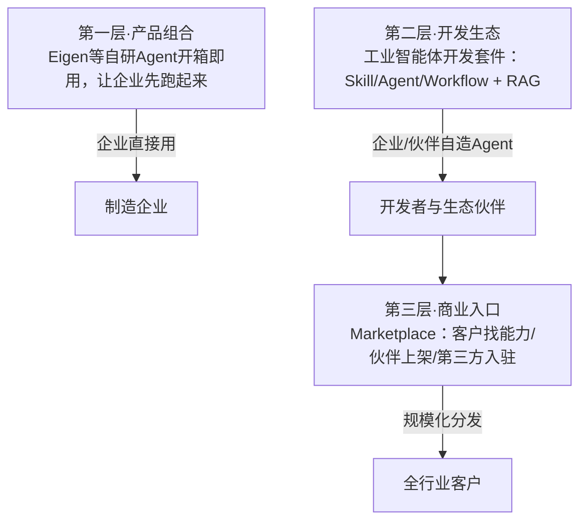
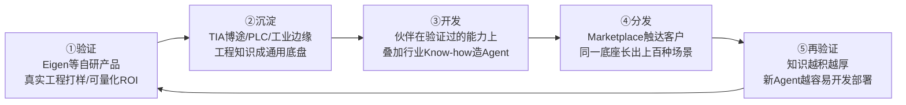

# 03 Xcelerator 三层生态与规模化飞轮

> 对应事实：F-026~F-036
> 核验状态：机制✅；平台规模数字⚠️勘误

## 从"货架"到"Launchpad"

西门子 Xcelerator 是开放式数字商业平台。博文对比了两种平台逻辑：

| | 传统数字化平台（货架逻辑） | 西门子Xcelerator（Launchpad逻辑） |
|---|---|---|
| 关系 | 买卖关系在交易完成时终止 | 连接软件/自动化/数据/行业知识 |
| 客户旅程 | 买到产品即结束 | 识别场景→匹配方案→部署→价值实现 |
| 目标 | 把产品卖出去 | 让产品在真实工业场景中**持续生长** |

## 三层架构

**第一层：产品组合**。很多制造企业最大的障碍不是不知道AI价值，而是不具备从零开发的能力。Eigen 等经过真实工程验证的自研产品直接嵌入工程和生产流程，"开箱即用"让企业先跑起来。

**第二层：开发生态**。不想拿现成产品的企业/伙伴，可用工业智能体开发套件自造Agent（详见 [概念02](02-icx-orchestration.md)）。核心是把OT层工程Know-how封装成可调用Skill。

**第三层：商业入口**。Agent在实验室跑通只完成0到1；规模化复制是商业化核心难题。线上平台 **Marketplace** 让客户更快找到经过筛选的工业AI能力，伙伴可展示产品、触达客户、获得反馈迭代。**第三方自研Agent厂商也可申请入驻**，审核通过后输出差异化行业方案并完成项目交付。

## 伙伴案例

### 阿丘科技：工业视觉质检（✅ 基本通过）

- 自研 **AQ-VLM 工业视觉大模型** + **VisionAgent 视觉应用平台**
- 无需重构技术栈，通过标准API对接西门子 **X Data Hub** 数据底座（博文另称对接 Teamcenter PLM 体系——⚠️ 该细节仅见博文，阿丘官网与西门子供稿均只提 X Data Hub，无法独立证实）
- 西门子提供工业数据上下文与业务流程入口，阿丘输出经系统验证的视觉缺陷检测能力
- 联合打造「**多维度工业AI视觉智能底座**」，完成互操作测试与安全合规审核后通过 Marketplace 上架，输出"开箱即用"智能质检能力（AIDI 2025年7月起已在平台 live）

### 设序科技：AI自动出图（✅ 基本通过）

- 自研 AI 自动出图平台：快速将 **3D模型转为2D工程图**（联合发布"闪设2D智能出图·NX专家版"）
- 汽车装备/非标自动化设备企业在 Marketplace 找到方案后：人均出图效率从数天压缩至小时级，**10人团队年节省工时超7000小时**
- 核验：合作媒体新工业网测算为"10人团队全年累计节省 **7200~9600小时**"，与"超7000小时"一致；"数天→小时级"为厂商口径（设序官网另有"分钟级"非标设计表述）；效果数据为伙伴/厂商自述
- "闪设2D-焊接夹具AI专业版"已在 Xcelerator Marketplace 上架（标注"非自营"）

### 生态扩张

- WAIC 2026 期间 **9家AI伙伴**签约（官方表述"近10家"）：松应科技、支点互动、壁小虎、沨呵智慧、光轮智能、龙坤智慧、摩泛科技、昇腾技术、臻效智能，补充物理AI、具身智能、工业智能体与算力场景
- 平台覆盖汽车、食品饮料、电子半导体、数据中心、绿色建筑等行业

## 平台规模数字（⚠️ 以官方口径为准）

| 指标 | 博文口径（截至2026-07） | 西门子官方7月口径 | 核验 |
|------|------------------------|-------------------|------|
| 产品及解决方案 | 900余款 | **超800款**（6月链博会稿为超700款） | ❌ 博文拔高 |
| 生态伙伴 | 600余家 | **500余家**（2025-09工博会时300多个） | ❌ 博文拔高 |
| 注册用户 | 超60万 | 超60万（**"在中国"**口径，非全球） | ⚠️ 博文省略地域限定 |
| AI产业应用伙伴 | 超100家 | 超100家 | ✅ |

> 引用建议：采用官方口径"超800款产品、500余家伙伴、中国超60万注册用户、AI伙伴超100家"。

## 规模化飞轮：验证→沉淀→开发→分发→再验证

博文的核心方法论：

> 工业AI的规模化，不是把同一个Agent复制粘贴到一百家工厂，而是让每一次成功交付，都成为下一次落地的起点。

- **工业底盘**：TIA博途、PLC、工业边缘中沉淀的工程知识，解决每个开发者都绕不开的基础工程问题（读懂工业语义、接入真实设备、权限/审计/回滚），伙伴不用反复造轮子
- **网络效应**：接入伙伴越多→覆盖场景越丰富→平台工业知识越厚→新Agent越容易开发部署
- 西门子还**开放中国工厂场景**，通过 Xcelerator 公开赛吸引开发者，把真实需求变成生态创新试验场（68%企业愿与外部厂商数据共享为需求基础，见 [概念00](00-industrial-agent-barrier.md)）

## 结论性判断

> 办公室AI的普及，靠的是让每个人都能打开一个对话框。工业AI的普及，靠的却是把一座工厂验证过的能力，变成更多工厂都能安全调用的生产力。

等到Agent不再只是示范工厂里的明星项目，而是像PLC和工业软件一样成为工程师随时可用的基础能力，工业AI才算走出展台、真正走进生产线。
