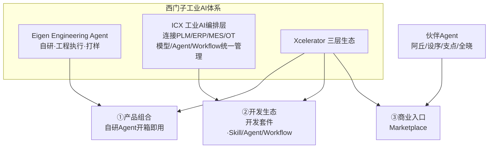

# 西门子工业Agent

> **来源**：量子位（记者田晏林），2026-08-27 发布
> **原文**：[《工业Agent不是"套壳"大模型！西门子百年经验灌进工业AI》](https://mp.weixin.qq.com/s/ssuJECesZ-UHrW6GRv_BkQ)
> **P0核验**：6大项 3✅ 3⚠️ 0❌（详见 [verification.md](references/verification.md)）

> **⚠️ 数据性质提示**：本文为西门子生态推广性质报道。文中成效数据（效率2-5倍、工程效率+50%、质量+80%、30%/10%、7000小时等）**均为西门子官方或伙伴企业自述/试点数据，无第三方独立测评**；引用的《2025工业智能体报告》系**西门子与至顶科技联合发布**；平台规模数字存在与官方口径不一致（详见下）。

> **📝 勘误（核验发现）**：博文称 Xcelerator "截至2026年7月**900余款**产品、**600余家**生态伙伴"，西门子官方7月口径为"**超800款**产品、**500余家**伙伴、**在中国**超60万注册用户"。本知识包数字以官方口径为准。

## 一句话概括

办公场景的AI Agent直接搬进工厂大概率失效——工业Agent需要理解工业语义、调用工业工具、接入实时数据、在闭环工作流中执行；西门子的路径是**自研Eigen打样、ICX做编排层、Xcelerator三层生态做规模化分发**，把百年工业Know-how封装成Agent可调用的Skill。

## 核心版图



## 知识结构

```
siemens-industrial-agent/
├── index.md
├── concepts/
│   ├── index.md
│   ├── 00-industrial-agent-barrier.md   ← 门槛：工业Agent为什么不能套壳
│   ├── 01-eigen-engineering-agent.md   ← Eigen：从辅助建议到自主执行
│   ├── 02-icx-orchestration.md         ← ICX编排层与"工业经验装接口"
│   └── 03-xcelerator-flywheel.md       ← 三层生态与规模化飞轮
├── references/
│   ├── index.md
│   ├── article-source.md               ← F-001~F-036 事实登记
│   └── verification.md                 ← P0核验报告
└── log.md
```

## 分层导航

### 概念层（4篇）

1. [工业Agent的门槛](concepts/00-industrial-agent-barrier.md) — 43%未部署/8%广泛应用、IT/OT断层、系统工程
2. [Eigen工程智能体](concepts/01-eigen-engineering-agent.md) — ECAD集成、PLC标签、端到端执行、ROI数据勘误
3. [ICX编排层与Skill封装](concepts/02-icx-orchestration.md) — AI调度总台、OT Know-how装接口、ECX案例
4. [Xcelerator三层生态飞轮](concepts/03-xcelerator-flywheel.md) — 产品/开发/Marketplace、伙伴案例、数字勘误

### 信源层（2篇）

- [事实登记](references/article-source.md) — F-001~F-036
- [核验报告](references/verification.md) — 3✅3⚠️ + 勘误明细

## 信任与生命周期

- **事实基数**：36条（F-001~F-036）
- **P0核验**：3✅ 3⚠️ 0❌
- **status**: verified
- **stale_after**: 2026-11-29（工业AI产品迭代快，3个月后复核产品名与平台数据）

## 已知边界

1. 成效数据全部为厂商/客户自述：Eigen 2-5倍/+50%/+80%、中科摩通30%/30%/10%、设序7000小时——无第三方独立测评
2. 中科摩通30/30/10数字2025年官方稿原归属 Industrial Copilot，2026年报道转归Eigen，产品归属存在变迁
3. 平台规模以官方口径为准：800余款产品/500余家伙伴/中国超60万用户（博文写900/600/未限定地域）
4. "Skill Creator、Agent Framework"组件英文名、阿丘对接Teamcenter PLM 仅见博文，未获独立佐证
5. 《2025工业智能体报告》为西门子与至顶科技联合发布，非独立第三方调研
6. 6000万访问量出自易观分析Q2报告：17款产品合计、PC网页访问口径（非DAU），博文未具名

```{toctree}
:hidden:
:maxdepth: 2

concepts/index
references/index
log
```
