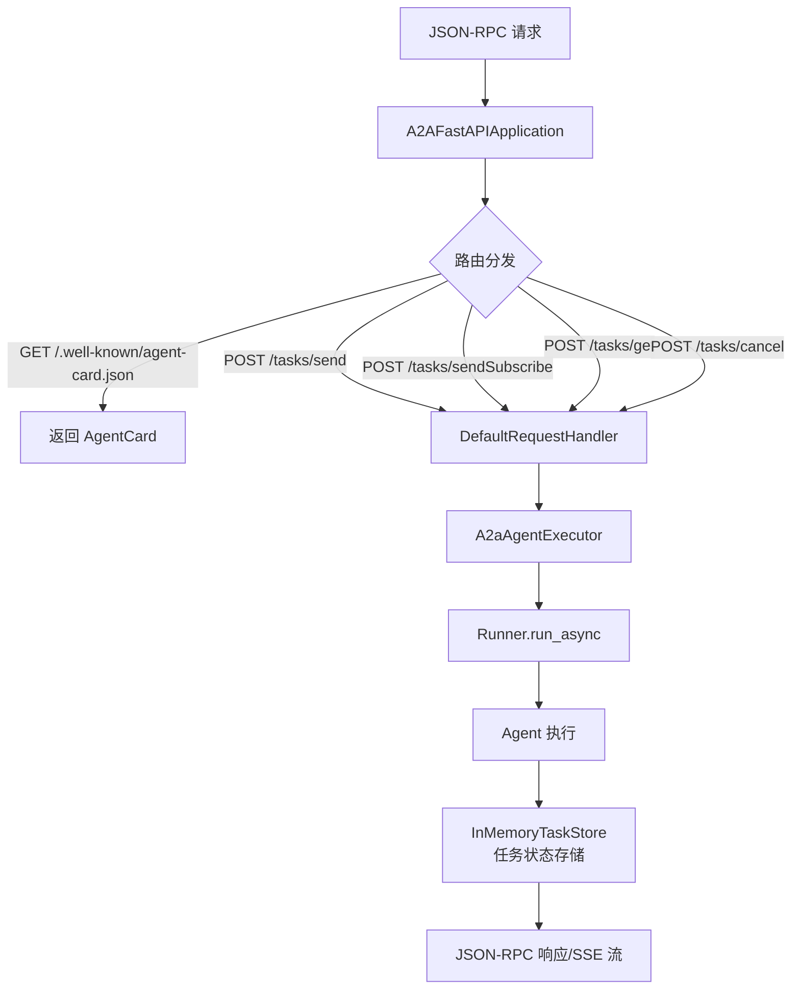
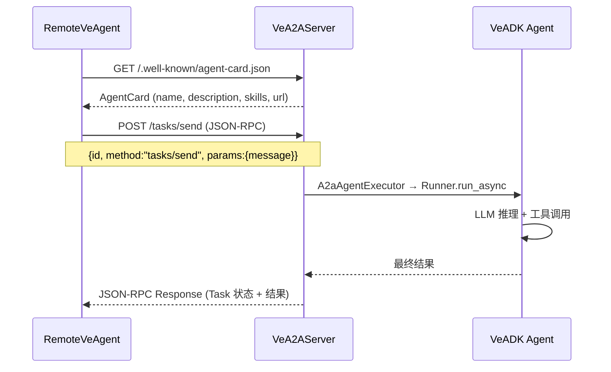
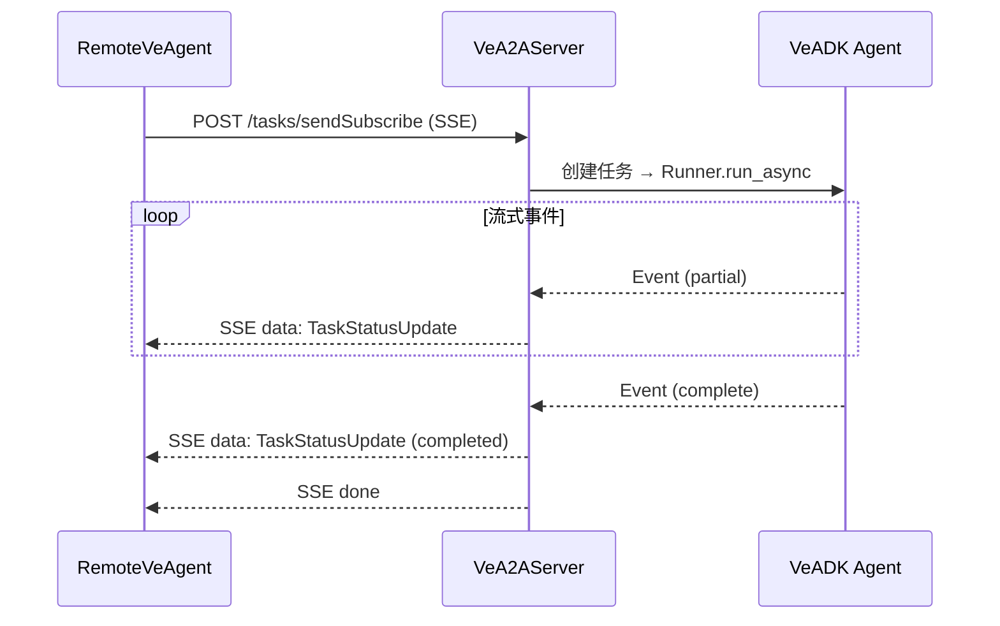

# Agent-to-Agent 协议

A2A（Agent-to-Agent）协议是 Google 提出的 Agent 互操作标准，允许不同框架、不同部署位置的 Agent 通过统一的 JSON-RPC 接口发现彼此、交换任务和流式结果。veadk-python 基于 `a2a-sdk==0.3.7` 实现了完整的 A2A 服务端和客户端，使 VeADK Agent 可以：

1. 作为 **服务端** 暴露 A2A 接口，被其他 Agent 发现和调用
2. 作为 **客户端** 通过 `RemoteVeAgent` 连接远程 Agent
3. 在 VeFaaS 平台上通过注册中心自动注册和发现

## A2A 协议架构

```
┌─────────────────────────────────────────────────────────────────┐
│                        A2A 生态                                │
│                                                                 │
│  ┌──────────────┐    JSON-RPC/HTTP     ┌──────────────────────┐ │
│  │ 本地 Agent A  │ ◄─────────────────► │ 远程 Agent B (VeFaaS)│ │
│  │              │   tasks/send        │                      │ │
│  │ RemoteVeAgent│   tasks/sendSubscribe│ VeA2AServer          │ │
│  │ (A2A 客户端)  │ ◄─────────────────► │ (A2A FastAPI App)    │ │
│  └──────┬───────┘   Agent Card 发现    └──────────┬───────────┘ │
│         │                                        │              │
│         │ 作为 sub_agent 接入                     │ 暴露 FastAPI  │
│         ▼                                        ▼              │
│  ┌──────────────┐                        ┌──────────────────┐  │
│  │ 父 Agent      │                        │ Agent Card       │  │
│  │ (Sequential/  │                        │ /.well-known/    │  │
│  │  Parallel/    │                        │ agent-card.json  │  │
│  │  Loop)        │                        └──────────────────┘  │
│  └──────────────┘                                              │
│                                                                 │
│  ┌──────────────────────────────────────────────────────────┐  │
│  │              A2A Hub（可选注册中心）                       │  │
│  │  RocketMQ 中间件 / Hub Server / Hub Client               │  │
│  └──────────────────────────────────────────────────────────┘  │
└─────────────────────────────────────────────────────────────────┘
```

## 核心组件

### Agent Card：Agent 元数据

Agent Card 是 A2A 协议的发现机制，每个 Agent 通过 `/.well-known/agent-card.json` 端点暴露自身元数据，客户端在连接时自动获取。

veadk/a2a/agent_card.py:L21-L45

```python
from a2a.types import AgentCapabilities, AgentCard, AgentProvider, AgentSkill

def get_agent_card(
    agent: Agent, url: str, version: str = VERSION, provider: str = "veadk"
) -> AgentCard:
    agent_provider = AgentProvider(organization=provider, url="")
    agent_capabilities = AgentCapabilities()
    agent_skills = [
        AgentSkill(
            id="0",
            name="chat",
            description="Basically chat with user.",
            tags=["chat", "talk"],
        )
    ]
    agent_card = AgentCard(
        capabilities=agent_capabilities,
        description=agent.description,
        name=agent.name,
        defaultInputModes=["text"],
        defaultOutputModes=["text"],
        provider=agent_provider,
        skills=agent_skills,
        url=url,
        version=version,
    )
    return agent_card
```

Agent Card 包含以下核心字段：

| 字段 | 说明 |
|------|------|
| `name` | Agent 名称（来自 agent.name） |
| `description` | Agent 描述（来自 agent.description） |
| `url` | Agent 服务端 URL |
| `version` | VeADK 版本号 |
| `provider` | 提供者信息（organization="veadk"） |
| `capabilities` | Agent 能力声明 |
| `skills` | Agent 技能列表（默认包含 chat 技能） |
| `defaultInputModes`/`defaultOutputModes` | 默认输入/输出模式（text） |

### VeA2AServer：A2A 服务端

`VeA2AServer` 将一个 VeADK Agent 包装为 A2A 兼容的 FastAPI 应用，处理 JSON-RPC 请求、任务管理和 Agent 执行。

veadk/a2a/ve_a2a_server.py:L31-L64

```python
class VeA2AServer:
    def __init__(
        self,
        agent: Agent,
        url: str,
        app_name: str,
        short_term_memory: ShortTermMemory,
        credential_service: BaseCredentialService | None = None,
    ):
        self.agent_card = get_agent_card(agent, url)

        self.agent_executor = A2aAgentExecutor(
            runner=Runner(
                agent=agent,
                app_name=app_name,
                short_term_memory=short_term_memory,
                credential_service=credential_service,
            )
        )

        self.task_store = InMemoryTaskStore()

        self.request_handler = DefaultRequestHandler(
            agent_executor=self.agent_executor, task_store=self.task_store
        )

    def build(self) -> FastAPI:
        app_application = A2AFastAPIApplication(
            agent_card=self.agent_card,
            http_handler=self.request_handler,
        )
        app = app_application.build()
        return app
```

#### 服务端架构



关键组件：
- **A2AFastAPIApplication**：来自 `a2a-sdk`，构建 FastAPI 路由（基于 JSON-RPC over HTTP）
- **DefaultRequestHandler**：处理 tasks/send、tasks/sendSubscribe 等 A2A 标准方法
- **A2aAgentExecutor**：来自 Google ADK，将 A2A 任务适配为 Runner 调用
- **InMemoryTaskStore**：内存中的任务状态存储（可替换为持久化实现）
- **Runner**：VeADK Runner，执行 Agent 并管理会话

#### init_app 便捷函数

veadk/a2a/ve_a2a_server.py:L67-L80

```python
def init_app(
    server_url: str,
    app_name: str,
    agent: Agent,
    short_term_memory: ShortTermMemory,
    credential_service: BaseCredentialService | None = None,
) -> FastAPI:
```

一行代码即可创建 A2A 服务端 FastAPI 应用：

```python
from veadk import Agent
from veadk.a2a.ve_a2a_server import init_app
from veadk.memory import ShortTermMemory

agent = Agent(name="my_agent", instruction="You are a helpful assistant.")
stm = ShortTermMemory(backend="local")
app = init_app(
    server_url="https://my-agent.example.com",
    app_name="my_app",
    agent=agent,
    short_term_memory=stm,
)
# app 是标准 FastAPI 实例，可直接 uvicorn 运行
```

### RemoteVeAgent：A2A 客户端

`RemoteVeAgent` 继承自 `google.adk.agents.remote_a2a_agent.RemoteA2aAgent`，允许将部署在远程的 A2A Agent 作为本地 Agent 使用（例如作为 sub_agent 接入 SequentialAgent）。

veadk/a2a/remote_ve_agent.py:L44-L200

```python
class RemoteVeAgent(RemoteA2aAgent):
    auth_method: Literal["header", "querystring"] | None = None

    def __init__(
        self,
        name: str,
        url: Optional[str] = None,
        auth_token: Optional[str] = None,
        auth_method: Literal["header", "querystring"] | None = None,
        httpx_client: Optional[httpx.AsyncClient] = None,
    ):
```

#### 初始化流程

```mermaid
flowchart TD
    A[RemoteVeAgent 初始化] --> B{确定 effective_url}
    B -->|httpx_client.base_url 存在| C[使用 client URL]
    B -->|url 参数存在| D[使用 url 参数]
    B -->|都不存在| E[抛出 ValueError]
    C --> F{auth_token?}
    D --> F
    F -->|header 模式| G[Authorization: Bearer header]
    F -->|querystring 模式| H[?token=xxx 查询参数]
    F -->|无 token| I[无认证]
    G --> J[GET {url}/.well-known/agent-card.json]
    H --> J
    I --> J
    J --> K[解析 AgentCard JSON]
    K --> L[_convert_agent_card_dict_to_obj]
    L --> M[创建 httpx.AsyncClient]
    M --> N[调用父类 RemoteA2aAgent 初始化]
```

#### 认证方式

| auth_method | 认证方式 | 适用场景 |
|-------------|---------|---------|
| `"header"` | HTTP `Authorization: Bearer {token}` 头 | 标准 Bearer Token 认证 |
| `"querystring"` | URL 查询参数 `?token={token}` | Webhook/回调等不支持 header 的场景 |
| `None` | 无认证 / 运行时从 CredentialService 获取 | 公开 Agent 或 VeIdentity 动态认证 |

静态 token 在初始化时传入并附加到 HTTP 客户端；运行时认证通过 `InvocationContext.credential_service` 动态获取（VeIdentity 集成）。

#### 使用示例

```python
from veadk.a2a.remote_ve_agent import RemoteVeAgent
from veadk.agents import SequentialAgent

# 连接远程 Agent（无认证）
public_agent = RemoteVeAgent(
    name="public_agent",
    url="https://vefaas.example.com/agents/public",
)

# 连接远程 Agent（Bearer Token 认证）
secure_agent = RemoteVeAgent(
    name="secure_agent",
    url="https://vefaas.example.com/agents/secure",
    auth_token="my_secret_token",
    auth_method="header",
)

# 作为 sub_agent 接入组合 Agent
pipeline = SequentialAgent(
    name="hybrid_pipeline",
    sub_agents=[local_agent, secure_agent],
)
```

### AgentBuilder 中的 RemoteVeAgent

`RemoteVeAgent` 也注册在 `AgentBuilder.AGENT_TYPES` 中（F-052），支持通过 YAML 配置声明式引用远程 Agent：

```python
AGENT_TYPES = {
    "Agent": Agent,
    "SequentialAgent": SequentialAgent,
    "ParallelAgent": ParallelAgent,
    "LoopAgent": LoopAgent,
    "RemoteVeAgent": RemoteVeAgent,
}
```

## A2A Hub：注册中心

`veadk/a2a/hub/` 目录提供了基于 RocketMQ 的 A2A Hub 实现，支持 Agent 的注册发现和消息中间件通信。

| 文件 | 职责 |
|------|------|
| hub/a2a_hub_server.py | Hub 服务端 |
| hub/a2a_hub_client.py | Hub 客户端 |
| hub/models.py | Hub 数据模型 |
| hub/rocketmq_middleware.py | RocketMQ 消息中间件 |

## 其他 A2A 组件

| 文件 | 职责 |
|------|------|
| a2a/registry_client.py | Agent 注册中心客户端 |
| a2a/ve_agent_executor.py | VeADK 自定义 Agent 执行器 |
| a2a/ve_middlewares.py | A2A 中间件（认证、日志等） |
| a2a/ve_task_store.py | 自定义任务存储实现 |
| a2a/utils/agent_to_a2a.py | Agent 到 A2A 格式的转换工具 |

## A2A 协议通信流程

### 一次性任务（tasks/send）



### 流式任务（tasks/sendSubscribe）



## 关键文件索引

| 文件 | 职责 |
|------|------|
| veadk/a2a/ve_a2a_server.py | VeA2AServer 服务端、init_app 便捷函数 |
| veadk/a2a/remote_ve_agent.py | RemoteVeAgent A2A 客户端、认证、Agent Card 获取 |
| veadk/a2a/agent_card.py | get_agent_card 元数据生成 |
| veadk/a2a/registry_client.py | Agent 注册中心客户端 |
| veadk/a2a/ve_agent_executor.py | VeADK Agent 执行器 |
| veadk/a2a/hub/ | A2A Hub（RocketMQ 注册中心） |
| veadk/agent_builder.py | AgentBuilder 支持 RemoteVeAgent 类型 |

## 相关概念

- [组合 Agent 模式](composite-agents.md) — RemoteVeAgent 可作为 sub_agent 接入 SequentialAgent/ParallelAgent/LoopAgent
- [Agent 类与 Runner 执行引擎](agent-and-runner.md) — VeA2AServer 内部使用 Runner 执行 Agent
- [CLI 命令系统](cli-commands.md) — veadk deploy 命令将 Agent 部署为 A2A 服务
