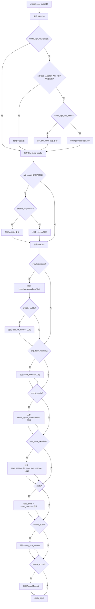
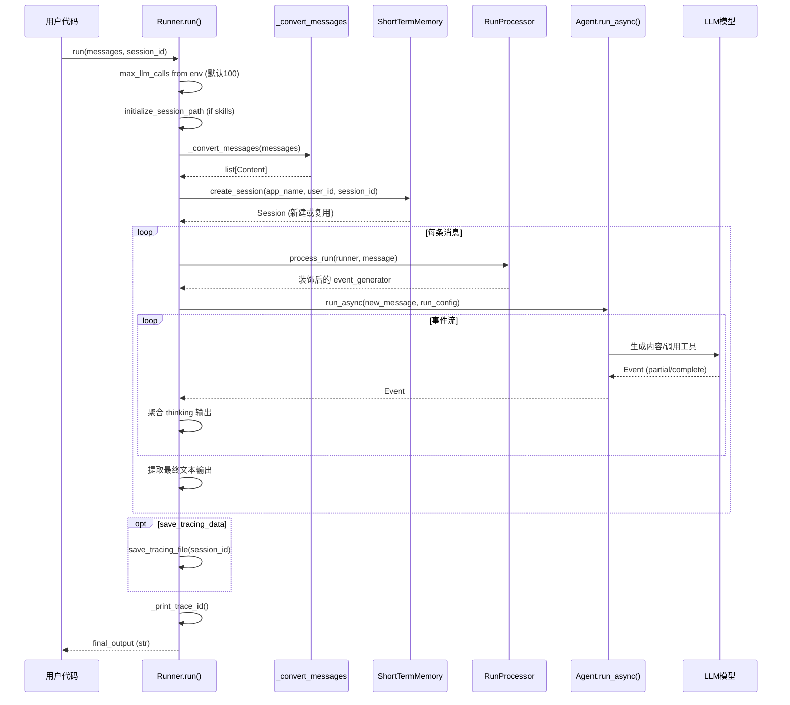

# Agent 类与 Runner 执行引擎

veadk-python 的运行时架构建立在两个核心抽象之上：**Agent** 定义"智能体能做什么"（模型、工具、记忆、指令），**Runner** 负责"如何执行一次对话"（消息转换、会话管理、事件流聚合、TOS 上传等）。二者继承自 Google ADK 的 `LlmAgent` 和 `Runner`，在其上叠加了火山引擎生态能力。

## 整体架构

```
┌─────────────────────────────────────────────────────────┐
│                      用户代码                            │
│  agent = Agent(name=..., instruction=..., tools=[...])   │
│  runner = Runner(agent=agent, app_name="my_app")         │
│  result = await runner.run(messages="Hello!")            │
└──────────────────────┬──────────────────────────────────┘
                       │
          ┌────────────▼────────────┐
          │       Runner            │
          │  ┌────────────────────┐  │
          │  │ _convert_messages  │  │  消息格式转换
          │  │ intercept_new_msg  │  │  装饰器：pre/post hook
          │  │ run_async (wrapped)│  │  TOS上传 + thinking聚合
          │  │ session_service    │  │  短期记忆会话管理
          │  └────────┬───────────┘  │
          └───────────┼──────────────┘
                      │
          ┌───────────▼──────────────┐
          │        Agent             │
          │  ┌─────────────────────┐ │
          │  │ model (LiteLlm/Ark) │ │  LLM调用层
          │  │ tools (15+内置)     │ │  工具集
          │  │ sub_agents          │ │  子Agent
          │  │ memory (STM/LTM)    │ │  记忆系统
          │  │ callbacks           │ │  before/after钩子
          │  │ _llm_flow           │ │  LLM流控制
          │  └─────────────────────┘ │
          └──────────────────────────┘
```

## Agent 类：智能体定义

`Agent` 是 veadk-python 的核心类，继承自 `google.adk.agents.LlmAgent`，通过 Pydantic 模型声明式定义一个 LLM 驱动的智能体。

### 类定义与字段

veadk/agent.py:L72-L213

```python
class Agent(LlmAgent):
    model_config = ConfigDict(arbitrary_types_allowed=True, extra="allow")

    # 标识字段
    id: str = Field(default_factory=lambda: str(uuid.uuid4()).split("-")[0])
    name: str = DEFAULT_AGENT_NAME          # "veAgent"
    description: str = DEFAULT_DESCRIPTION
    instruction: Union[str, InstructionProvider] = DEFAULT_INSTRUCTION

    # 模型配置
    model_name: Union[str, list[str]] = Field(default_factory=lambda: settings.model.name)
    model_provider: str = Field(default_factory=lambda: settings.model.provider)  # "openai"
    model_api_base: str = Field(default_factory=lambda: settings.model.api_base)
    model_api_key: str = ""
    model_api_key_name: str = Field(default_factory=lambda: settings.model.api_key_name)
    model_extra_config: dict = Field(default_factory=dict)

    # 能力组件
    tools: list[ToolUnion] = []
    sub_agents: list[BaseAgent] = Field(default_factory=list, exclude=True)
    knowledgebase: Optional[KnowledgeBase] = None
    short_term_memory: Optional[ShortTermMemory] = None
    long_term_memory: Optional[LongTermMemory] = None
    prompt_manager: Optional[BasePromptManager] = None
    tracers: list[BaseTracer] = []
    example_store: Optional[BaseExampleProvider] = None

    # 布尔开关
    enable_responses: bool = False
    enable_responses_cache: bool = True
    enable_authz: bool = False
    auto_save_session: bool = False
    enable_supervisor: bool = False
    enable_ghostchar: bool = False
    enable_dataset_gen: bool = False
    enable_dynamic_load_skills: bool = False
    enable_skills_checklist: bool = False
    enable_a2ui: bool = False
    enable_tunnel: bool = False

    # 运行时选择
    runtime: Literal["adk", "codex", "piagent"] = "adk"
    skills: list[str] = Field(default_factory=list)
    skills_mode: Optional[Literal["skills_sandbox", "aio_sandbox", "local"]] = None
```

### model_post_init：初始化流水线

Agent 的所有自动装配逻辑在 Pydantic 的 `model_post_init` 中完成，这是理解 Agent 初始化过程的关键：

veadk/agent.py:L214-L445

初始化流程如下：



API Key 解析优先级（F-019）：

1. 显式传入的 `model_api_key`
2. `MODEL_AGENT_API_KEY` 环境变量
3. `model_api_key_name` 通过 `get_ark_token` 按名解析
4. `settings.model.api_key` 全局配置默认值

模型实例化逻辑（F-020）：

- 当 `enable_responses=True` 时，创建 `ArkLlm`（火山引擎 Ark Responses API）
- 否则创建 `LiteLlm`（通过 LiteLLM 兼容 OpenAI 接口的模型）
- 模型名格式为 `"{provider}/{model_name}"`，如 `"openai/doubao-seed-2-1-pro-260628"`
- 当 `model_name` 为列表时，首元素作为主模型，其余作为 fallback 链

### _llm_flow：LLM 流选择

`_llm_flow` 属性根据 Agent 配置决定 LLM 对话的流转策略：

veadk/agent.py:L698-L721

| 条件 | Flow 类型 | 说明 |
|------|-----------|------|
| 无子 Agent，无 Supervisor | `SingleFlow` | 单 Agent 直接对话 |
| 无子 Agent，有 Supervisor | `SupervisorSingleFlow` | 单 Agent + 监督者建议 |
| 有子 Agent，无 Supervisor | `AutoFlow` | LLM 自动选择子 Agent |
| 有子 Agent，有 Supervisor | `SupervisorAutoFlow` | 自动路由 + 监督者审查 |

### 多运行时支持

`_run_async_impl` 方法支持三种运行时后端（F-028）：

veadk/agent.py:L723-L741

```python
def _run_async_impl(self, ctx):
    if self.runtime != "adk":
        return veadk.runtime.get_runtime(self.runtime).run_async(self, ctx)
    return super()._run_async_impl(ctx)
```

| runtime 值 | 说明 |
|------------|------|
| `"adk"` | 默认，使用 Google ADK 内置 LLM 流 |
| `"codex"` | 委托给 OpenAI Codex SDK 运行时 |
| `"piagent"` | 委托给本地 Pi 编码 Agent RPC 模式 |

### 模块级 Patch

Agent 模块加载时执行三个 monkey patch（F-030）：

- `patch_tracer()`：修补 ADK tracer 的已知问题
- `patch_asyncio()`：修补 asyncio 事件循环兼容性
- `patch_mcp_session_retry()`：修补 MCP session 重试逻辑

同时设置 `LITELLM_LOCAL_MODEL_COST_MAP=True` 以避免 Litellm 导入时约 10s 的延迟（F-031）。

### update_model：动态切换模型

```python
def update_model(self, model_name: str):
    self.model = self.model.model_copy(
        update={"model": f"{self.model_provider}/{model_name}"}
    )
```

veadk/agent.py:L447-L451

## Runner 类：执行引擎

`Runner` 继承自 `google.adk.runners.Runner`，是用户与 Agent 交互的主入口。它封装了消息转换、会话管理、事件流处理、媒体上传等横切关注点。

### 构造函数

veadk/runner.py:L354-L466

```python
class Runner(ADKRunner):
    def __init__(
        self,
        agent: BaseAgent | Agent | None = None,
        short_term_memory: ShortTermMemory | None = None,
        app_name: str | None = None,
        user_id: str = "veadk_default_user",
        upload_inline_data_to_tos: bool = False,
        run_processor: BaseRunProcessor | None = None,
        *args, **kwargs,
    ) -> None:
```

构造函数关键逻辑：

1. **run_processor 优先级链**（F-034）：Runner 参数 > Agent.run_processor > NoOpRunProcessor
2. **session_service 选择**（F-035）：优先使用外部传入的 session_service，其次从 short_term_memory 获取，最后创建内存 `InMemorySessionService`
3. **long_term_memory 关联**：优先外部传入 memory_service，其次从 Agent 获取
4. **消息拦截层注入**（F-036）：通过 `MethodType` 将 `intercept_new_message(_upload_image_to_tos)(super().run_async)` 包装到实例上

### RunnerMessage 类型

Runner 接受灵活的消息输入格式（F-037）：

veadk/runner.py:L46-L52

```python
RunnerMessage = Union[
    str,                              # 单轮文本
    list[str],                        # 多轮文本
    MediaMessage,                     # 单轮多模态 (text + media路径)
    list[MediaMessage],               # 多轮多模态
    list[MediaMessage | str],         # 混合文本和多模态
]
```

### run 方法：主执行入口

veadk/runner.py:L467-L575

`run` 是 async 方法，接收 RunnerMessage 并返回最终文本结果：

```python
async def run(
    self,
    messages: RunnerMessage,
    user_id: str = "",
    session_id: str = f"tmp-session-{formatted_timestamp()}",
    run_config: RunConfig | None = None,
    save_tracing_data: bool = False,
    upload_inline_data_to_tos: bool = False,
    run_processor: BaseRunProcessor | None = None,
) -> str:
```

执行流程：



### 消息转换：_convert_messages

veadk/runner.py:L200-L277

`_convert_messages` 函数将用户友好的 `RunnerMessage` 转换为 Google GenAI 的 `list[Content]`：

- `str` → 单条 `Content(role="user", parts=[Part(text=...)])`
- `MediaMessage` → 读取本地文件字节，通过 `filetype.guess` 检测 MIME 类型（仅支持 `image/*` 和 `video/*`），构造 `inline_data=Blob(data=..., mime_type=...)`
- `list` → 递归展开，支持多轮对话

### 消息拦截装饰器：intercept_new_message

veadk/runner.py:L106-L197

这是一个装饰器工厂，在 `run_async` 调用前后插入横切逻辑：

1. **pre_run_process**：遍历 new_message 的 parts，若包含 inline_data 且启用了 TOS 上传，调用 `_upload_image_to_tos` 上传
2. **事件流消费**：迭代底层 event generator
   - 跳过 `event.partial=True` 的流式分块
   - 聚合 thinking 输出（`part.thought=True`），避免逐 token 日志
   - 记录 function call / function response / 最终文本输出
3. **post_run_process**：当前为空操作占位符

### TOS 媒体上传：_upload_image_to_tos

veadk/runner.py:L279-L326

当 inline_data 包含文件名和字节数据时：

- 生成对象路径：`{app_name}/{user_id}-{session_id}-{filename}`
- 调用 `VeTOS.async_upload_bytes` 上传
- 上传成功后，将 `display_name` 替换为签名 URL
- 所有异常被捕获并记录，不中断主流程

### 辅助方法

| 方法 | 说明 |
|------|------|
| `get_trace_id() -> str` | 获取当前 Trace ID（F-041），非 VeADK Agent 或无 tracer 时返回 `"<unknown_trace_id>"` |
| `save_tracing_file(session_id) -> str` | 导出 tracing 数据文件（F-042），支持 Agent/SequentialAgent/ParallelAgent/LoopAgent |
| `save_eval_set(session_id, eval_set_id)` | 导出评估集（F-043），创建 `EvalSetRecorder` 并 dump |
| `save_session_to_long_term_memory(...)` | 将会话保存到长期记忆（F-044） |

## 顶层包入口

veadk/__init__.py 通过 `__getattr__` 实现延迟加载，避免导入 `veadk` 时就加载 Agent 和 Runner 的重量级依赖：

```python
def __getattr__(name):
    if name == "Agent":
        from veadk.agent import Agent
        return Agent
    if name == "Runner":
        from veadk.runner import Runner
        return Runner
    raise AttributeError(f"module 'veadk' has no attribute '{name}'")

__all__ = ["Agent", "Runner", "VERSION"]
```

## Quickstart 模式

来自 examples/01_quickstart 的标准三步用法（F-093）：

```python
from veadk import Agent, Runner

agent = Agent(
    name="my_agent",
    description="My first agent",
    instruction="You are a helpful assistant.",
)
runner = Runner(agent=agent, app_name="my_app")
result = await runner.run(
    messages="Hello!",
    session_id="my-session",
)
```

## 关键文件索引

| 文件 | 职责 |
|------|------|
| veadk/\_\_init\_\_.py | 包入口，延迟加载 Agent/Runner |
| veadk/agent.py | Agent 类定义、model_post_init 装配逻辑、LLM Flow 选择、多运行时委托 |
| veadk/runner.py | Runner 类、消息转换、TOS 上传、事件拦截装饰器、run 主入口 |
| veadk/version.py | 版本号获取 |
| veadk/utils/patches.py | Monkey patches（tracer/asyncio/mcp） |
| veadk/processors/base_run_processor.py | RunProcessor 抽象基类 |

## 相关概念

- [模型配置层](model-configuration.md) — Agent 的 model_name/model_provider/api_key 解析与双后端模型
- [记忆系统](memory-system.md) — ShortTermMemory 提供 session_service，LongTermMemory 提供跨会话记忆
- [工具定义与调用](tool-definition.md) — Agent.tools 内置工具集与自动挂载机制
- [组合 Agent 模式](composite-agents.md) — SequentialAgent/ParallelAgent/LoopAgent 与 sub_agents 协作
- [CLI 命令系统](cli-commands.md) — veadk web 命令通过 Runner 启动 Web 服务
