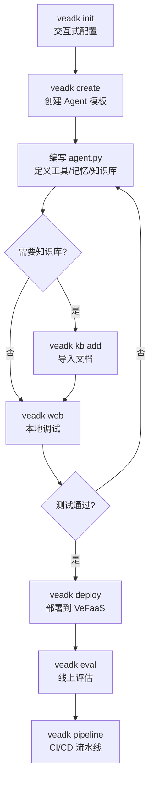

# CLI 命令系统

veadk-python 提供完整的命令行工具集 `veadk`，基于 Python Click 框架构建，覆盖 Agent 开发全生命周期——从项目初始化、本地调试、知识库构建到云端部署、评估测试。通过 `pip install veadk-python` 安装后即可使用。

## CLI 架构

```
┌──────────────────────────────────────────────────────────────┐
│                    veadk (Click Group)                        │
│                  Volcengine Agent Development Kit             │
│                                                               │
│  ┌───────────── 开发调试 ─────────────┐  ┌──── 部署运维 ────┐ │
│  │ init     项目初始化向导             │  │ deploy   VeFaaS  │ │
│  │ create   创建 Agent 模板           │  │ frontend Studio  │ │
│  │ web      本地 Web 调试服务器        │  │ pipeline 部署流水线│ │
│  │ prompt   提示词管理                │  │ update   版本更新 │ │
│  │          (集成 Prompt Pilot)       │  │ clean    清理缓存 │ │
│  └────────────────────────────────────┘  └──────────────────┘ │
│                                                               │
│  ┌───────────── 数据与知识 ────────────┐  ┌──── 评估与训练 ──┐ │
│  │ kb       知识库管理                 │  │ eval     评估    │ │
│  │          (add 子命令)               │  │ uploadevalset    │ │
│  │          (支持 local/opensearch/    │  │          上传测试集│ │
│  │           viking/redis)            │  │ rl_group 强化学习 │ │
│  └────────────────────────────────────┘  │ harness  测试框架│ │
│                                          └──────────────────┘ │
│                                                               │
│  ┌────────────────── 扩展 ────────────────────────────────┐   │
│  │ agentkit  AgentKit 扩展命令                            │   │
│  └────────────────────────────────────────────────────────┘   │
└──────────────────────────────────────────────────────────────┘
```

## 入口点与注册机制

veadk/cli/cli.py:L64-L92

```python
@click.group()
@click.version_option(version=VERSION, prog_name="Volcengine Agent Development Kit (VeADK)")
def veadk():
    """Volcengine Agent Development Kit (VeADK) command line interface."""
    pass

veadk.add_command(deploy)
veadk.add_command(init)
veadk.add_command(create)
veadk.add_command(prompt)
veadk.add_command(web)
veadk.add_command(frontend)
veadk.add_command(studio)
veadk.add_command(pipeline)
veadk.add_command(eval)
veadk.add_command(kb)
veadk.add_command(uploadevalset)
veadk.add_command(update)
veadk.add_command(clean)
veadk.add_command(rl_group)
veadk.add_command(agentkit)
veadk.add_command(harness)
```

### Provider 自举

CLI 启动时先执行 `_bootstrap_serve_provider()`（F-056），检测命令行参数中的 `--provider` 标志，在加载子命令模块前设置云服务提供商环境变量（`AGENTKIT_CLOUD_PROVIDER`/`CLOUD_PROVIDER`），支持 `volcengine` 和 `byteplus` 两种提供商。

## 核心命令详解

### `veadk init`：项目初始化向导

veadk/cli/cli_init.py:L27-L80

交互式向导，引导用户配置 VeFaaS 应用名称、API Gateway 设置、部署模式和认证方式。

**收集的配置项：**

| 配置项 | 说明 | 默认值 |
|--------|------|--------|
| `vefaas_application_name` | VeFaaS 应用名 | `veadk-cloud-agent` |
| `veapig_instance_name` | API Gateway 实例名 | 空 |
| `veapig_service_name` | API Gateway 服务名 | 空 |
| `veapig_upstream_name` | API Gateway 上游名 | 空 |
| `deploy_mode` | 部署模式选择 | 1=A2A/MCP Server, 2=VeADK Web |
| `auth_method` | 认证方式 | none / oauth2 / api-key |

```bash
veadk init
# 交互式提示配置项目
```

### `veadk create`：创建 Agent 模板

veadk/cli/cli_create.py:L20-L46

在当前目录创建标准 Agent 项目结构，生成三个核心文件：

```
my_agent/
├── .env              # 环境变量（ARK_API_KEY）
├── __init__.py       # 包初始化
└── agent.py          # Agent 定义（模板代码）
```

agent.py 模板：

```python
from veadk import Agent

root_agent = Agent(
    name="root_agent",
    description="A helpful assistant for user questions.",
    instruction="Answer user questions to the best of your knowledge",
    model_name="doubao-seed-1-8-251228",
)
```

执行 `veadk web` 即可启动该 Agent。

### `veadk web`：本地 Web 调试服务器

veadk/cli/cli_web.py:L100-L157

启动本地 Web 服务器，基于 Google ADK Web Server 并添加 VeADK 增强——记忆集成、OAuth2 认证、工作流 Agent 检测。

```python
@click.command(context_settings=dict(ignore_unknown_options=True, allow_extra_args=True))
@click.option("--oauth2-user-pool", type=str, default=None)
@click.option("--oauth2-user-pool-client", type=str, default=None)
@click.option("--oauth2-redirect-uri", type=str, default=None)
@click.pass_context
def web(ctx, oauth2_user_pool, oauth2_user_pool_client, oauth2_redirect_uri, *args, **kwargs):
```

**关键特性：**
- 自动检测 Agent 类型（普通 Agent / SequentialAgent / ParallelAgent / LoopAgent）
- 自动配置 ShortTermMemory 和 LongTermMemory
- 支持 OAuth2 认证（VeIdentity User Pool）
- Monkey-patch ADK Web Server 以注入 VeADK 特有功能

```bash
# 基础启动
veadk web

# 带 OAuth2 认证
veadk web --oauth2-user-pool my-pool --oauth2-user-pool-client my-client
```

### `veadk deploy`：部署到 VeFaaS

veadk/cli/cli_deploy.py:L23-L80

将 Agent 部署到火山引擎 VeFaaS（函数计算）平台，支持配置 API Gateway、记忆后端、认证方式。

```python
@click.command()
@click.option("--volcengine-access-key", default=None)
@click.option("--volcengine-secret-key", default=None)
@click.option("--vefaas-app-name", required=True)
@click.option("--veapig-instance-name", default="")
@click.option("--veapig-service-name", default="")
@click.option("--veapig-upstream-name", default="")
@click.option("--short-term-memory-backend", default="local",
              type=click.Choice(["local", "mysql"]))
@click.option("--use-adk-web", is_flag=True)
@click.option("--auth-method", default="none",
              type=click.Choice(["none", "api-key", "oauth2"]))
@click.option("--user-pool-name", default="")
@click.option("--client-name", default="")
@click.option("--path", default=".")
@click.option("--iam-role", default=None)
def deploy(volcengine_access_key, volcengine_secret_key, vefaas_app_name, ...):
```

**部署选项：**

| 选项 | 说明 |
|------|------|
| `--vefaas-app-name` | VeFaaS 应用名称（必填） |
| `--short-term-memory-backend` | 短期记忆后端（local/mysql） |
| `--use-adk-web` | 部署为 Web UI 模式 |
| `--auth-method` | 认证方式（none/api-key/oauth2） |
| `--user-pool-name` | VeIdentity 用户池名（OAuth2） |
| `--client-name` | VeIdentity 客户端名（OAuth2） |
| `--iam-role` | VeFaaS IAM 角色 |

```bash
veadk deploy --vefaas-app-name my-agent --short-term-memory-backend mysql
```

### `veadk kb add`：知识库管理

veadk/cli/cli_kb.py:L21-L60

命令行方式向知识库添加文档，支持 4 种后端。

```python
@click.command()
@click.option("--backend", type=click.Choice(["local", "opensearch", "viking", "redis"]), required=True)
@click.option("--app_name", default="")
@click.option("--index", default="")
@click.option("--path", required=True, help="Knowledge file or directory path")
def add(backend, app_name, index, path):
```

```bash
# 向本地知识库添加文档目录
veadk kb add --backend local --index my_docs --path ./docs/

# 向 OpenSearch 知识库添加文件
veadk kb add --backend opensearch --app_name my_app --path ./manual.pdf
```

### `veadk prompt`：提示词管理

集成 Prompt Pilot 功能，支持提示词的版本管理、A/B 测试和优化。

### `veadk eval`：Agent 评估

评估 Agent 在测试集上的表现，支持多种评估指标和自动化测试。

### `veadk uploadevalset`：上传评估数据集

将评估数据集上传到平台，用于后续的 eval 命令和在线评估。

### `veadk frontend` / `veadk studio`：前端与 Studio

`frontend` 和 `studio` 命令启动 Agent 前端开发环境和 VeADK Studio 可视化编排工具。启动前通过 `_bootstrap_serve_provider()` 检测 `--provider` 参数，支持 volcengine 和 byteplus 两种云环境。

### `veadk pipeline`：部署流水线

管理 CI/CD 部署流水线，支持自动化部署流程。

### `veadk rl_group`：强化学习训练

`rl_group` 是一个 Click 命令组，包含强化学习相关子命令（RLHF、RLAIF 等）。模板位于 cli/templates/rl/ 目录，支持 Ark 和 Lightning 两种训练后端。

### `veadk clean`：清理缓存

清理构建产物、临时文件和缓存。

### `veadk update`：版本更新

更新 veadk-python 到最新版本。

### `veadk agentkit`：AgentKit 扩展

AgentKit 相关扩展命令，包括沙箱管理和会话元数据。

### `veadk harness`：测试框架

Agent 测试框架相关命令，支持自动化测试和质量验证。

## 命令分类总览

| 命令 | 类别 | 核心功能 | 关键文件 |
|------|------|---------|---------|
| `init` | 项目初始化 | 交互式配置向导 | cli_init.py |
| `create` | 项目初始化 | 创建 Agent 模板文件 | cli_create.py |
| `web` | 开发调试 | 本地 Web 服务器（OAuth2、记忆集成） | cli_web.py |
| `prompt` | 开发调试 | Prompt Pilot 提示词管理 | cli_prompt.py |
| `deploy` | 部署运维 | 部署到 VeFaaS 平台 | cli_deploy.py |
| `frontend`/`studio` | 部署运维 | 前端/Studio 可视化环境 | cli_frontend.py |
| `pipeline` | 部署运维 | CI/CD 流水线管理 | cli_pipeline.py |
| `update` | 部署运维 | 版本更新 | cli_update.py |
| `clean` | 部署运维 | 清理缓存和构建产物 | cli_clean.py |
| `kb add` | 数据知识 | 向知识库添加文档 | cli_kb.py |
| `eval` | 评估训练 | Agent 性能评估 | cli_eval.py |
| `uploadevalset` | 评估训练 | 上传评估数据集 | cli_uploadevalset.py |
| `rl_group` | 评估训练 | 强化学习训练 | cli_rl.py |
| `harness` | 评估训练 | 自动化测试框架 | cli_harness.py |
| `agentkit` | 扩展 | AgentKit 沙箱/会话管理 | cli_agentkit.py |

## 典型工作流



## 关键文件索引

| 文件 | 职责 |
|------|------|
| veadk/cli/cli.py | CLI 入口、Click Group 定义、命令注册、Provider 自举 |
| veadk/version.py | VERSION 版本号 |
| veadk/cli/cli_init.py | init 命令——交互式项目初始化向导 |
| veadk/cli/cli_create.py | create 命令——创建 Agent 模板文件 |
| veadk/cli/cli_web.py | web 命令——本地 Web 服务器（OAuth2、记忆集成） |
| veadk/cli/cli_deploy.py | deploy 命令——VeFaaS 部署 |
| veadk/cli/cli_kb.py | kb 命令组——知识库管理 |

## 相关概念

- [Agent-to-Agent 协议](a2a-protocol.md) — deploy 命令默认部署为 A2A Server
- [Agent 类与 Runner 执行引擎](agent-and-runner.md) — web 命令启动的 Runner 驱动 Agent 执行
- [知识库集成](knowledge-base.md) — kb 命令管理 KnowledgeBase
