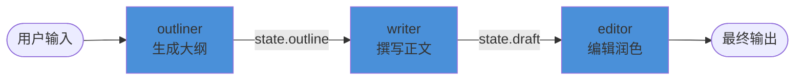
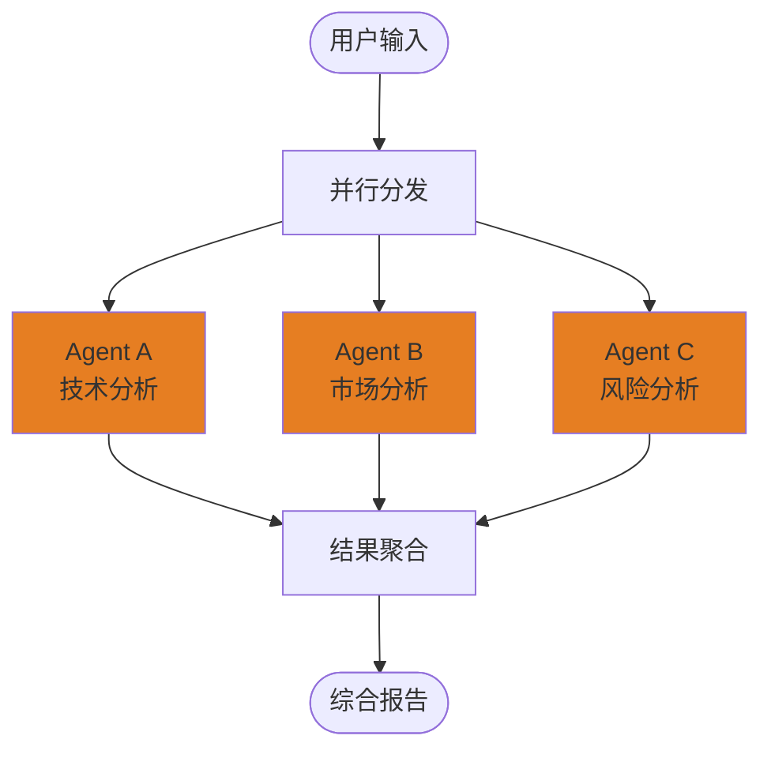
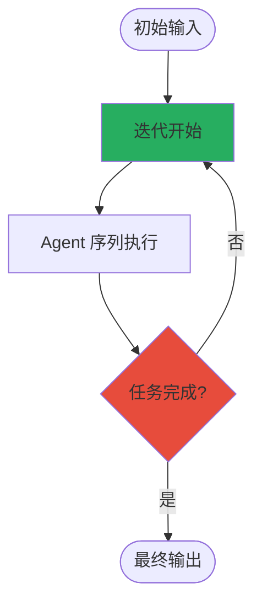

# 组合 Agent 模式

单个 Agent 适合简单的问答和工具调用场景，但复杂任务（如内容创作流水线、多维度分析、迭代优化）需要多个专业 Agent 协作。veadk-python 提供三种组合 Agent 类型——`SequentialAgent`（顺序执行）、`ParallelAgent`（并行执行）、`LoopAgent`（循环执行）——均继承自 Google ADK 对应的基类，并统一支持 tracers、Pydantic 配置等 VeADK 增强。此外还提供 `Supervisor` 监督模式和 `AgentBuilder` YAML 声明式构建。

## 组合模式概览

```
┌─────────────────────────────────────────────────────────────┐
│                     组合 Agent 类型                           │
│                                                              │
│  ┌─────────────────┐  ┌─────────────────┐  ┌──────────────┐ │
│  │ SequentialAgent │  │  ParallelAgent  │  │   LoopAgent  │ │
│  │   顺序执行       │  │   并行执行       │  │   循环执行    │ │
│  │  A→B→C         │  │  ═A═╗            │  │  ╭→A→B→C─╮   │ │
│  │  流水线模式     │  │  ═B═╣→ 聚合      │  │  ╰────────╯   │ │
│  │                 │  │  ═C═╝            │  │  迭代优化     │ │
│  └─────────────────┘  └─────────────────┘  └──────────────┘ │
│         │                    │                  │            │
│         └────────────────────┼──────────────────┘            │
│                              ▼                               │
│                    ┌──────────────────┐                      │
│                    │  AgentBuilder     │                      │
│                    │  YAML 声明式构建  │                      │
│                    └──────────────────┘                      │
│                                                              │
│  ┌──────────────────────────────────────────────────────┐    │
│  │  Supervisor 监督模式（可选叠加）                       │    │
│  │  在每次 LLM 调用前注入监督者建议                       │    │
│  └──────────────────────────────────────────────────────┘    │
└─────────────────────────────────────────────────────────────┘
```

## 三种组合 Agent 的共同特征

三种组合 Agent 共享相同的设计模式（F-051）：

1. **继承 Google ADK 基类**：`SequentialAgent`→`GoogleADKSequentialAgent`、`ParallelAgent`→`GoogleADKParallelAgent`、`LoopAgent`→`GoogleADKLoopAgent`
2. **Pydantic 模型配置**：均声明 `model_config = ConfigDict(arbitrary_types_allowed=True, extra="allow")`
3. **统一字段**：`name`、`description`、`instruction`、`sub_agents: list[BaseAgent]`、`tracers: list[BaseTracer]`
4. **初始化钩子**：`model_post_init` 中调用 `super().model_post_init(None)` 完成 sub_agents 初始化并记录日志
5. **模块级 patch**：三个模块都调用 `patch_asyncio()` 修补 asyncio 兼容性

## SequentialAgent：顺序执行

`SequentialAgent` 按预定义顺序依次执行子 Agent，前一个子 Agent 的输出通过 session state 传递给后续子 Agent。

veadk/agents/sequential_agent.py:L31-L64

```python
class SequentialAgent(GoogleADKSequentialAgent):
    model_config = ConfigDict(arbitrary_types_allowed=True, extra="allow")

    name: str = "veSequentialAgent"
    description: str = DEFAULT_DESCRIPTION
    instruction: str = DEFAULT_INSTRUCTION
    sub_agents: list[BaseAgent] = Field(default_factory=list, exclude=True)
    tracers: list[BaseTracer] = []

    def model_post_init(self, __context: Any) -> None:
        super().model_post_init(None)
        logger.info(f"{self.__class__.__name__} `{self.name}` init done.")
```

### 适用场景

- **内容创作流水线**：大纲 Agent → 写作 Agent → 编辑 Agent
- **多步推理**：分析 Agent → 规划 Agent → 执行 Agent
- **ETL 流程**：提取 Agent → 转换 Agent → 加载 Agent

### 使用模式

来自 examples/06_multi_agent 的标准模式（F-094）：

```python
from veadk import Agent
from veadk.agents import SequentialAgent

outliner = Agent(
    name="outliner",
    instruction="Create an outline for a blog post about {topic}. "
                "Write the outline to state key 'outline'.",
    output_key="outline",
)

writer = Agent(
    name="writer",
    instruction="Write a blog post based on this outline: {outline}. "
                "Write the draft to state key 'draft'.",
    output_key="draft",
)

editor = Agent(
    name="editor",
    instruction="Edit and polish this blog draft: {draft}.",
)

pipeline = SequentialAgent(
    name="blog_pipeline",
    sub_agents=[outliner, writer, editor],
)
```

子 Agent 通过 `output_key` 将输出写入 session state，后续子 Agent 在 instruction 中用 `{key}` 引用前序输出。ADK 框架负责在子 Agent 之间传递 state。

### 执行流程图



## ParallelAgent：并行执行

`ParallelAgent` 并发执行多个子 Agent，适用于子任务之间无依赖关系、可独立执行的场景。

veadk/agents/parallel_agent.py:L31-L72

```python
class ParallelAgent(GoogleADKParallelAgent):
    model_config = ConfigDict(arbitrary_types_allowed=True, extra="allow")

    name: str = "veParallelAgent"
    description: str = DEFAULT_DESCRIPTION
    instruction: str = DEFAULT_INSTRUCTION
    sub_agents: list[BaseAgent] = Field(default_factory=list, exclude=True)
    tracers: list[BaseTracer] = []

    def model_post_init(self, __context: Any) -> None:
        super().model_post_init(None)
        if self.tracers:
            logger.warning(
                "Enable tracing in ParallelAgent may cause OpenTelemetry "
                "context error. Issue see https://github.com/google/adk-python/issues/1670"
            )
        logger.info(f"{self.__class__.__name__} `{self.name}` init done.")
```

### 注意事项

- **Tracing 限制**：启用 tracers 可能导致 OpenTelemetry 上下文错误（已知 ADK issue #1670）
- **并发安全**：子 Agent 应避免写入相同的 state key，防止竞争条件

### 适用场景

- **多维度分析**：技术分析 Agent + 市场分析 Agent + 风险分析 Agent 并行执行
- **多源搜索**：并行搜索多个数据源
- **A/B 测试**：同一问题由多个风格 Agent 并行回答

### 执行流程图



## LoopAgent：循环执行

`LoopAgent` 循环执行其子 Agent，直到满足终止条件（如 LLM 判断任务完成或达到最大迭代次数）。适用于需要多轮迭代、自我修正的任务。

veadk/agents/loop_agent.py:L31-L68

```python
class LoopAgent(GoogleADKLoopAgent):
    model_config = ConfigDict(arbitrary_types_allowed=True, extra="allow")

    name: str = "veLoopAgent"
    description: str = DEFAULT_DESCRIPTION
    instruction: str = DEFAULT_INSTRUCTION
    sub_agents: list[BaseAgent] = Field(default_factory=list, exclude=True)
    tracers: list[BaseTracer] = []

    def model_post_init(self, __context: Any) -> None:
        super().model_post_init(None)
        logger.info(f"{self.__class__.__name__} `{self.name}` init done.")
```

### 适用场景

- **代码生成与测试**：写代码 Agent → 运行测试 Agent → （失败则循环修复）
- **多轮搜索与推理**：搜索 → 分析 → 不够则继续搜索
- **自我修正**：生成 → 评估 → 修正 → 再评估

### 执行流程图



## Supervisor：监督模式

Supervisor 模式在 LLM 每次调用前，由一个专门的"监督者"Agent 审查对话历史和工具调用，给出优化建议，注入到下一轮 LLM 请求中。这相当于给 Worker Agent 增加了一个"内审"环节。

### build_supervisor：创建监督 Agent

veadk/agents/supervise_agent.py:L25-L55

```python
class Advice(BaseModel):
    advice: str
    """The advice to the worker agent. Should be empty if the history execution is correct."""
    reason: str
    """The reason for the advice"""

instruction = Template("""You are a supervisor of an agent system. The system prompt of worker agent is:
```system prompt
{{ system_prompt }}
```
You should guide the agent to finish task and must output a JSON-format string with specific advice and reason:
- If you think the history execution is not correct, you should give your advice:
  {"advice": "Your advice here", "reason": "Your reason here"}.
- If you think the history execution is correct, you should output an empty string:
  {"advice": "", "reason": "Your reason here"}.
""")

def build_supervisor(supervised_agent: Agent) -> Agent:
    custom_instruction = instruction.render(system_prompt=supervised_agent.instruction)
    agent = Agent(
        name="supervisor",
        description="A supervisor for agent execution",
        instruction=custom_instruction,
        model_extra_config={"response_format": Advice},
    )
    return agent
```

监督 Agent 的输出是一个 `Advice` 对象（`advice` + `reason`），使用 JSON 格式约束输出。

### generate_advice：生成建议

veadk/agents/supervise_agent.py:L58-L79

```python
async def generate_advice(agent: Agent, llm_request: LlmRequest) -> str:
    runner = Runner(agent=agent)
    messages = ""
    for content in llm_request.contents:
        if content and content.parts:
            for part in content.parts:
                if part.text:
                    messages += f"{content.role}: {part.text}"
                if part.function_call:
                    messages += f"{content.role}: {part.function_call}"
                if part.function_response:
                    messages += f"{content.role}: {part.function_response}"

    prompt = (
        f"Agent has the following tools: {llm_request.tools_dict}. "
        f"History trajectory is: " + messages
    )
    return await runner.run(messages=prompt)
```

### SupervisorAutoFlow：监督流

veadk/flows/supervise_auto_flow.py:L32-L60

```python
class SupervisorAutoFlow(SupervisorSingleFlow):
    async def _call_llm_async(self, invocation_context, llm_request, model_response_event):
        supervisor_response = await generate_advice(self._supervisor, llm_request)
        advice_and_reason = json.loads(supervisor_response)

        if advice_and_reason["advice"]:
            llm_request.contents.append(
                Content(
                    parts=[Part(text=f"""Message from your supervisor (not user): {advice_and_reason["advice"]}, the corresponding reason is {advice_and_reason["reason"]}
Please follow the advice and reason above to optimize your actions.
""")],
                    role="user",
                )
            )
```

当监督者给出非空建议时，建议被包装为一条 user 角色的消息注入到 LLM 请求中，引导 Worker Agent 修正行为。

### _llm_flow 选择逻辑

Agent 的 `_llm_flow` 属性根据配置自动选择 Flow 类型（F-027）：

veadk/agent.py:L698-L721

| sub_agents | enable_supervisor | Flow 类型 | 说明 |
|------------|-------------------|-----------|------|
| 无 | False | `SingleFlow` | 单 Agent 直接对话 |
| 无 | True | `SupervisorSingleFlow` | 单 Agent + 监督者 |
| 有 | False | `AutoFlow` | LLM 自动路由到子 Agent |
| 有 | True | `SupervisorAutoFlow` | 自动路由 + 监督者审查 |

启用方式：在 Agent 上设置 `enable_supervisor=True`，框架自动创建监督 Agent 和对应的 Flow。

## AgentBuilder：YAML 声明式构建

`AgentBuilder` 支持从 YAML 配置文件构建任意复杂度的 Agent 树，适合需要动态配置或可视化编排的场景。

veadk/agent_builder.py:L29-L93

### AGENT_TYPES 映射表

```python
AGENT_TYPES = {
    "Agent": Agent,
    "SequentialAgent": SequentialAgent,
    "ParallelAgent": ParallelAgent,
    "LoopAgent": LoopAgent,
    "RemoteVeAgent": RemoteVeAgent,
}
```

### 构建流程

```mermaid
flowchart TD
    A[YAML 配置文件] --> B[OmegaConf.load 解析]
    B --> C[OmegaConf.to_container 转为 dict]
    C --> D[_build 递归构建]
    D --> E{有 sub_agents?}
    E -->|是| F[递归 _build 每个 sub_agent]
    F --> G[收集 sub_agents 列表]
    E -->|否| H{有 tools?}
    G --> H
    H -->|是| I[importlib 按 module.attr 导入工具函数]
    I --> J[收集 tools 列表]
    H -->|否| K[AGENT_TYPES[type] 查找类]
    J --> K
    K --> L[agent_cls(**config, sub_agents=..., tools=...)]
    L --> M([返回 Agent 实例])
```

### 使用方式

```python
from veadk.agent_builder import AgentBuilder

builder = AgentBuilder()
agent = builder.build(path="agent_config.yaml", root_agent_identifier="root_agent")
```

YAML 配置示例（概念性）：

```yaml
root_agent:
  type: SequentialAgent
  name: "research_pipeline"
  sub_agents:
    - type: Agent
      name: "searcher"
      instruction: "Search for information about the topic."
      tools:
        - name: "veadk.tools.builtin_tools.web_search:web_search"
    - type: Agent
      name: "writer"
      instruction: "Write a summary based on search results."
```

工具通过 `"module:function"` 字符串指定，AgentBuilder 递归构建 sub_agents 树。

## 组合模式选择指南

| 模式 | 子任务关系 | 执行方式 | 典型场景 |
|------|-----------|---------|---------|
| `SequentialAgent` | 有依赖，前序输出是后序输入 | 顺序 A→B→C | 内容创作流水线、ETL、多步推理 |
| `ParallelAgent` | 无依赖，可独立执行 | 并发 A‖B‖C | 多维度分析、多源搜索、A/B测试 |
| `LoopAgent` | 需要迭代修正 | 循环 A→B→...→直到完成 | 代码生成+测试、搜索-推理循环、自我修正 |
| `Supervisor` | 需要质量控制 | 每轮 LLM 调用前审查 | 安全敏感场景、质量要求高的任务 |
| `RemoteVeAgent` | 跨进程/跨网络 | A2A 协议远程调用 | 分布式 Agent、微服务化 Agent |

组合模式可以嵌套使用：例如 `SequentialAgent` 的某个子 Agent 可以是 `ParallelAgent`，`LoopAgent` 内部可以包含 `SequentialAgent`。

## 关键文件索引

| 文件 | 职责 |
|------|------|
| veadk/agents/sequential_agent.py | SequentialAgent 定义 |
| veadk/agents/parallel_agent.py | ParallelAgent 定义（含 OTel 警告） |
| veadk/agents/loop_agent.py | LoopAgent 定义 |
| veadk/agents/supervise_agent.py | Supervisor 模式：build_supervisor、generate_advice、Advice 模型 |
| veadk/flows/supervise_single_flow.py | SupervisorSingleFlow 实现 |
| veadk/flows/supervise_auto_flow.py | SupervisorAutoFlow 实现 |
| veadk/agent_builder.py | AgentBuilder YAML 构建器、AGENT_TYPES 映射 |
| veadk/a2a/remote_ve_agent.py | RemoteVeAgent（A2A 远程 Agent） |

## 相关概念

- [Agent 类与 Runner 执行引擎](agent-and-runner.md) — Agent._llm_flow 属性选择 Flow 类型，enable_supervisor 标志控制监督模式
- [Agent-to-Agent 协议](a2a-protocol.md) — RemoteVeAgent 通过 A2A 协议连接远程 Agent
- [工具定义与调用](tool-definition.md) — 组合 Agent 的子 Agent 可以挂载不同的工具集
