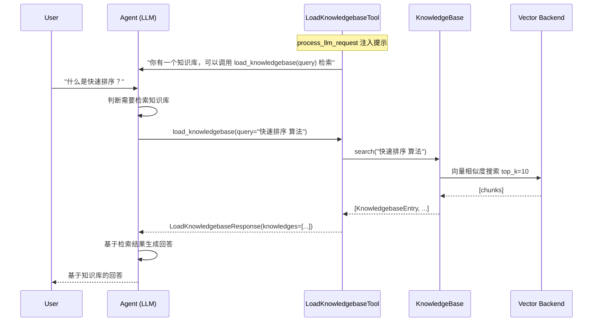

# 知识库集成

知识库（KnowledgeBase）是 veadk-python 的 RAG（Retrieval-Augmented Generation）核心模块，为 Agent 提供私有文档检索能力。它抽象了统一的知识库接口，支持 8 种后端（内存、OpenSearch、VikingDB、Redis、Milvus、TOS Vector、Context Search、OpenViking），自动挂载检索工具到 Agent，并支持 Profile 分库和用户画像增强检索。

## 知识库架构

```
┌─────────────────────────────────────────────────────────────┐
│                     Agent                                    │
│  ┌───────────────────────────────────────────────────────┐  │
│  │  LLM ← system prompt (注入知识库描述和 profile 信息)   │  │
│  │        ↓ 决定何时检索                                  │  │
│  │  LoadKnowledgebaseTool(query)                         │  │
│  │        ↓ 调用                                         │  │
│  │  KnowledgeBase.search(query) → [KnowledgebaseEntry]   │  │
│  └───────────────┬───────────────────────────────────────┘  │
│                  │                                           │
│  ┌───────────────▼───────────────────────────────────────┐  │
│  │              KnowledgeBase (门面类)                     │  │
│  │  add_from_directory / add_from_files / add_from_text  │  │
│  │  search / close / generate_profiles                   │  │
│  └───────────────┬───────────────────────────────────────┘  │
│                  │ 通过 _get_backend_cls 延迟加载             │
│  ┌───────────────▼───────────────────────────────────────┐  │
│  │           BaseKnowledgebaseBackend (抽象基类)           │  │
│  │  ┌─────────┐ ┌──────────┐ ┌───────┐ ┌───────┐        │  │
│  │  │  local  │ │opensearch│ │ redis │ │milvus │ ...    │  │
│  │  │ (内存)   │ │          │ │       │ │       │        │  │
│  │  └─────────┘ └──────────┘ └───────┘ └───────┘        │  │
│  └───────────────────────────────────────────────────────┘  │
└─────────────────────────────────────────────────────────────┘
```

## KnowledgeBase 核心类

`KnowledgeBase` 是知识库的门面类（Facade），统一管理后端实例和文档操作。

veadk/knowledgebase/knowledgebase.py:L92-L180

```python
class KnowledgeBase(BaseModel):
    name: str = "user_knowledgebase"
    description: str = "This knowledgebase stores some user-related information."
    backend: (
        Literal["local", "opensearch", "viking", "redis", "milvus",
                "tos_vector", "context_search", "openviking"]
        | BaseKnowledgebaseBackend
    ) = "local"
    backend_config: dict = Field(default_factory=dict)
    top_k: int = 10
    app_name: str = ""
    index: str = ""
    enable_profile: bool = False
    query_with_user_profile: bool = False
```

### 核心字段

| 字段 | 类型 | 默认值 | 说明 |
|------|------|--------|------|
| `name` | `str` | `"user_knowledgebase"` | 知识库名称 |
| `description` | `str` | 描述文本 | 知识库描述（注入到 Agent system prompt） |
| `backend` | 字符串或实例 | `"local"` | 向量后端类型或自定义后端实例 |
| `backend_config` | `dict` | `{}` | 后端初始化配置（优先于自动配置） |
| `top_k` | `int` | `10` | 检索返回的 Top-K 条目数 |
| `app_name` | `str` | `""` | 应用名（未指定 index 时用作 index 名） |
| `index` | `str` | `""` | 向量索引/集合名称 |
| `enable_profile` | `bool` | `False` | 是否启用 Profile 分库 |
| `query_with_user_profile` | `bool` | `False` | 是否结合用户画像增强查询 |

### 后端选择逻辑（model_post_init）

veadk/knowledgebase/knowledgebase.py:L156-L185

```python
def model_post_init(self, __context: Any, /) -> None:
    if isinstance(self.backend, BaseKnowledgebaseBackend):
        self._backend = self.backend          # 直接使用传入的后端实例
        self.index = self._backend.index
        return

    if self.backend_config:
        self._backend = _get_backend_cls(self.backend)(**self.backend_config)
        return                                 # 使用显式配置初始化

    self.index = self.index or self.app_name
    if not self.index:
        raise ValueError("Either `index` or `app_name` must be provided.")

    self._backend = _get_backend_cls(self.backend)(index=self.index)
```

后端选择的三种方式：
1. **传入后端实例**：直接使用，适合自定义后端
2. **传入 backend_config**：用配置字典初始化对应后端类
3. **默认方式**：根据 backend 类型名和 index 自动初始化

## 8 种向量后端

`_get_backend_cls` 函数实现后端类型到类的延迟映射（F-073）：

veadk/knowledgebase/knowledgebase.py:L30-L89

| 后端 | 类 | 适用场景 | 依赖 |
|------|-----|---------|------|
| `"local"` | `InMemoryKnowledgeBackend` | 开发测试、轻量原型 | 无（内存存储） |
| `"opensearch"` | `OpensearchKnowledgeBackend` | 企业级 OpenSearch 集群 | llama-index + opensearch-py |
| `"viking"` | `VikingDBKnowledgeBackend` | 火山引擎 VikingDB 向量数据库 | llama-index + viking SDK |
| `"redis"` | `RedisKnowledgeBackend` | Redis 向量检索 | llama-index + redis |
| `"milvus"` | `MilvusKnowledgeBackend` | Milvus 开源向量数据库 | llama-index + pymilvus |
| `"tos_vector"` | `TosVectorKnowledgeBackend` | 火山引擎 TOS 对象存储+向量 | 火山 SDK |
| `"context_search"` | `ContextSearchBackend` | 火山引擎 Context Search 服务 | 火山 SDK |
| `"openviking"` | `OpenVikingKnowledgeBackend` | OpenViking 资源检索 | 火山 SDK |

> **注意**：向量后端（local/opensearch/viking/redis/milvus/tos_vector）需要 llama-index 依赖，通过 `pip install veadk-python[extensions]` 安装。缺少扩展时会给出明确的错误提示。

### BaseKnowledgebaseBackend 抽象接口

veadk/knowledgebase/backends/base_backend.py:L20-L58

```python
class BaseKnowledgebaseBackend(ABC, BaseModel):
    index: str

    @abstractmethod
    def precheck_index_naming(self) -> None: ...

    @abstractmethod
    def add_from_directory(self, directory: str, *args, **kwargs) -> bool: ...

    @abstractmethod
    def add_from_files(self, files: list[str], *args, **kwargs) -> bool: ...

    @abstractmethod
    def add_from_text(self, text: str | list[str], *args, **kwargs) -> bool: ...

    @abstractmethod
    def search(self, *args, **kwargs) -> list: ...
```

所有后端必须实现文档导入（目录/文件/文本）和检索两个核心能力。

## 文档导入 API

KnowledgeBase 提供三种文档导入方式（F-074）：

### add_from_directory：从目录导入

```python
def add_from_directory(self, directory: str, **kwargs) -> bool
```

递归扫描目录下所有文件，经过分块（chunking）和嵌入（embedding）后存入向量后端。

```python
kb = KnowledgeBase(backend="local", index="my_docs")
kb.add_from_directory("./docs/")
```

### add_from_files：从文件列表导入

```python
def add_from_files(self, files: list[str], **kwargs) -> bool
```

导入指定的文件列表。

```python
kb.add_from_files(["./docs/intro.pdf", "./docs/api.md"])
```

### add_from_text：从文本导入

```python
def add_from_text(self, text: str | list[str], **kwargs) -> bool
```

直接导入纯文本内容（支持单条或批量）。

```python
kb.add_from_text("Python 是一种解释型高级编程语言。")
kb.add_from_text(["段落1", "段落2", "段落3"])
```

## 检索 API

### search：语义检索

veadk/knowledgebase/knowledgebase.py:L265-L282

```python
def search(self, query: str, top_k: int = 0, **kwargs) -> list[KnowledgebaseEntry]
```

对 query 进行语义嵌入后，在向量后端中检索 top_k 个最相似的文档块。返回 `KnowledgebaseEntry` 列表：

veadk/knowledgebase/entry.py:L18-L25

```python
class KnowledgebaseEntry(BaseModel):
    content: str           # 检索到的文本内容
    metadata: dict | None  # 元数据（来源文件、页码、相似度分数等）
```

### KnowledgebaseEntry 归一化

`search` 方法对后端返回结果做了归一化处理：
- 返回 `KnowledgebaseEntry` → 直接使用
- 返回 `str` → 自动包装为 `KnowledgebaseEntry(content=str)`
- 其他类型 → 记录错误日志并跳过

### close：资源释放

```python
def close(self) -> None
```

如果后端实现了 `close()` 方法（如关闭连接池），KnowledgeBase 会委托调用。通过 `__getattr__` 透传后端的其他方法（如 `delete`、`list_chunks` 等）。

## Agent 自动挂载机制

Agent 在 `model_post_init` 中检测到 `knowledgebase` 字段后，自动将知识库作为工具挂载，Agent 无需手动配置即可在对话中检索知识库（F-021）：

veadk/agent.py:L306-L324（概念性）

```python
if self.knowledgebase:
    self.tools.append(LoadKnowledgebaseTool(knowledgebase=self.knowledgebase))
    if self.knowledgebase.enable_profile:
        self.tools.append(load_kb_queries)  # Profile 查询推荐工具
```

### LoadKnowledgebaseTool：知识库检索工具

veadk/tools/builtin_tools/load_knowledgebase.py:L39-L167

`LoadKnowledgebaseTool` 是一个 `FunctionTool`，向 LLM 暴露 `load_knowledgebase(query)` 函数：

```python
class LoadKnowledgebaseTool(FunctionTool):
    def __init__(self, knowledgebase: KnowledgeBase):
        super().__init__(self.load_knowledgebase)
        self.knowledgebase = knowledgebase
        self.custom_metadata["backend"] = knowledgebase.backend

    async def load_knowledgebase(
        self, query: str, tool_context: ToolContext
    ) -> LoadKnowledgebaseResponse:
        response = await asyncio.to_thread(self.knowledgebase.search, query)
        return LoadKnowledgebaseResponse(knowledges=response)
```

#### process_llm_request：提示注入

工具在每次 LLM 调用前（`process_llm_request`）向 system prompt 注入知识库元信息：

1. **基础提示**：告知 LLM 知识库名称和描述，以及何时应该调用 `load_knowledgebase`
2. **Profile 提示**（`enable_profile=True`）：列出可用的知识库 profile，要求先调用 `load_kb_queries` 获取推荐查询词
3. **用户画像提示**（`query_with_user_profile=True`）：从 LongTermMemory 获取用户画像，引导 LLM 生成个性化查询



## Profile 分库机制

当 `enable_profile=True` 时，知识库支持将文档按主题分为多个 Profile（子库），LLM 可以根据问题选择相关的 Profile 进行精准检索，避免跨主题噪声。

### KnowledgebaseProfile

veadk/knowledgebase/types.py:L18-L29

```python
class KnowledgebaseProfile(BaseModel):
    name: str         # Profile 名称
    description: str  # Profile 描述
    tags: list[str]   # 分类标签（3-5个）
    keywords: list[str]  # 推荐查询关键词（3-5个）
```

### generate_profiles：自动生成 Profile

veadk/knowledgebase/knowledgebase.py:L297-L357

```python
async def generate_profiles(self, files: list[str], profile_path: str = ""):
```

该方法内部创建一个专用 Agent（`profile_generator`），用 `deepseek-v3-2-251201` 模型为每个文件自动生成 Profile（name、description、tags、keywords），输出 JSON 格式并保存到 `./profiles/knowledgebase/profiles_{index}/` 目录。

Profile 工作流：
1. LLM 通过 `load_kb_queries` 工具获取 Profile 列表和推荐关键词
2. 根据用户问题选择相关 Profile
3. 结合推荐关键词生成精准的检索查询
4. 调用 `load_knowledgebase` 执行检索

## 基本使用示例

```python
from veadk import Agent, Runner
from veadk.knowledgebase import KnowledgeBase

# 1. 创建知识库
kb = KnowledgeBase(
    backend="local",           # 内存后端（生产环境用 opensearch/viking）
    index="product_docs",
    top_k=5,
    name="产品文档库",
    description="包含产品使用指南、API文档和FAQ",
)

# 2. 导入文档
kb.add_from_directory("./docs/product/")
kb.add_from_text("我们的产品支持 REST API 和 WebSocket 两种接入方式。")

# 3. 创建带知识库的 Agent
agent = Agent(
    name="product_assistant",
    instruction="你是产品助手，基于知识库回答用户问题。",
    knowledgebase=kb,        # 自动挂载 LoadKnowledgebaseTool
)

# 4. 运行——Agent 会自动判断何时检索知识库
runner = Runner(agent=agent)
response = await runner.run(
    messages="如何接入 REST API？",
    user_id="user_001",
    session_id="session_001",
)
```

## 关键文件索引

| 文件 | 职责 |
|------|------|
| veadk/knowledgebase/knowledgebase.py | KnowledgeBase 门面类、_get_backend_cls、generate_profiles |
| veadk/knowledgebase/entry.py | KnowledgebaseEntry 数据模型 |
| veadk/knowledgebase/types.py | KnowledgebaseProfile 模型 |
| veadk/knowledgebase/backends/base_backend.py | BaseKnowledgebaseBackend 抽象基类 |
| veadk/knowledgebase/backends/in_memory_backend.py | 内存后端（开发测试） |
| veadk/knowledgebase/backends/opensearch_backend.py | OpenSearch 后端 |
| veadk/knowledgebase/backends/vikingdb_knowledge_backend.py | VikingDB 后端 |
| veadk/knowledgebase/backends/redis_backend.py | Redis 向量后端 |
| veadk/knowledgebase/backends/milvus_backend.py | Milvus 后端 |
| veadk/tools/builtin_tools/load_knowledgebase.py | LoadKnowledgebaseTool 检索工具 |

## 相关概念

- [记忆系统](memory-system.md) — LongTermMemory 的用户画像可增强知识库检索（query_with_user_profile）
- [工具定义与调用](tool-definition.md) — LoadKnowledgebaseTool 是内置工具的一种
- [Agent 类与 Runner 执行引擎](agent-and-runner.md) — Agent.knowledgebase 字段和自动挂载机制
