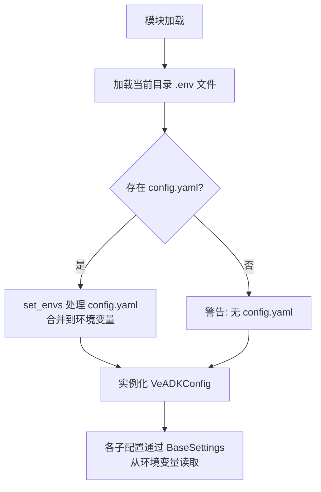

# 模型配置层

veadk-python 的模型层采用**双后端架构**：默认通过 LiteLLM 兼容 OpenAI 协议调用任意模型（包括火山引擎 Ark、OpenAI、Anthropic 等），启用 `enable_responses=True` 时切换为火山引擎原生 Ark Responses API（`ArkLlm`），获得流式缓存、多模态交互等高级能力。配置层通过 `ModelConfig`（基于 Pydantic Settings）实现环境变量与配置文件的统一管理。

## 模型后端架构

```
┌──────────────────────────────────────────────────────┐
│                    Agent.model                        │
│                                                       │
│   ┌─────────────┐  enable_responses=False  ┌────────┐ │
│   │  LiteLlm    │◄─────────────────────────│ ArkLlm │ │
│   │ (LiteLLM)   │   enable_responses=True   │(Ark)   │ │
│   └──────┬──────┘                           └───┬────┘ │
│          │                                      │      │
└──────────┼──────────────────────────────────────┼──────┘
           │                                      │
     ┌─────▼──────┐                       ┌──────▼──────┐
     │ OpenAI兼容 │                       │ Ark Responses│
     │ /v1/chat   │                       │ /v3/responses│
     │ completions│                       │ API (原生)   │
     └────────────┘                       └─────────────┘
         任意提供商                           火山引擎专属
     (火山Ark/OpenAI/                     (流式缓存/fallback/
      Anthropic/...)                      多模态/interactions)
```

## ModelConfig：全局模型配置

`ModelConfig` 基于 `pydantic-settings.BaseSettings`，使用环境变量前缀 `MODEL_AGENT_`，提供模型名、提供商、API 地址和密钥的统一配置入口。

veadk/configs/model_configs.py:L31-L54

```python
class ModelConfig(BaseSettings):
    model_config = SettingsConfigDict(env_prefix="MODEL_AGENT_")

    name: str = DEFAULT_MODEL_AGENT_NAME           # "doubao-seed-2-1-pro-260628"
    provider: str = DEFAULT_MODEL_AGENT_PROVIDER   # "openai"
    api_base: str = DEFAULT_MODEL_AGENT_API_BASE   # "https://ark.cn-beijing.volces.com/api/v3/"
    api_key_name: str = ""

    @cached_property
    def api_key(self) -> str:
        if explicit := os.getenv("MODEL_AGENT_API_KEY"):
            return explicit
        if self.api_key_name:
            return get_ark_token(api_key_name=self.api_key_name)
        return get_ark_token()
```

### API Key 解析链

`api_key` 是 `@cached_property`，按以下优先级解析（F-065）：

```mermaid
flowchart LR
    A[api_key 访问] --> B{MODEL_AGENT_API_KEY<br/>环境变量?}
    B -->|是| C[返回环境变量值]
    B -->|否| D{api_key_name<br/>已设置?}
    D -->|是| E[get_ark_token<br/>按名称解析]
    D -->|否| F[get_ark_token()<br/>默认第一个密钥]
    E --> G[返回 API Key]
    F --> G
    C --> G
```

### 其他模型配置类

| 配置类 | 环境变量前缀 | 默认模型 | 说明 |
|--------|-------------|---------|------|
| `ModelConfig` | `MODEL_AGENT_` | `doubao-seed-2-1-pro-260628` | Agent 推理模型 |
| `EmbeddingModelConfig` | `MODEL_EMBEDDING_` | `doubao-embedding-vision-250615` | Embedding 模型（2048维） |
| `NormalEmbeddingModelConfig` | `MODEL_EMBEDDING_` | `doubao-embedding-text-240715` | 文本 Embedding（2560维） |
| `RealtimeModelConfig` | `MODEL_REALTIME_` | `doubao_realtime_voice_model` | 实时语音模型（WSS） |

## VeADKConfig：全局配置聚合

`VeADKConfig` 是所有配置子模型的聚合根，通过全局单例 `settings` 访问：

veadk/config.py:L64-L146

```python
class VeADKConfig(BaseModel):
    model: ModelConfig = Field(default_factory=ModelConfig)
    tool: BuiltinToolConfigs = Field(default_factory=BuiltinToolConfigs)
    prompt_pilot: PromptPilotConfig = Field(default_factory=PromptPilotConfig)

    # 追踪配置
    opentelemetry_config: OpenTelemetryConfig = ...
    apmplus_config: APMPlusConfig = ...
    cozeloop_config: CozeloopConfig = ...
    tls_config: TLSConfig = ...
    prometheus_config: PrometheusConfig = ...

    # 数据库/存储配置
    tos: TOSConfig = ...
    opensearch: OpensearchConfig = ...
    mysql: MysqlConfig = ...
    redis: RedisConfig = ...
    milvus: MilvusConfig = ...
    viking_knowledgebase: VikingKnowledgebaseConfig = ...

    veidentity: VeIdentityConfig = ...
    realtime_model: RealtimeModelConfig = ...

settings = VeADKConfig()  # 全局单例
```

### 配置加载顺序



1. 首先加载当前工作目录的 `.env` 文件（`load_dotenv`）
2. 然后查找 `config.yaml`（通过 `find_dotenv` 向上搜索）
3. 通过 `set_envs` 将 YAML 配置映射为环境变量
4. 最后实例化全局 `settings = VeADKConfig()`

### BytePlus 环境适配

当 `CLOUD_PROVIDER=byteplus` 时，默认值自动切换为海外版（F-066）：

veadk/consts.py:L79-L91

```python
if provider and provider.lower() == "byteplus":
    DEFAULT_MODEL_AGENT_NAME = "dola-seed-2-1-turbo-260628"
    DEFAULT_MODEL_AGENT_API_BASE = "https://ark.ap-southeast.bytepluses.com/api/v3"
    DEFAULT_IMAGE_EDIT_MODEL_NAME = "seededit-3-0-i2i-250628"
    DEFAULT_VIDEO_MODEL_NAME = "dreamina-seedance-2-0-260128"
    DEFAULT_IMAGE_GENERATE_MODEL_NAME = "dola-seedream-5-0-pro-260628"
```

同时 `getenv()` 函数自动将 `BYTEPLUS_ACCESS_KEY/SECRET_KEY` 映射为 `VOLCENGINE_ACCESS_KEY/SECRET_KEY`。

## LiteLlm：通用模型后端

`LiteLlm` 来自 `google.adk.models.lite_llm`，基于 LiteLLM 库提供 OpenAI 兼容接口的统一调用。当 `enable_responses=False`（默认）时，Agent 使用此后端。

veadk/agent.py:L286-L293

```python
self.model = LiteLlm(
    model=f"{self.model_provider}/{model_name}",
    api_key=self.model_api_key,
    api_base=self.model_api_base,
    fallbacks=fallbacks,
    **self.model_extra_config,
)
```

### 模型命名格式

LiteLLM 使用 `"{provider}/{model_name}"` 格式路由到不同提供商：

| provider 值 | 实际路由 | 示例 |
|-------------|---------|------|
| `"openai"` | OpenAI 兼容接口（默认指向火山 Ark） | `openai/doubao-seed-2-1-pro-260628` |
| `"anthropic"` | Anthropic Claude | `anthropic/claude-3-sonnet` |
| `"gemini"` | Google Gemini | `gemini/gemini-pro` |

### Fallback 模型链

当 `model_name` 传入列表时，第一个元素作为主模型，其余依次作为 fallback（F-020）：

```python
if isinstance(self.model_name, list):
    model_name = self.model_name[0]
    fallbacks = [f"{self.model_provider}/{m}" for m in self.model_name[1:]]
```

主模型调用失败时，LiteLLM 自动依次尝试 fallback 模型，提升可用性。

## ArkLlm：火山引擎原生 Responses API

`ArkLlm` 继承自 `google.adk.models.Gemini`，通过火山引擎 Ark SDK 的 `AsyncArk` 客户端调用 Responses API，提供比 LiteLLM 更丰富的原生能力。

veadk/models/ark_llm.py:L703-L719

```python
class ArkLlm(Gemini):
    model: str
    fallbacks: Optional[List[str]] = None
    llm_client: ArkLlmClient = Field(default_factory=ArkLlmClient)
    use_interactions_api: bool = True
    enable_responses_cache: bool = True
```

veadk/agent.py:L275-L285

```python
if self.enable_responses:
    from veadk.models.ark_llm import ArkLlm
    self.model = ArkLlm(
        model=f"{self.model_provider}/{model_name}",
        api_key=self.model_api_key,
        api_base=self.model_api_base,
        fallbacks=fallbacks,
        enable_responses_cache=self.enable_responses_cache,
        **self.model_extra_config,
    )
```

### ArkLlmClient：底层 HTTP 客户端

veadk/models/ark_llm.py:L683-L700

```python
class ArkLlmClient:
    async def aresponses(self, **kwargs) -> Union[ArkTypeResponse, AsyncStream[ResponseStreamEvent]]:
        api_base = kwargs.pop("api_base", DEFAULT_VIDEO_MODEL_API_BASE)
        api_key = kwargs.pop("api_key", None)
        if api_key is None:
            api_key = settings.model.api_key

        client = AsyncArk(
            base_url=api_base,
            api_key=api_key,
        )
        raw_response = await client.responses.create(**kwargs)
        return raw_response
```

### ArkLlm 核心特性

| 特性 | 说明 |
|------|------|
| **Streaming** | 支持流式和非流式两种模式 |
| **Fallback 链** | 主模型失败后依次尝试备选模型（与 LiteLlm 相同逻辑） |
| **响应缓存** | `enable_responses_cache=True` 时复用 `previous_response_id` 实现多轮续接缓存 |
| **Interactions API** | `use_interactions_api=True` 使用 Ark 交互 API |
| **ADK 版本检查** | 要求 `google-adk>=1.34.0`，否则抛出 ImportError |

### generate_content_async：请求构造

veadk/models/ark_llm.py:L732-L759

```python
async def generate_content_async(
    self, llm_request: LlmRequest, stream: bool = False
) -> AsyncGenerator[LlmResponse, None]:
    self._maybe_append_user_content(llm_request)
    instructions, input_param, tools, text_format, generation_params = (
        _get_responses_inputs(llm_request)
    )

    previous_response_id = None
    if self.enable_responses_cache:
        previous_response_id = get_previous_interaction_id(llm_request)

    responses_args = {
        # ... 构造请求参数
    }
```

缓存机制通过 `previous_response_id` 实现——多轮对话中，后续请求携带上一轮的 response ID，Ark 服务端可复用上下文，减少 token 消耗。

## DEFAULT_MODEL_EXTRA_CONFIG：默认请求配置

所有模型请求默认携带以下 extra_headers 和 extra_body（F-069）：

veadk/consts.py:L25-L42

```python
DEFAULT_MODEL_EXTRA_CONFIG = {
    "extra_headers": {
        "x-is-encrypted": getenv("MODEL_AGENT_ENCRYPTED", "true"),
        "veadk-source": "veadk",
        "veadk-version": VERSION,
        "User-Agent": f"VeADK/{VERSION}",
        "X-Client-Request-Id": getenv("MODEL_AGENT_CLIENT_REQ_ID", f"veadk/{VERSION}"),
    },
    "extra_body": {
        "caching": {"type": getenv("MODEL_AGENT_CACHING", "enabled")},
        "expire_at": int(time.time()) + 3600,  # 1小时后过期
    },
}
```

Agent.model_post_init 中将用户配置与默认配置合并（headers 和 body 使用 `|=` 操作符合并，用户配置覆盖默认值）。

## 默认模型一览

veadk/consts.py:L20-L94

| 用途 | 模型名 | API Base |
|------|--------|----------|
| Agent 推理（国内） | `doubao-seed-2-1-pro-260628` | `https://ark.cn-beijing.volces.com/api/v3/` |
| Agent 推理（BytePlus） | `dola-seed-2-1-turbo-260628` | `https://ark.ap-southeast.bytepluses.com/api/v3` |
| 图片生成（国内） | `doubao-seedream-5-0-260128` | Ark 国内 |
| 图片生成（BytePlus） | `dola-seedream-5-0-pro-260628` | Ark 海外 |
| 图片编辑 | `doubao-seededit-3-0-i2i-250628` | Ark 国内/海外 |
| 视频生成（国内） | `doubao-seedance-2-0-260128` | Ark 国内 |
| 视频生成（BytePlus） | `dreamina-seedance-2-0-260128` | Ark 海外 |
| Embedding（多模态） | `doubao-embedding-vision-250615` | Ark 国内，维度 2048 |

## 性能优化：LITELLM_LOCAL_MODEL_COST_MAP

veadk/agent.py:L23-L28

```python
if not os.getenv("LITELLM_LOCAL_MODEL_COST_MAP"):
    os.environ["LITELLM_LOCAL_MODEL_COST_MAP"] = "True"
```

导入 Agent 模块时，若未设置 `LITELLM_LOCAL_MODEL_COST_MAP`，自动设为 `"True"`，启用本地模型费用映射表，避免 Litellm 导入时从远程拉取费用数据（约 10s 延迟）。

## update_model：运行时切换模型

veadk/agent.py:L447-L451

```python
def update_model(self, model_name: str):
    self.model = self.model.model_copy(
        update={"model": f"{self.model_provider}/{model_name}"}
    )
```

通过 Pydantic 的 `model_copy` 创建新模型实例，保留所有其他配置（api_key、api_base、extra_config 等），仅更新模型名称。适用于 A/B 测试、成本优化等场景。

## 关键文件索引

| 文件 | 职责 |
|------|------|
| veadk/configs/model_configs.py | ModelConfig/EmbeddingModelConfig/RealtimeModelConfig 定义 |
| veadk/config.py | VeADKConfig 聚合、配置加载顺序、getenv()、全局 settings |
| veadk/consts.py | 默认模型名、API Base、DEFAULT_MODEL_EXTRA_CONFIG、BytePlus 适配 |
| veadk/models/ark_llm.py | ArkLlm 类、ArkLlmClient、Responses API 调用实现 |
| veadk/models/ark_embedding.py | Ark Embedding 模型封装 |
| veadk/agent.py | Agent.model_post_init 中的模型实例化逻辑 |

## 相关概念

- [Agent 类与 Runner 执行引擎](agent-and-runner.md) — Agent 在 model_post_init 中创建模型实例，Runner 消费模型输出
- [记忆系统](memory-system.md) — Embedding 模型为长期记忆和知识库提供向量化能力
- [知识库集成](knowledge-base.md) — 知识库后端依赖 Embedding 模型进行文档向量化
