# 工具定义与调用

工具（Tool）是 Agent 与外部世界交互的桥梁。veadk-python 的工具系统建立在 Google ADK 的 `ToolUnion` 抽象之上，提供了 15+ 内置工具、MCP Router 远程工具接入，以及在 Agent 初始化时根据配置自动挂载工具的机制。内置工具采用**延迟加载**策略——注册 `"module:attr"` 路径而非直接导入实例，避免导入 `veadk.tools` 时拉取重量级依赖。

## 工具系统架构

```
┌──────────────────────────────────────────────────────────────┐
│                       Agent.tools                             │
│                                                               │
│  ┌─────────────┐ ┌──────────────┐ ┌───────────────────────┐  │
│  │ 内置工具     │ │ 自动挂载工具  │ │ 用户自定义工具         │  │
│  │ (延迟加载)   │ │ (条件触发)    │ │ (直接传入)            │  │
│  └──────┬──────┘ └──────┬───────┘ └──────────┬────────────┘  │
│         │               │                     │               │
│  ┌──────▼──────┐ ┌──────▼───────┐ ┌──────────▼────────────┐  │
│  │_BUILTIN_    │ │KnowledgeBase │ │ 任意 ToolUnion:        │  │
│  │TOOLS 注册表  │ │LongTermMemory│ │  - Python 函数        │  │
│  │             │ │Auth/A2UI/    │ │  - MCPToolset         │  │
│  │web_search   │ │Tunnel/Ghost  │ │  - BaseTool 子类      │  │
│  │web_fetch    │ │char/...      │ │  - 其他 ADK 工具      │  │
│  │run_code     │ └──────────────┘ └───────────────────────┘  │
│  │...          │                                             │
│  └─────────────┘                                             │
└──────────────────────────────────────────────────────────────┘
         │
         ▼
┌──────────────────────────────────────────────────────────────┐
│              LLM Function Calling                            │
│  模型根据工具描述决定是否调用，ADK 框架负责执行并返回结果       │
└──────────────────────────────────────────────────────────────┘
```

## 内置工具注册表

### 延迟加载机制

veadk/tools/__init__.py:L26-L67

内置工具通过 `_BUILTIN_TOOLS` 字典注册，值为 `"module:attr"` 格式的延迟导入路径：

```python
_BUILTIN_TOOLS: dict[str, str] = {
    # Web
    "web_search": "veadk.tools.builtin_tools.web_search:web_search",
    "web_fetch": "veadk.tools.builtin_tools.web_fetch:web_fetch",
    "parallel_web_search": "veadk.tools.builtin_tools.parallel_web_search:parallel_web_search",
    "vesearch": "veadk.tools.builtin_tools.vesearch:vesearch",
    "link_reader": "veadk.tools.builtin_tools.link_reader:link_reader",
    # Code
    "run_code": "veadk.tools.builtin_tools.run_code:run_code",
    "coding": "veadk.tools.builtin_tools.coding:coding",
    # Image / video / speech generation
    "image_generate": "veadk.tools.builtin_tools.image_generate:image_generate",
    "image_edit": "veadk.tools.builtin_tools.image_edit:image_edit",
    "video_generate": "veadk.tools.builtin_tools.video_generate:video_generate",
    "video_task_query": "veadk.tools.builtin_tools.video_generate:video_task_query",
    "ppt_generate": "veadk.tools.builtin_tools.ppt_generate:ppt_generate",
    "text_to_speech": "veadk.tools.builtin_tools.tts:text_to_speech",
    # Demo / example tools
    "get_city_weather": "veadk.tools.demo_tools:get_city_weather",
    "get_location_weather": "veadk.tools.demo_tools:get_location_weather",
}
```

延迟加载的设计原因：某些工具（如图片/视频生成）在导入时会构建客户端实例并需要凭证，不应在 `import veadk.tools` 时触发。只有通过 `get_builtin_tool()` 按名获取时才真正导入。

### 工具访问 API

```python
def list_builtin_tools() -> list[str]:
    """返回所有内置工具名称的排序列表。"""
    return sorted(_BUILTIN_TOOLS)

def get_builtin_tool(name: str) -> ToolUnion:
    """按名称解析内置工具，不存在时抛出 KeyError。"""
    if name not in _BUILTIN_TOOLS:
        raise KeyError(
            f"Unknown builtin tool '{name}'. "
            f"Available: {', '.join(list_builtin_tools())}"
        )
    module_path, attr = _BUILTIN_TOOLS[name].split(":")
    module = importlib.import_module(module_path)
    return getattr(module, attr)
```

## 内置工具一览

### Web 搜索类

| 工具名 | 模块路径 | 功能 |
|--------|---------|------|
| `web_search` | `veadk.tools.builtin_tools.web_search` | 火山引擎网页搜索，返回搜索结果文档列表 |
| `web_fetch` | `veadk.tools.builtin_tools.web_fetch` | 抓取网页内容 |
| `parallel_web_search` | `veadk.tools.builtin_tools.parallel_web_search` | 并行多查询搜索 |
| `vesearch` | `veadk.tools.builtin_tools.vesearch` | 火山引擎专属搜索 |
| `link_reader` | `veadk.tools.builtin_tools.link_reader` | 链接内容阅读器 |

web_search 工具签名（F-070）：

veadk/tools/builtin_tools/web_search.py:L31-L39

```python
def web_search(query: str, tool_context: ToolContext | None = None) -> list[str]:
    """Search a query in websites.

    Args:
        query: The query to search.

    Returns:
        A list of result documents.
    """
```

凭证解析优先级：工具专属环境变量 `TOOL_WEB_SEARCH_ACCESS_KEY/SECRET_KEY` > `tool_context.state` 中的 AK/SK > IAM 凭证。

### 代码执行类

| 工具名 | 模块路径 | 功能 |
|--------|---------|------|
| `run_code` | `veadk.tools.builtin_tools.run_code` | 沙箱代码执行 |
| `coding` | `veadk.tools.builtin_tools.coding` | 编码辅助工具 |

### 多模态生成类

| 工具名 | 模块路径 | 默认模型 | 功能 |
|--------|---------|---------|------|
| `image_generate` | `veadk.tools.builtin_tools.image_generate` | `doubao-seedream-5-0-260128` | 图片生成（豆包 Seedream） |
| `image_edit` | `veadk.tools.builtin_tools.image_edit` | `doubao-seededit-3-0-i2i-250628` | 图片编辑（SeedEdit） |
| `video_generate` | `veadk.tools.builtin_tools.video_generate` | `doubao-seedance-2-0-260128` | 视频生成（豆包 Seedance） |
| `video_task_query` | `veadk.tools.builtin_tools.video_generate` | — | 视频生成任务查询 |
| `ppt_generate` | `veadk.tools.builtin_tools.ppt_generate` | — | PPT 生成 |
| `text_to_speech` | `veadk.tools.builtin_tools.tts` | — | 文本转语音 |

图片生成默认模型 `doubao-seedream-5-0-260128`，视频生成默认模型 `doubao-seedance-2-0-260128`，图片编辑默认模型 `doubao-seededit-3-0-i2i-250628`（F-092）。BytePlus 环境下自动切换为对应的海外版模型。

### 示例/演示工具

| 工具名 | 模块路径 | 功能 |
|--------|---------|------|
| `get_city_weather` | `veadk.tools.demo_tools` | 按城市名查询天气（演示用） |
| `get_location_weather` | `veadk.tools.demo_tools` | 按位置查询天气（演示用） |

这两个工具在包导入时直接导入（非延迟加载），作为简单的示例工具存在。

## MCP Router：远程工具接入

除内置工具外，veadk-python 通过 MCP（Model Context Protocol）Router 接入远程工具集：

veadk/tools/builtin_tools/mcp_router.py

```python
from google.adk.tools.mcp_tool.mcp_toolset import MCPToolset
from google.adk.tools.mcp_tool.mcp_session_manager import StreamableHTTPConnectionParams
from veadk.config import getenv

url = getenv("TOOL_MCP_ROUTER_URL")
api_key = getenv("TOOL_MCP_ROUTER_API_KEY")

mcp_router = MCPToolset(
    connection_params=StreamableHTTPConnectionParams(
        url=url, headers={"Authorization": f"Bearer {api_key}"}
    ),
)
```

通过环境变量 `TOOL_MCP_ROUTER_URL` 和 `TOOL_MCP_ROUTER_API_KEY` 配置 MCP Router 端点，使用 Streamable HTTP 协议连接远程 MCP 服务，Bearer Token 认证。这样 Agent 可以透明地使用远程 MCP 服务暴露的所有工具。

## Agent 自动工具挂载

Agent 在 `model_post_init` 中根据布尔开关自动挂载功能工具集，这是 veadk-python "开箱即用" 设计的核心。以下是自动挂载的工具和触发条件：

```mermaid
flowchart TD
    A[Agent.model_post_init] --> B{knowledgebase 设置?}
    B -->|是| B1[+ LoadKnowledgebaseTool]
    B1 --> B2{enable_profile?}
    B2 -->|是| B3[+ load_kb_queries] --> C
    B2 -->|否| C{long_term_memory 设置?}
    B -->|否| C

    C -->|是| C1[+ google.adk.tools.load_memory<br/>设置 custom_metadata.backend] --> D
    C -->|否| D{enable_authz?}

    D -->|是| D1[+ check_agent_authorization<br/>注册到 before_agent_callback] --> E
    D -->|否| E{auto_save_session + long_term_memory?}

    E -->|是| E1[+ save_session_to_long_term_memory<br/>注册到 after_agent_callback] --> F
    E -->|否| F{skills 非空?}

    F -->|是| F1[load_skills + SkillsToolset]
    F1 --> F2{enable_skills_checklist?}
    F2 -->|是| F3[+ skills checklist 回调] --> G
    F2 -->|否| G{example_store?}
    F -->|否| G

    G -->|是| G1[+ ExampleTool] --> H
    G -->|否| H{enable_ghostchar?}

    H -->|是| H1[+ GhostcharTool<br/>追加幽灵字符指令] --> I
    H -->|否| I{enable_a2ui?}

    I -->|是| I1[+ build_a2ui_toolset] --> J
    I -->|否| J{enable_tunnel?}

    J -->|是| J1[+ TunnelToolset] --> K[初始化完成]
    J -->|否| K
```



### 自动挂载工具详细说明

| 触发条件 | 挂载的工具/回调 | 源码位置 |
|---------|---------------|---------|
| `knowledgebase` 已设置 | `LoadKnowledgebaseTool` | agent.py:L306-L314 |
| `knowledgebase.enable_profile=True` | `load_kb_queries` 工具 | agent.py:L316-L324 |
| `long_term_memory` 已设置 | `google.adk.tools.load_memory`（设置 backend 元数据） | agent.py:L326-L333 |
| `enable_authz=True` | `check_agent_authorization`（before_agent_callback） | agent.py:L335-L349 |
| `auto_save_session=True` + LTM | `save_session_to_long_term_memory`（after_agent_callback） | agent.py:L354-L375 |
| `skills` 非空 | `load_skills()` + SkillsToolset | agent.py:L377-L397 |
| `example_store` 已设置 | `ExampleTool(examples=example_store)` | agent.py:L399-L402 |
| `enable_ghostchar=True` | `GhostcharTool()` + 幽灵字符指令 | agent.py:L404-L410 |
| `enable_a2ui=True` | `build_a2ui_toolset(catalog=...)` | agent.py:L412-L416 |
| `enable_tunnel=True` | `TunnelToolset(agent_name=self.name)` | agent.py:L418-L422 |
| `enable_dataset_gen=True` | `dataset_auto_gen_callback`（after_agent_callback） | agent.py:L424-L438 |

### 知识库工具挂载示例

```python
# 设置 knowledgebase 后，Agent 自动添加 LoadKnowledgebaseTool
from veadk import Agent
from veadk.knowledgebase import KnowledgeBase

kb = KnowledgeBase(backend="local", index="my_docs")
agent = Agent(
    name="doc_agent",
    knowledgebase=kb,  # 自动挂载 LoadKnowledgebaseTool
)
# agent.tools 现在包含 LoadKnowledgebaseTool 实例
```

### 授权回调挂载

```python
# enable_authz=True 时，check_agent_authorization 注册为 before_agent_callback
agent = Agent(
    name="secure_agent",
    enable_authz=True,  # 自动添加授权检查回调
)
```

回调注册逻辑支持单回调和回调列表两种情况——若已有回调则追加到列表，否则直接设置。

## 其他工具文件

`veadk/tools/builtin_tools/` 目录下还有更多工具实现（部分为可选依赖或特定场景使用）：

| 文件 | 功能 |
|------|------|
| `load_knowledgebase.py` | 知识库加载工具（自动挂载） |
| `load_kb_queries.py` | 知识库查询 Profile 工具 |
| `agent_authorization.py` | Agent 授权检查工具 |
| `execute_skills.py` | 技能执行工具 |
| `playwright.py` | Playwright 浏览器自动化 |
| `web_scraper.py` | 网页爬虫 |
| `lark.py` | 飞书集成 |
| `run_sandbox_agent.py` | 沙箱 Agent 运行 |
| `supabase_toolset.py` | Supabase 数据库工具集 |
| `llm_shield.py` | LLM 安全防护 |
| `a2a_registry.py` | A2A 注册中心工具 |

## 工具类型：ToolUnion

veadk-python 使用 Google ADK 的 `ToolUnion` 类型别名，支持以下工具形式：

```python
from google.adk.agents.llm_agent import ToolUnion

# ToolUnion 可以是：
# 1. 普通 Python 函数（自动生成 JSON Schema）
def my_tool(query: str) -> str: ...

# 2. google.adk.tools.BaseTool 子类实例
from google.adk.tools import BaseTool

class MyTool(BaseTool):
    ...

# 3. google.adk.tools.BaseToolset 实例（工具集）
from google.adk.tools import BaseToolset
from google.adk.tools.mcp_tool.mcp_toolset import MCPToolset

# 4. google-genai 类型的 FunctionDeclaration
```

普通 Python 函数作为工具时，ADK 框架自动通过类型注解和 docstring 生成 OpenAI Function Calling 格式的 JSON Schema，LLM 根据 Schema 决定是否调用。

## 关键文件索引

| 文件 | 职责 |
|------|------|
| veadk/tools/\_\_init\_\_.py | 内置工具注册表、get_builtin_tool()、list_builtin_tools() |
| veadk/tools/builtin_tools/web_search.py | 火山引擎网页搜索工具 |
| veadk/tools/builtin_tools/web_fetch.py | 网页内容抓取 |
| veadk/tools/builtin_tools/run_code.py | 代码执行（沙箱） |
| veadk/tools/builtin_tools/image_generate.py | 图片生成（Seedream） |
| veadk/tools/builtin_tools/video_generate.py | 视频生成（Seedance）+ 任务查询 |
| veadk/tools/builtin_tools/ppt_generate.py | PPT 生成 |
| veadk/tools/builtin_tools/tts.py | 文本转语音 |
| veadk/tools/builtin_tools/load_knowledgebase.py | 知识库 RAG 工具（自动挂载） |
| veadk/tools/builtin_tools/mcp_router.py | MCP Router 远程工具集 |
| veadk/tools/builtin_tools/agent_authorization.py | Agent 授权检查 |
| veadk/tools/demo_tools.py | 演示工具（天气查询） |
| veadk/agent.py | Agent.model_post_init 中的工具自动挂载逻辑 |

## 相关概念

- [Agent 类与 Runner 执行引擎](agent-and-runner.md) — Agent.tools 字段定义与自动挂载机制
- [知识库集成](knowledge-base.md) — LoadKnowledgebaseTool 对接知识库 RAG
- [A2UI 协议](a2ui-protocol.md) — build_a2ui_toolset 生成 A2UI 工具集
- [隧道与网络通信](tunnel-networking.md) — TunnelToolset 动态发现本地 MCP 服务器
