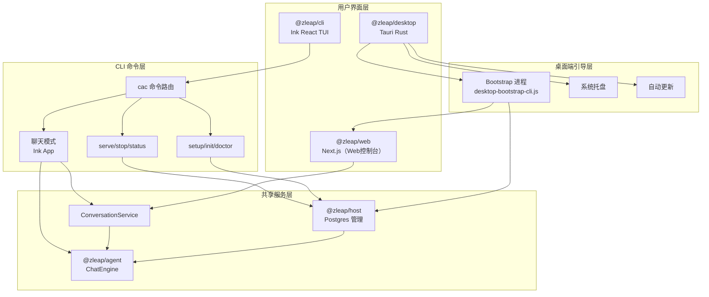
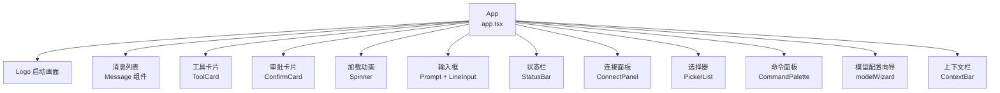
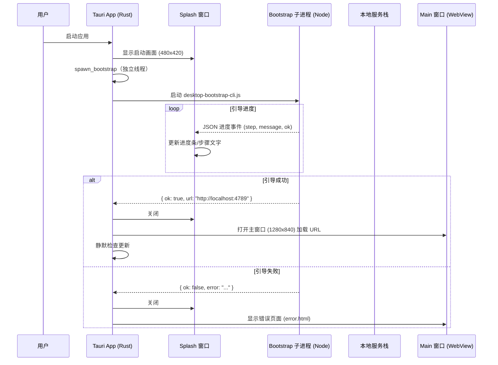

## 概述

Zleap-Agent 提供双端用户界面：**CLI 终端界面**（`@zleap/cli`，基于 Ink React TUI 框架）和 **桌面应用**（`@zleap/desktop`，基于 Tauri Rust 框架）。CLI 提供了完整的终端交互式聊天体验、服务管理命令和配置向导；桌面端是一个轻量壳应用，负责引导运行时环境（解压 Node.js/PostgreSQL、启动本地服务）、自动更新、系统托盘集成，并在主窗口中加载本地 Web 控制台。

两者共享底层服务栈：都通过 `@zleap/host` 管理 PostgreSQL 生命周期，通过 `@zleap/agent` 的 ChatEngine 执行对话，通过 `ConversationService` 管理会话。



## CLI 架构

### 命令路由

CLI 使用 **cac**（Commander.js 的轻量替代）进行命令路由，入口为 runCli 函数。

```typescript
export async function runCli(argv: string[]): Promise<void> {
  if (argv.includes('--help') || argv.includes('-h')) { printHelp(); return; }
  if (argv.includes('--version') || argv.includes('-v')) { /* 版本输出 */ return; }
  if (argv[0] === 'config') { /* 配置子命令 */ return; }

  const cli = cac('zleap');

  cli.command('serve', '启动本地栈（Postgres + Web + Worker）')
     .option('--gateway', '同时启动 IM gateway')
     .option('--detach', '后台运行')
     .action(async (options) => {
       const { runServeCommand } = await import('./serve.js');
       process.exitCode = await runServeCommand(options);
     });

  cli.command('status', '查看 Zleap 服务健康状态')
     .action(async () => { ... });
  cli.command('stop', '停止 zleap serve 启动的本地栈')
     .action(async () => { ... });
  // ... 更多命令：update, rollback, setup, init, doctor, uninstall, channels, connect
  cli.parse(['node', 'zleap', ...argv], { run: false });
  await cli.runMatchedCommand();
}
```

### 命令清单

| 命令 | 功能 | 关键选项 |
|------|------|---------|
| `zleap [prompt]` | 交互式 TUI 或一次性对话 | — |
| `zleap serve` | 启动本地服务栈（Postgres+Web+Worker） | `--gateway`, `--detach`, `--production`, `--skip-postgres` |
| `zleap stop` | 停止服务 | — |
| `zleap status` | 查看服务健康状态 | — |
| `zleap setup` | 打开 Web 配置向导 | — |
| `zleap init` | CLI 首次配置向导 | `--force`, `--from-env` |
| `zleap doctor` | 环境体检 | `--json` |
| `zleap update` | 查看/执行更新 | `--check`, `--version` |
| `zleap rollback` | 回滚到上一版本 | `--allow-downgrade`, `--allow-schema-downgrade` |
| `zleap uninstall` | 卸载 | `--full`, `--yes` |
| `zleap channels` | IM 频道连接管理 | 子命令：feishu/wechat/feishu-cli |
| `zleap connect <channel>` | 连接 IM 频道 | `--refresh`, `--logout` |
| `zleap config` | 配置管理 | 子命令：302 setup/status/clear 等 |

### 动态导入优化

CLI 大量使用动态 `import()` 延迟加载子命令模块：

```typescript
cli.command('serve', ...).action(async (options) => {
  const { runServeCommand } = await import('./serve.js');  // 懒加载
  process.exitCode = await runServeCommand(options);
});
```

这种设计使得 `zleap --help` 等轻量命令无需加载 ChatEngine、数据库驱动等重型依赖，启动速度极快。

## Ink TUI 聊天界面

### App 组件

聊天模式的核心是 App React 组件，基于 **Ink** 框架（React for CLI）渲染终端 UI：

```typescript
export function App({
  initialContext, initialSessionModel, systemPrompt,
  initialMessages, continueSession = false,
}: AppProps): ReactElement {
  const { exit } = useApp();
  const [config, setConfig] = useState<CliConfig>(initialContext.config);
  const [ctx, setCtx] = useState<CliContext>(initialContext);
  const [sessionModel, setSessionModel] = useState<CustomModelConfig | undefined>(initialSessionModel);
  const model = sessionModel ?? ctx.model ?? config.model;
  const engine = useMemo(() => new ChatEngine(model, ctx.persistence), [model, ctx.persistence]);
  // ... 状态管理
  const chat = useChat(engine, systemPrompt, sessionRuntimeRef);
  const [input, setInput] = useState('');
  const needsOnboarding = !config.onboarded && !model;
  const [wizard, setWizard] = useState<ModelWizard | null>(needsOnboarding ? { step: 'protocol', draft: {} } : null);
  // ... picker 状态（session/model/mode/channel）
  const ambient = useAmbientStatus(ctx.dbReachable, ambientRefresh);
  // ... 渲染
}
```

### UI 组件结构



关键 UI 组件位于 `packages/cli/src/ui/` 目录：

| 组件 | 文件 | 功能 |
|------|------|------|
| Message | Message.tsx | 渲染用户/助手/系统消息，支持工具调用显示 |
| ToolCard | ToolCard.tsx | 工具调用详情卡片，显示工具名/参数/结果 |
| ConfirmCard | ConfirmCard.tsx | HITL 审批卡片，等待用户确认高风险工具 |
| Prompt | Prompt.tsx | 输入提示，结合 LineInput 实现多行输入 |
| Spinner | Spinner.tsx | 流式输出加载动画 |
| StatusBar | StatusBar.tsx | 底部状态栏，显示模型/权限/运行模式 |
| CommandPalette | CommandPalette.tsx | Ctrl+K 命令面板，快速切换模型/模式/频道 |
| PickerList | PickerList.tsx | 通用选择列表，用于模型/会话/模式选择 |
| Logo | Logo.tsx | 启动 Logo 画面，显示模型和配置路径 |
| Mascot | Mascot.tsx | 吉祥物表情，根据状态变化情绪 |
| StreamingAssistant | StreamingAssistant.tsx | 流式消息渲染 |
| ConnectPanel | ConnectPanel.tsx | IM 频道连接面板 |

### 状态管理

TUI 使用 React Hooks 管理 UI 状态，核心自定义 Hooks：

```typescript
// useChat — 封装 ChatEngine 的对话状态
const chat = useChat(engine, systemPrompt, sessionRuntimeRef);
// chat.messages: DisplayMessage[]
// chat.status: 'idle' | 'running' | 'error'
// chat.send(text): Promise<void>
// chat.load(messages, contextMessages?, options?): void
// chat.notify(text): void

// useAmbientStatus — 后台服务状态监控
const ambient = useAmbientStatus(ctx.dbReachable, ambientRefresh);
// ambient.dbReachable: boolean
// ambient.services: ServiceStatus[]

// useCommandPalette — 命令面板状态
const { isOpen, open, close, query, results } = useCommandPalette();
```

### 会话持久化

聊天会话自动持久化，支持断点续聊：

```typescript
useEffect(() => {
  if (continueSession) {
    void (async () => {
      const local = await loadLastSession();  // 本地文件缓存
      if (local && local.length > 0) { chat.load(local); return; }
      const fromDb = await engine.resumeLastThread();  // 数据库持久化
      if (fromDb && fromDb.messages.length > 0) {
        chat.load(fromDb.messages.map(...), fromDb.contextMessages,
          { workspaceRoot: fromDb.workspaceRoot });
      }
    })();
  }
}, [continueSession, chat, engine, initialMessages]);

// 自动保存：运行状态从 running→idle 时保存
useEffect(() => {
  if (prev === 'running' && chat.status === 'idle') {
    void saveSession(chat.messages);
  }
}, [chat.status, chat.messages]);
```

持久化采用两级策略：本地文件缓存（快速恢复）+ 数据库持久化（跨设备同步）。

### 运行模式与权限

CLI 支持运行模式和权限模式的切换：

```typescript
const [runMode, setRunModeState] = useState<RunMode>(initialPrefs.runMode);
const [permissionMode, setPermissionModeState] = useState<PermissionMode>(initialPrefs.permissionMode);
// runMode: 'plan' | 'execute' | 'auto'（规划/执行/自动）
// permissionMode: 'default' | 'read-only' | 'trusted'（审批/只读/信任）
```

这些偏好通过 `resolveSessionPrefs`/`patchSessionPrefs` 持久化到配置中。

### 内置命令

在聊天模式中，用户可以输入斜杠命令：

```typescript
// commands/builtin.ts 解析内置命令
const { parseBuiltinCommand } = await import('./commands/builtin.js');
```

斜杠命令通过命令面板（CommandPalette）也可以快速访问，无需记忆命令名。

### 首次使用向导

首次启动（无模型配置）时自动触发模型配置向导：

```typescript
const needsOnboarding = !config.onboarded && !model;
const [wizard, setWizard] = useState<ModelWizard | null>(
  needsOnboarding ? { step: 'protocol', draft: {} } : null
);
```

向导分步引导用户选择 API 协议、输入密钥、选择模型，完成后写入配置并标记 onboarded。

## 桌面端（Tauri）

桌面端是一个 Tauri v2 应用，Rust 代码位于 packages/desktop/src-tauri/src/lib.rs。它本质上是一个**运行时引导器 + Web 窗口壳**：不直接实现 Agent 逻辑，而是解压/定位运行时、启动 Node.js 子进程引导本地 Web 服务，然后在 WebView 窗口中加载该服务。

### 启动流程



### 核心 Rust 函数

#### run() — 应用入口

```rust
#[cfg_attr(mobile, tauri::mobile_entry_point)]
pub fn run() {
    tauri::Builder::default()
        .plugin(tauri_plugin_shell::init())
        .plugin(tauri_plugin_dialog::init())
        .plugin(tauri_plugin_updater::Builder::new().build())
        .invoke_handler(tauri::generate_handler![
            retry_bootstrap, open_logs_folder, get_bootstrap_error
        ])
        .setup(|app| {
            open_splash_window(app.handle())?;     // 打开启动画面
            spawn_bootstrap(app.handle().clone()); // 异步引导
            setup_tray(app.handle())?;             // 设置系统托盘
            Ok(())
        })
        .build(tauri::generate_context!())
        .run(|app_handle, event| {
            if matches!(event, RunEvent::Exit) {
                stop_all_services(&app_handle);   // 退出时停止服务
            }
        });
}
```

#### spawn_bootstrap — 引导线程

```rust
fn spawn_bootstrap(app: AppHandle) {
    thread::spawn(move || {
        let result = run_desktop_bootstrap(&app);
        let app_for_main = app.clone();
        let _ = app.run_on_main_thread(move || {
            finish_bootstrap(&app_for_main, result);
        });
    });
}
```

引导在独立线程运行，通过 `run_on_main_thread` 将结果传回 Tauri 主线程（UI 操作必须在主线程执行）。

#### run_desktop_bootstrap — 引导进程管理

这是桌面端最复杂的函数，负责：

1. **运行时定位**：支持 slim 模式（bootstrap.tar.gz 按需下载）和 bundled 模式（内置 payload）
2. **Node.js 解析**：按优先级查找 Node 二进制：环境变量 > 托管版本 > 内置 node.tar.gz > 系统 PATH
3. **进程启动**：使用 `hidden_command` 启动 Node 子进程（Windows 上设置 `CREATE_NO_WINDOW` 防止控制台弹窗）
4. **进度流解析**：逐行读取 stdout，解析 `BootstrapProgress` JSON 事件更新 splash 窗口
5. **结果等待**：等待进程退出，解析 `BootstrapResult` 获取服务 URL 或错误信息

```rust
let mut cmd = hidden_command(&node_bin);
cmd.arg(&script).arg("--json");
cmd.env("ZLEAP_HOME", &home);
cmd.env("ZLEAP_RUNTIME_ROOT", home.join("app"));
cmd.env("ZLEAP_DESKTOP", "1");
cmd.env("ZLEAP_STARTED_BY", "desktop");
cmd.env("ZLEAP_STOP_POLICY", "onDesktopQuit");
cmd.env("ZLEAP_WEB_PORT", port.to_string());
cmd.current_dir(&script_root);
cmd.stdout(Stdio::piped());
cmd.stderr(Stdio::piped());
let mut child = cmd.spawn().map_err(|e| e.to_string())?;
```

### Windows 控制台窗口抑制

Windows 上 GUI 进程启动控制台子进程时会闪烁 cmd 窗口，Rust 代码通过 `CREATE_NO_WINDOW` 标志抑制：

```rust
fn hidden_command<S: AsRef<std::ffi::OsStr>>(program: S) -> Command {
    let cmd = Command::new(program);
    #[cfg(windows)]
    {
        use std::os::windows::process::CommandExt;
        const CREATE_NO_WINDOW: u32 = 0x0800_0000;
        let mut cmd = cmd;
        cmd.creation_flags(CREATE_NO_WINDOW);
        return cmd;
    }
    #[cfg(not(windows))]
    cmd
}
```

### 自动更新

桌面端集成 `tauri_plugin_updater`，启动后静默检查更新：

```rust
fn check_for_update(app: &AppHandle, interactive: bool) {
    tauri::async_runtime::spawn(async move {
        let updater = app.updater().unwrap();
        match updater.check().await {
            Ok(Some(update)) => {
                // 发现新版本，弹窗询问是否更新
                let proceed = app.dialog().message(...)
                    .buttons(MessageDialogButtons::OkCancelCustom(...))
                    .blocking_show();
                if proceed { perform_update(&app, update).await; }
            }
            Ok(None) => { /* 已是最新，interactive=true 时提示 */ }
            Err(error) => { /* 检查失败提示 */ }
        }
    });
}
```

更新流程：先下载（显示进度条在 splash 窗口），下载成功后才停止服务并安装，失败不影响运行中的应用：

```rust
async fn perform_update(app: &AppHandle, update: tauri_plugin_updater::Update) {
    show_progress_splash(app);
    let result = update.download_and_install(|chunk, total| {
        // 实时更新下载进度
        set_splash_progress(app, pct, &format!("正在下载更新 {pct}%..."));
    }, || {}).await;
    match result {
        Ok(_) => { stop_all_services(app); app.restart(); }
        Err(error) => { /* 关闭 splash，显示错误 */ }
    }
}
```

### 系统托盘

```rust
fn setup_tray(app: &AppHandle) -> tauri::Result<()> {
    let open = MenuItem::with_id(app, "open", "打开 Zleap", true, None)?;
    let check_update = MenuItem::with_id(app, "check_update", "检查更新…", true, None)?;
    let quit = MenuItem::with_id(app, "quit", "退出", true, None)?;
    let menu = Menu::with_items(app, &[&open, &check_update, &quit])?;
    TrayIconBuilder::new()
        .menu(&menu)
        .on_menu_event(|app, event| match event.id.as_ref() {
            "open" => { /* 显示/聚焦主窗口 */ }
            "check_update" => check_for_update(app, true),
            "quit" => { stop_all_services(app); app.exit(0); }
            _ => {}
        })
        .on_tray_icon_event(|tray, event| {
            // 左键单击托盘图标 → 显示主窗口
            if let TrayIconEvent::Click { button: MouseButton::Left, button_state: MouseButtonState::Up, .. } = event {
                if let Some(win) = app.get_webview_window("main") {
                    let _ = win.show();
                    let _ = win.set_focus();
                }
            }
        })
        .build(app)?;
    Ok(())
}
```

### macOS 应用菜单

macOS 上需要自定义菜单以保留标准的复制/粘贴/关于等菜单项：

```rust
#[cfg(target_os = "macos")]
fn install_app_menu(app: &tauri::App) -> tauri::Result<()> {
    let app_submenu = Submenu::with_items(app, "Zleap", true, &[
        &PredefinedMenuItem::about(app, Some("关于 Zleap"), Some(about_metadata))?,
        &check_update,
        &PredefinedMenuItem::separator(app)?,
        &PredefinedMenuItem::services(app, None)?,
        // ... 隐藏/退出等
    ])?;
    let edit_submenu = Submenu::with_items(app, "编辑", true, &[
        // 撤销/重做/剪切/复制/粘贴/全选
    ])?;
    let menu = Menu::with_items(app, &[&app_submenu, &edit_submenu])?;
    app.set_menu(menu)?;
}
```

Edit 菜单的存在确保 WebView 内的 Cmd+C/V/A 快捷键正常工作。

### 服务生命周期管理

桌面端拥有自己启动的服务会话，退出时精确停止：

```rust
fn stop_all_services(app: &AppHandle) {
    if !desktop_owns_runtime_session() { return; }  // 非桌面启动的服务不动
    let app_root = resolve_runtime_root(app);
    let control = host_script(&app_root, "control-cli.js");
    if control.exists() {
        let _ = hidden_command(node_bin)
            .arg(control).arg("stop")
            .arg("--desktop-session-only")
            .arg("--session-id").arg(desktop_session_id())
            .status();
    }
}
```

通过 `desktop_owns_runtime_session()` 检查 serve.json 状态文件，确认服务是由本桌面实例启动的（started_by=desktop, session_id 匹配），避免误杀用户通过 CLI 独立启动的服务。

### 首次启动：运行时种子解压

首次启动时，桌面端需要从内置的 app.tar.gz 解压运行时（约 880MB）：

```rust
fn prepare_runtime_root(app: &AppHandle) -> Result<PathBuf, String> {
    let current = zleap_home().join("app").join("current");
    if let Some(seed_archive) = seed.as_ref() {
        if should_install_seed(app, &current)? {
            // 解压到 splash 窗口显示进度（这是最长的步骤）
            emit_splash_step(app, "seed", "首次启动：正在本地解压运行时（约 30–60 秒，无需联网）…");
            return install_seed_archive(seed_archive);
        }
    }
    // 已有 runtime，直接使用
    if is_app_root(&current) { return Ok(current); }
    // ...
}
```

种子安装采用原子替换策略：先解压到临时目录 → 删除 previous → 将 current 重命名为 previous → 将临时目录重命名为 current → 失败时回滚。

### 分发模式

桌面端支持两种分发模式：

| 模式 | 特征 | bootstrap 方式 |
|------|------|----------------|
| **Bundled（全量包）** | 内置 app.tar.gz（~880MB runtime） | 首次启动解压到 ~/.zleap/app/current |
| **Slim（瘦包）** | 仅含 bootstrap.tar.gz + download.json | 解压 bootstrap 后由 Node 下载 runtime |

Slim 模式下，bootstrap 引导器会根据 download.json 按需下载 Node.js、PostgreSQL 和 app 运行时，适合网络分发或自动更新场景。

### Tauri 命令

前端（WebView）可通过 Tauri IPC 调用三个 Rust 命令：

```rust
.invoke_handler(tauri::generate_handler![
    retry_bootstrap,    // 重试引导
    open_logs_folder,   // 打开日志文件夹
    get_bootstrap_error // 获取引导错误信息
])
```

## CLI 与桌面端的关系

CLI 和桌面端是互补的：

- **CLI 适合开发者/高级用户**：轻量启动、脚本集成、服务器环境、管道组合
- **桌面端适合普通用户**：双击启动、自动更新、系统托盘、图形界面（Web 控制台）

两者共享底层服务：桌面端启动的服务栈与 `zleap serve` 启动的完全相同，桌面端本质上就是 `zleap serve --production --detach` 的 GUI 封装加上自动更新和系统托盘。

```mermaid
flowchart LR
    subgraph Entry["入口"]
        ZC["zleap serve\nCLI 命令"]
        DT[桌面端启动]
    end
    Entry -->|启动| Serve[serve-cli.js\n@zleap/host]
    Serve --> PG[PostgreSQL]
    Serve --> Web[Web Server\n@zleap/web :4789]
    Serve --> Worker[Task Worker\n@zleap/tasks]
    Serve --> GW[Gateway\n@zleap/gateway 可选]
    DT -->|打开 WebView| Web
```

## 源码参考

| 文件 | 关键内容 |
|------|---------|
| app.tsx | Ink TUI 主组件、状态管理、ChatEngine 集成、会话恢复 |
| router.ts | cac 命令路由、所有 CLI 命令定义、动态导入 |
| lib.rs | Tauri 桌面端完整实现（1341行）、引导流程、自动更新、系统托盘、服务生命周期 |
| useChat.ts | 聊天状态 Hook、消息管理、流式输出处理 |
| mode.tsx | 运行模式 UI |
| cli/serve.ts | 服务启动逻辑（Postgres+Web+Worker） |
| cli/setup.ts | Web 配置向导启动 |
| cli/doctor.ts | 环境体检 |
| cli/tuiServe.ts | TUI 内嵌服务管理 |
| ui/*.tsx | TUI 组件库（消息/工具/审批/输入/选择器等） |

## 小结

Zleap-Agent 的 CLI 和桌面端为不同用户群体提供了适配的交互入口：

1. **CLI（Ink TUI）**：React for Terminal 的现代 TUI，提供丰富的交互组件（消息流、工具卡片、审批弹窗、命令面板、选择器），动态导入实现快速启动，两级会话持久化
2. **桌面端（Tauri Rust）**：轻量壳应用，核心职责是运行时引导（种子解压/下载/Node.js 管理）、自动更新、系统托盘和服务生命周期管理，UI 完全由 Web 控制台提供
3. **共享服务栈**：两端复用 @zleap/host 的服务管理、@zleap/agent 的 ChatEngine 和 @zleap/store 的持久层，桌面端本质是 GUI 封装的 `zleap serve`
4. **Windows 适配**：CREATE_NO_WINDOW 抑制控制台弹窗，tar.gz/PowerShell Expand-Archive 跨平台解压
5. **macOS 适配**：自定义菜单保留标准编辑快捷键
6. **原子操作**：运行时安装采用临时目录+原子重命名策略，防止中断导致损坏；更新先下载后安装，失败不影响运行
7. **服务归属检测**：桌面端通过 serve.json 精确识别自己启动的服务，避免误杀 CLI 启动的实例
