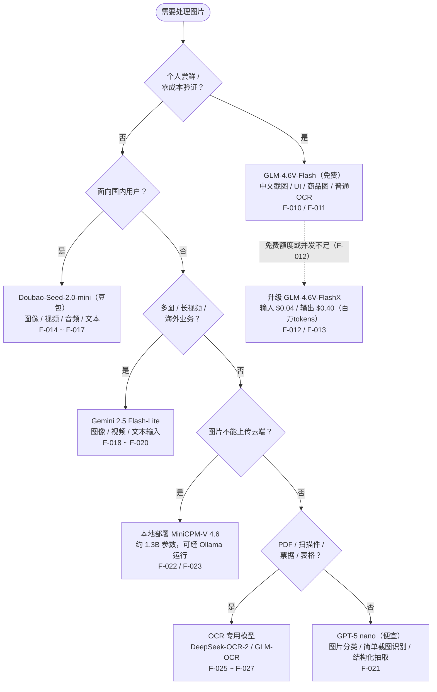

# 选型决策树

把五场景选型矩阵（[按场景选型矩阵](../concepts/02-scenario-matrix.md)）压缩成一条可执行的路径。决策树按总结口诀（F-033）展开，每个叶节点标注对应事实编号，便于回溯核验。

## 决策树

## 叶节点事实对照表

| 叶节点 | 模型 | 关键依据 | 事实编号 |
|-------|------|---------|---------|
| 个人尝鲜 | GLM-4.6V-Flash | 官方价格免费；适用中文截图、UI 页面、商品图片信息提取和普通 OCR | F-010、F-011 |
| 免费额度不足 | GLM-4.6V-FlashX | 免费额度或并发不能满足需求时替换；输入 $0.04、输出 $0.40/百万 tokens | F-012、F-013 |
| 国内生产 | Doubao-Seed-2.0-mini | 图像/视频/音频/文本四模态；国内接入和人民币结算方便；上线前实测并发、限流和 SLA | F-014 ~ F-017 |
| 多图/长视频/海外 | Gemini 2.5 Flash-Lite | 图像/视频/文本输入；输入 $0.10、输出 $0.40/百万 tokens；给 DeepSeek 提供视觉事实不必硬上 Pro | F-018 ~ F-020 |
| 本地隐私 | MiniCPM-V 4.6 | 图片不能上传云端时本地部署；约 1.3B 参数，可经 Ollama 运行；提取交给 MiniCPM-V、分析交给 DeepSeek | F-022 ~ F-024 |
| 文档识别 | DeepSeek-OCR-2 / GLM-OCR | PDF/扫描件/票据/表格优先评估；几十页文档更便于保留布局、控制成本和生成 Markdown；复杂表格/小字/模糊件抽样验收 | F-025 ~ F-027 |
| 简单抽取（兜底） | GPT-5 nano | 便宜，适合图片分类、简单截图识别和结构化抽取 | F-021 |

## 使用说明

1. **决策顺序对应口诀**（F-033）：个人尝鲜（GLM）→ 国内生产（豆包）→ 长视频（Gemini）→ 本地隐私（MiniCPM）→ 文档识别（OCR 专用）；图片分类/简单截图识别（GPT-5 nano，F-021）作为云端轻量兜底分支；
2. **选定视觉模型后**，按 [视觉-推理双模型协作架构](../concepts/03-vision-reasoning-pipeline.md) 接入 DeepSeek 判断侧（F-028）；
3. **价格时效**：决策树中的价格为 2026-08 时点信息（F-013、F-015、F-019），决策前请复核官方页面；
4. **单源提示**：Gemini（F-018 ~ F-020）、GPT-5 nano（F-021）、MiniCPM（F-022 ~ F-024）、OCR 专用（F-025 ~ F-027）分支未经官方核验，详见 [核验报告](../references/verification.md)。

## 相关示例

- [成本-场景选型演练](cost-scenario-walkthrough.md) — 各场景价格对比
- [视觉模型输出结构设计示例](pipeline-output-structure.md) — 选型之后的输出结构设计
