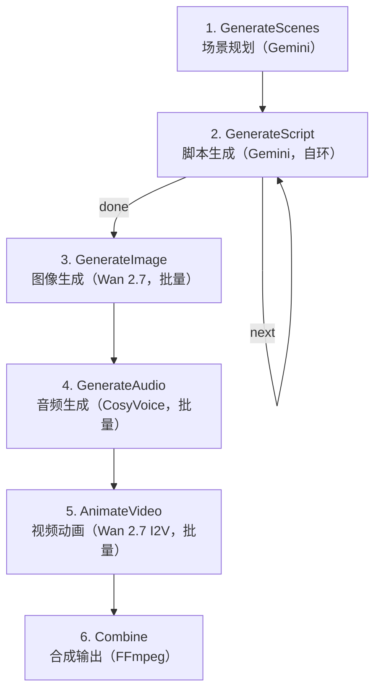

# Wan-Video Generator 教程

Wan-Video Generator 是一个基于 [PocketFlow](/ai/pocketflow/pocketflow-core/) 框架的 AI 视频生成应用。它读取任意 Markdown 技术文章，自动生成带有配音、动画和角色一致性的完整卡通教学视频——只需一条命令，无需任何剪辑软件。

## 核心特性

- **全自动流水线**：从 Markdown 文章到最终视频，6 个节点串联完成
- **角色一致性**：三层保障机制（文本描述 + 参考图 + 场景链式引用）确保角色跨场景外观统一
- **自环迭代**：脚本生成节点通过自环逐场景编写，保持对话上下文连贯
- **批量处理**：图像、音频、视频生成都使用 BatchNode 并行处理
- **多模型协作**：Gemini（文本规划）+ Wan 2.7（图像/视频）+ CosyVoice（语音）+ FFmpeg（合成）

## 流水线架构



| 阶段 | 模型/工具 | 功能 | 节点类型 |
|------|----------|------|---------|
| 场景规划 | Gemini 2.5 Flash | 阅读文章，规划 4-8 个卡通场景 | Node |
| 脚本生成 | Gemini 2.5 Flash | 逐场景生成对白、图像提示词、动画提示词 | Node（自环） |
| 图像生成 | Wan 2.7 Image | 根据提示词和参考图生成场景插画 | BatchNode |
| 音频生成 | CosyVoice v3+ | 按角色语音配置生成配音 | BatchNode |
| 视频动画 | Wan 2.7 I2V | 将静态图转为匹配音频时长的动画片段 | BatchNode |
| 合成输出 | FFmpeg | 合并音视频、拼接片段为最终视频 | Node |

## 快速导航

### 核心概念
- [视频生成流水线](concepts/video-pipeline.md) — 六阶段架构设计与数据流转
- [自环迭代优化](concepts/self-loop-iteration.md) — GenerateScriptNode 的自环模式与上下文传递
- [角色一致性策略](concepts/character-consistency.md) — 三层保障机制详解

### API 参考
- [GenerateScenesNode](references/generate-scenes-node.md) — 场景规划节点
- [GenerateScriptNode](references/generate-script-node.md) — 脚本生成节点（自环）
- [GenerateImageNode](references/generate-image-node.md) — 图像生成节点（批量）
- [GenerateAudioNode](references/generate-audio-node.md) — 音频生成节点（批量）
- [AnimateVideoNode](references/animate-video-node.md) — 视频动画节点（批量）
- [CombineNode](references/combine-node.md) — 合成输出节点

### 使用示例
- [基本使用](examples/basic-usage.md) — 环境配置与命令行运行
- [神经网络科普视频](examples/neural-networks-demo.md) — 完整演示：从文章到 73 秒动画

## 角色设定

项目内置两个卡通角色：

| 角色 | 描述 | 语音配置 |
|------|------|---------|
| **Mia（米娅）** | 扎马尾辫、戴圆眼镜的开朗女孩，对学习主题感到困惑并提问 | longanhuan 音色，语速 1.2x，音调 1.15x |
| **Ding Ding Dog（叮叮狗）** | 可爱蓝色机器小狗，大垂耳、金铃铛、红色项圈、圆肚皮魔法口袋，用道具和类比解释概念 | longanyang 音色，语速 1.0x，音调 0.9x |

对话模式：Mia 提问（困惑/好奇）→ Ding Ding Dog 解释（道具/类比）→ 交替进行 → Mia 庆祝理解。

## Shared 数据存储

所有节点通过 `shared` 字典通信：

```python
shared = {
    # 输入
    "md_path": str,          # 输入 Markdown 文件路径
    "md_content": str,       # 加载的 Markdown 内容
    "output_dir": str,       # 输出目录
    "ref_image": str,        # 角色参考图路径

    # 流水线数据
    "scenes": [],            # 场景规划列表 [{speaker, description}, ...]
    "scripts": [],           # 脚本列表 [{speaker, text, image_prompt, animation_prompt}, ...]
    "images": [],            # 生成的图像路径列表
    "audios": [],            # 生成的音频路径列表
    "videos": [],            # 生成的视频片段路径列表
    "final_video": str,      # 最终合成视频路径

    # 循环控制
    "current_idx": 0,        # 自环当前场景索引
}
```

## 源码位置

- 节点定义：[nodes.py](file:///d:/spaces/SpecWeave/external/libs/ai/ThePocket/PocketFlow-Tutorial-Wan-Video/nodes.py)
- 流程编排：[flow.py](file:///d:/spaces/SpecWeave/external/libs/ai/ThePocket/PocketFlow-Tutorial-Wan-Video/flow.py)
- 入口程序：[main.py](file:///d:/spaces/SpecWeave/external/libs/ai/ThePocket/PocketFlow-Tutorial-Wan-Video/main.py)
- 工具函数：[utils/](file:///d:/spaces/SpecWeave/external/libs/ai/ThePocket/PocketFlow-Tutorial-Wan-Video/utils/)

```{toctree}
:hidden:
:maxdepth: 7

concepts/character-consistency
concepts/self-loop-iteration
concepts/video-pipeline
examples/basic-usage
examples/neural-networks-demo
references/animate-video-node
references/combine-node
references/generate-audio-node
references/generate-image-node
references/generate-scenes-node
references/generate-script-node
```
