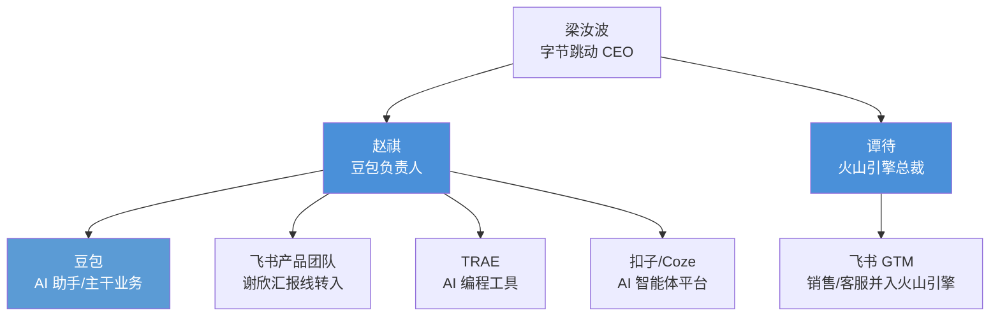

# 整合时间线与组织架构

2026 年 7 月底至 8 月底，字节跳动在不到一个月内完成三轮 AI 业务组织调整，将飞书产品、TRAE、扣子三支队伍全部收进豆包旗下（F-003）。本页按时间顺序梳理关键节点，并呈现整合后的组织架构与产品定位。

> 本页事实已经 36 氪、21 世纪经济报道等权威媒体核验（详见 [核验报告](../references/verification.md)）。

## 时间线

### 2026-07-30：飞书产品并入豆包

- 飞书产品团队并入豆包体系，飞书 CEO 谢欣改为向豆包负责人赵祺汇报（F-002 + 核验补充）；
- 飞书的 GTM（Go-to-Market，即面向市场的销售、客服等团队）并入火山引擎，由火山引擎总裁谭待负责（F-002 + 核验补充）；
- 这是本轮整合的**第一轮**调整。

> 事实溯源：F-002；核验来源：36氪 7.30 报道、21世纪经济报道、南方+

### 2026-08-17 ~ 21：豆包密集上线六大功能

在两轮组织调整之间，豆包产品侧连续五天密集上线新功能（F-013），逐日如下：

| 日期 | 上线功能 |
|------|---------|
| 8 月 17 日 | 远程控制电脑（F-013） |
| 8 月 18 日 | Windows 虚拟桌面（F-013） |
| 8 月 19 日 | 云电脑（F-013） |
| 8 月 20 日 | 侧边工作台（F-013） |
| 8 月 21 日 | 技能商店、连接器、工作伙伴（F-013；技能商店已上架超 200 项技能） |

这波功能上线为后续的产品整合做了能力铺垫——远程控制、虚拟桌面、云电脑指向"AI 操作电脑"的办公场景，技能商店和连接器指向多 Agent 协作的生态能力。

> 事实溯源：F-013；核验结论：逐日日期完全吻合

### 2026-08-24：TRAE 与扣子整体并入豆包

- TRAE（AI 编程工具）和扣子（AI 智能体开发平台）团队**整体并入豆包体系**（F-001）；
- 产品和运营团队统一向豆包负责人**赵祺**汇报（F-001）；
- 36 氪于当日发布独家报道，字节官方确认了赵祺的汇报线（核验结论第 1 项）；
- 距上一轮飞书调整仅 **25 天**（F-002）。

> 事实溯源：F-001、F-002；核验来源：36氪 8.24 独家 + 字节官方确认

### 2026-08-25：豆包工作独立发布

- 豆包工作（独立 AI 办公产品）于 2026 年 8 月 25 日**正式发布**（F-021，核验补充事实）；
- TRAE Work 和扣子的办公能力与豆包工作场景深度融合（F-014）；
- 博文发布时（8 月 27 日）称"最快本周推出"（F-014），实际发布日即为 8 月 25 日，博文表述准确但时态滞后。

> 事实溯源：F-014、F-021；核验结论第 8 项确认豆包工作 8 月 25 日已发布

### 一个月三次调整

从 7 月 30 日到 8 月 24 日，飞书、TRAE、扣子三支队伍全部收进豆包旗下（F-003），节奏紧凑。这不是渐进式微调，而是在极短时间内完成的 AI 业务线全面收拢。

> 事实溯源：F-003

## 整合后的组织架构

关键变化：

1. **赵祺统管产品线**：豆包 + 飞书产品 + TRAE + 扣子四条产品线统一向赵祺汇报（F-001、F-002），形成 AI 产品的统一指挥体系；
2. **谢欣汇报线转移**：飞书原 CEO 谢欣在产品层面改为向赵祺汇报（核验补充），飞书不再作为独立 BU 运作产品；
3. **谭待接管 GTM**：飞书的销售、客服等 GTM 团队并入火山引擎由谭待负责（核验补充），产品与销售分离——产品归豆包，商业化归火山引擎；
4. **TRAE IDE/CLI 保留**：TRAE IDE 和 CLI 继续保留，变成豆包品牌下的**编程子产品**（F-015），未被裁撤或合并；36 氪明确表述为"TRAE IDE 及 CLI 作为豆包品牌下编程产品线持续发展"（核验结论第 8 项）。

> 事实溯源：F-001、F-002、F-015

## 产品定位变化

整合后，三个被并入产品的角色互补关系明确（F-012）：

| 产品 | 原定位 | 整合后角色 | 汇报线 |
|------|--------|-----------|--------|
| 豆包 | AI 助手 | 主干 AI 业务，统一入口与品牌 | 赵祺（原有） |
| 飞书 | 企业协同办公 | 补企业协同和权限管理能力（F-012） | 赵祺（产品）；谭待（GTM） |
| TRAE | AI 编程工具 | 补编程和任务执行能力（F-012）；IDE/CLI 保留为编程子产品（F-015） | 赵祺 |
| 扣子 | 智能体开发平台 | 补多 Agent 协作和智能体搭建能力（F-012） | 赵祺 |

三者不是被豆包"吞并"消失，而是作为豆包大旗下的能力模块，分别补齐企业协同（飞书）、编程执行（TRAE）、多 Agent 协作（扣子）三块拼图，最终汇向"豆包工作"这个统一的 AI 办公产品（F-014、F-021）。

> 事实溯源：F-012、F-014、F-015、F-021

## 小结

2026 年 8 月的整合在时间线上呈现"组织调整 → 产品密集上线 → 再组织调整 → 独立产品发布"的节奏：7 月 30 日飞书先行并入，8 月 17-21 日豆包密集补能力，8 月 24 日 TRAE/扣子到位，8 月 25 日豆包工作正式发布。赵祺成为 AI 产品线的统一负责人，谭待接管飞书商业化 GTM，TRAE IDE/CLI 作为编程子产品保留。组织收拢的背后逻辑——算力成本压力——见 [算力成本驱动的组织变革](01-cost-driven-rationale.md)。

## 相关概念

- [算力成本驱动的组织变革](01-cost-driven-rationale.md) — 赛马机制为何在 AI 时代不可持续
- [AI办公竞争格局](02-competitive-landscape.md) — 整合后豆包与腾讯/阿里的对标
- [博文信源事实清单](../references/article-source.md) — F-001 ~ F-021 完整登记
- [核验报告](../references/verification.md) — 8 项核验结论与权威来源
