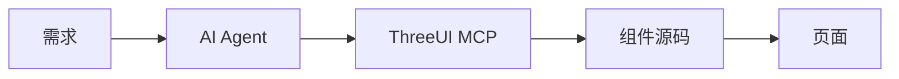

# 02 AI Coding 与 MCP

> ThreeUI 如何与 AI Coding Agent 协作，以及 MCP Server 的能力。

## AI Coding 集成

ThreeUI 的一个明显方向是 **AI Coding**（F-023）。官方除了支持直接看源码，还提供了与 Prompt 相关的能力。开发者可以找到喜欢的效果，然后把源码或 Prompt 直接交给：

- **Codex**
- **Claude Code**
- **Cursor**

这类 AI Agent 进行修改。

### 修改示例

博文给出的自然语言指令示例（F-024）：

| 指令 | 修改维度 |
|------|----------|
| "整体改成深蓝色科技风。" | 主题/配色 |
| "减少粒子数量。" | 参数调优 |
| "把灯光调柔和一点。" | 光照 |
| "动画速度降低 30%。" | 动效时序 |

AI 直接基于现有 Three.js 代码继续修改。

### 解决的痛点

> 📝 以前很多人最大的问题是：**看得懂效果，但改不动。** Three.js 里面随便涉及几个 Camera、Material、Shader 参数，就很容易劝退（F-025）。

新的工作流变得简单（F-026）：

```
先找一个接近目标的效果 → 再让 AI 改
```

### Agent Skills 生态

核验确认，ThreeUI 组件"自带配套 Skills"（agent skills），每个组件的 skills 文件夹可直接放入多种 AI Coding Agent 使用（F-027）：

- Claude Code
- Cursor
- Codex
- OpenCode
- Kiro

Meng To 公告原文："Copy the prompt or source, give it to your agent, then change the theme, lighting, motion or layout."

官网甚至有 "Brand Orbs" 组件分别以 Claude Code、OpenAI、Codex、Cursor、Gemini 等品牌命名，侧面印证对这些 AI 工具的生态亲近。

## MCP Server

ThreeUI 提供了自己的 **MCP（Model Context Protocol）Server**，让支持 MCP 的 AI Coding Client 直接访问 ThreeUI Catalog（F-030）。

### 四个 MCP 工具

博文描述的四个能力（F-031）：

| 工具 | 功能 |
|------|------|
| `search_catalog` | 搜索组件和模板 |
| `get_catalog_item` | 获取组件信息、资源和使用方式 |
| `get_item_source` | 直接读取完整源码 |
| `get_item_prompt` | 获取组件对应的实现 Prompt |

> ⚠️ **核验说明（F-042）**：MCP 作为 Pro 功能已在定价页确认（"Pro MCP access to components, prompts, and source"），但上述 4 个具体工具名称无法从公开网页独立验证，可能仅在 Pro 认证后的 MCP 配置文档中披露。工具命名逻辑与定价页描述的三类资源（components/prompts/source）大致对应。

### MCP 工作流

博文设想的完整流程（F-033）：



开发者可以直接告诉 AI："给我找一个适合 AI 产品首页的粒子背景。"Agent 自己搜索 ThreeUI，找到合适组件，读取源码继续修改。

### Pro 能力

MCP 属于 **Pro 能力**（F-032）。Pro 版本包含（F-034）：

- 50+ 额外组件
- MCP 访问权限
- Agent Skills

Community 版本（MIT 开源）包含 164 个效果，Pro 版本扩展至 373+ 组件。

## AI + 组件库的范式转变

ThreeUI 代表了一种新范式：组件库不仅给人用，还直接给 AI 用。三层能力递进：

1. **源码可读**：Community 版本开放完整源码，非黑盒 npm 包
2. **Prompt 可交**：每个组件自带配套 Prompt/Skills，可直接交给 AI Agent
3. **MCP 可搜**：Pro 版本通过 MCP 让 Agent 自主搜索、获取源码和 Prompt

这使得"找效果→拿源码→描述需求→AI 修改"的闭环成为可能。

## 关键事实索引

- F-023~F-027：AI Coding 集成、修改示例、痛点、Skills 生态
- F-030~F-034：MCP Server、4 工具、Pro 能力、工作流
- F-042：MCP 工具名核验说明
