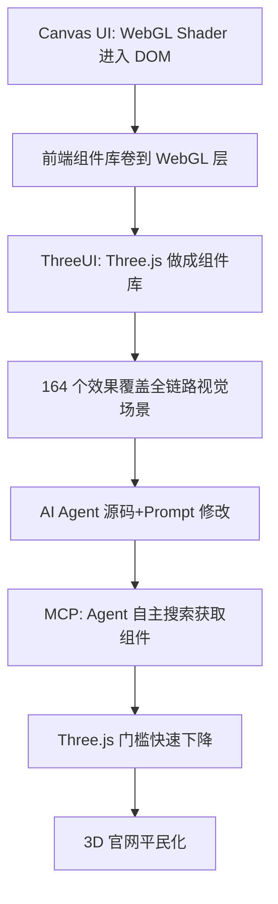

# 03 WebGL UI 组件化趋势

> 从 Canvas UI 到 ThreeUI，WebGL 正在进入普通 UI 开发，Three.js 门槛快速下降。

## 前情：Canvas UI

博文以 **Canvas UI** 作为行业参照（F-035）：

> "前段时间，一个叫 Canvas UI 的项目突然火了。它把 WebGL Shader 带进真实 DOM，让普通网页也能做出非常夸张的视觉效果。"

### Canvas UI 核验补充（F-043）

| 项目 | 信息 |
|------|------|
| 作者 | DavidHDev（react-bits 维护者） |
| 发布时间 | 2026-07-23 |
| 核心技术 | 实验性 `html-in-canvas` API |
| 框架支持 | React / Vue / Svelte / vanilla TS |
| 官网 | https://canvasui.dev/ |
| 核心理念 | "Your DOM becomes a WebGL texture, shaders distort, dissolve, and refract your real page in real time" |
| 组件数 | 发布时 24 个，核验时 33 个 |

> 注：博文仅将 Canvas UI 作为行业参照提及，未误归属为 Meng To 作品。Canvas UI 发布（7月23日）比 ThreeUI（8月22日左右）早约一个月，博文用"前段时间"描述合理。

## 趋势判断

### 1. 组件库卷到 WebGL 层

> 📝 "前端组件库已经开始卷到 WebGL 这一层了。"（F-036）

传统 UI 组件库（按钮、卡片、表单）竞争已趋饱和，新的差异化方向是将 Three.js / WebGL / Shader 效果封装为可复用组件。

### 2. 从手搓到组件化

> 📝 "从按钮、文字、背景，到完整 3D 场景和 Landing Page，越来越多以前需要手搓的视觉效果，正在变成可以直接拿来用的组件。"（F-037）

ThreeUI 覆盖了从微观（按钮 Shader）到宏观（完整 Landing Page）的全链路视觉组件。

### 3. AI Agent 降低修改门槛

> 📝 "再加上 AI Agent：找效果 → 拿源码 → 描述需求 → AI 修改"（F-038）

传统上 Three.js 的高门槛在于 Camera/Material/Shader 参数的复杂性。AI Coding Agent 使得开发者可以通过自然语言修改现有效果，无需深入理解每个参数。

### 4. Three.js 门槛快速下降

> 📝 "Three.js 的门槛确实正在快速下降。"（F-039）

下降来自两个方向：
- **组件化**：ThreeUI 等项目将复杂效果封装为即用组件
- **AI 化**：AI Agent 基于源码进行自然语言驱动的修改

### 5. 3D 官网平民化

> 📝 "以后想做一个看起来很贵的 3D 官网，可能真没以前那么难了。"（F-040）

## 趋势逻辑链

## 与 AI 编程生态的连接

ThreeUI 被归入 `ai/trae/` 分组，核心原因不是 Three.js 本身，而是它与 AI Coding 生态的深度集成：

1. **MCP Server**：Agent 可通过标准协议搜索和获取组件
2. **Agent Skills**：每个组件自带 skills，兼容 Claude Code/Cursor/Codex 等
3. **Prompt 驱动**：自然语言修改 Three.js 参数，降低 Shader/Material 门槛
4. **源码开放**：AI 基于完整源码修改，而非黑盒 API 调用

这代表了"组件库原生为 AI 设计"的新方向——组件不仅有 UI 和源码，还有配套的 Prompt 和 MCP 工具。

## 关键事实索引

- F-035~F-040：Canvas UI 参照与趋势判断（6条作者观点📝）
- F-043：Canvas UI 核验补充
