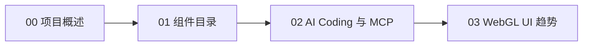

# Concepts：ThreeUI 概念目录

> 4 篇概念文档，从项目概述到组件目录、AI Coding/MCP 集成、行业趋势。

## 学习路径

| 序号 | 文档 | 核心问题 | 关键事实 |
|------|------|----------|----------|
| 00 | [项目概述](00-project-overview.md) | ThreeUI 是什么？谁做的？有多少内容？ | F-002~F-009 |
| 01 | [组件目录](01-component-catalog.md) | 有哪些组件？覆盖什么场景？ | F-010~F-022 |
| 02 | [AI Coding 与 MCP](02-ai-coding-mcp.md) | AI 如何使用 ThreeUI？MCP 怎么工作？ | F-023~F-034 |
| 03 | [WebGL UI 趋势](03-webgl-ui-trend.md) | 为什么 WebGL 组件化是趋势？ | F-035~F-043 |

## 路径图



建议先读 00 了解项目定位和数据，再通过 01 浏览具体组件能力，然后读 02 理解 AI 集成工作流，最后读 03 把握行业趋势。

```{toctree}
:hidden:
:maxdepth: 7

00-project-overview
01-component-catalog
02-ai-coding-mcp
03-webgl-ui-trend
```
