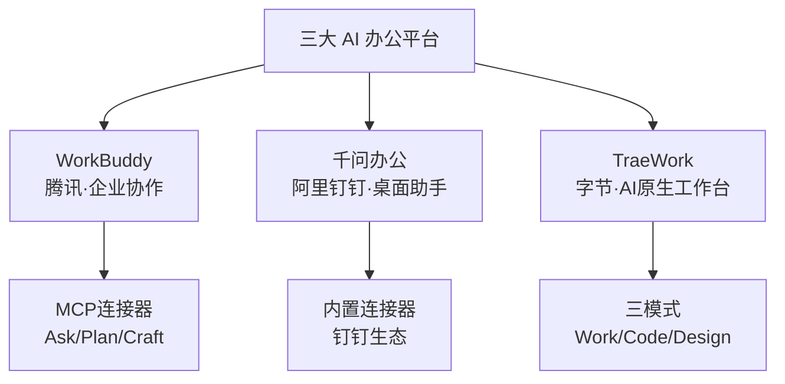

# 01 三大 AI 办公平台对比

> WorkBuddy、千问办公、TraeWork 的产品定位、功能特性与差异。

## 平台总览

| 维度 | WorkBuddy | 千问办公（QwenWork） | TraeWork |
|------|-----------|---------------------|----------|
| 出品方 | **腾讯** | **阿里巴巴钉钉业务线** | **字节跳动 TRAE 品牌** |
| 定位 | AI 办公智能体 | 桌面智能办公助手 | AI 原生工作台 |
| 形态 | 网页/桌面 | 桌面/网页/钉钉/鸿蒙 | 网页/桌面/移动 |
| 连接器机制 | MCP 协议，80+ 连接器 | 内置连接器+集成市场 | 官方预置连接器 |
| 工作模式 | Ask/Plan/Craft | — | Work/Code/Design |
| 底层模型 | 混元等 | 通义千问 | TRAE 模型 |

## WorkBuddy

WorkBuddy 是腾讯出品的 AI 办公智能体（F-003, F-031）。

### 连接器（Connector）机制

WorkBuddy 的连接器是与外部服务之间的桥梁——把第三方平台的数据和能力直接接入 AI 工作流，让用户用自然语言操作这些服务，无需手动下载/上传/复制粘贴。

连接器基于 **MCP（Model Context Protocol）** 协议，内置 80+ 连接器（腾讯文档、飞书、GitHub、企查查等），支持自定义 MCP 连接器。

### 工作模式

- **Ask**：问答式查询
- **Plan**：规划任务
- **Craft**：执行/创建

### Tushare 相关状态

WorkBuddy 技能市场中存在社区 Skill `tushare-finance`（作者 stanleychanh，非 Tushare 官方账号 waditu-tushare），需手动安装并配置 Token（F-029）。

## 千问办公（QwenWork）

千问办公是一款桌面智能办公助手（F-004, F-030）。

> ⚠️ **核验勘误**：博文称"由千问团队开发"，实际开发主体为**阿里巴巴钉钉业务线**，整合了 QoderWork、悟空、MuleRun 三款智能体。产品名含"千问"且底层依托通义千问大模型，但研发主体是钉钉业务线。

### 平台支持

| 平台 | 版本要求 |
|------|----------|
| macOS | 14+ |
| Windows | 10+ |
| HarmonyOS（鸿蒙） | 6.1+ |
| 网页版 | 浏览器访问 |
| 钉钉端 | 钉钉内入口 |

> 博文仅提及 macOS 和 Windows，**遗漏了鸿蒙 6.1+ 支持**。

### 连接器机制

支持浏览器、macOS 应用、Microsoft 365 内置连接器及集成市场（钉钉、飞书、Notion 等）。

### Tushare 相关状态

千问办公官方连接器列表（qwenwork.cn/docs/features/connectors）中**未发现 Tushare**（F-012 核验❌）。

## TraeWork

TraeWork 是 TRAE 品牌下的 AI 原生工作台（F-005, F-015~F-017）。

### 三端形态

| 形态 | 入口 |
|------|------|
| 网页版 | work.trae.ai |
| 桌面版 | 独立应用 |
| 移动版 | TRAE 移动端 |

### 三种模式

| 模式 | 目标用户 | 用途 |
|------|----------|------|
| **Work** | 非开发用户 | 日常办公、文档、数据 |
| **Code** | 开发工程师 | 专业开发、编码 |
| **Design** | 设计用户 | 设计工作（2026-06-25 发布） |

三种模式覆盖从专业开发到日常办公的各类场景。

### Tushare 相关状态

Tushare 官方 MCP 文档列出的 Vibe Coding 工具中包含 **"Trae"**（TRAE 编程 IDE），但未提及 **"TraeWork"**（办公工作台）。Trae 和 TraeWork 是 TRAE 品牌下的不同产品：
- **Trae**：AI 编程 IDE（类似 Cursor）
- **TraeWork**：AI 原生工作台（含 Work/Code/Design 三模式）

博文可能将两者混淆。

## 三平台定位差异

博文称三个平台覆盖"从企业协作、文档办公到开发者Agent的不同场景"（F-008, F-023📝），这一定位描述基本准确。

## 关键事实索引

- F-003/F-031：WorkBuddy 腾讯出品，MCP 连接器
- F-004/F-030：千问办公钉钉业务线，macOS/Windows/鸿蒙
- F-005/F-015~F-017：TraeWork 三端三模式
- F-029：WorkBuddy 社区 Skill 状态
