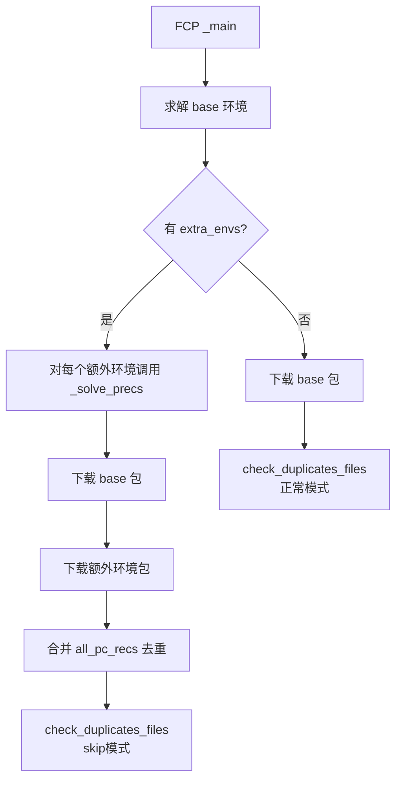

# 多环境与通道配置

constructor 支持在一个安装程序中创建多个 conda 环境，以及灵活的通道映射和镜像配置。

## extra_envs：多环境安装

默认情况下，constructor 创建一个 `base`（root）环境。通过 `extra_envs` 可以创建任意数量的额外环境。

### 基本用法

```yaml
name: mypython
version: "1.0"
channels:
  - conda-forge
specs:
  - python=3.14
  - conda              # base 必须包含 conda 才能管理额外环境

extra_envs:
  datascience:
    specs:
      - numpy
      - pandas
      - jupyterlab
      - matplotlib
  devtools:
    specs:
      - black
      - ruff
      - pytest
```

安装后目录结构：
```
<install-prefix>/
├── bin/               # base 环境的可执行文件
├── python*            # base 环境的 Python
├── condabin/
├── envs/
│   ├── datascience/   # datascience 环境
│   │   ├── bin/
│   │   └── lib/
│   └── devtools/      # devtools 环境
│       ├── bin/
│       └── lib/
├── pkgs/              # 包缓存（所有环境共享）
└── conda-meta/
```

### extra_envs 子字段

每个额外环境支持以下配置（`ExtraEnv` 模型）：

| 子字段 | 类型 | 说明 |
|--------|------|------|
| `specs` | list\<string\> | 包规格列表（同全局 specs） |
| `channels` | list\<string\> | 环境专属通道（继承全局 channels，优先级更高） |
| `exclude` | list\<string\> | 环境专属排除列表（空列表 `[]` 覆盖全局 exclude） |
| `environment` | string | 从已有环境名复制 |
| `environment_file` | string | 从 environment.yml/txt 创建 |
| `menu_packages` | list\<string\>\|null | 该环境的菜单包 |
| `user_requested_specs` | list\<string\> | 用户请求规格 |
| `freeze_env` | dict\|null | Frozen 标记（CEP-22） |

### 多环境约束

1. **base 必须包含 conda**：额外环境由 base 中的 conda 管理
2. **ignore_duplicate_files 强制为 True**：跨环境共享包是预期行为
3. **全局 exclude 传递**：全局 `exclude` 对所有环境生效；额外环境可设 `exclude: []` 来覆盖
4. **Python 可选**：额外环境不强制包含 Python（如纯工具环境）
5. **包去重**：所有环境的包合并下载，相同包只存储一份（节省空间）
6. **register_envs**：所有环境（base + extra_envs）默认注册到 `~/.conda/environments.txt`

### 多环境的 FCP 处理



### 多环境安装脚本行为

SH 安装程序（header.sh）和 NSIS 安装程序都支持多环境：
1. 先安装 base 环境（`conda create --prefix <prefix> --file pkgs/urls`）
2. 对每个额外环境：`conda create --prefix <prefix>/envs/<name> --file pkgs/urls.conda-meta/<name>`
3. 每个环境独立初始化（conda init、快捷方式等）

### 示例：数据科学工作站

```yaml
name: data-science
version: "2026.08"
channels:
  - conda-forge
specs:
  - python=3.14
  - conda
  - mamba
  - pip

extra_envs:
  # 主数据分析环境（默认激活）
  analysis:
    specs:
      - python=3.14
      - numpy
      - pandas
      - scipy
      - scikit-learn
      - matplotlib
      - seaborn
      - jupyterlab
      - polars
      - pyarrow
    channels:
      - conda-forge
      - nvidia  # GPU包
    menu_packages:
      - jupyterlab

  # 深度学习环境（独立CUDA版本）
  deeplearning:
    specs:
      - python=3.12
      - pytorch
      - torchvision
      - cudnn
      - transformers
      - datasets
      - accelerate
    channels:
      - pytorch
      - nvidia
      - conda-forge

  # 文档编写环境
  docs:
    specs:
      - sphinx
      - mkdocs
      - pandoc
      - jupytext
```

## channels_remap：通道重映射

channels_remap 允许构建时和安装后使用不同的通道 URL。这是企业内部分发的关键功能。

### 工作原理

```yaml
channels_remap:
  - src: file:///D:/internal/conda-bld    # 构建时：本地通道
    dest: https://repo.anaconda.com/pkgs/main  # 安装后：公共通道
```

构建时：constructor 从 `src` URL 求解和下载包。
安装后：用户的 `.condarc` 配置为 `dest` URL，所有包看起来都来自公共通道。

### 典型用途

1. **内网构建**：企业内部构建时使用本地/内网镜像，安装后配置为公共通道
2. **私有包分发**：构建时包含私有通道包，但不在用户端暴露私有通道地址
3. **CDN切换**：构建时使用离构建机器近的镜像，安装后配置为全球 CDN

### 多通道映射

```yaml
channels_remap:
  - src: file:///mnt/internal/main
    dest: https://repo.anaconda.com/pkgs/main
  - src: file:///mnt/internal/forge
    dest: https://conda.anaconda.org/conda-forge
  - src: file:///mnt/internal/msys2   # [win]
    dest: https://repo.anaconda.com/pkgs/msys2  # [win]
```

### channels vs channels_remap

| 特性 | channels | channels_remap |
|------|----------|----------------|
| 构建时通道 | ✅ 使用列出的URL | ✅ 使用 src URL |
| 安装后通道 | ✅ 使用列出的URL | ✅ 使用 dest URL |
| 本地通道支持 | ✅ file:// URL | ✅ src 可以是 file:// |
| 隐藏内部URL | ❌ | ✅ dest 替换 src |

## mirrored_channels：通道镜像

`mirrored_channels` 配置通道的镜像 URL 列表作为 fallback。需要 mamba 包存在且 `write_condarc=True`。

```yaml
write_condarc: true
specs:
  - python
  - mamba              # 必须包含 mamba

mirrored_channels:
  conda-forge:
    - "https://conda.anaconda.org/conda-forge"
    - "https://mirrors.tuna.tsinghua.edu.cn/anaconda/cloud/conda-forge"
    - "https://mirrors.aliyun.com/anaconda/cloud/conda-forge"
  defaults:
    - "https://repo.anaconda.com/pkgs/main"
    - "https://mirrors.tuna.tsinghua.edu.cn/anaconda/pkgs/main"
```

生成的 `.condarc` 包含镜像配置，mamba 在下载时自动尝试镜像列表。

## condarc 自定义

### write_condarc

最简单的方式：`write_condarc: true`，constructor 自动从 channels/channels_remap 生成 `.condarc`。

### condarc 直接指定

完全自定义 `.condarc` 内容，覆盖所有其他 condarc 相关选项：

```yaml
condarc: |
  channels:
    - conda-forge
    - defaults
  channel_priority: strict
  solver: libmamba
  auto_activate_base: true
  proxy_servers:
    http: http://proxy.company.com:8080
    https: http://proxy.company.com:8080
  ssl_verify: /etc/ssl/certs/ca-certificates.crt
```

或使用 dict 格式：

```yaml
condarc:
  channels:
    - conda-forge
  channel_priority: strict
  auto_activate_base: false
```

### conda_default_channels

设置 `.condarc` 中的 `default_channels`（仅在 `write_condarc: true` 时生效）：

```yaml
write_condarc: true
conda_default_channels:
  - https://repo.anaconda.com/pkgs/main
  - https://repo.anaconda.com/pkgs/r
```

### conda_channel_alias

设置 `.condarc` 中的 `channel_alias`：

```yaml
conda_channel_alias: https://conda.anaconda.org/
```

## 通道配置优先级

当多种通道配置同时存在时，优先级从高到低：

1. **condarc**（直接指定，覆盖所有其他）
2. **channels_remap**（src构建/dest安装）
3. **channels**（构建和安装都使用）
4. **conda_default_channels**（仅 default_channels 键）

## virtual_specs：虚拟包约束

`virtual_specs` 指定目标机器必须满足的虚拟包条件（在安装时检查，构建时不求解）：

```yaml
virtual_specs:
  - __glibc>=2.24        # [linux] 要求 glibc >= 2.24
  - __osx>=11.0          # [osx] 要求 macOS >= 11.0
  - __cuda>=11.0         # 要求 CUDA >= 11.0
```

虚拟包在安装时由 conda-standalone 检测：
- SH 安装程序：bash 脚本检查 `__glibc`/`__osx`，其他通过 solver dry-run
- PKG 安装程序：原生检查 `__osx`（不需要 solver）
- 可通过 `CONDA_OVERRIDE_GLIBC`/`CONDA_OVERRIDE_OSX` 环境变量覆盖检测结果

## 下一步

- 06-FCP 依赖求解与包下载：了解多环境在 FCP 中的处理细节
- 13-签名与安全：了解 frozen 环境保护机制
