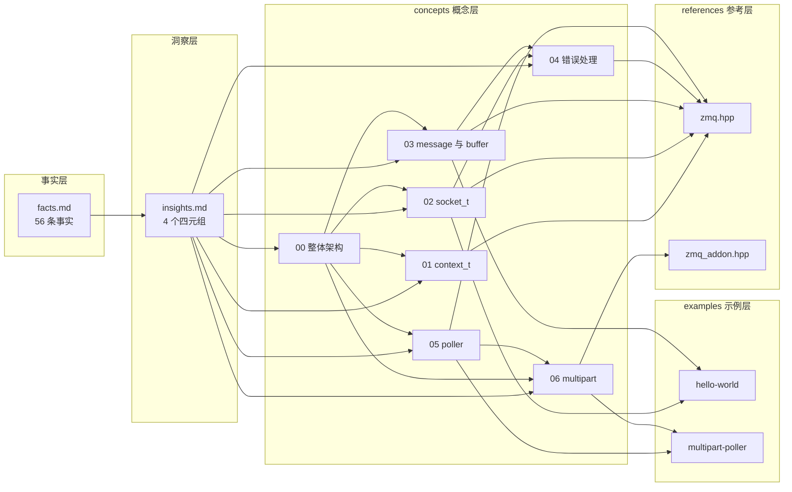

# cppzmq 架构洞察（I 阶段）

> 在 [facts.md](facts.md) 的 56 条事实基础上，提炼 4 个核心架构洞察。每个洞察采用「陈述 / 证据 / 反常识 / 行动」四元组结构，避免空泛赞美，落到可指导工程决策的张力点上。

## 洞察一：RAII 资源管理三巨头——用析构函数消灭 C API 的手动释放负担

### 陈述
`context_t`、`socket_t`、`message_t` 三个核心类分别持有 `void* ptr`、`void* _handle`（+`ctxptr`）、`zmq_msg_t msg`，在构造时获取 libzmq 资源、在析构时自动调用 `zmq_ctx_term`/`zmq_close`/`zmq_msg_close`；三者统一**禁用拷贝、支持移动**，把资源所有权编码进类型系统。

### 证据
- `context_t::~context_t()` 调用 `close()`，`close()` 以 `do { rc = zmq_ctx_term(ptr); } while (rc==-1 && errno==EINTR);` 循环处理信号中断（`zmq.hpp` L851、L885-L897）。
- `socket_t::~socket_t()` 调用 `close()`，`close()` 调 `zmq_close` 并把 `_handle/ctxptr` 置空（`zmq.hpp` L2282、L2288-L297）。
- `message_t::~message_t()` 调 `zmq_msg_close`；拷贝构造/赋值被 `ZMQ_DELETED_FUNCTION` 删除，移动构造在“窃取”后 `zmq_msg_init(&rhs.msg)` 把源重置为空消息（`zmq.hpp` L513-L531、L757-L765）。
- 测试 `tests/message.cpp` L5-L8 用 `static_assert` 验证 `message_t` 不可拷贝构造/赋值。

### 反常识
- **RAII 不等于“无阻塞”**：`context_t` 析构仍会阻塞在 `zmq_ctx_term`（等待其上 socket 关闭），这是 libzmq 语义而非 cppzmq 缺陷。cppzmq 的应对是暴露 `shutdown()`（先发 `ETERM` 打断阻塞调用）和公开 `close()`，让用户能在析构前主动有序关停——“自动释放”与“可控关停”是两件事。
- **`message_t` 删除拷贝而非做引用计数共享**：libzmq 的 `zmq_msg_copy` 实际是引用计数的零拷贝共享，cppzmq 却故意不让它隐式发生（注释明言“避免用户在不知情时使用共享消息”），强制用户写 `msg.move(other)` / `msg.copy(other)` 或 `std::move`。这与 `std::shared_ptr` 式“默认共享”的直觉相反——**显式优于隐式，性能语义必须可见**。
- **移动构造会重置源对象**：`message_t` 移动构造不是浅拷贝指针，而是复制整个 `zmq_msg_t`（值语义）后重新初始化源，确保源析构时 `zmq_msg_close` 的是一个空消息，不会 double-free。

### 行动
1. 让三巨头随栈对象作用域自然析构，不要在 C++ 代码里手动 `zmq_close`/`zmq_ctx_term`/`zmq_msg_close`。
2. 需要跨作用域转移所有权时用 `std::move`；需要共享消息数据时**显式**调用 `msg.copy(other)` 并清楚其引用计数语义。
3. 对需要有序关停的服务，先 `ctx.shutdown()` 打断阻塞 recv/poll，join 工作线程后再让 `ctx` 析构；不要依赖析构隐式完成关停。
4. 需要提前释放 socket 但保留 context 时，显式 `socket.close()`（幂等，已关闭时直接返回）。

## 洞察二：类型安全的套接字选项——用标签类型 + 模板重载把 void*/len 错误移到编译期

### 陈述
`sockopt` 命名空间为每个选项定义一个空标签类型（`integral_option<Opt,T,BoolUnit>` 或 `array_option<Opt,NullTerm>`），`detail::socket_base::set/get` 通过函数重载和模板参数推导，把“选项名 → 值类型 → 长度 → 空终止处理”全部固化进类型签名。调用点形如 `socket.set(zmq::sockopt::linger, 55)`、`socket.get(zmq::sockopt::events)`。

### 证据
- 标签定义：`template<int Opt,class T,bool BoolUnit=false> struct integral_option {};` 与 `template<int Opt,int NullTerm=1> struct array_option {};`（`zmq.hpp` L1442-L1452）。
- 约 80 个选项由宏批量声明，例如 `ZMQ_DEFINE_INTEGRAL_OPT(ZMQ_EVENTS, events, int)`、`ZMQ_DEFINE_INTEGRAL_OPT(ZMQ_FD, fd, ::zmq::fd_t)`、`ZMQ_DEFINE_ARRAY_OPT_BINARY(ZMQ_ROUTING_ID, routing_id)`（`zmq.hpp` L1483-L1758）。
- `set` 重载对整型值做 `static_assert(std::is_integral<T>)`，对 `BoolUnit=true` 的选项额外接受 `bool`；`get(integral_option)` 做 `is_scalar` 断言并 `assert(size==sizeof val)`（`zmq.hpp` L1807-L1869）。
- 测试 `tests/socket.cpp` L51-L80 演示：`set(immediate, false)`、`set(linger, 55)`、`set(routing_id, "foobar"/buffer(id)/id/string_view)`、`get(routing_id, buffer(id_ret))`、`get(routing_id)` 返回 `std::string`。

### 反常识
- **C API 的 `zmq_setsockopt(sock, ZMQ_LINGER, &val, sizeof(val))` 有三类运行时错误**：选项常量拼写/类型不匹配、`val` 类型与选项不符、`sizeof` 长度错误。cppzmq 把这三类全部移到编译期——但代价是**每个选项一个类型**，头文件里用宏铺了约 80 个标签，看似“啰嗦”，实则把 libzmq 的选项元数据做了一次编译期反射。
- **bool 选项不直接存 bool**：`BoolUnit=true` 的选项底层类型仍是 `int`（libzmq 约定），`set` 接受 `bool` 后内部转成 `T rep_val=val` 再传；测试 `set(immediate, 80)` 会因越界抛 `error_t`（`tests/socket.cpp` L61）——**类型安全管类型，值域校验仍在运行时**。
- **`get(array_option)` 默认开 1024 字节缓冲**：对 `routing_id`（最长 255）够用，但对二进制大选项（如 `curve_publickey` 的 Z85 是 41 字节、二进制 32 字节）默认值偏大；`NullTerm==2` 会把默认改成 41。要精确控制长度应使用 `get(opt, mutable_buffer)` 重载返回真实字节数，而非依赖默认字符串重载。

### 行动
1. 一律废弃 `setsockopt(int,...)`/`getsockopt(int,...)`，新代码只写 `socket.set(zmq::sockopt::xxx, val)` / `socket.get(zmq::sockopt::xxx)`。
2. 整型/布尔选项直接传值；数组选项优先传 `const char*`/`std::string`/`std::string_view`/`zmq::buffer(...)`。
3. 读取长度未知或二进制选项时，用 `socket.get(opt, zmq::buffer(buf))` 获取真实字节数，不要依赖默认 1024 字符串重载。
4. 若新增 libzmq 选项，按 `ZMQ_DEFINE_*` 宏模式在 `sockopt` 命名空间补一个标签，即可自动获得类型安全的 set/get——这是该设计的扩展点。

## 洞察三：buffer 抽象——用 (指针,长度) 值类型统一 send/recv 内存表示，消除样板与 UB

### 陈述
`mutable_buffer`/`const_buffer` 是一对仅持有 `data`+`size` 的轻量值类型，配合自由函数 `buffer()` 的庞大重载族（裸指针、C 数组、`std::array`、`std::vector`、`std::basic_string`、`std::basic_string_view`），把“一段连续字节”的表示统一起来；`str_buffer()` 和 `_zbuf` 字面量专门处理字符串字面量的终止符问题。`send(const_buffer)`/`recv(mutable_buffer)` 据此提供统一接口。

### 证据
- `mutable_buffer`/`const_buffer` 定义与 `operator+=`/`operator+`（按 `min(n,size)` 前移，防越界）、`mutable→const` 隐式转换（`zmq.hpp` L1102-L1177）。
- `buffer()` 重载族与 `detail::buffer_contiguous_sequence`，后者用 `static_assert(detail::is_pod_like<T>, "T must be POD")` 拒绝非平凡可复制/非标准布局元素（`zmq.hpp` L1206-L1367）。
- `str_buffer` 用 `(N-1)*sizeof(Char)` 剥离 `'\0'`，并 `assert(data[N-1]==Char{0})` 确保确实是字面量（`zmq.hpp` L1372-L1380）。
- `socket_base::send(const_buffer, send_flags)` 直接调 `zmq_send(buf.data(), buf.size(), ...)`（`zmq.hpp` L2005-L2014）；`recv(mutable_buffer)` 返回 `recv_buffer_size{written, untruncated}` 报告截断（`zmq.hpp` L2077-L2090）。

### 反常识
- **const 正确性被编码进类型**：`const_buffer` 可由 `mutable_buffer` 隐式构造，但反向不行。于是 `send` 吃 `const_buffer`（只读发送），`recv` 只吃 `mutable_buffer`（必须可写）——编译器强制了读写方向，这在 C 版 `void*` 中完全丢失。
- **`buffer()` 拒绝非 POD 元素**：试图 `zmq::buffer(vector<NonTrivial>)` 会编译失败，防止把含虚表指针/非平凡拷贝的对象按字节发送（接收方无法重建）。这是刻意的保守策略——注释引用 Networking TS N4771，要求 trivially copyable **或** standard layout，cppzmq 要求**两者都满足**（`is_pod_like`）。
- **`str_buffer` 不复制、不拥有**：它返回指向字面量静态存储的 `const_buffer`，只能用于生存期长于发送操作的数据；`send_static` 走 `zmq_send_const` 明确告知 libzmq 缓冲不会被修改/释放。而普通 `message_t(const void*, size_t)` 会**拷贝**数据——零拷贝与拷贝的边界由不同构造函数/`send_static` vs `send` 显式区分。
- **recv 到固定 buffer 会静默截断**：`recv_buffer_result_t` 同时返回 `size`（实际写入）和 `untruncated_size`（消息真实长度），必须检查 `truncated()`，否则数据被悄悄截断——buffer 抽象统一了接口，但没有消除应用层对截断的责任。

### 行动
1. 发送连续容器：`socket.send(zmq::buffer(vec), zmq::send_flags::none)`；发送字符串字面量：`socket.send(zmq::str_buffer("hello"))` 或 `"hello"_zbuf`。
2. 非 POD 结构先显式序列化（protobuf/JSON/自定义平铺）再发送，不要试图绕过 `is_pod_like` 静态断言。
3. 零拷贝发送：用 `message_t(void*, size, free_fn*, hint*)` 注册释放函数；常量静态数据用 `send_static`。
4. 接收定长缓冲后检查 `auto r = socket.recv(zmq::buffer(buf)); if (r && r->truncated()) { /* 消息被截断，需更大缓冲重收或丢弃 */ }`。

## 洞察四：poller_t 的类型安全事件多路复用 + active_poller_t 的回调分发

### 陈述
`poller_t<T>` 是模板类，把用户数据类型 `T` 参数化，`poller_event<T>` 与 C 的 `zmq_poller_event_t` 布局兼容（可直接 `reinterpret_cast`），从而在取回事件时直接拿到 `T* user_data` 而非 `void*`；`add/remove/modify/wait_all` 全部类型安全。`active_poller_t` 在其上用 `std::function<void(event_flags)>` 注册 handler，`wait` 时自动分发，把“轮询 + switch 分发”样板封装掉。

### 证据
- `poller_event<T>` 字段 `socket_ref socket; fd_t fd; T* user_data; event_flags events;`，测试用 `static_assert(sizeof/alignof)` 验证与 `zmq_poller_event_t` 一致（`zmq.hpp` L2708-L2714；`tests/poller.cpp` L12-L18）。
- `poller_t` 用 `std::unique_ptr<void, destroy_poller_t>` 管理 `zmq_poller_new/destroy`；`add(socket_ref, events, T*)` 用 `enable_if<!is_same<T,no_user_data>>` 守卫——`poller_t<>`（默认 `no_user_data`）根本没有三参 `add`（`zmq.hpp` L2716-L2863）。
- `wait_all(Sequence&)` 静态断言 `Sequence::value_type == event_type`，返回就绪数（`zmq.hpp` L2802-L2823）。
- `active_poller_t` 内部持 `poller_t<handler_type>` 与 `unordered_map<poller_ref_t, shared_ptr<handler_type>>`；`add` 失败时回滚 map 插入；`wait` 在 `need_rebuild` 时重建 handler 向量，再 `wait_all` 并对每个事件执行 `(*event.user_data)(event.events)`（`zmq_addon.hpp` L741-L853）。
- `poller_ref_t` 是 `(type-tag, socket_ref, fd_t)` 的可哈希 tuple，让同一 poller 能同时管理 socket 和 fd 且不冲突（`zmq_addon.hpp` L41-L92）。

### 反常识
- **类型安全不是靠封装，而是靠“布局兼容 + 模板参数”**：`poller_event<T>` 与 C 结构体二进制兼容，因此底层仍调 `zmq_poller_wait_all` 填充 C 数组，但 `user_data` 在 C++ 侧以 `T*` 出现——零开销抽象，没有 `void*→T*` 的运行时强转散落在用户代码里（强转集中在 `reinterpret_cast<zmq_poller_event_t*>(&event)` 一处）。
- **`poller_t<>` 不接受 user_data**：用 `no_user_data` 占位类型 + SFINAE 在编译期禁止三参 `add`，而不是运行时传 `nullptr`。这是“用类型表达能力边界”的范例——不需要用户数据时，API 面就根本不暴露这个参数。
- **`active_poller_t` 用 `shared_ptr<handler>` 作 user_data 而非直接存 `std::function`**：因为 `poller_t` 存的是指针，handler 需要稳定地址；`shared_ptr` 既保证地址稳定，又让 `poller_handlers` 向量持有强引用防止回调在分发途中被销毁。`add` 用 try/catch 回滚 map 保证异常安全——**注册-添加非原子，需要显式回滚**。
- **与 C `zmq_pollitem_t` POD 数组相比**：C 方式要手填 `{socket, fd, events, revents}` 数组、轮询后遍历 `revents` 做位与分支、用 `void*` 带上下文；cppzmq 把“注册什么”和“事件回来后做什么”通过模板/`std::function` 关联起来，但代价是 `active_poller_t` 每次 `add/remove` 都置 `need_rebuild`，下次 `wait` 重建向量——高频增删场景有摊销开销。

### 行动
1. 只需轮询、自行处理事件：用 `zmq::poller_t<MyData>`，`add(sock, event_flags::pollin, &myData)`，`wait_all(events, timeout)` 后读 `event.user_data`。
2. 要回调式分发：用 `zmq::active_poller_t`，`add(sock, flags, { ... })`，循环 `poller.wait(timeout)` 即可自动回调。
3. 同一 poller 混用 socket 与原生 fd：`active_poller_t` 通过 `poller_ref_t` 已支持；直接用 `poller_t` 时注意 socket 与 fd 的 `add/remove` 是不同重载。
4. 高频增删 fd 的场景评估 `need_rebuild` 重建成本；若稳定不变则零额外开销。`wait_all` 需要预分配 `vector<event_type>`，容量按预期最大 fd 数预留。

## 知识地图设计

在 `spec/` 下按 OKF bundle 组织三层知识地图，所有文档带 YAML frontmatter（`type` 必填），交叉引用使用相对路径。

### concepts/ —— 概念层（7 篇，从整体到局部）

| 序号 | 文件 | 主题 | 核心内容 |
|---|---|---|---|
| 00 | [concepts/00-overview.md](../concepts/00-overview.md) | 整体架构与设计目标 | header-only 形态、与 libzmq 的分层、命名空间布局、C++11/14/17 兼容垫片、设计哲学（RAII/类型安全/零开销） |
| 01 | [concepts/01-context.md](../concepts/01-context.md) | context_t 上下文 | ctxopt 强类型选项、io_threads/max_sockets、shutdown vs close、EINTR 重试循环、移动语义 |
| 02 | [concepts/02-socket.md](../concepts/02-socket.md) | socket_t 与套接字层 | socket_type 枚举、socket_base 的 bind/connect、send/recv 结果类型、sockopt 标签机制、socket_ref 非拥有引用、proxy |
| 03 | [concepts/03-message-and-buffer.md](../concepts/03-message-and-buffer.md) | message_t 与 buffer 抽象 | 消息构造函数族、移动/拷贝语义、零拷贝 free_fn、const_buffer/mutable_buffer、buffer() 重载、str_buffer/_zbuf |
| 04 | [concepts/04-error-handling.md](../concepts/04-error-handling.md) | 错误处理 | error_t（num/what）、EAGAIN 与 optional 返回值、异常与断言的分工、错误传播模式 |
| 05 | [concepts/05-poller.md](../concepts/05-poller.md) | poller_t 与事件多路复用 | event_flags、poller_event<T> 布局兼容、add/remove/modify/wait_all、active_poller_t 回调分发、poller_ref_t |
| 06 | [concepts/06-multipart.md](../concepts/06-multipart.md) | multipart 高层抽象 | recv_multipart/send_multipart 迭代器接口、multipart_t 容器、encode/decode（RFC 50）、与 CZMQ zmsg 的关系 |

> 另预留 `concepts/07-monitor.md`（monitor_t 事件监控）作为可选扩展，本次知识地图先列 6 个核心主题（00-06 共 7 篇）。

### references/ —— 参考层（2 篇，源码索引）

| 文件 | 内容 |
|---|---|
| [references/zmq-hpp.md](../references/zmq-hpp.md) | `zmq.hpp` 文件级参考：行号索引、类/函数/宏清单、条件编译开关（ZMQ_BUILD_DRAFT_API / ZMQ_HAVE_POLLER / ZMQ_HAVE_TIMERS / CPPZMQ_HAS_OPTIONAL 等） |
| [references/zmq-addon-hpp.md](../references/zmq-addon-hpp.md) | `zmq_addon.hpp` 文件级参考：multipart_t、自由函数、active_poller_t、poller_ref_t 的签名与依赖说明 |

### examples/ —— 示例层（2 篇，可运行用法）

| 文件 | 内容 |
|---|---|
| [examples/hello-world.md](../examples/hello-world.md) | REQ-REP 最小示例：context_t + socket_t + send/recv(message_t) 与 buffer 两种写法、错误处理 |
| [examples/multipart-poller.md](../examples/multipart-poller.md) | 多部分消息 + poller_t/active_poller_t 示例：send_multipart/recv_multipart、multipart_t、事件回调注册与分发 |

### 文档关系图

## 小结

cppzmq 的设计可以用一句话概括：**在不增加运行时开销的前提下，用 C++ 类型系统把 libzmq C API 的三类危险源（手动资源释放、`void*`+长度、`void*` 用户数据）分别用 RAII、标签类型+模板重载、模板参数+布局兼容结构化掉**。其代价是头文件体积较大（大量宏生成标签与重载）、部分默认值（如 1024 选项缓冲）需要使用者警觉，但整体是“零成本抽象”原则在 C++ 绑定中的教科书级实践。
