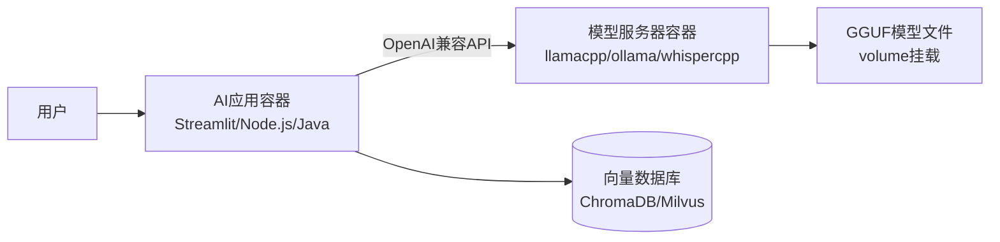

# 配方架构概览

ai-lab-recipes 采用**双容器分离架构**，将模型服务能力与 AI 应用逻辑解耦，每个配方（Recipe）至少由两个独立容器组成：模型服务器容器和 AI 应用容器。这种架构设计使得模型管理和应用开发可以独立演进，同时支持灵活的组件替换。

## 双容器架构



### 模型服务器容器

模型服务器负责：
- 加载和管理 GGUF 格式的机器学习模型
- 通过 OpenAI 兼容 API 暴露推理能力
- 处理 GPU/CPU 资源调度
- 支持多种硬件加速（CUDA、Vulkan）

### AI 应用容器

AI 应用容器负责：
- 提供特定任务的业务逻辑（聊天、RAG、代码生成等）
- 通过 API 调用模型服务器进行推理
- 提供用户界面（Web UI、API 端点）
- 集成向量数据库等外部服务（如 RAG 场景）

## 目录结构

```
ai-lab-recipes/
├── model_servers/          # 模型服务器实现
│   ├── llamacpp_python/   # 默认模型服务器
│   ├── ollama/            # Ollama集成
│   ├── whispercpp/        # 语音识别服务器
│   └── object_detection_python/  # 目标检测服务器
├── recipes/                # AI应用配方
│   ├── audio/             # 音频处理应用
│   ├── computer_vision/   # 计算机视觉应用
│   ├── multimodal/        # 多模态应用
│   └── natural_language_processing/  # NLP应用
├── models/                 # 模型下载脚本
├── convert_models/         # 模型转换工具
└── data/                   # 示例数据文件
```

## 架构优势

1. **职责分离**：模型管理与应用逻辑独立开发、独立部署
2. **灵活替换**：AI应用可对接不同模型服务器，无需修改应用代码
3. **多语言支持**：AI应用支持 Python、Node.js、Java Quarkus 等多种技术栈
4. **本地优先**：所有组件可在本地运行，无需依赖云服务
5. **生产就绪**：容器化设计支持从本地原型平滑迁移到生产环境

## 相关概念

- [模型服务器选型](01-model-servers.md)：了解各模型服务器的特点和适用场景
- [NLP配方概览](02-nlp-recipes.md)：Chatbot、RAG、Agent等NLP应用架构
- [部署方式](03-deployment.md)：Quadlet、Bootc、Ansible等部署选项
