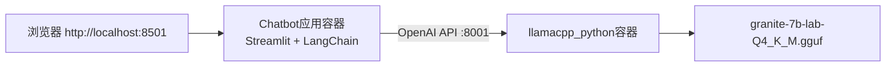

# 启动Chatbot示例

本示例将引导你从零开始部署和运行 ai-lab-recipes 的 Chatbot 聊天机器人配方，使用 Quadlet 方式本地部署。完成后你将拥有一个运行在本地的 LLM 聊天应用。

## 前置条件

- 已安装 Podman 4.0+
- 至少 8GB 内存（推荐 16GB+）
- （可选）NVIDIA GPU 以获得更快推理速度
- 网络连接以下载模型和镜像

## 架构说明

Chatbot 采用双容器架构：



## 步骤1：下载模型

首先需要获取 GGUF 格式的 LLM 模型。推荐使用 granite-7b-lab 模型。

```bash
# 进入项目根目录
cd d:\spaces\SpecWeave\external\dao\action\Containers\ai-lab-recipes

# 进入models目录
cd models

# 下载granite-7b-lab GGUF模型（约4GB）
curl -sLO https://huggingface.co/instructlab/granite-7b-lab-GGUF/resolve/main/granite-7b-lab-Q4_K_M.gguf
```

> 如果 `curl` 下载慢，可手动从浏览器访问上述URL下载，保存到 `models/` 目录。

## 步骤2：使用预构建镜像快速启动（推荐）

项目已将镜像发布到 quay.io，无需本地构建即可直接运行。

```bash
# 进入Chatbot配方目录
cd ../recipes/natural_language_processing/chatbot

# 生成Quadlet配置和Kubernetes YAML
make quadlet
```

`make quadlet` 会在 `build/` 目录生成 `chatbot.yaml`，其中包含完整的 Pod 定义（模型服务器 + Chatbot 应用两个容器）。

启动 Pod：

```bash
podman kube play build/chatbot.yaml
```

首次运行会自动从 quay.io 拉取镜像，可能需要几分钟时间。

## 步骤3：验证部署

检查 Pod 和容器状态：

```bash
# 查看运行中的Pod
podman pod list

# 查看运行中的容器
podman ps
```

预期输出应看到名为 `chatbot` 的 Pod，以及两个容器：
- 模型服务器容器（llamacpp_python）
- Chatbot 应用容器

查看容器日志确认启动成功：

```bash
# 查看模型服务器日志（等待模型加载完成）
podman logs -f chatbot-model-server

# 查看应用日志
podman logs chatbot-app
```

模型加载完成后，模型服务器日志会显示类似 "Uvicorn running on http://0.0.0.0:8001" 的信息。

## 步骤4：访问Web UI

打开浏览器访问：**http://localhost:8501**

你将看到 Streamlit 构建的聊天界面，可以直接与 LLM 对话：

1. 在输入框输入问题，例如："What is Podman?"
2. 按回车发送，等待模型回复
3. 支持多轮对话上下文

## 步骤5：（可选）本地构建镜像

如果你想修改代码后自己构建镜像，而不是使用预构建镜像：

### 构建模型服务器

```bash
# 进入llamacpp_python目录
cd ../../../../model_servers/llamacpp_python

# 构建CPU版本镜像
make build

# 或构建CUDA版本（需要NVIDIA GPU）
# make build-cuda
```

### 构建Chatbot应用

```bash
# 返回Chatbot目录
cd ../../recipes/natural_language_processing/chatbot

# 构建应用镜像
make build
```

### 本地运行

```bash
# 先生成Quadlet配置
make quadlet

# 启动
podman kube play build/chatbot.yaml
```

## 步骤6：管理应用生命周期

```bash
# 停止Pod
podman pod stop chatbot

# 删除Pod
podman pod rm chatbot

# 重新启动
podman kube play build/chatbot.yaml
```

## 环境变量配置

通过修改 `quadlet/chatbot.yaml` 或 Makefile 变量可调整配置：

```yaml
# 常见环境变量
env:
  - MODEL_PATH=models/granite-7b-lab-Q4_K_M.gguf  # 模型文件路径
  - HOST=0.0.0.0                                    # 服务监听地址
  - PORT=8001                                       # 模型服务端口
  - MODEL_ENDPOINT=http://10.88.0.1:8001           # 应用连接的模型服务地址
```

## 故障排查

### 问题1：镜像拉取失败

**症状**：`podman kube play` 报镜像拉取错误

**解决**：
- 检查网络连接
- 尝试手动拉取：`podman pull quay.io/ai-lab/chatbot:latest`
- 或改用本地构建（见步骤5）

### 问题2：模型加载慢

**症状**：启动后长时间无响应

**解决**：
- 检查模型文件是否完整下载
- 首次加载 GGUF 模型需要时间，查看模型服务器日志等待
- 内存不足会导致使用swap，速度极慢——确保有足够内存

### 问题3：无法访问8501端口

**症状**：浏览器无法连接

**解决**：
- 确认容器在运行：`podman ps`
- 检查端口映射：`podman port chatbot-app`
- 防火墙是否阻止了8501端口

### 问题4：回复质量差/乱码

**症状**：模型回复无意义内容

**解决**：
- 确认使用的是正确的GGUF模型
- 检查模型路径配置是否正确
- 尝试更大参数的模型（如7B以上）

## 扩展：部署为Bootc镜像

如需将Chatbot打包成可启动操作系统镜像：

```bash
# 构建bootc镜像
make BOOTC_IMAGE=quay.io/your/chatbot-bootc:latest bootc

# 在目标bootc系统上切换
bootc switch quay.io/your/chatbot-bootc:latest
```

重启后系统会自动运行Chatbot服务。

## 下一步

- 尝试 [RAG应用部署](02-rag.md)，体验基于私有文档的问答
- 了解 [部署方式](../concepts/03-deployment.md) 中更多部署选项
- 探索其他NLP配方：Codegen、Agents、Function Calling

## 相关概念

- [配方架构概览](../concepts/00-introduction.md)
- [模型服务器选型](../concepts/01-model-servers.md)
- [NLP配方概览](../concepts/02-nlp-recipes.md)
- [部署方式](../concepts/03-deployment.md)
