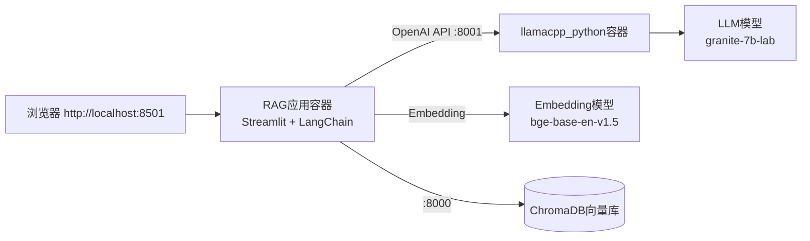

# RAG应用部署

本示例将引导你部署 RAG（检索增强生成）应用。RAG 在 Chatbot 基础上增加了向量数据库，使 LLM 能够基于你上传的私有文档回答问题，有效减少"幻觉"。

## 前置条件

- 完成 [Chatbot示例](01-chatbot.md) 或已了解基础部署流程
- 至少 12GB 内存（RAG 需要同时运行 LLM + Embedding 模型 + 向量数据库）
- 已下载 LLM 模型（granite-7b-lab-Q4_K_M.gguf）

## 架构说明

RAG 采用三组件架构，比 Chatbot 多了向量数据库：



**数据流**：
1. 用户上传文档 → Embedding 模型向量化 → 存入 ChromaDB
2. 用户提问 → 检索相关文档片段 → 连同问题发给 LLM → 生成回答

## 步骤1：下载所需模型

RAG 需要两个模型：

### LLM 模型（生成回答）

如果还没下载，先下载 granite-7b-lab：

```bash
cd d:\spaces\SpecWeave\external\dao\action\Containers\ai-lab-recipes/models
curl -sLO https://huggingface.co/instructlab/granite-7b-lab-GGUF/resolve/main/granite-7b-lab-Q4_K_M.gguf
```

### Embedding 模型（文档向量化）

使用 Python 下载 BAAI/bge-base-en-v1.5 embedding 模型：

```python
from huggingface_hub import snapshot_download
snapshot_download(
    repo_id="BAAI/bge-base-en-v1.5",
    cache_dir="models/",
    local_files_only=False
)
```

将上述代码保存为 `download_embedding.py` 并运行：

```bash
pip install huggingface_hub
python download_embedding.py
```

## 步骤2：启动向量数据库（ChromaDB）

RAG 使用 ChromaDB 作为向量数据库（轻量级，适合本地开发）：

```bash
# 拉取ChromaDB镜像
podman pull chromadb/chroma

# 启动ChromaDB容器
podman run --rm -d --name chroma -p 8000:8000 chromadb/chroma
```

验证 ChromaDB 运行：

```bash
podman ps
podman logs chroma
```

看到 "Started server component" 表示启动成功。

## 步骤3：启动模型服务器

使用 llamacpp_python 作为模型服务器：

```bash
# 进入llamacpp_python目录
cd ../model_servers/llamacpp_python

# 如果还没构建镜像，先构建
make build

# 启动模型服务器（挂载models目录）
podman run --rm -d --name model-server \
    -p 8001:8001 \
    -v $(pwd)/../../models:/locallm/models \
    -e MODEL_PATH=models/granite-7b-lab-Q4_K_M.gguf \
    -e HOST=0.0.0.0 \
    -e PORT=8001 \
    llamacpp_python
```

> 使用 Windows PowerShell 时，`$(pwd)` 替换为完整路径，如 `D:\spaces\...\models`

等待模型加载完成：

```bash
podman logs -f model-server
```

## 步骤4：构建并启动RAG应用

```bash
# 进入RAG配方目录
cd ../../recipes/natural_language_processing/rag

# 构建RAG应用镜像
make build

# 启动RAG应用（连接模型服务器和ChromaDB）
podman run --rm -d --name rag-inference -p 8501:8501 \
    -e MODEL_ENDPOINT=http://host.containers.internal:8001 \
    -e VECTORDB_HOST=host.containers.internal \
    -e VECTORDB_PORT=8000 \
    -v $(pwd)/../../../models:/rag/models \
    rag
```

**关键环境变量说明**：

| 环境变量 | 值 | 说明 |
|---------|-----|------|
| `MODEL_ENDPOINT` | http://host.containers.internal:8001 | 模型服务器地址 |
| `VECTORDB_HOST` | host.containers.internal | ChromaDB主机 |
| `VECTORDB_PORT` | 8000 | ChromaDB端口 |

> `host.containers.internal` 是 Podman 提供的宿主机访问域名

验证应用启动：

```bash
podman ps
podman logs rag-inference
```

## 步骤5：（可选）使用Quadlet一键启动

类似 Chatbot，RAG 也支持 Quadlet 一键部署：

```bash
# 确保已回到rag目录
cd d:\spaces\SpecWeave\external\dao\action\Containers\ai-lab-recipes/recipes/natural_language_processing/rag

# 生成Quadlet YAML
make quadlet

# 启动Pod（包含模型服务器+RAG应用+ChromaDB sidecar）
podman kube play build/rag.yaml
```

## 步骤6：使用RAG应用

打开浏览器访问：**http://localhost:8501**

### 上传文档

1. 在侧边栏找到文件上传区域
2. 上传项目提供的示例文档 `data/fake_meeting.txt` 或你自己的 TXT/PDF 文件
3. 等待文档处理完成（向量化并存入 ChromaDB）

项目已提供示例数据文件 `sample-data/fake_meeting.txt`，内容是一段虚构的会议记录。

### 提问测试

尝试问一些只有文档中才有的信息，例如：
- "What was discussed in the meeting?"
- "What are the action items?"
- "Who attended the meeting?"

你会发现 LLM 的回答基于上传的文档，而非通用知识。

### 管理向量数据库

`app/manage_vectordb.py` 提供向量数据库管理功能：

```bash
# 查看已索引文档
python app/manage_vectordb.py --list

# 清除所有数据
python app/manage_vectordb.py --clear
```

## 步骤7：（可选）使用Milvus替代ChromaDB

生产环境推荐使用 Milvus 向量数据库：

```bash
# 创建Milvus数据目录
mkdir -p volumes/milvus

# 创建配置文件 milvus-embedEtcd.yaml
@"
listen-client-urls: http://0.0.0.0:2379
advertise-client-urls: http://0.0.0.0:2379
quota-backend-bytes: 4294967296
auto-compaction-mode: revision
auto-compaction-retention: '1000'
"@ | Out-File -Encoding utf8 milvus-embedEtcd.yaml

# 启动Milvus
podman run --rm -d \
    --name milvus-standalone \
    --security-opt seccomp:unconfined \
    -e ETCD_USE_EMBED=true \
    -e ETCD_CONFIG_PATH=/milvus/configs/embedEtcd.yaml \
    -e COMMON_STORAGETYPE=local \
    -v $(pwd)/volumes/milvus:/var/lib/milvus \
    -v $(pwd)/milvus-embedEtcd.yaml:/milvus/configs/embedEtcd.yaml \
    -p 19530:19530 \
    -p 9091:9091 \
    -p 2379:2379 \
    --health-cmd="curl -f http://localhost:9091/healthz" \
    --health-interval=30s \
    --health-start-period=90s \
    milvusdb/milvus:master-20240426-bed6363f \
    milvus run standalone
```

启动RAG应用时指定使用Milvus：

```bash
podman run --rm -d --name rag-inference -p 8501:8501 \
    -e MODEL_ENDPOINT=http://host.containers.internal:8001 \
    -e VECTORDB_VENDOR=milvus \
    -e VECTORDB_HOST=host.containers.internal \
    -e VECTORDB_PORT=19530 \
    -v $(pwd)/../../../models:/rag/models \
    rag
```

## 环境清理

测试完成后清理容器：

```bash
# 停止所有相关容器
podman stop rag-inference model-server chroma milvus-standalone

# （如使用kube play）停止Pod
podman pod stop rag
podman pod rm rag
```

## 故障排查

### 问题1：连接模型服务器失败

**症状**：应用日志显示连接错误

**排查**：
- 确认 model-server 容器在运行：`podman ps`
- 检查 MODEL_ENDPOINT 地址是否正确
- Windows/macOS 上使用 `host.containers.internal` 而非 `127.0.0.1`
- 测试连通性：`podman exec -it rag-inference curl http://host.containers.internal:8001/v1/models`

### 问题2：文档上传后无响应

**症状**：上传文档后长时间卡住

**排查**：
- Embedding 模型是否下载完整
- 检查应用日志：`podman logs rag-inference`
- 内存是否充足（Embedding 也需要内存）

### 问题3：回答不基于文档

**症状**：回答仍然是通用知识，没用到上传的文档

**排查**：
- 确认文档已成功索引（看上传后的提示）
- 尝试更具体的问题
- 检查检索结果数量（调整 LangChain 的 k 值）

### 问题4：ChromaDB连接失败

**症状**：向量数据库连接错误

**排查**：
- ChromaDB 容器是否运行：`podman ps | grep chroma`
- 端口 8000 是否被占用
- 检查 ChromaDB 日志：`podman logs chroma`

## 代码结构

RAG 应用核心代码位于 `app/` 目录：

```
rag/app/
├── Containerfile          # 容器构建文件
├── rag_app.py            # 主应用（Streamlit UI + RAG链）
├── manage_vectordb.py    # 向量数据库管理工具
└── requirements.txt      # Python依赖
```

核心依赖包括：
- `langchain`：LLM 应用框架
- `chromadb` / `pymilvus`：向量数据库客户端
- `sentence-transformers`：Embedding 模型
- `streamlit`：Web UI
- `llama-cpp-python`：LLM 客户端（OpenAI兼容）

## 下一步

- 探索其他高级配方：[Agents](../concepts/02-nlp-recipes.md#agents智能体)、[Codegen](../concepts/02-nlp-recipes.md#codegen代码生成)
- 学习将 RAG 部署为 [Bootc可启动容器](../concepts/03-deployment.md#方式二bootc可启动容器)
- 尝试 Node.js 版本的 RAG：`rag-nodejs/` 目录

## 相关概念

- [配方架构概览](../concepts/00-introduction.md)
- [模型服务器选型](../concepts/01-model-servers.md)
- [NLP配方概览](../concepts/02-nlp-recipes.md)
- [部署方式](../concepts/03-deployment.md)
