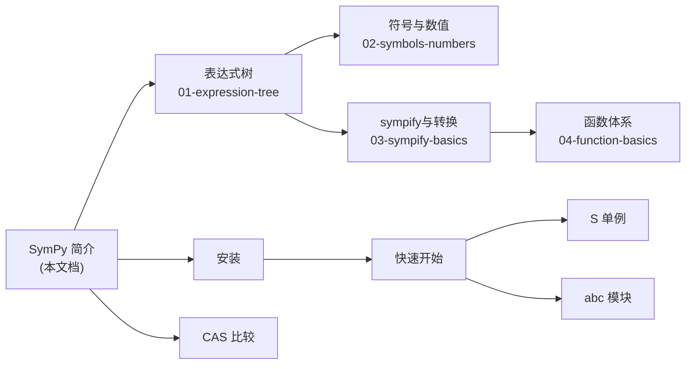

# SymPy 符号计算简介

## 什么是符号计算

符号计算（Symbolic Computation），又称计算机代数（Computer Algebra），是一种以**精确符号**而非近似数值进行数学运算的计算范式。与数值计算直接操作浮点数不同，符号计算操作的是数学表达式本身——变量保持为符号，分数保持为精确有理数，常数保持为数学实体。

以计算 √2 为例说明两种范式的差异：

```python
# 数值计算：得到近似浮点数
import math
math.sqrt(2)    # 1.4142135623730951（近似值，有精度损失）

# 符号计算：保持精确表达式
from sympy import sqrt, N
sqrt(2)         # sqrt(2)（精确表示）
N(sqrt(2), 30)  # 1.41421356237309504880168872421（30位精度数值）
```

| 特性 | 数值计算 | 符号计算 |
|------|----------|----------|
| 操作对象 | 浮点数/整数 | 符号表达式 |
| 精度 | 有限（受浮点位数限制） | 任意精度/精确 |
| 典型运算 | 近似求值 | 化简、求导、积分、求解 |
| 结果形式 | 数值 | 符号表达式或解析解 |
| 示例库 | NumPy, SciPy | SymPy, Mathematica, Maple |

## SymPy 是什么

SymPy 是一个用纯 Python 实现的开源计算机代数系统（CAS），遵循三条款 BSD 许可证，是 Python 生态中最成熟的符号计算库。SymPy 的核心设计哲学是：[^F-069]

- **纯 Python 实现**：无 C 扩展依赖，易于安装和跨平台使用
- **BSD 许可证**：商业友好，可自由用于开源和商业项目
- **轻量级**：唯一强制依赖是 mpmath（任意精度浮点库）
- **可扩展**：模块化架构，支持自定义函数和扩展

### 环境要求

根据 [core-init](../references/core-init.md) 中的源码分析，SymPy 要求：

- **Python 版本**：≥ 3.9
- **强制依赖**：mpmath（任意精度浮点运算）
- **可选依赖**：Matplotlib（绘图）、NumPy/SciPy（lambdify 后端）、IPython（交互增强）

## 核心模块概览

SymPy 的功能按子模块组织，顶层 `sympy` 包从各子模块聚合导出约 400+ 个公开符号。[^F-070]

| 子模块 | 核心功能 | 常用导出 |
|--------|----------|----------|
| `core` | 表达式体系核心 | `Basic`, `Expr`, `Symbol`, `sympify`, `S`, `Integer`, `Rational` |
| `functions` | 数学函数库 | `sin`, `cos`, `exp`, `log`, `gamma`, `besselj`, `erf`, `Piecewise` |
| `simplify` | 表达式化简 | `simplify`, `trigsimp`, `powsimp`, `ratsimp`, `cse` |
| `polys` | 多项式系统 | `Poly`, `factor`, `gcd`, `groebner`, `roots`, `ZZ`, `QQ` |
| `solvers` | 方程求解 | `solve`, `dsolve`, `pdsolve`, `solveset`, `linsolve` |
| `integrals` | 积分与变换 | `integrate`, `Integral`, `laplace_transform` |
| `series` | 级数展开 | `limit`, `series`, `Limit`, `Order`, `residue` |
| `matrices` | 矩阵运算 | `Matrix`, `eye`, `zeros`, `det`, `trace`, `MatrixSymbol` |
| `sets` | 集合论 | `Set`, `Interval`, `Union`, `FiniteSet`, `Reals` |
| `logic` | 布尔逻辑 | `And`, `Or`, `Not`, `Xor`, `satisfiable` |
| `assumptions` | 假设系统 | `Q`, `ask`, `refine`, `assuming` |
| `printing` | 打印与代码生成 | `latex`, `pretty`, `pprint`, `srepr`, `ccode` |
| `geometry` | 几何 | `Point`, `Line`, `Circle`, `Ellipse`, `Polygon` |
| `stats` | 概率统计 | `Normal`, `density`, `E`, `variance`（需显式导入） |
| `ntheory` | 数论 | `isprime`, `factorint`, `primepi`, `primitive_root` |
| `physics` | 物理学 | `units`, 经典力学, 量子力学（需显式导入） |

部分功能密集型子模块（`stats`、`combinatorics`、`physics`）默认不自动导入以保持启动速度，需显式导入。[^F-071]

## SymPy 与其他 CAS 的比较

| 特性 | SymPy | Mathematica | Maple | Maxima |
|------|-------|-------------|-------|--------|
| 语言 | Python | Wolfram Language | Maple 语言 | Lisp 方言 |
| 许可证 | BSD（开源免费） | 商业许可证 | 商业许可证 | GPL（开源免费） |
| 实现语言 | 纯 Python | 混合（C/C++/Java） | 混合（C/C++/Java） | Lisp |
| Python 集成 | 原生 | 通过 WSTP/mathematica API | 通过 OpenMaple | 通过接口库 |
| 可扩展性 | Python 生态 | Wolfram 生态 | Maple 生态 | Lisp 宏系统 |
| 启动速度 | 快 | 较慢 | 较慢 | 中等 |
| 可视化 | 依赖 Matplotlib | 内置强大 | 内置强大 | Gnuplot |

SymPy 的独特优势在于：它是唯一与 Python 科学计算生态（NumPy、SciPy、pandas、Jupyter）无缝集成的全功能 CAS，可以在同一个 Python 环境中完成从符号推导到数值计算再到可视化的完整工作流。

## 快速开始

### 安装

```bash
# pip 安装
pip install sympy

# conda 安装
conda install sympy
```

### 基本使用

```python
>>> from sympy import symbols, sin, cos, exp, integrate, diff, limit, solve, factor
>>> from sympy import init_printing
>>> init_printing()  # 启用美化打印（Jupyter/终端）

# 1. 定义符号变量
>>> x, y, z = symbols('x y z')

# 2. 创建表达式（自动保持精确形式）
>>> expr = x**2 + 2*x + 1
>>> expr
x**2 + 2*x + 1

# 3. 代数运算
>>> factor(expr)
(x + 1)**2
>>> (x + y)**2
(x + y)**2
>>> ((x + y)**2).expand()
x**2 + 2*x*y + y**2

# 4. 微积分
>>> diff(sin(x), x)          # 求导
cos(x)
>>> integrate(exp(-x**2), x) # 积分
sqrt(pi)*erf(x)/2
>>> limit(sin(x)/x, x, 0)    # 极限
1

# 5. 方程求解
>>> solve(x**2 - 4, x)
[-2, 2]

# 6. 代入与求值
>>> expr = sin(x) + cos(x)
>>> expr.subs(x, 0)          # 代入 x=0
1
>>> pi.evalf(10)             # 数值求值（10位精度）
3.141592654
```

### 使用 S 单例避免浮点陷阱

`S`（`SingletonRegistry`）是 SymPy 的单例对象注册表，同时可作为 `sympify()` 的快捷方式，用于精确构造有理数：[^F-065]

```python
>>> from sympy import S, symbols
>>> x = symbols('x')

# 错误：Python 的 1/2 先计算为 float 0.5
>>> x + 1/2
x + 0.5

# 正确：S(1)/2 产生精确的 Rational(1,2)
>>> x + S(1)/2
x + 1/2
```

### 使用 abc 模块快速获取符号

`sympy.abc` 模块预定义了所有拉丁字母和希腊字母符号，可以直接导入使用：

```python
>>> from sympy.abc import a, b, c, x, y, z
>>> from sympy.abc import alpha, beta, gamma, delta, theta, phi
>>> a*x**2 + b*x + c
a*x**2 + b*x + c
```

### Jupyter 环境中的使用

在 Jupyter Notebook/Lab 中，调用 `init_printing()` 后 SymPy 自动使用 MathJax 渲染 LaTeX 格式输出，获得与 Mathematica 类似的排版效果：

```python
from sympy import init_printing
init_printing()  # Jupyter 中自动选择 LaTeX 渲染
```

## 核心概念导航

SymPy 的知识体系围绕表达式树展开，核心概念间的依赖关系如下：

1. **[表达式树模型](01-expression-tree.md)**：所有 SymPy 对象都是不可变树，`Basic`/`Expr` 构成核心类层次，`args`/`func` 是树遍历的基础
2. **[符号与数值系统](02-symbols-numbers.md)**：`Symbol`/`Dummy`/`Wild` 提供符号变量，`Integer`/`Rational`/`Float` 提供精确数值，`S` 单例管理常量
3. **[sympify与类型转换](03-sympify-basics.md)**：`sympify()` 将 Python 对象转为 SymPy 对象，`Function` 类体系支持函数应用，`evalf`/`N` 提供数值求值
4. **[函数体系](04-function-basics.md)**：初等函数（三角/指数/对数/双曲/复数/分段）与特殊函数（Gamma/Bessel/误差/超几何/正交多项式）构成数学函数库



## 打印与输出

SymPy 提供多种输出格式，通过 `sympy.printing` 子模块实现：[^F-070]

```python
>>> from sympy import sin, latex, pretty, srepr, symbols
>>> x = symbols('x')

>>> latex(sin(x)**2)          # LaTeX 输出
'\\sin^{2}{\\left(x \\right)}'

>>> print(pretty(sin(x)))     # ASCII 艺术
sin(x)

>>> srepr(sin(x))             # 内部表示（可用于调试）
"sin(Symbol('x'))"
```

## 与数值计算的桥接

`lambdify` 函数将 SymPy 表达式编译为可调用的数值函数，桥接符号推导与数值计算：

```python
>>> from sympy import lambdify, symbols, sin
>>> import numpy as np
>>> x = symbols('x')
>>> f = lambdify(x, sin(x), 'numpy')
>>> f(np.array([0, np.pi/2, np.pi]))
array([0.00000000e+00, 1.00000000e+00, 1.22464680e-16])
```

## 延伸阅读

- 源码信源：[core-init](../references/core-init.md) 提供顶层 API 的完整导出清单
- 源码信源：[basic-source](../references/basic-source.md) 深入 `Basic`/`Expr` 类层次实现
- 后续概念：[表达式树模型](01-expression-tree.md) 是理解 SymPy 内部机制的基础

[^F-069]: facts.md F-069 — 顶层 __init__.py 环境检查与依赖要求
[^F-070]: facts.md F-070 — 顶层 __init__.py 子模块导入清单
[^F-071]: facts.md F-071 — 顶层 __init__.py 延迟加载与 evalf 表初始化
[^F-065]: facts.md F-065 — SingletonRegistry 与 S 单例对象
