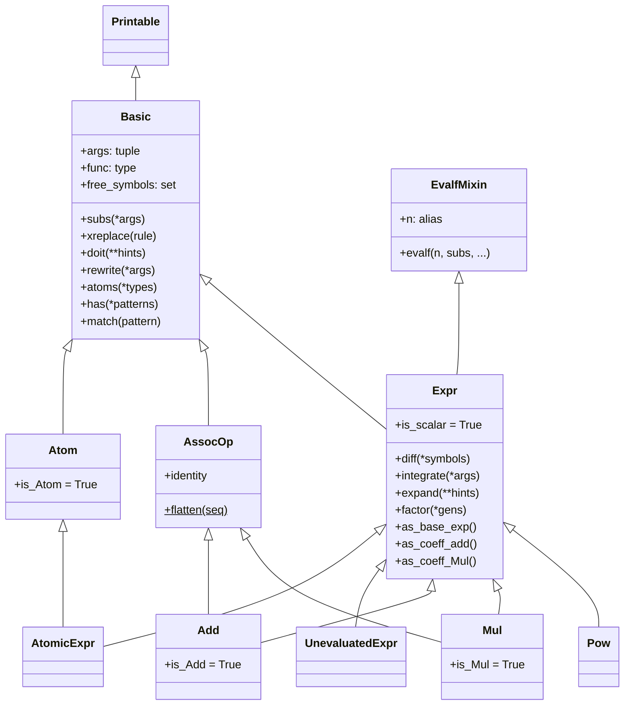
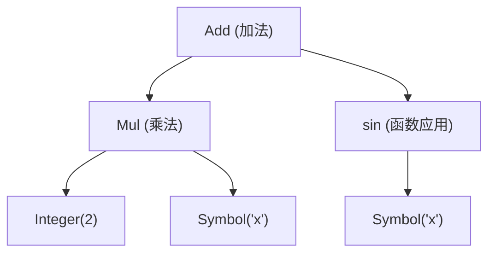

# 表达式树模型

SymPy 的核心数据模型是**不可变表达式树（Immutable Expression Tree）**。每个 SymPy 对象都是一棵树：内部节点表示数学运算（加法、乘法、幂运算、函数应用等），叶子节点表示符号、数字和常量。理解表达式树是掌握 SymPy 的基础——所有高级功能（化简、求导、积分、求解）都是树遍历和变换。[^F-072]

## 不可变性

所有 SymPy 表达式都是**不可变对象（Immutable）**。一旦创建，其内部状态不可修改。任何"修改"操作实际上是创建新的表达式对象。不可变性带来三个关键优势：[^F-001]

1. **哈希可缓存**：`__hash__` 首次计算后缓存于 `_mhash`，字典和集合中安全使用
2. **结构共享**：子表达式可在多处共享引用，无意外修改风险
3. **回溯安全**：变换失败时原始对象完好，无需深拷贝

```python
>>> from sympy import symbols
>>> x, y = symbols('x y')
>>> expr = x + y
>>> expr2 = expr.subs(x, 1)
>>> expr       # 原表达式不变
x + y
>>> expr2      # 返回新表达式
y + 1
>>> expr is expr2
False
```

## 类继承层次

表达式树的类型系统以 `Basic` 为根，通过多层继承构建：[^F-072]



核心继承链：
- **树结构层**：`Printable → Basic` 定义树的基本协议（args/func/遍历/替换）
- **代数层**：`Basic → Expr`（混入 `EvalfMixin`）增加微积分、代数变换、数值求值
- **叶子层**：`Basic → Atom → AtomicExpr → Symbol/Number/NumberSymbol` 标记无内部子节点
- **运算层**：`Basic → AssocOp → Add/Mul` 实现结合律运算的扁平化框架

## args 与 func：树的重构恒等式

每个 SymPy 对象都有两个核心属性：[^F-004] [^F-005]

- **`args`**：返回子节点元组 `tuple[Basic, ...]`，是表达式树的直接子表达式
- **`func`**：返回对象的类（`self.__class__`），用于重建同类型节点

两者共同满足**重构恒等式**：

```
x == x.func(*x.args)
```

即：任何表达式都可以通过取出其 `func`（类）和 `args`（子节点），再用 `func(*args)` 重建出等价的表达式。这是 SymPy 所有树遍历和变换的基础。

```python
>>> from sympy import sin, symbols
>>> x = symbols('x')
>>> expr = sin(x) + 1
>>> expr.func
<class 'sympy.core.add.Add'>
>>> expr.args
(1, sin(x))
>>> expr.func(*expr.args) == expr   # 重构恒等式
True

# 递归查看子节点结构
>>> expr.args[1].func               # sin(x) 的类
sin
>>> expr.args[1].args               # sin(x) 的子节点
(x,)
>>> expr.args[0].func               # 1 的类
<class 'sympy.core.numbers.One'>
>>> expr.args[0].args               # 叶子节点无 args
()
```

## 树的可视化

### 用 srepr 查看完整结构

`srepr()` 函数输出表达式的规范表示，以嵌套函数调用形式展示完整树结构：

```python
>>> from sympy import srepr, symbols, sin
>>> x = symbols('x')
>>> expr = 2*x + sin(x)
>>> srepr(expr)
"Add(Mul(Integer(2), Symbol('x')), sin(Symbol('x')))"
```

对应的表达式树结构：



### 用 print_tree 打印树

`sympy.printing.print_tree()` 提供文本树状输出：

```python
>>> from sympy import print_tree
>>> print_tree(2*x + sin(x))
# 可在终端显示树状层次
```

## 内部节点类型

### Add（加法）

`Add` 继承自 `Expr` 和 `AssocOp`，表示加法运算。构造时自动扁平化同类项、合并系数：[^F-037] [^F-042]

```python
>>> from sympy import Add, symbols
>>> x, y = symbols('x y')
>>> Add(x, x, y)           # 自动合并：2*x + y
2*x + y
>>> Add(x, x, y, evaluate=False)  # 不求值，保持原始结构
x + x + y
```

Add 的 `args` 按规范序排列，数字系数在前：

```python
>>> (3*x + 2*y + 1).args
(1, 3*x, 2*y)
```

### Mul（乘法）

`Mul` 继承自 `Expr` 和 `AssocOp`，表示乘法运算。同样自动扁平化和提取系数：[^F-039]

```python
>>> from sympy import Mul
>>> Mul(x, x, y)           # x**2*y
x**2*y
>>> Mul(2, x, evaluate=False)
2*x  # 注意：Mul 仍会执行部分简化
```

### Pow（幂运算）

`Pow` 表示幂运算 `base**exp`，不继承 `AssocOp`（幂运算不满足结合律）：

```python
>>> from sympy import Pow
>>> Pow(x, 2)              # x**2
x**2
>>> (x**2).args
(x, 2)
>>> (x**2).func
<class 'sympy.core.power.Pow'>
```

通过 `as_base_exp()` 方法分解幂运算的底数和指数：[^F-020]

```python
>>> (x**2).as_base_exp()
(x, 2)
```

## 叶子节点类型

叶子节点通过 `Atom` 基类标记。`Atom` 重写了以下方法以符合叶子语义：[^F-013]

| 方法 | 行为 |
|------|------|
| `matches()` | 返回 `self`（无内部结构可匹配） |
| `xreplace()` | 返回 `self`（无内部节点可替换） |
| `doit()` | 返回 `self`（叶子无需求值） |
| `args` | 返回空元组 `()` |

```python
>>> from sympy import Integer, Symbol
>>> Integer(5).args
()
>>> Symbol('x').args
()
>>> Integer(5).is_Atom
True
```

主要叶子类型：
- **Symbol/Dummy/Wild**：符号变量（详见 [02-symbols-numbers](02-symbols-numbers.md)）
- **Integer/Rational/Float**：数字常量（详见 [02-symbols-numbers](02-symbols-numbers.md)）
- **NumberSymbol 子类**：π、e、i 等数学常量（详见 [02-symbols-numbers](02-symbols-numbers.md)）

## 表达式遍历

SymPy 提供两种树遍历策略和多种工具函数：[^F-063] [^F-064]

### 前序遍历（preorder）

前序遍历按照"根→左→右"的顺序访问节点，即先访问当前节点，再递归遍历子节点：

```python
>>> from sympy import symbols, sin
>>> from sympy.core.traversal import preorder_traversal
>>> x, y = symbols('x y')
>>> expr = x + sin(y)
>>> [node for node in preorder_traversal(expr)]
[x + sin(y), x, sin(y), y]
```

遍历顺序：先 `x + sin(y)`（根），再 `x`（第一个子节点），再 `sin(y)`（第二个子节点），最后 `y`（sin(y) 的子节点）。

### 后序遍历（postorder）

后序遍历按照"左→右→根"的顺序访问节点，即先遍历完所有子节点再访问当前节点：

```python
>>> from sympy.core.traversal import postorder_traversal
>>> [node for node in postorder_traversal(x + sin(y))]
[x, y, sin(y), x + sin(y)]
```

后序遍历在需要自底向上替换/化简时非常有用——子节点先于父节点处理。

### 其他遍历工具

| 工具 | 功能 |
|------|------|
| `iterargs(expr)` | 迭代表达式的直接参数（仅一层） |
| `iterfreeargs(expr)` | 迭代自由参数（跳过绑定变量如积分变量） |
| `bottom_up(rv, F)` | 自底向上应用函数 F |
| `use(expr, func, level)` | 在指定层级应用函数 |
| `walk(e, *target)` | 遍历并匹配目标类型 |

## 表达式操作方法

### subs：替换

`subs()` 是最常用的表达式操作方法，支持三种调用形式：[^F-006]

| 调用形式 | 示例 | 说明 |
|----------|------|------|
| 两个位置参数 | `expr.subs(x, y)` | 将 `x` 替换为 `y` |
| 字典参数 | `expr.subs({x: 1, y: 2})` | 批量替换 |
| 可迭代参数对 | `expr.subs([(x, 1), (y, 2)])` | 按序替换 |

**顺序替换 vs 同时替换**：默认按顺序替换，可能导致后续替换影响前面的结果；使用 `simultaneous=True` 可实现同时替换：

```python
>>> from sympy import symbols
>>> x, y = symbols('x y')
>>> (x + y).subs({x: y, y: x})              # 顺序替换：x→y后y→x → 2*x
2*x
>>> (x + y).subs({x: y, y: x}, simultaneous=True)  # 同时替换：交换
x + y
```

`subs` 是**语义级替换**，它理解数学结构（如会处理导数中的变量、积分中的绑定变量等），而不仅是树节点的机械替换。

### xreplace：精确节点替换

`xreplace(rule)` 执行**精确节点匹配替换**——仅当节点与字典键完全相等（`==`）时才替换，不区分自由变量与约束变量，不做模式匹配，不做任何数学理解：[^F-007]

```python
>>> from sympy import symbols
>>> x, y = symbols('x y')
>>> (1 + x*y).xreplace({x: y})    # x 被精确替换为 y
y**2 + 1
>>> (1 + x*y).xreplace({x*y: 1})  # x*y 作为子表达式匹配
2
```

**subs vs xreplace 对比**：

| 特性 | subs | xreplace |
|------|------|----------|
| 替换策略 | 语义级（理解数学结构） | 语法级（精确节点匹配） |
| 绑定变量处理 | 跳过绑定变量 | 不区分，所有匹配节点替换 |
| 模式匹配 | 支持代数等价匹配 | 仅 `==` 精确匹配 |
| 适用场景 | 常规数学替换 | 精确控制树结构变换 |

### replace：通用子表达式替换

`replace(query, value, ...)` 是更灵活的通用替换方法，支持类型匹配、模式匹配、函数查询等：

```python
>>> from sympy import symbols, sin, cos, Wild
>>> x = symbols('x')
>>> # 类型替换：将所有 sin 替换为 cos
>>> (sin(x) + sin(2*x)).replace(sin, cos)
cos(x) + cos(2*x)
```

### doit：求值

`doit(**hints)` 递归求值默认保持不求值形式的对象：[^F-008]

```python
>>> from sympy import Integral, Sum, symbols
>>> x = symbols('x')
>>> i = Integral(x**2, x)
>>> i               # 不求值形式
Integral(x**2, x)
>>> i.doit()        # 执行积分求值
x**3/3
```

常见被 `doit()` 求值的类型：`Integral`、`Sum`、`Product`、`Limit`、`Derivative`、`Subs`。使用 `deep=False` 可仅求值当前层而不递归深入子表达式。

### rewrite：重写

`rewrite(*args, deep=True)` 将表达式重写为目标函数的形式，通过调用目标类型的 `_eval_rewrite_as_*()` 钩子方法实现转换：[^F-009]

```python
>>> from sympy import sin, cos, exp, I, tan
>>> x = symbols('x')
>>> sin(x).rewrite(exp)           # 三角函数 → 复指数
-I*(exp(I*x) - exp(-I*x))/2
>>> sin(x).rewrite(cos)           # sin → cos
cos(x - pi/2)
>>> tan(x).rewrite(sin)           # tan → sin
2*sin(x)**2/sin(2*x)
```

rewrite 支持链式调用：`expr.rewrite(exp).rewrite(cos)`。

## 常用查询方法

### atoms：查找叶子节点

`atoms(*types)` 返回表达式中指定类型的所有叶子节点集合：[^F-011]

```python
>>> from sympy import symbols, Number, NumberSymbol
>>> x, y = symbols('x y')
>>> expr = x + 2*y + pi
>>> expr.atoms(Symbol)            # 所有符号
{x, y}
>>> expr.atoms(Number)            # 所有数字
{2}
>>> expr.atoms(NumberSymbol)      # 数字常量
{pi}
>>> expr.atoms()                  # 无参数：所有原子类型
{2, pi, x, y}
```

### free_symbols：自由符号集

`free_symbols` 属性返回表达式中所有**自由符号**（非绑定变量）的集合：[^F-011]

```python
>>> from sympy import Integral, symbols
>>> x, y = symbols('x y')
>>> (x**2 + y).free_symbols
{x, y}
>>> Integral(x, (x, 0, 1)).free_symbols  # 积分变量 x 是绑定变量，不出现
set()
```

### has：检测包含

`has(*patterns)` 检测表达式是否包含指定模式：

```python
>>> from sympy import sin
>>> (x + sin(y)).has(sin)
True
>>> (x + y).has(sin)
False
```

## 规范序与 ordering_of_classes

SymPy 使用**规范序（Canonical Ordering）** 确保数学等价的表达式具有相同的表示形式，这对于 `==` 比较和哈希至关重要。模块级列表 `ordering_of_classes` 定义了交换律运算中参数的排序优先级（从高到低）：[^F-016]

1. 单例数字（Zero/One/NegativeOne/Half）
2. 数字常量（pi, E, 等）
3. 单例符号（如 I）
4. 普通符号（x, y, z）
5. Pow（幂运算）
6. Mul（乘法）
7. Add（加法）
8. 函数值（sin(x), cos(x)）
9. 定义的单例函数
10. 未定义函数（f(x)）
11. Lambda
12. Order
13. 关系运算

```python
>>> from sympy import symbols, sin
>>> x, y = symbols('x y')
>>> y + x           # 自动排序：x 在 y 前
x + y
>>> 1 + x           # 数字在前
x + 1
```

## UnevaluatedExpr：保持不求值

`UnevaluatedExpr` 用于包装表达式以阻止自动求值/化简：[^F-022]

```python
>>> from sympy import UnevaluatedExpr, Mul, symbols
>>> x = symbols('x')
>>> Mul(2, UnevaluatedExpr(x + 1))
2*(x + 1)
>>> _.doit()        # doit() 时展开
2*x + 2
```

这在需要精确控制求值时机或展示中间步骤时非常有用。

## __slots__ 与内存布局

`Basic` 使用 `__slots__ = ('_mhash', '_args', '_assumptions')` 限制实例属性，带来更好的内存效率和访问速度：[^F-001]

| 槽位 | 类型 | 用途 |
|------|------|------|
| `_mhash` | `int \| None` | 缓存哈希值 |
| `_args` | `tuple[Basic, ...]` | 子节点元组 |
| `_assumptions` | `StdFactKB` | 假设状态字典 |

外部代码**必须**通过 `.args` 属性访问子节点，禁止直接使用 `._args`。[^F-004]

## 代码示例：递归遍历表达式树

利用 args/func 重构恒等式，可以递归遍历任意表达式树：

```python
>>> from sympy import Basic, symbols, sin
>>> x, y = symbols('x y')
>>> expr = x*y + sin(x)

>>> def walk_tree(node, depth=0):
...     """前序遍历打印树结构"""
...     indent = "  " * depth
...     print(f"{indent}{type(node).__name__}: {node}")
...     for arg in node.args:
...         walk_tree(arg, depth + 1)

>>> walk_tree(expr)
# Add: x*y + sin(x)
#   Mul: x*y
#     Symbol: x
#     Symbol: y
#   sin: sin(x)
#     Symbol: x
```

## is_* 类型检查属性

`Basic` 在类级别声明了一组 `is_*` 布尔属性，用于类型检查和数学属性查询：[^F-012]

- **类型标记**：`is_Atom`、`is_Symbol`、`is_Number`、`is_Add`、`is_Mul`、`is_Pow`、`is_Function`
- **数学属性**（三值逻辑：True/False/None）：`is_integer`、`is_real`、`is_positive`、`is_zero`、`is_rational`、`is_commutative` 等

```python
>>> from sympy import Integer, Symbol
>>> Integer(5).is_Integer
True
>>> Integer(5).is_positive
True
>>> x = Symbol('x')
>>> x.is_integer        # 无假设时返回 None（不确定）
>>> x = Symbol('x', integer=True)
>>> x.is_integer
True
```

## 延伸阅读

- 源码信源：[basic-source](../references/basic-source.md) 提供 `Basic`/`Expr`/`Atom`/`AssocOp` 的完整 API 参考
- 后续概念：[符号与数值系统](02-symbols-numbers.md) 介绍叶子节点的具体类型
- 后续概念：[sympify与类型转换](03-sympify-basics.md) 介绍如何将 Python 对象转换为表达式树节点

[^F-001]: facts.md F-001 — Basic 类定义、继承与 __slots__
[^F-004]: facts.md F-004 — args 属性
[^F-005]: facts.md F-005 — func 属性
[^F-006]: facts.md F-006 — subs 方法三种调用形式
[^F-007]: facts.md F-007 — xreplace 方法
[^F-008]: facts.md F-008 — doit 方法
[^F-009]: facts.md F-009 — rewrite 方法
[^F-011]: facts.md F-011 — Basic 公开方法清单
[^F-012]: facts.md F-012 — is_* 类型检查属性
[^F-013]: facts.md F-013 — Atom 类定义与重写方法
[^F-016]: facts.md F-016 — ordering_of_classes 排序优先级
[^F-020]: facts.md F-020 — Expr 结构分解方法
[^F-022]: facts.md F-022 — UnevaluatedExpr 类
[^F-037]: facts.md F-037 — Add 类
[^F-039]: facts.md F-039 — Mul 类
[^F-042]: facts.md F-042 — AssocOp 类
[^F-063]: facts.md F-063 — preorder_traversal
[^F-064]: facts.md F-064 — 遍历工具函数
[^F-072]: facts.md F-072 — 核心类继承链
