# 函数体系

SymPy 的 `functions` 模块是数学函数的统一入口，按功能分为三大子模块：`elementary`（初等函数）、`special`（特殊函数）、`combinatorial`（组合函数）。所有具体函数类均继承自 `Function` 基类（→ `Application` → `Expr` → `Basic`），通过 `@classmethod eval()` 实现特殊值自动求值，通过 `_eval_rewrite_as_<target>()` 支持函数间重写，通过 `_eval_expand_<hint>()` 支持展开变换。[^F-088]

## 模块架构

```mermaid
flowchart TD
    F["functions/__init__.py"] --> ELEM["elementary/ 初等函数"]
    F --> SPEC["special/ 特殊函数"]
    F --> COMB["combinatorial/ 组合函数"]

    ELEM --> TRIG["trigonometric.py<br/>sin/cos/tan/..."]
    ELEM --> EXP["exponential.py<br/>exp/log/LambertW"]
    ELEM --> HYP["hyperbolic.py<br/>sinh/cosh/tanh/..."]
    ELEM --> CPLX["complexes.py<br/>re/im/Abs/sign/..."]
    ELEM --> INT["integers.py<br/>floor/ceiling/frac"]
    ELEM --> MISC["miscellaneous.py<br/>sqrt/Min/Max/..."]
    ELEM --> PW["piecewise.py<br/>Piecewise"]

    SPEC --> ERR["error_functions.py<br/>erf/Ei/Si/Ci"]
    SPEC --> GAM["gamma_functions.py<br/>gamma/digamma/..."]
    SPEC --> BES["bessel.py<br/>besselj/bessely/..."]
    SPEC --> ZET["zeta_functions.py<br/>zeta/polylog/..."]
    SPEC --> HYP2["hyper.py<br/>hyper/meijerg"]
    SPEC --> POLY2["polynomials.py<br/>legendre/hermite/..."]

    COMB --> FAC["factorials.py<br/>factorial/binomial/..."]
    COMB --> NUM["numbers.py<br/>fibonacci/bernoulli/..."]
```



## 函数类核心机制

所有 SymPy 数学函数共享五套核心机制（以 `sin` 为例）：[^F-050] [^F-009]

```python
>>> from sympy import sin, cos, exp, pi, I, expand_trig, diff
>>> from sympy.abc import x

# 1. eval：特殊值自动求值（类方法）
>>> sin(0)                     # → 0
0
>>> sin(pi/2)                  # → 1
1

# 2. rewrite：函数间重写
>>> sin(x).rewrite(exp)        # → 复指数形式
-I*(exp(I*x) - exp(-I*x))/2
>>> sin(x).rewrite(cos)        # → 余弦形式
cos(x - pi/2)

# 3. expand：展开变换
>>> expand_trig(sin(2*x))      # → 三角展开
2*sin(x)*cos(x)

# 4. diff：求导
>>> sin(x).diff(x)
cos(x)

# 5. series：级数展开
>>> sin(x).series(x, 0, 6)
x - x**3/6 + x**5/120 + O(x**6)
```

每个具体函数类通过定义以下钩子方法参与上述机制：

| 钩子方法 | 用途 |
|----------|------|
| `@classmethod eval(cls, *args)` | 特殊值自动求值 |
| `_eval_rewrite_as_<rulename>(self, *args)` | 定义重写规则（如 `_eval_rewrite_as_exp`） |
| `_eval_expand_<hint>(self, **hints)` | 定义展开规则（如 `_eval_expand_trig`） |
| `_eval_derivative(s)` | 定义导数 |
| `_eval_nseries(x, n, ...)` | 定义级数展开 |
| `fdiff(argindex)` | 形式导数（用于链式法则） |

---

## 一、初等函数（elementary/）

初等函数是数学分析中最基本的函数类，包括三角函数、指数对数函数、双曲函数、复数函数、取整函数、根号/极值函数和分段函数。[^F-089]

### 1.1 三角函数（trigonometric.py）

三角函数全部继承自 `TrigonometricFunction` 基类，每个函数都有对应的反函数：[^F-089]

| 函数 | 名称 | 反函数 | 说明 |
|------|------|--------|------|
| `sin` | 正弦 | `asin` | sin(0)=0, sin(π/2)=1 |
| `cos` | 余弦 | `acos` | cos(0)=1, cos(π/2)=0 |
| `tan` | 正切 | `atan` | tan = sin/cos |
| `cot` | 余切 | `acot` | cot = cos/sin = 1/tan |
| `sec` | 正割 | `asec` | sec = 1/cos |
| `csc` | 余割 | `acsc` | csc = 1/sin |
| `sinc` | 辛格函数 | — | sinc(x) = sin(x)/x，sinc(0)=1 |
| `atan2` | 二参数反正切 | — | atan2(y,x) 返回极角 |

```python
>>> from sympy import sin, cos, tan, cot, sec, csc, sinc
>>> from sympy import asin, acos, atan, acot, asec, acsc, atan2
>>> from sympy import pi, Rational, sqrt
>>> from sympy.abc import x

>>> sin(pi/6)                   # 特殊值
1/2
>>> cos(pi/4)
sqrt(2)/2
>>> tan(pi/3)
sqrt(3)
>>> sinc(0)                     # 极限值
1
>>> asin(Rational(1,2))         # 反三角特殊值
pi/6
>>> atan2(1, 0)                 # 极角
pi/2

# 重写为复指数
>>> sin(x).rewrite(exp)
-I*(exp(I*x) - exp(-I*x))/2
```

### 1.2 指数与对数函数（exponential.py）

| 函数 | 数学记号 | 说明 |
|------|----------|------|
| `exp` | eˣ | 自然指数函数 |
| `log` / `ln` | ln x | 自然对数（`ln` 是 `log` 别名） |
| `LambertW` | W(z) | Lambert W 函数：W(z)·e^{W(z)} = z |

```python
>>> from sympy import exp, log, ln, LambertW, E, S
>>> from sympy.abc import x

>>> exp(0)
1
>>> exp(1)                      # = E
E
>>> log(1)
0
>>> log(E)
1
>>> log(100, 10)                # 以 10 为底
2
>>> LambertW(0)
0
>>> LambertW(E)                 # W(e) = 1
1
```

> **注意**：`E`（自然对数底）不是 Function 子类，而是 `NumberSymbol` 常量（`S.Exp1`），定义在 `core/numbers.py`。

### 1.3 双曲函数（hyperbolic.py）

双曲函数通过复指数定义，与三角函数有密切类比关系，全部继承自 `HyperbolicFunction` 基类：[^F-089]

| 函数 | 数学记号 | 反函数 |
|------|----------|--------|
| `sinh` | sinh x | `asinh` |
| `cosh` | cosh x | `acosh` |
| `tanh` | tanh x | `atanh` |
| `coth` | coth x | `acoth` |
| `sech` | sech x | `asech` |
| `csch` | csch x | `acsch` |

```python
>>> from sympy import sinh, cosh, tanh, simplify, I
>>> from sympy.abc import x

>>> sinh(x).rewrite(exp)        # 指数形式
(exp(x) - exp(-x))/2
>>> simplify(cosh(x)**2 - sinh(x)**2)  # 恒等式
1

# 与三角函数的关系（欧拉公式）
>>> sinh(I*x)
I*sin(x)
>>> cosh(I*x)
cos(x)
```

### 1.4 复数函数（complexes.py）

复数相关函数用于操作复数的实部、虚部、模、辐角：[^F-090]

| 函数 | 说明 |
|------|------|
| `re` | 取实部 |
| `im` | 取虚部 |
| `Abs` | 绝对值/模 |
| `sign` | 符号函数（z/|z|） |
| `arg` | 辐角（主值） |
| `conjugate` | 复共轭 |
| `polar_lift` | 提升到极坐标表示 |
| `adjoint` | 伴随（共轭转置） |
| `transpose` | 转置 |

```python
>>> from sympy import re, im, sign, Abs, arg, conjugate, I, pi
>>> x, y = symbols('x y', real=True)
>>> z = x + I*y

>>> re(z)
x
>>> im(z)
y
>>> Abs(z)
sqrt(x**2 + y**2)
>>> conjugate(z)
x - I*y
>>> arg(1 + I)                  # 辐角
pi/4
>>> sign(1 + I)                 # 符号函数
(1 + I)/sqrt(2)
```

### 1.5 取整函数（integers.py）

| 函数 | 说明 |
|------|------|
| `floor` | 向下取整（⌊x⌋） |
| `ceiling` | 向上取整（⌈x⌉） |
| `frac` | 小数部分（x - floor(x)） |

```python
>>> from sympy import floor, ceiling, frac, Rational, pi
>>> from sympy.abc import x

>>> floor(Rational(7, 3))       # ⌊7/3⌋ = 2
2
>>> ceiling(Rational(7, 3))     # ⌈7/3⌉ = 3
3
>>> frac(Rational(7, 3))        # {7/3} = 1/3
1/3
>>> floor(pi)                   # ⌊π⌋ = 3
3
>>> floor(-Rational(1,2))       # ⌊-1/2⌋ = -1
-1
```

### 1.6 杂项初等函数（miscellaneous.py）

| 函数 | 说明 |
|------|------|
| `sqrt` | 平方根 (√x) |
| `root` | n 次方根 |
| `cbrt` | 立方根 |
| `Min` | 最小值 |
| `Max` | 最大值 |
| `Id` | 恒等函数 |
| `Rem` | 取余 |

```python
>>> from sympy import sqrt, root, cbrt, Min, Max, symbols
>>> x = symbols('x', positive=True)

>>> sqrt(4)
2
>>> sqrt(-1)
I
>>> cbrt(8)
2
>>> root(16, 4)
2
>>> Min(2, 5, 1)
1
>>> Max(2, 5, 1)
5
>>> sqrt(x**2)                  # 在 positive 假设下自动化简
x
```

### 1.7 分段函数（piecewise.py）

`Piecewise` 是表示分段定义函数的核心类，是处理绝对值、符号函数、分段连续函数等的基础工具：[^F-091]

```python
>>> from sympy import Piecewise, symbols
>>> x = symbols('x')

# 定义绝对值函数
>>> abs_expr = Piecewise((-x, x < 0), (x, True))
>>> abs_expr
Piecewise((-x, x < 0), (x, True))
>>> abs_expr.subs(x, -3)
3
>>> abs_expr.subs(x, 5)
5

# 分段求导
>>> abs_expr.diff(x)
Piecewise((-1, x < 0), (1, x > 0))
```

`Piecewise` 的参数是 `(expr, condition)` 元组，按顺序求值，第一个满足条件的分支生效。`True` 作为条件表示"否则"（else）。

```python
# 更复杂的分段函数
>>> f = Piecewise(
...     (0, x < 0),
...     (x**2, (x >= 0) & (x < 1)),
...     (1, x >= 1)
... )
>>> f.subs(x, -1)
0
>>> f.subs(x, Rational(1,2))
1/4
>>> f.subs(x, 2)
1
```

`piecewise_fold` 函数将嵌套的 Piecewise 展开为单层结构。

---

## 二、特殊函数（special/）

特殊函数在物理、工程、统计、数论等领域有重要应用，通常定义为积分、级数或微分方程的解。SymPy 的 `special` 子模块提供了丰富的特殊函数实现。[^F-092]

### 2.1 误差函数与指数积分（error_functions.py）

误差函数族在概率论（正态分布）和热传导方程中有核心地位：

| 函数 | 数学记号 | 说明 |
|------|----------|------|
| `erf` | erf(z) | 误差函数：erf(z) = (2/√π)∫₀ᶻ e^{-t²}dt |
| `erfc` | erfc(z) | 互补误差函数：1 - erf(z) |
| `erfi` | erfi(z) | 虚误差函数：-i·erf(iz) |
| `Ei` | Ei(z) | 指数积分 |
| `Si` / `Ci` | Si(z) / Ci(z) | 正弦/余弦积分 |
| `li` / `Li` | li(z) / Li(z) | 对数积分 |
| `fresnels` / `fresnelc` | S(z) / C(z) | 菲涅尔积分 |

```python
>>> from sympy import erf, erfc, Ei, Si, oo, Symbol
>>> x = Symbol('x')

>>> erf(0)                      # 特殊值
0
>>> erf(oo)                     # lim_{z→∞} erf(z) = 1
1
>>> erfc(0)
1
>>> Ei(0)
-oo
>>> Si(0)
0
```

### 2.2 Gamma 与 Beta 函数（gamma_functions.py, beta_functions.py）

Gamma 函数是阶乘在实数域的推广，连接离散与连续数学：[^F-092] [^F-093]

| 函数 | 数学记号 | 说明 |
|------|----------|------|
| `gamma` | Γ(z) | Gamma 函数：Γ(n) = (n-1)! |
| `loggamma` | log Γ(z) | 对数 Gamma 函数 |
| `digamma` | ψ(z) | Digamma 函数（Γ′/Γ） |
| `trigamma` | ψ¹(z) | Trigamma 函数 |
| `polygamma` | ψ⁽ⁿ⁾(z) | 多伽马函数 |
| `beta` | B(a,b) | Beta 函数：B(a,b) = Γ(a)Γ(b)/Γ(a+b) |
| `lowergamma` | γ(s,x) | 下不完全 Gamma |
| `uppergamma` | Γ(s,x) | 上不完全 Gamma |

```python
>>> from sympy import gamma, digamma, beta, loggamma, Rational, factorial
>>> from sympy.abc import x, n

>>> gamma(1)
1
>>> gamma(5)                    # Γ(5) = 4! = 24
24
>>> gamma(Rational(1,2))        # Γ(1/2) = √π
sqrt(pi)
>>> beta(1, 1)
1
>>> beta(Rational(1,2), Rational(1,2))  # B(1/2,1/2) = π
pi
>>> digamma(1)                  # ψ(1) = -γ
-EulerGamma
>>> gamma(x+1).rewrite(factorial)  # Γ(x+1) = x!
factorial(x)
```

### 2.3 Bessel 函数（bessel.py）

Bessel 函数是柱坐标 Helmholtz 方程的解，广泛用于波动、热传导、电磁学：

| 函数 | 说明 |
|------|------|
| `besselj` | 第一类 Bessel 函数 Jᵥ(z) |
| `bessely` | 第二类 Bessel 函数 Yᵥ(z) |
| `besseli` | 第一类修正 Bessel 函数 Iᵥ(z) |
| `besselk` | 第二类修正 Bessel 函数 Kᵥ(z) |
| `hankel1` / `hankel2` | 第一/二类 Hankel 函数 |
| `jn` / `yn` | 球 Bessel 函数 |
| `airyai` / `airybi` | Airy 函数 |

```python
>>> from sympy import besselj, bessely, airyai, diff, simplify
>>> from sympy.abc import x, n

>>> besselj(0, 0)               # J₀(0) = 1
1
>>> besselj(1, 0)               # J₁(0) = 0
0

# Bessel 微分方程验证：x²J'' + xJ' + (x²-n²)J = 0
>>> J = besselj(n, x)
>>> eq = x**2*diff(J, x, 2) + x*diff(J, x) + (x**2 - n**2)*J
>>> from sympy import besselsimp
>>> besselsimp(eq)
0
```

### 2.4 Zeta 函数与多重对数（zeta_functions.py）

Zeta 函数族在数论（素数分布）和量子场论中有核心地位：

| 函数 | 数学记号 | 说明 |
|------|----------|------|
| `zeta` | ζ(s) | Riemann zeta 函数 |
| `dirichlet_eta` | η(s) | Dirichlet eta 函数（交错 zeta） |
| `polylog` | Liₛ(z) | 多重对数函数 |
| `lerchphi` | Φ(z,s,a) | Lerch 超越函数 |
| `stieltjes` | γₙ | Stieltjes 常数 |

```python
>>> from sympy import zeta, dirichlet_eta, polylog, stieltjes, pi, Rational

>>> zeta(2)                     # ζ(2) = π²/6
pi**2/6
>>> zeta(4)                     # ζ(4) = π⁴/90
pi**4/90
>>> dirichlet_eta(1)            # η(1) = ln 2
log(2)
>>> polylog(1, Rational(1,2))   # Li₁(1/2) = ln 2
log(2)
>>> stieltjes(0)                # γ₀ = EulerGamma
EulerGamma
```

### 2.5 超几何函数（hyper.py）

超几何函数 pFq 是一大类特殊函数的统一表示——许多初等函数和特殊函数都是超几何函数的特例：

| 函数 | 说明 |
|------|------|
| `hyper` | 广义超几何函数 pFq |
| `meijerg` | Meijer G 函数 G^{m,n}_{p,q} |
| `appellf1` | Appell F₁（双变量超几何） |
| `hyperexpand` | 超几何函数展开为初等/特殊函数 |

```python
>>> from sympy import hyper, hyperexpand, Rational
>>> from sympy.abc import x

# hyper([a,b], [c], x) 表示 ₂F₁(a,b;c;x)
>>> hyper([1, 1], [2], x)
hyper((1, 1), (2,), x)
>>> hyperexpand(hyper([1, 1], [2], x))
-log(1 - x)/x
```

Meijer G 函数是更广泛的推广，参数格式为 `meijerg([[a1..an],[a(n+1)..ap]],[[b1..bm],[b(m+1)..bq]], z)`。

### 2.6 正交多项式（polynomials.py）

正交多项式在特定区间上关于特定权函数正交，在逼近论、量子力学和信号处理中非常重要：[^F-092]

| 函数 | 多项式 | 正交区间 | 权函数 |
|------|--------|----------|--------|
| `legendre` | Legendre Pₙ(x) | [-1,1] | 1 |
| `assoc_legendre` | 关联 Legendre Pₙᵐ(x) | [-1,1] | — |
| `chebyshevt` | 第一类 Chebyshev Tₙ(x) | [-1,1] | 1/√(1-x²) |
| `chebyshevu` | 第二类 Chebyshev Uₙ(x) | [-1,1] | √(1-x²) |
| `hermite` | Hermite Hₙ(x) | (-∞,∞) | e^{-x²} |
| `laguerre` | Laguerre Lₙ(x) | [0,∞) | e^{-x} |
| `assoc_laguerre` | 关联 Laguerre Lₙᵅ(x) | [0,∞) | xᵅe^{-x} |
| `gegenbauer` | Gegenbauer Cₙᵅ(x) | [-1,1] | (1-x²)^{α-1/2} |
| `jacobi` | Jacobi Pₙ⁽ᵅ,ᵝ⁾(x) | [-1,1] | (1-x)ᵅ(1+x)ᵝ |

```python
>>> from sympy import legendre, chebyshevt, hermite, laguerre, Symbol
>>> x = Symbol('x')
>>> n = Symbol('n', integer=True, nonnegative=True)

>>> legendre(0, x)              # P₀ = 1
1
>>> legendre(1, x)              # P₁ = x
x
>>> legendre(2, x)              # P₂ = (3x²-1)/2
3*x**2/2 - 1/2
>>> chebyshevt(0, x)
1
>>> chebyshevt(3, x)            # T₃ = 4x³ - 3x
4*x**3 - 3*x
>>> hermite(2, x)               # H₂ = 4x² - 2
4*x**2 - 2
>>> laguerre(2, x)              # L₂ = x²/2 - 2x + 1
x**2/2 - 2*x + 1
```

### 2.7 其他重要特殊函数

| 类别 | 函数 | 说明 |
|------|------|------|
| Delta 函数 | `DiracDelta` | Dirac δ 函数 |
| | `Heaviside` | Heaviside 阶跃函数 H(x) |
| 椭圆积分 | `elliptic_k` | 第一类完全椭圆积分 K(m) |
| | `elliptic_e` | 第二类椭圆积分 |
| Mathieu | `mathieus` / `mathieuc` | Mathieu 方程周期解 |
| 球谐函数 | `Ynm` | 球谐函数 Yₙᵐ(θ,φ) |
| 张量 | `KroneckerDelta` | Kronecker δ_{ij} |
| | `LeviCivita` | Levi-Civita 符号 ε_{ijk} |
| B 样条 | `bspline_basis` | B 样条基函数 |

```python
>>> from sympy import DiracDelta, Heaviside, KroneckerDelta, integrate, oo, pi
>>> from sympy.abc import x, i, j

>>> DiracDelta(x).diff(x)        # δ 的一阶导数
DiracDelta(x, 1)
>>> integrate(DiracDelta(x), (x, -oo, oo))  # ∫δ = 1
1
>>> Heaviside(-1)
0
>>> KroneckerDelta(i, i)         # δ_{ii} = 1
1
```

---

## 三、组合函数（combinatorial/）

### 3.1 阶乘类（factorials.py）

| 函数 | 数学记号 | 说明 |
|------|----------|------|
| `factorial` | n! | 阶乘，n! = Γ(n+1) |
| `factorial2` | n‼ | 双阶乘 |
| `binomial` | C(n,k) | 二项式系数 |
| `rf` / `RisingFactorial` | x⁽ⁿ⁾ | 升阶乘 |
| `ff` / `FallingFactorial` | (x)ₙ | 降阶乘 |
| `subfactorial` | !n | 错位排列数 |

```python
>>> from sympy import factorial, factorial2, binomial, rf, ff, subfactorial, gamma
>>> from sympy.abc import x, n, k

>>> factorial(5)
120
>>> factorial(0)
1
>>> factorial2(6)                # 6‼ = 6·4·2 = 48
48
>>> binomial(5, 2)               # C(5,2) = 10
10
>>> rf(x, 3)                     # x(x+1)(x+2)
x*(x + 1)*(x + 2)
>>> ff(x, 3)                     # x(x-1)(x-2)
x*(x - 1)*(x - 2)
>>> subfactorial(3)              # !3 = 2
2
>>> factorial(x).rewrite(gamma)  # 重写为 Gamma
gamma(x + 1)
```

### 3.2 数论组合函数（numbers.py）

| 函数 | 说明 |
|------|------|
| `fibonacci` | Fibonacci 数 Fₙ |
| `lucas` | Lucas 数 Lₙ |
| `harmonic` | 调和数 Hₙ |
| `bernoulli` | Bernoulli 数 Bₙ |
| `bell` | Bell 数 Bₙ |
| `catalan` | Catalan 数 Cₙ |
| `euler` | Euler 数 Eₙ |
| `partition` | 整数分拆函数 p(n) |
| `mobius` | Möbius 函数 μ(n) |
| `totient` | Euler 总计函数 φ(n) |
| `divisor_sigma` | 除数函数 σₖ(n) |

```python
>>> from sympy import (fibonacci, lucas, harmonic, bernoulli, bell,
...                    catalan, partition, mobius, totient, divisor_sigma)

>>> fibonacci(10)                # F₁₀ = 55
55
>>> lucas(0)
2
>>> harmonic(3)                  # H₃ = 1 + 1/2 + 1/3 = 11/6
11/6
>>> bernoulli(0)
1
>>> bernoulli(1)
-1/2
>>> bernoulli(2)
1/6
>>> bell(3)                      # B₃ = 5
5
>>> catalan(3)                   # C₃ = 5
5
>>> partition(5)                 # p(5) = 7
7
>>> mobius(6)                    # μ(6) = 1（2·3 两个不同素因子）
1
>>> totient(10)                  # φ(10) = 4
4
>>> divisor_sigma(6)             # σ(6) = 1+2+3+6 = 12
12
```

---

## 四、函数操作范式

### expand 展开系列

SymPy 提供多种展开 hint，控制不同类型的展开行为：

| 展开函数 | hint 名 | 功能 |
|----------|---------|------|
| `expand(expr)` | 全部 | 默认展开 |
| `expand_mul` | `mul` | 乘法展开 |
| `expand_trig` | `trig` | 三角展开 |
| `expand_log` | `log` | 对数展开 |
| `expand_func` | `func` | 函数展开 |
| `expand_power_base` | `power_base` | 幂底数展开 |
| `expand_power_exp` | `power_exp` | 幂指数展开 |
| `expand_complex` | `complex` | 复数分离展开 |

```python
>>> from sympy import (expand, expand_trig, expand_log, sin, cos,
...                    log, exp)
>>> from sympy.abc import x, y

>>> expand((x + y)**3)           # 多项式展开
x**3 + 3*x**2*y + 3*x*y**2 + y**3
>>> expand_trig(sin(x + y))      # 三角和角展开
sin(x)*cos(y) + sin(y)*cos(x)
>>> expand_log(log(x*y), force=True)  # 对数展开
log(x) + log(y)
```

### rewrite 重写

`rewrite(target)` 将函数转换为其他表示形式，在化简和积分中常用：

```python
>>> from sympy import sin, cos, tan, exp, tanh, I
>>> from sympy.abc import x

# 三角函数 ↔ 复指数
>>> sin(x).rewrite(exp)
-I*(exp(I*x) - exp(-I*x))/2
>>> cos(x).rewrite(exp)
exp(I*x)/2 + exp(-I*x)/2

# 三角函数 ↔ 其他三角
>>> tan(x).rewrite(sin)
2*sin(x)**2/sin(2*x)

# 双曲 ↔ 指数
>>> tanh(x).rewrite(exp)
(exp(x) - exp(-x))/(exp(x) + exp(-x))
```

### 链式组合

rewrite 和 expand 可以链式组合，完成复杂变换：

```python
>>> from sympy import sin, expand_trig, simplify
>>> from sympy.abc import x

>>> expr = sin(2*x).rewrite(exp).expand()
>>> # sin(2x) → 复指数 → 展开
>>> simplify(expr)               # 化简回来
sin(2*x)
```

## 延伸阅读

- 前置概念：[sympify与类型转换](03-sympify-basics.md) 了解 Function 类和 AppliedUndef 的构造机制
- 前置概念：[表达式树模型](01-expression-tree.md) 了解函数应用作为树节点的结构
- 源码信源：[functions-source](../references/functions-source.md) 提供初等/特殊/组合函数的完整 API 参考
- 参考文档：[core-init](../references/core-init.md) 了解函数在顶层包中的导出清单

[^F-009]: facts.md F-009 — rewrite 方法机制
[^F-050]: facts.md F-050 — Function 基类
[^F-088]: facts.md F-088 — functions 模块三分区结构
[^F-089]: facts.md F-089 — 三角函数/指数/双曲函数导出
[^F-090]: facts.md F-090 — 复数/整数/杂项函数导出
[^F-091]: facts.md F-091 — Piecewise 导出
[^F-092]: facts.md F-092 — 特殊函数导出清单
[^F-093]: facts.md F-093 — Beta 函数和其他特殊函数
[^F-094]: facts.md F-094 — 组合函数导出清单
