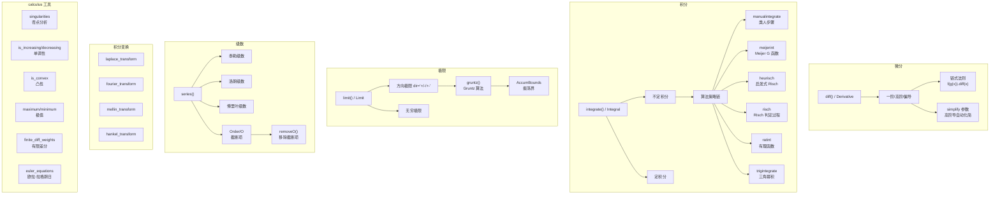

# 微积分

SymPy 的微积分系统以三类惰性对象为核心：`Derivative`（未求值微分）、`Integral`（未求值积分）、`Limit`（未求值极限），通过 `.doit()` 触发实际计算。`diff()` 提供微分入口，`integrate()` 是顶层积分入口，内部按策略链依次尝试 manualintegrate、meijerint、heurisch、risch、ratint 等算法。极限计算采用 Gruntz 算法（基于渐近级数展开）。此外，`series()` 提供泰勒/洛朗级数展开，积分变换模块支持 Laplace、Fourier、Mellin、Hankel 等变换，calculus 模块提供奇点分析、单调性判定、凸性检测、极值求解、有限差分等实用工具。[^F-054] [^F-095] [^F-096] [^F-083]

## 微积分操作总览



---

## 一、微分

### 1.1 基本求导

SymPy 提供三种求导入口：模块级函数 `diff()`、表达式方法 `Expr.diff()`、未求值类 `Derivative`。`diff()` 内部调用 `Derivative` 并默认 `evaluate=True` 触发计算。[^F-054]

```python
>>> from sympy import diff, Derivative, Function, sin, cos, exp, sqrt, symbols
>>> from sympy.abc import x, y, z
>>> f, g = symbols('f g', cls=Function)
>>>
>>> # 一阶求导
>>> diff(sin(x), x)
cos(x)
>>> sin(x).diff(x)
cos(x)
>>>
>>> # 高阶求导
>>> diff(x**4, x, 3)
24*x
>>> diff(sin(x), x, 4)
sin(x)
>>>
>>> # 混合偏导
>>> diff(sin(x)*cos(y), x, y)
-sin(y)*cos(x)
>>>
>>> # 未求值形式
>>> Derivative(sin(x), x)
Derivative(sin(x), x)
>>> diff(sin(x), x, evaluate=False)
Derivative(sin(x), x)
>>>
>>> # doit() 触发求值
>>> Derivative(sin(x), x).doit()
cos(x)
```

### 1.2 链式法则与抽象函数

对未定义的抽象函数求导时，SymPy 自动应用链式法则：

```python
>>> from sympy import Function, symbols
>>> x = symbols('x')
>>> f = Function('f')
>>> g = Function('g')
>>>
>>> # 链式法则
>>> f(g(x)).diff(x)
Derivative(f(g(x)), g(x))*Derivative(g(x), x)
>>>
>>> # 对函数本身求导（变分法）
>>> Derivative(f(x)**2, f(x), evaluate=True)
2*f(x)
>>>
>>> # 高阶导数化简控制
>>> expr = sqrt((x + 1)**2 + x)
>>> diff(expr, (x, 5), simplify=True).count_ops()
30
>>> diff(expr, (x, 5), simplify=False).count_ops()
136
```

---

## 二、积分

### 2.1 Integral 类与积分形式

`Integral` 类表示未求值的积分，支持不定积分、定积分、多重积分。积分限的解释规则：[^F-096]

| 形式 | 含义 |
|------|------|
| `Integral(f, x)` | 不定积分 ∫f(x)dx |
| `Integral(f, (x, a, b))` | 定积分 ∫ₐᵇ f(x)dx |
| `Integral(f, (x, a))` | 抽象原函数，结果中 x 替换为 a |
| `Integral(f, x, y)` | 多重不定积分 |
| `Integral(f, (x,a,b), (y,c,d))` | 多重定积分 |

```python
>>> from sympy import Integral, integrate, sin, cos, exp, oo, Rational, symbols
>>> from sympy.abc import x, y
>>>
>>> # 不定积分（未求值）
>>> Integral(x**2, x)
Integral(x**2, x)
>>> Integral(x**2, x).doit()
x**3/3
>>>
>>> # 定积分
>>> Integral(x**2, (x, 0, 1)).doit()
1/3
>>> Integral(sin(x), (x, 0, 3.14159))  # π 近似
>>>
>>> # 单自由变量自动推断
>>> Integral(x**2)
Integral(x**2, x)
>>>
>>> # 多重积分
>>> Integral(x*y, (x, 0, 1), (y, 0, 1)).doit()
1/4
```

### 2.2 integrate() 函数

`integrate()` 是顶层积分入口函数，自动处理不定积分和定积分：[^F-096]

```python
>>> from sympy import integrate, sin, cos, exp, log, oo, sqrt, pi, E, Rational
>>> from sympy.abc import x, y, a, b
>>>
>>> # === 不定积分 ===
>>> integrate(x**2, x)
x**3/3
>>> integrate(sin(x), x)
-cos(x)
>>> integrate(1/x, x)
log(x)
>>> integrate(x*exp(x), x)
(x - 1)*exp(x)
>>> integrate(exp(-x**2), x)            # 非初等积分，返回特殊函数
sqrt(pi)*erf(x)/2
>>>
>>> # === 定积分 ===
>>> integrate(x**2, (x, 0, 1))
1/3
>>> integrate(sin(x), (x, 0, pi))
2
>>> integrate(exp(-x), (x, 0, oo))      # 反常积分
1
>>> integrate(1/(1 + x**2), (x, -oo, oo))
pi
>>> integrate(sqrt(1 - x**2), (x, -1, 1))  # 半圆面积
pi/2
>>>
>>> # 带参数积分
>>> integrate(a*x + b, x)
a*x**2/2 + b*x
>>>
>>> # 不可积情况：返回未求值 Integral
>>> integrate(x**x, x)
Integral(x**x, x)
```

### 2.3 积分算法策略链

`integrate()` 内部按策略链依次尝试多种积分方法：[^F-097] [^F-098] [^F-099] [^F-100]

| 方法 | 模块 | 适用场景 | 特点 |
|------|------|----------|------|
| `manualintegrate` | manualintegrate.py | 初等函数 | 类人步骤，教学友好 |
| `meijerint` | meijerint.py | 特殊函数、无穷积分 | Meijer G 函数，处理 Bessel/Airy 等 |
| `heurisch` | heurisch.py | 初等超越函数 | 启发式 Risch-Norman，成功率高 |
| `risch_integrate` | risch.py | 初等函数判定 | 可证明不可积（决策过程） |
| `ratint` | rationaltools.py | 有理函数 | 部分分式分解，确定性 |
| `trigintegrate` | trigonometry.py | 三角函数幂积 | 三角恒等变换 |
| `singularityintegrate` | singularityfunctions.py | DiracDelta/Heaviside | 奇异函数处理 |

```python
>>> from sympy import integrate, exp, sin, log
>>> from sympy.abc import x
>>>
>>> # 强制使用特定算法
>>> integrate(x*sin(x), x, manual=True)    # 手动积分
-x*cos(x) + sin(x)
>>>
>>> # Risch 算法可证明不可积
>>> integrate(exp(-x**2), x, risch=True)
NonElementaryIntegral(exp(-x**2), x)
```

#### 核心算法简介

- **heurisch（启发式 Risch）**：将积分转化为求解未知系数的线性方程组，假设原函数是基函数的线性组合，通过待定系数法求解，成功率高但不保证完备。
- **Risch 算法**：初等函数积分的**判定过程**——要么找到初等原函数，要么**证明**不存在初等原函数。返回 `NonElementaryIntegral` 时表示已证明无初等闭式。
- **Meijer G 积分**：将被积函数表示为 Meijer G 函数，利用卷积定理计算积分，特别擅长零到无穷的定积分和特殊函数乘积。
- **manualintegrate**：模拟人类手工积分步骤（换元、分部积分、三角代换等），适用于教学场景。

---

## 三、极限

### 3.1 limit() 函数

`limit()` 使用 Gruntz 算法计算函数在某点的极限，支持方向参数：[^F-109]

```python
>>> from sympy import limit, Limit, sin, cos, exp, log, oo, Symbol
>>> x = Symbol('x')
>>>
>>> # 经典极限
>>> limit(sin(x)/x, x, 0)
1
>>> limit((1 + 1/x)**x, x, oo)
E
>>> limit((cos(x) - 1)/x**2, x, 0)
-1/2
>>>
>>> # 单侧极限
>>> limit(1/x, x, 0, dir='+')       # 右极限
oo
>>> limit(1/x, x, 0, dir='-')       # 左极限
-oo
>>>
>>> # 无穷远处极限
>>> limit(exp(-x), x, oo)
0
>>> limit(1/x, x, oo)
0
>>> limit(x/log(x), x, oo)
oo
>>>
>>> # Expr.limit() 方法
>>> sin(x).limit(x, 0)
0
```

### 3.2 Limit 类与 Gruntz 算法

`Limit` 类表示未求值的极限，通过 `.doit()` 触发计算。复杂极限使用 **Gruntz 算法**——基于级数展开的渐近分析方法，是计算趋向无穷极限的可靠方法。[^F-109]

```python
>>> from sympy import Limit, sin, AccumBounds
>>> from sympy.abc import x
>>>
>>> L = Limit(sin(x)/x, x, 0)
>>> L
Limit(sin(x)/x, x, 0)
>>> L.doit()
1
>>>
>>> # 振荡极限返回 AccumBounds
>>> limit(sin(x), x, oo)
AccumBounds(-1, 1)
```

`AccumBounds`（累积极限界）表示极限不存在时表达式的振荡区间，例如 `sin(x)` 在 `x→∞` 时振荡于 [-1, 1]。

---

## 四、级数展开

### 4.1 series() — 泰勒/洛朗级数

`series()` 计算表达式在某点处的级数展开，默认展开到 6 阶（到 O(x⁶)），返回结果包含 `Order`/`O` 项表示截断误差：[^F-110]

```python
>>> from sympy import series, sin, cos, exp, log, O
>>> from sympy.abc import x
>>>
>>> # 基本泰勒展开（Maclaurin 级数，x=0）
>>> series(sin(x), x, 0, 6)
x - x**3/6 + x**5/120 + O(x**6)
>>> series(cos(x), x, 0, 6)
1 - x**2/2 + x**4/24 + O(x**6)
>>> series(exp(x), x, 0, 5)
1 + x + x**2/2 + x**3/6 + x**4/24 + O(x**5)
>>>
>>> # 在非零点展开
>>> series(1/(1+x), x, 1, 4)
1/2 - (x - 1)/4 + (x - 1)**2/8 - (x - 1)**3/16 + O((x - 1)**4, (x, 1))
>>>
>>> # 洛朗级数（含负幂次）
>>> series(1/sin(x), x, 0, 5)
1/x + x/6 + 7*x**3/360 + O(x**4)
>>>
>>> # 对数展开
>>> series(log(1+x), x, 0, 5)
x - x**2/2 + x**3/3 - x**4/4 + O(x**5)
```

### 4.2 Order/O 与 removeO()

`Order`（别名 `O`）表示大 O 量级记号，描述函数在某点附近的渐近行为。使用 `removeO()` 移除截断项，获得截断多项式：[^F-108]

```python
>>> from sympy import series, sin, O
>>> from sympy.abc import x
>>>
>>> # 移除 O 项，获取多项式近似
>>> series(sin(x), x, 0, 6).removeO()
x**5/120 - x**3/6 + x
>>>
>>> # O 项的运算规则
>>> O(x) + O(x**2)
O(x)
>>> x + O(x**2)
x + O(x**2)
```

### 4.3 其他级数工具

| 工具 | 用途 |
|------|------|
| `fourier_series(f, (x, a, b))` | 傅里叶三角级数展开 |
| `fps(f, x)` | 形式幂级数（Formal Power Series） |
| `residue(expr, x, x0)` | 留数计算（洛朗展开 (x-x0)^{-1} 项系数） |

```python
>>> from sympy import fourier_series, fps, residue, exp, pi, factorial
>>> from sympy.abc import x
>>>
>>> # 留数
>>> residue(1/x, x, 0)
1
>>> residue(exp(x)/x**2, x, 0)
1
>>>
>>> # 傅里叶级数
>>> f = fourier_series(x**2, (x, -pi, pi))
>>> f.truncate(3)
pi**2/3 - 4*cos(x) + cos(2*x) - 4*cos(3*x)/9
```

---

## 五、积分变换

积分变换模块提供多种积分变换及其逆变换。变换函数默认返回三元组 `(结果, 收敛条件, 收敛横坐标)`，传 `noconds=True` 只返回变换结果。[^F-095]

| 变换对 | 正向函数 | 定义 |
|--------|----------|------|
| Laplace | `laplace_transform(f, t, s)` | F(s) = ∫₀^∞ f(t)e^{-st} dt |
| Fourier | `fourier_transform(f, x, k)` | F(k) = ∫ f(x)e^{-2πikx} dx |
| Mellin | `mellin_transform(f, x, s)` | F(s) = ∫₀^∞ f(x)x^{s-1} dx |
| Hankel | `hankel_transform(f, r, k, nu)` | F(k) = ∫₀^∞ r f(r) J_ν(kr) dr |
| Sine | `sine_transform(f, x, k)` | F(k) = ∫₀^∞ f(x)sin(kx) dx |
| Cosine | `cosine_transform(f, x, k)` | F(k) = ∫₀^∞ f(x)cos(kx) dx |

```python
>>> from sympy import (laplace_transform, inverse_laplace_transform,
...                    fourier_transform, mellin_transform,
...                    exp, sin, cos, DiracDelta, Heaviside, symbols)
>>> from sympy.abc import t, s, x, k, a, b
>>>
>>> # Laplace 变换
>>> laplace_transform(exp(-a*t), t, s, noconds=True)
1/(a + s)
>>> laplace_transform(Heaviside(t), t, s, noconds=True)
1/s
>>> laplace_transform(DiracDelta(t), t, s, noconds=True)
1
>>>
>>> # 逆 Laplace 变换
>>> inverse_laplace_transform(1/(s + a), s, t, noconds=True)
exp(-a*t)*Heaviside(t)
>>>
>>> # Laplace 变换：正弦函数
>>> laplace_transform(exp(-a*t)*sin(b*t), t, s, noconds=True)
b/((a + s)**2 + b**2)
>>>
>>> # Fourier 变换
>>> fourier_transform(exp(-x**2), x, k)
sqrt(pi)*exp(-pi**2*k**2)
>>>
>>> # Mellin 变换
>>> mellin_transform(exp(-x), x, s, noconds=True)
gamma(s)
```

---

## 六、calculus 实用工具

`sympy.calculus` 模块提供微积分分析实用工具。[^F-083]

### 6.1 奇点与单调性

```python
>>> from sympy.calculus import singularities, is_increasing, is_monotonic
>>> from sympy.abc import x
>>>
>>> singularities(1/(x**2 - 1), x)
{-1, 1}
>>> is_increasing(x**3, x)
True
```

### 6.2 函数分析：驻点、极值、凸性

```python
>>> from sympy.calculus.util import (stationary_points, maximum,
...                                   minimum, is_convex, periodicity)
>>> from sympy import sin, exp, pi, S
>>> from sympy.abc import x
>>>
>>> # 驻点（临界点）
>>> stationary_points(x**3 - 3*x, x, S.Reals)
{-1, 1}
>>>
>>> # 极值
>>> minimum(x**2, x, S.Reals)
0
>>> maximum(-x**2 + 4, x, S.Reals)
4
>>>
>>> # 凸性
>>> is_convex(x**2, x)
True
>>> is_convex(-x**2, x)
False
>>>
>>> # 周期性
>>> periodicity(sin(x), x)
2*pi
>>> periodicity(exp(x), x)           # 非周期函数返回 None
```

### 6.3 有限差分与欧拉-拉格朗日方程

```python
>>> from sympy.calculus import finite_diff_weights, euler_equations
>>> from sympy import Function, diff, sqrt, symbols
>>> from sympy.abc import x
>>>
>>> # 有限差分权重
>>> w = finite_diff_weights(1, [-1, 0, 1], 0)
>>> # w[1] 为一阶导中心差分权重
>>>
>>> # 欧拉-拉格朗日方程（变分法）
>>> f = Function('f')
>>> L = sqrt(1 + f(x).diff(x)**2)
>>> euler_equations(L, f(x), x)
[Eq(Derivative(f(x), (x, 2))/(Derivative(f(x), x)**2 + 1)**(3/2), 0)]
```

---

## 七、综合示例

```python
>>> from sympy import (diff, integrate, limit, laplace_transform, series,
...                    sin, cos, exp, log, sqrt, pi, oo, E,
...                    Function, Rational, S)
>>> from sympy.abc import x, t, s, a
>>>
>>> # === 微分 ===
>>> diff(sin(x)*exp(-x), x)
-exp(-x)*sin(x) + exp(-x)*cos(x)
>>>
>>> # === 积分 ===
>>> integrate(x**3 + 2*x + 1, x)
x**4/4 + x**2 + x
>>> integrate(x*exp(-x), (x, 0, oo))
1
>>>
>>> # === 极限 ===
>>> limit((1 - cos(x))/x**2, x, 0)
1/2
>>>
>>> # === 级数 ===
>>> series(exp(x), x, 0, 5)
1 + x + x**2/2 + x**3/6 + x**4/24 + O(x**5)
>>>
>>> # === Laplace 变换 ===
>>> laplace_transform(t**2, t, s, noconds=True)
2/s**3
```

## 延伸阅读

- 前置概念：[表达式化简](06-simplification.md) 了解 diff/integrate 结果的化简策略
- 前置概念：[函数体系](04-function-basics.md) 了解 _eval_derivative/_eval_nseries 钩子
- 后续概念：[方程求解](08-solvers.md) 了解 dsolve 微分方程求解
- 源码信源：[calculus-integrals-source](../references/calculus-integrals-source.md) 提供积分算法链与变换的完整 API
- 源码信源：[series-solvers-source](../references/series-solvers-source.md) 提供级数展开与极限的完整参考

[^F-054]: facts.md F-054 — Derivative 类与 diff 函数
[^F-083]: facts.md F-083 — calculus 模块导出（奇点/单调性/凸性/极值/有限差分）
[^F-095]: facts.md F-095 — integrals 模块导出与积分变换
[^F-096]: facts.md F-096 — Integral 类与 integrate 函数
[^F-097]: facts.md F-097 — heurisch 启发式 Risch 算法
[^F-098]: facts.md F-098 — Risch 算法（初等函数判定过程）
[^F-099]: facts.md F-099 — Meijer G 函数积分
[^F-100]: facts.md F-100 — manualintegrate 手动积分
[^F-107]: facts.md F-107 — series 模块导出
[^F-108]: facts.md F-108 — Order/O 量级记号
[^F-109]: facts.md F-109 — limit/Limit 与 Gruntz 算法
[^F-110]: facts.md F-110 — series() 泰勒/洛朗级数展开
