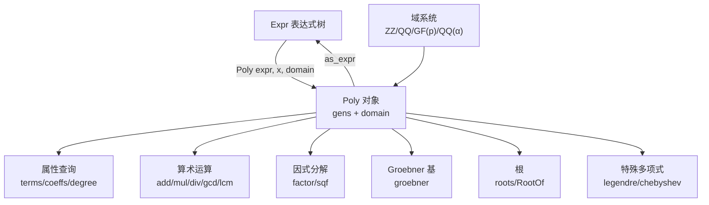
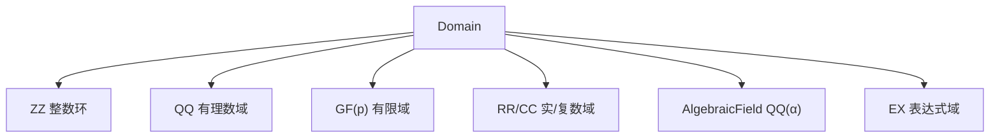

# 多项式代数

SymPy 的多项式系统位于 `sympy.polys` 包，是符号代数计算的核心引擎。与通用 `Expr` 表达式树不同，`Poly` 类将表达式编译为带**显式生成元**（gens）和**系数域**（domain）的规范多项式表示，在此基础上提供因式分解、GCD、Groebner 基、结式、判别式等高效代数算法。[^polys-source]

## Poly 操作概览



---

## 一、Poly vs Expr：核心区别

`Poly` 与普通 `Expr` 的三大区别：

1. **显式生成元**：必须指定哪些符号是变量（gens），其他符号视为系数
2. **固定系数域**：系数属于特定代数结构（ZZ、QQ、GF(p) 等）
3. **规范表示**：内部以有序单项式列表存储，运算效率更高

```python
>>> from sympy import Poly, symbols, sin
>>> x, y = symbols('x y')
>>>
>>> # Poly 必须指定生成元
>>> p = Poly(x**2 + 2*x + 1, x)
>>> p
Poly(x**2 + 2*x + 1, x, domain='ZZ')
>>> p.is_Poly
True
```

---

## 二、创建 Poly 对象

### 2.1 多种构造方式

```python
>>> from sympy import Poly, ZZ
>>> from sympy.abc import x
>>>
>>> # 从表达式创建（自动推断域）
>>> Poly(x**2 + 2*x + 1, x)
Poly(x**2 + 2*x + 1, x, domain='ZZ')
>>>
>>> # 多变量 + 指定域
>>> Poly(x**2/2 + x/3 + 1, x, domain='QQ')
Poly(1/2*x**2 + 1/3*x + 1, x, domain='QQ')
>>>
>>> # 从字典 {幂次: 系数}
>>> Poly.from_dict({(0,):1, (1,):2, (2,):3}, x, domain=ZZ)
Poly(3*x**2 + 2*x + 1, x, domain='ZZ')
>>>
>>> # 从根列表构造首一多项式
>>> Poly.from_roots([1, 2, 3], x)
Poly(x**3 - 6*x**2 + 11*x - 6, x, domain='ZZ')
>>>
>>> # 有限域 GF(5)
>>> Poly(x**2 + 1, x, modulus=5)
Poly(x**2 + 1, x, modulus=5)
```

---

## 三、Poly 属性与查询

| 属性/方法 | 返回值 | 说明 |
|---|---|---|
| `p.gens` | tuple | 生成元元组 |
| `p.domain` | Domain | 系数域 |
| `p.degree(gen)` | int | 次数 |
| `p.terms(order)` | list | `[(monom, coeff), ...]` |
| `p.coeffs(order)` | list | 系数列表 |
| `p.monoms(order)` | list | 单项式幂次列表 |
| `p.as_dict()` | dict | `{monom: coeff}` |
| `p.as_expr()` | Expr | 转回普通表达式 |
| `p.nth(n)` | Expr | x^n 的系数 |
| `p.LC()/LM()/LT()` | — | 首项系数/单项式/首项 |

```python
>>> from sympy import Poly
>>> from sympy.abc import x, y
>>> p = Poly(x**3 + 2*x**2 + 3*x + 4, x)
>>> p.degree()
3
>>> p.coeffs()
[1, 2, 3, 4]
>>> p.as_dict()
{(0,): 4, (1,): 3, (2,): 2, (3,): 1}
>>> p.as_expr()
x**3 + 2*x**2 + 3*x + 4
```

---

## 四、多项式算术运算

### 4.1 加减乘除

多项式除法满足 `f = q*g + r`，其中 `deg(r) < deg(g)`：

```python
>>> from sympy import Poly, div, gcd, lcm, resultant, discriminant
>>> from sympy.abc import x
>>> f = Poly(x**2 - 1, x)
>>> g = Poly(x**2 - 2*x + 1, x)
>>>
>>> f + g
Poly(2*x**2 - 2*x, x, domain='ZZ')
>>> f * g
Poly(x**4 - 2*x**3 + 2*x - 1, x, domain='ZZ')
>>>
>>> q, r = div(f, g)
>>> q*g + r == f
True
>>>
>>> gcd(f, g)
Poly(x - 1, x, domain='ZZ')
>>> lcm(f, g)
Poly(x**3 - x**2 - x + 1, x, domain='ZZ')
```

### 4.2 结式与判别式

```python
>>> from sympy.abc import a, b, c
>>> resultant(x**2 - 1, x**2 - 4, x)
9
>>> discriminant(a*x**2 + b*x + c, x)
-4*a*c + b**2
```

---

## 五、因式分解与展开

| 函数 | 说明 |
|---|---|
| `factor(expr)` | 因式分解（支持有限域/代数扩域） |
| `factor_list(expr)` | 返回 `(coeff, [(factor, exp), ...])` |
| `sqf(expr)` | 无平方分解 |
| `expand(expr)` | 展开乘法（factor 的逆运算） |

```python
>>> from sympy import factor, expand, sqf
>>> from sympy.abc import x, y
>>>
>>> factor(x**2 - 1)
(x - 1)*(x + 1)
>>> factor(x**3 - x**2 + x - 1)
(x - 1)*(x**2 + 1)
>>> factor(x**2 + 1, modulus=5)     # 有限域分解
(x - 2)*(x - 3)
>>>
>>> expand((x + y)**3)
x**3 + 3*x**2*y + 3*x*y**2 + y**3
>>>
>>> sqf(x**5 - x**4 - x + 1, x)
(x - 1)**2*(x**2 + x + 1)
```

---

## 六、有理函数

| 函数 | 说明 |
|---|---|
| `cancel(expr)` | 约分（约去公因子） |
| `together(expr)` | 通分合并 |
| `apart(expr, x)` | 部分分式分解 |
| `numer(f)/denom(f)` | 提取分子/分母 |

```python
>>> from sympy import cancel, together, apart, numer, denom
>>> from sympy.abc import x, y
>>>
>>> cancel((x**2 - 1)/(x**2 - 2*x + 1))
(x + 1)/(x - 1)
>>> together(1/x + 1/y)
(x + y)/(x*y)
>>> apart(1/(x**2 + 2*x - 3), x)
-1/(4*(x + 3)) + 1/(4*(x - 1))
```

---

## 七、域系统（Domains）

域决定了系数类型和可用运算。构造 `Poly` 时未指定域则自动推断。



| 域 | 说明 |
|---|---|
| `ZZ` | 整数环（默认），支持 GCD/因式分解 |
| `QQ` | 有理数域，支持除法 |
| `GF(p)` | p 元有限域，p 为素数 |
| `RR`/`CC` | 实/复浮点数域，近似计算 |
| `QQ.algebraic_field(α)` | 代数扩域 QQ(α)，支持代数数系数分解 |
| `EX` | 通用表达式域，无算法保证 |

```python
>>> from sympy import Poly, sqrt, QQ
>>> from sympy.abc import x
>>>
>>> Poly(x**2 + 2*x + 1, x).domain
ZZ
>>> Poly(x/2 + 1, x).domain
QQ
>>>
>>> # 代数扩域 QQ(√2) 上分解 x^2 - 2
>>> p = Poly(x**2 - 2, x, domain=QQ.algebraic_field(sqrt(2)))
>>> p.factor()
(x - sqrt(2))*(x + sqrt(2))
```

---

## 八、Groebner 基

Groebner 基是多元多项式理想的规范基，是求解多元多项式方程组的核心工具。支持三种主要单项式序：`lex`（字典序，消元求解）、`grlex`（分次字典序）、`grevlex`（分次逆字典序，计算最快）。

```python
>>> from sympy import groebner, reduced, is_zero_dimensional
>>> from sympy.abc import x, y
>>>
>>> G = groebner([x**2 + y - 1, x*y - x], x, y, order='lex')
>>> G
GroebnerBasis([x**2 + y - 1, x*y - x, y**2 - 2*y + 1], x, y, domain='ZZ', order='lex')
>>>
>>> reduced(x**3 + y**2, G, x, y, order='lex')
([x, 0, -1], -x + y + 1)
>>> is_zero_dimensional(G)  # 有限个解？
True
```

---

## 九、特殊与正交多项式

SymPy 提供经典正交多项式和数论多项式。注意 `_poly` 后缀版本返回 `Poly` 对象，无后缀版本返回 `Expr`（函数形式）：

| 多项式 | Expr 函数 | Poly 函数 | 说明 |
|---|---|---|---|
| Legendre | `legendre(n,x)` | `legendre_poly(n,x)` | P_n(x) |
| Chebyshev T | `chebyshevt(n,x)` | `chebyshevt_poly(n,x)` | 第一类 T_n(x) |
| Hermite | `hermite(n,x)` | `hermite_poly(n,x)` | H_n(x) |
| Laguerre | `laguerre(n,x)` | `laguerre_poly(n,x)` | L_n(x) |
| Jacobi | `jacobi(n,a,b,x)` | `jacobi_poly(n,a,b,x)` | P_n^(a,b)(x) |
| Gegenbauer | `gegenbauer(n,a,x)` | `gegenbauer_poly(n,a,x)` | C_n^a(x) |
| 分圆多项式 | — | `cyclotomic_poly(n,x)` | Φ_n(x) |

```python
>>> from sympy import legendre, chebyshevt, hermite, cyclotomic_poly
>>> from sympy.abc import x
>>>
>>> legendre(3, x)
5*x**3/2 - 3*x/2
>>> chebyshevt(4, x)
8*x**4 - 8*x**2 + 1
>>> hermite(3, x)
8*x**3 - 12*x
>>> cyclotomic_poly(6, x)
x**2 - x + 1
```

---

## 十、RootOf：符号根表示

五次及以上不可约多项式无通用根式解，`RootOf` 通过索引号精确引用不可约多项式的复根：

```python
>>> from sympy import RootOf, roots, nroots
>>> from sympy.abc import x
>>>
>>> roots(x**2 - 1, x)          # 可解多项式
{-1: 1, 1: 1}
>>>
>>> r = RootOf(x**5 - x + 1, 0)  # 不可约五次
>>> r.evalf(10)
-1.167303978
```

| 根函数 | 说明 |
|---|---|
| `roots(f, x)` | 精确根，返回 `{root: multiplicity}` |
| `nroots(f, x, n)` | 数值根（所有复根近似） |
| `real_roots(f, x)` | 实根隔离 |
| `RootOf(f, n)` | 第 n 个根的符号表示 |
| `count_roots(f, x)` | 实根个数（Sturm 定理） |

---

## 十一、插值

```python
>>> from sympy import interpolate, horner
>>> from sympy.abc import x
>>>
>>> interpolate([(0,1),(1,2),(2,4)], x)
x**2/2 + x/2 + 1
>>> horner(x**3 + 3*x**2 + 3*x + 1)
x*(x*(x + 3) + 3) + 1
```

---

## 异常类

| 异常 | 触发场景 |
|------|---------|
| `GeneratorsNeeded` | 未指定生成元（如 `Poly(1)`） |
| `PolynomialError` | 多项式通用错误 |
| `DomainError`/`CoercionFailed` | 域相关错误 |
| `ExactQuotientFailed` | 精确除法失败 |

## 延伸阅读

- 前置概念：[表达式树结构](01-expression-tree.md) 理解 Expr 与 Poly 的关系
- 前置概念：[符号与数字](02-symbols-numbers.md) 了解域系统中的数字表示
- 关联概念：[方程求解](08-solvers.md) 了解 solve 如何利用多项式算法
- 关联概念：[矩阵运算](09-matrices.md) 了解特征多项式与 Poly 的联系
- 源码信源：[polys-algebra-source](../references/polys-algebra-source.md) 提供完整 API 参考

[^polys-source]: polys/__init__.py — 多项式模块入口；polys/polytools.py — Poly 类定义与多项式运算函数
