# 进阶主题

本文档覆盖 SymPy 五个进阶模块：`sympy.tensor`（索引与 N 维数组）、`sympy.stats`（概率统计）、`sympy.printing`（多格式输出）、`sympy.codegen`（代码生成 AST）、`sympy.vector`（向量微积分），以及连接符号与数值的核心工具 `lambdify` 和表达式解析 `parse_expr`。[^tensor-stats-source]

## 进阶模块架构

```mermaid
graph TD
    Core["SymPy 核心 Expr/Basic"] --> Tensor["tensor 索引/数组"]
    Core --> Stats["stats 概率统计"]
    Core --> Printing["printing 多格式输出"]
    Core --> Vector["vector 向量微积分"]
    Core --> Parsing["parsing 表达式解析"]
    Tensor --> Indexed["Indexed/Idx Einstein索引"]
    Tensor --> NDim["NDimArray 符号数组"]
    Stats --> Disc["离散分布 Die/Binomial/Poisson"]
    Stats --> Cont["连续分布 Normal/Uniform"]
    Stats --> Query["P/E/variance 查询"]
    Printing --> Str["str/srepr"]
    Printing --> Pretty["pprint 2D美化"]
    Printing --> LaTeX["latex 数学公式"]
    Printing --> CodePrint["ccode/fcode/julia/rust"]
    CodeGen["codegen AST"] --> AST["Assignment/For/FunctionDef"]
    Utils["utilities"] --> Lambdify["lambdify NumPy桥接"]
    Utils --> Autowrap["autowrap 编译调用"]
    Vector --> Coord["CoordSys3D 坐标系"]
    Vector --> Del["Del 微分算子"]
    Vector --> VInt["vector_integrate"]
    Lambdify --> CodePrint
```



---

## 一、张量（tensor）

### 1.1 索引表示：Indexed/IndexedBase/Idx

索引系统实现 Einstein 求和约定：

| 类 | 说明 |
|----|------|
| `IndexedBase(name, shape=None)` | 张量名（基对象），带可选形状 |
| `Idx(name, range=None)` | 索引符号，支持范围声明 |
| `Indexed(base, *indices)` | 索引后的分量（如 A[i,j]） |

```python
>>> from sympy import IndexedBase, Idx, symbols, Sum
>>> i, j, n = symbols('i j n', integer=True)
>>>
>>> A = IndexedBase('A', shape=(n, n))
>>> A[i, j]
A[i, j]
>>>
>>> # 矩阵迹：Σ_i A[i,i]
>>> Sum(A[i, i], (i, 0, n-1))
Sum(A[i, i], (i, 0, n - 1))
```

### 1.2 N 维数组：NDimArray

`NDimArray` 是符号 N 维数组（类似 NumPy ndarray，元素可为符号），`Array` 是 `ImmutableDenseNDimArray` 的别名：

```python
>>> from sympy import Array, tensorproduct, tensorcontraction, derive_by_array
>>> from sympy.abc import x, y
>>>
>>> A = Array([[1, 2], [3, 4]])
>>> A.shape
(2, 2)
>>>
>>> B = Array([x, y])
>>> C = tensorproduct(A, B)   # 张量积
>>> C.shape
(2, 2, 2)
>>>
>>> D = tensorproduct(A, A)
>>> E = tensorcontraction(D, (0, 2))  # 缩并指标0和2
>>> E.shape
(2, 2)
>>>
>>> from sympy import sin, cos
>>> derive_by_array(sin(x)*cos(y), [x, y])
[cos(x)*cos(y), -sin(x)*sin(y)]
```

---

## 二、概率统计（stats）

`sympy.stats` 采用「先定义随机变量，再查询统计量」的模式。

### 2.1 离散分布

| 分布 | 构造 | 说明 |
|------|------|------|
| 骰子 | `Die(name, sides=6)` | 均匀离散 |
| 伯努利 | `Bernoulli(name, p)` | 0-1 分布 |
| 二项 | `Binomial(name, n, p)` | n 次伯努利成功次数 |
| 泊松 | `Poisson(name, lam)` | 泊松分布 |
| 几何 | `Geometric(name, p)` | 首次成功试验次数 |
| 自定义 | `FiniteRV(name, density_dict)` | 自定义有限分布 |

```python
>>> from sympy.stats import P, E, variance, Die, Binomial, Poisson
>>> from sympy import Rational
>>>
>>> X = Die('X', 6)
>>> P(X > 3)
1/2
>>> E(X)
7/2
>>>
>>> B = Binomial('B', 10, Rational(1,2))
>>> E(B)
5
>>> variance(B)
5/2
```

### 2.2 连续分布

| 分布 | 构造 | 参数 |
|------|------|------|
| 正态 | `Normal(name, mu, sigma)` | 均值 μ，标准差 σ |
| 指数 | `Exponential(name, rate)` | 速率 λ |
| 均匀 | `Uniform(name, a, b)` | 区间 [a,b] |
| Beta | `Beta(name, alpha, beta)` | 形状参数 |
| Gamma | `Gamma(name, k, theta)` | 形状 k，尺度 θ |
| 自定义 | `ContinuousRV(x, pdf, set)` | 自定义密度 |

```python
>>> from sympy.stats import Normal, Uniform, Exponential, density
>>> from sympy import Symbol, simplify, sqrt, pi, exp, erf, oo
>>>
>>> Z = Normal('Z', 0, 1)
>>> simplify(P(Z > 1))
1/2 - erf(sqrt(2)/2)/2
>>> density(Z)(Symbol('x'))
sqrt(2)*exp(-x**2/2)/(2*sqrt(pi))
>>>
>>> U = Uniform('U', 0, 1)
>>> E(U)
1/2
>>> variance(U)
1/12
```

### 2.3 查询函数

| 函数 | 含义 |
|------|------|
| `P(condition)` | 概率 |
| `E(expr)` | 期望 |
| `variance(expr)`/`std(expr)` | 方差/标准差 |
| `density(expr)(x)` | 概率密度函数 |
| `cdf(expr, x)` | 累积分布函数 |
| `sample(expr)` | 采样 |
| `covariance(X,Y)`/`correlation(X,Y)` | 协方差/相关系数 |
| `H(expr)` | 熵 |

---

## 三、打印系统（printing）

所有打印器继承 `Printer` 基类，通过 `_print_<ClassName>` 方法分发：

| 格式 | 函数 | 说明 |
|------|------|------|
| 字符串 | `str(expr)` | 普通文本 |
| 精确表示 | `srepr(expr)` | S-expression 精确表示 |
| 2D 美化 | `pprint(expr)` | Unicode/ASCII 2D 输出 |
| LaTeX | `latex(expr)` | LaTeX 数学公式 |
| 预览 | `preview(expr)` | LaTeX 渲染为图片 |
| C 代码 | `ccode(expr)` | C 语言表达式 |
| Fortran | `fcode(expr)` | Fortran 代码 |
| Julia | `julia_code(expr)` | Julia 代码 |
| Rust | `rust_code(expr)` | Rust 代码 |
| JavaScript | `jscode(expr)` | JS 代码 |
| Mathematica | `mathematica_code(expr)` | Wolfram 语言 |
| MATLAB | `octave_code(expr)` | Octave/MATLAB |
| 树形 | `print_tree(expr)` | 表达式树层次 |
| 图 | `dotprint(expr)` | Graphviz dot |

```python
>>> from sympy import symbols, sin, Integral, latex, srepr, pprint
>>> from sympy import ccode, julia_code, mathematica_code
>>> x, y = symbols('x y')
>>> expr = Integral(sin(x), x)
>>>
>>> srepr(expr)
"Integral(sin(Symbol('x')), Tuple(Symbol('x')))"
>>> latex(expr)
'\\int \\sin{\\left(x \\right)}\\, dx'
>>> ccode(x**2 + sin(y))
'pow(x, 2) + sin(y)'
>>> julia_code(x**2 + 1)
'x.^2 + 1'
>>> mathematica_code(sin(x))
'Sin[x]'
```

---

## 四、代码生成

### 4.1 lambdify：符号到数值的桥梁

`lambdify()` 将 SymPy 表达式转为可数值求值的 Python lambda：

```python
lambdify(args, expr, modules=None, cse=False)
```

| 参数 | 说明 |
|------|------|
| `modules` | 后端：`'math'`/`'numpy'`/`'scipy'`/`'mpmath'` |
| `cse` | 公共子表达式消除（大表达式推荐开启） |

```python
>>> from sympy import lambdify, symbols, sin
>>> import numpy as np
>>> x = symbols('x')
>>>
>>> f = lambdify(x, sin(x), modules='numpy')
>>> f(np.array([0, np.pi/2, np.pi]))
array([0.0000000e+00, 1.0000000e+00, 1.2246468e-16])
>>>
>>> g = lambdify(x, x**2+1, modules='math')
>>> g(3)
10
```

### 4.2 codegen() 与 autowrap()

`codegen()` 生成完整 C/Fortran 源码文件；`autowrap()` 自动编译为 Python 可调用二进制扩展（支持 f2py/Cython 后端）：

```python
>>> from sympy.utilities.codegen import codegen
>>> from sympy.abc import x
>>> [(c_name, c_code), (h_name, h_code)] = codegen(
...     ("f", x**2+1), language="C", prefix="test", header=True)
```

codegen AST 提供跨语言节点：`Assignment`、`CodeBlock`、`For`、`While`、`FunctionDefinition`、`Return` 等；C 特有 `goto`/`struct` 在 `cnodes.py`，Fortran 特有 `Do`/`Subroutine` 在 `fnodes.py`。

---

## 五、向量微积分（vector）

### 5.1 CoordSys3D 坐标系

`CoordSys3D` 是向量系统核心，表示三维直角坐标系：

```python
>>> from sympy.vector import CoordSys3D, dot, cross
>>> from sympy import sqrt
>>>
>>> N = CoordSys3D('N')
>>> N.i, N.j, N.k       # 基向量
(N.i, N.j, N.k)
>>>
>>> v = 3*N.i + 4*N.j + 5*N.k
>>> v.magnitude()
5*sqrt(2)
>>> dot(N.i, N.j)
0
>>> cross(N.i, N.j)
N.k
```

> **注意**：向量模块使用坐标系自身坐标变量（`N.x`/`N.y`/`N.z`），非 `sympy.abc` 的 `x`/`y`/`z`。

### 5.2 微分算子 Del（∇）

| 运算 | 函数 | 数学符号 |
|------|------|---------|
| 梯度 | `gradient(f)` | ∇f |
| 散度 | `divergence(v)` | ∇·v |
| 旋度 | `curl(v)` | ∇×v |
| 拉普拉斯 | `laplacian(f)` | ∇²f |

```python
>>> from sympy.vector import gradient, divergence, curl, laplacian
>>>
>>> f = N.x**2*N.y + N.y*N.z
>>> gradient(f)
N.k*N.y + N.j*(N.x**2 + N.z) + N.i*(2*N.x*N.y)
>>>
>>> vfield = N.x*N.i + N.y*N.j + N.z*N.k
>>> divergence(vfield)
3
>>>
>>> cfield = -N.y*N.i + N.x*N.j
>>> curl(cfield)
2*N.k
>>> laplacian(N.x**2 + N.y**2 + N.z**2)
6
```

### 5.3 场分析与积分

| 函数 | 说明 |
|------|------|
| `is_conservative(field)` | 是否保守场（旋度=0） |
| `is_solenoidal(field)` | 是否无散场（散度=0） |
| `scalar_potential(field, coord)` | 标量势 |
| `vector_integrate(field, region)` | 线/面/体积分 |

```python
>>> from sympy.vector import is_conservative, scalar_potential, ParametricRegion
>>> from sympy import cos, sin, pi
>>> t = symbols('t')
>>>
>>> F = N.y*N.z*N.i + N.x*N.z*N.j + N.x*N.y*N.k
>>> is_conservative(F)
True
>>> scalar_potential(F, N)
N.x*N.y*N.z
>>>
>>> curve = ParametricRegion((cos(t), sin(t), 0), (t, 0, 2*pi))
```

---

## 六、表达式解析

`parse_expr()` 将字符串解析为 SymPy 表达式，支持隐式乘法等转换：

```python
>>> from sympy import parse_expr
>>>
>>> parse_expr("x**2 + 2*x + 1")
x**2 + 2*x + 1
>>>
>>> from sympy.parsing.sympy_parser import (
...     standard_transformations, implicit_multiplication_application)
>>> parse_expr("2x", transformations=standard_transformations +
...     (implicit_multiplication_application,))
2*x
```

---

## 模块选择指南

| 需求 | 模块/函数 |
|------|----------|
| 符号张量（Einstein 求和） | `tensor.IndexedBase/Idx/Indexed` |
| 符号 N 维数组 | `Array` + `tensorproduct/tensorcontraction` |
| 概率期望/方差 | `stats.P/E/variance` + 分布类 |
| LaTeX 公式输出 | `latex()` / `preview()` |
| 终端 2D 显示 | `pprint()` |
| 数值化（NumPy/SciPy） | `lambdify(modules='numpy')` |
| 生成 C/Fortran 源码 | `utilities.codegen.codegen()` |
| 向量场（梯度/旋度） | `vector.CoordSys3D + Del` |
| 字符串转表达式 | `parse_expr()` |

## 延伸阅读

- 前置概念：[表达式树结构](01-expression-tree.md) 理解 Printer 分发机制
- 前置概念：[微积分](07-calculus.md) 了解向量微分算子与标量微积分的关系
- 关联概念：[矩阵运算](09-matrices.md) 了解 Array 与 Matrix 的区别
- 关联概念：[多项式代数](10-polynomials.md) 了解 factor/gcd 与代码生成的配合
- 源码信源：[tensor-stats-source](../references/tensor-stats-source.md) 提供完整 API 参考

[^tensor-stats-source]: tensor/__init__.py、stats/__init__.py、printing/__init__.py、codegen/__init__.py、vector/__init__.py
