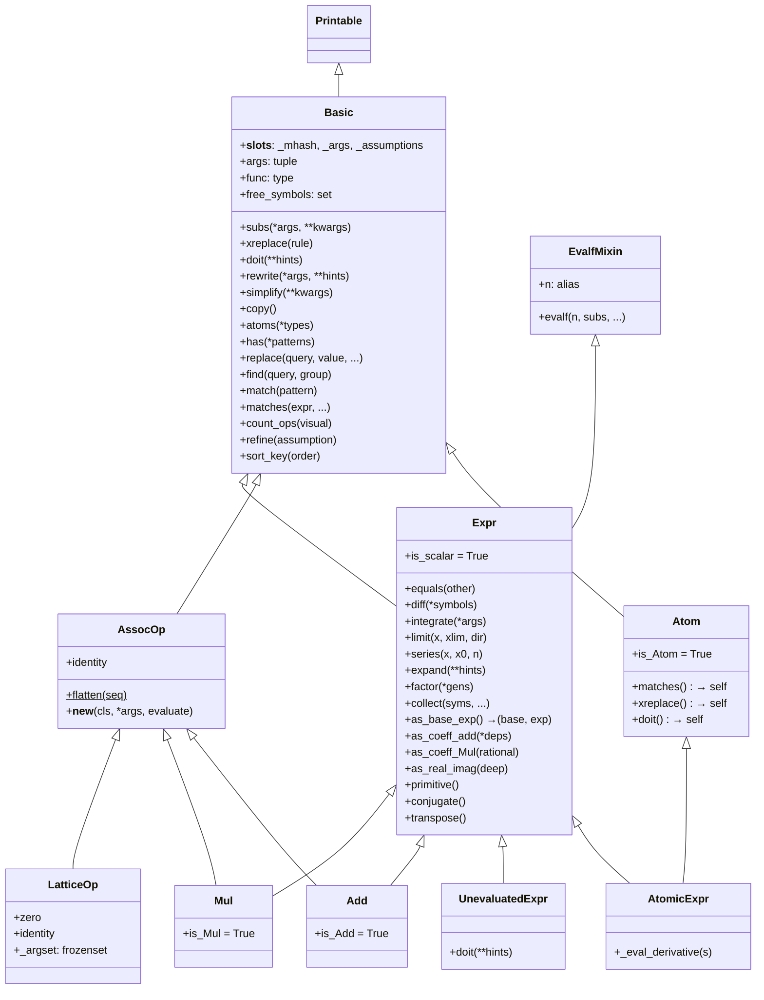

# Basic/Expr 核心类体系源码信源

SymPy 的表达式体系建立在不可变树结构之上。`Basic` 是所有 SymPy 对象的基类，`Expr` 在其之上增加代数运算能力，`Atom` 标记叶子节点，`AssocOp` 提供结合运算的扁平化框架。[^F-072]

## 类继承层次



核心继承链：`Printable → Basic → Expr → Add/Mul/Pow`（Add 和 Mul 还同时继承 `AssocOp`）；原子类型链：`Basic → Atom → AtomicExpr → Symbol/Dummy/Wild/Number/NumberSymbol`。[^F-072] [^F-073]

## Basic 基类

`Basic` 定义于 `core/basic.py` 第164行，继承自 `Printable`，是所有可被 `sympify()` 返回的 SymPy 对象的根类。[^F-001]

### __slots__ 与实例状态

```python
class Basic(Printable):
    __slots__ = ('_mhash', '_args', '_assumptions')
```

- `_mhash: int | None`：缓存哈希值，`__hash__` 首次计算后缓存于此[^F-001]
- `_args: tuple[Basic, ...]`：子节点元组（表达式树的直接子表达式）[^F-001]
- `_assumptions`：假设状态字典（`StdFactKB` 类型）[^F-002]

外部代码**必须**通过 `.args` 属性访问子节点，禁止直接使用 `._args`。[^F-004]

### __new__ 构造模式

```python
def __new__(cls, *args):
    obj = object.__new__(cls)
    obj._assumptions = cls.default_assumptions
    obj._mhash = None
    obj._args = args  # all items in args must be Basic objects
    return obj
```

`Basic` 使用 `__new__` 而非 `__init__` 进行实例初始化，这是不可变对象的典型设计模式——对象在构造时即确定全部状态，构造后不可修改。子类通过重写 `__new__` 实现参数规范化、求值逻辑。[^F-002]

### __init_subclass__ 钩子

```python
def __init_subclass__(cls):
    super().__init_subclass__()
    _prepare_class_assumptions(cls)
```

每个子类定义时自动调用 `_prepare_class_assumptions(cls)` 初始化该类的默认假设属性，使得 `is_*` 属性体系在类定义阶段就建立完整。[^F-003]

### args 与 func 属性

**args 属性**（第913行）返回 `self._args`，是表达式树子节点的公开访问接口。[^F-004]

**func 属性**（第887行）返回 `self.__class__`，对所有对象满足重构恒等式：`x == x.func(*x.args)`。这意味着任何 SymPy 对象都可以通过 `obj.func(*obj.args)` 重建自身。[^F-005]

```python
>>> from sympy import sin, symbols
>>> x = symbols('x')
>>> expr = sin(x) + 1
>>> expr.func
<class 'sympy.core.add.Add'>
>>> expr.args
(1, sin(x))
>>> expr.func(*expr.args) == expr
True
```

### subs 替换方法

`subs(self, arg1, arg2=None, **kwargs)` 支持三种调用形式：[^F-006]

| 调用形式 | 示例 | 说明 |
|---|---|---|
| 两个位置参数 | `expr.subs(x, y)` | 将 `x` 替换为 `y` |
| 字典参数 | `expr.subs({x: 1, y: 2})` | 批量替换 |
| 可迭代参数对 | `expr.subs([(x, 1), (y, 2)])` | 按序替换 |
| simultaneous 关键字 | `expr.subs({x:y, y:x}, simultaneous=True)` | 同时替换（避免顺序依赖） |

```python
>>> from sympy import symbols
>>> x, y = symbols('x y')
>>> (x + y).subs(x, 1)
y + 1
>>> (x + y).subs({x: y, y: x})  # 顺序替换：x→y后y→x导致都变成x
2*x
>>> (x + y).subs({x: y, y: x}, simultaneous=True)  # 同时替换
x + y
```

### xreplace 精确节点替换

`xreplace(self, rule)` 方法接收字典 `rule`，在表达式树中执行**精确节点匹配替换**——仅当节点与字典键完全相等（`==`）时才替换，不区分自由变量与约束变量，不做模式匹配。[^F-007]

```python
>>> from sympy import symbols, Function
>>> x, y = symbols('x y')
>>> f = Function('f')
>>> (1 + x*y).xreplace({x: y})
y**2 + 1
>>> (1 + x*y).xreplace({x*y: 1})
2
```

### doit 求值方法

`doit(self, **hints)` 递归求值默认保持不求值形式的对象（如 `Integral`、`Limit`、`Sum`、`Product`、`Derivative`），支持 `deep=True`（默认）参数控制是否递归深入子表达式。[^F-008]

```python
>>> from sympy import Integral, symbols
>>> x = symbols('x')
>>> i = Integral(x**2, x)
>>> i
Integral(x**2, x)
>>> i.doit()
x**3/3
```

### rewrite 重写方法

`rewrite(self, *args, deep=True, **hints)` 根据规则重写表达式，接受目标类型或类型可迭代对象作为位置参数（`pattern`），通过调用 `_eval_rewrite()` 或 `_eval_rewrite_as_<rulename>()` 方法执行实际转换。[^F-009]

```python
>>> from sympy import sin, exp, I
>>> sin(x).rewrite(exp)
-I*(exp(I*x) - exp(-I*x))/2
```

### 其他核心方法

| 方法 | 行号 | 功能 |
|---|---|---|
| `copy()` | L302 | 返回 `self.func(*self.args)` 即浅拷贝重建 |
| `compare(other)` | L372 | 规范序比较，返回 -1/0/1 |
| `fromiter(args, **assumptions)` | L431 | 类方法，从可迭代参数构造实例 |
| `atoms(*types)` | L607 | 返回指定类型的叶子节点集合 |
| `free_symbols` | L684 | 属性，返回自由符号集合 |
| `has(*patterns)` | L1392 | 检测是否包含指定模式 |
| `replace(query, value, map=False, simultaneous=True, exact=None)` | L1547 | 通用子表达式替换 |
| `find(query, group=False)` | L1804 | 查找匹配查询的子表达式 |
| `match(pattern, old=False)` | L1938 | 模式匹配，返回替换字典或 None |
| `matches(expr, repl_dict=None, old=False)` | L1892 | 结构匹配 |
| `count_ops(visual=False)` | L2000 | 统计运算操作数 |
| `refine(assumption=True)` | L2036 | 在给定假设下化简 |
| `simplify(**kwargs)` | L2031 | 委托给 `sympy.simplify` 化简 |
| `dummy_eq(other, symbol=None)` | L556 | 忽略 Dummy 身份比较 |
| `as_dummy()` | L743 | 替换绑定变量为 Dummy |
| `canonical_variables` | L790 | 属性，返回规范变量映射 |
| `sort_key(order=None)` | L454 | 返回排序键元组 |
| `class_key()` | L449 | 类方法，返回类排序键 |

[^F-011]

### is_* 类型检查属性

`Basic` 在类级别声明了一组 `is_*` 布尔属性，初始值均为 `False`（或 `None`），子类按需重写为 `True`。完整列表包括：[^F-012]

- **类型标记**：`is_number`、`is_Atom`、`is_Symbol`、`is_symbol`、`is_Dummy`、`is_Wild`、`is_Function`
- **运算标记**：`is_Add`、`is_Mul`、`is_Pow`、`is_Number`、`is_Float`、`is_Rational`、`is_Integer`、`is_NumberSymbol`
- **结构标记**：`is_Derivative`、`is_Relational`、`is_Equality`、`is_Boolean`、`is_Matrix`、`is_Poly`、`is_Piecewise`、`is_Order`
- **数学属性**（可三值：True/False/None）：`is_integer`、`is_real`、`is_complex`、`is_positive`、`is_negative`、`is_zero`、`is_rational`、`is_even`、`is_odd`、`is_prime`、`is_finite`、`is_infinite`、`is_commutative`、`is_algebraic`、`is_transcendental`、`is_imaginary`、`is_polar` 等

```python
>>> from sympy import Integer, Symbol
>>> Integer(5).is_Integer
True
>>> Integer(5).is_positive
True
>>> x = Symbol('x')
>>> x.is_integer  # 无假设时返回 None（不确定）
>>> x = Symbol('x', integer=True)
>>> x.is_integer
True
```

### ordering_of_classes 规范序

模块级列表 `ordering_of_classes`（basic.py 第58行）定义交换律运算中参数的规范排序优先级，从高到低为：[^F-016]

1. 单例数字（Zero/One/NegativeOne/Half）
2. 数字常量
3. 单例符号（如 ImaginaryUnit）
4. 符号
5. Pow
6. Mul
7. Add
8. 函数值
9. 定义的单例函数
10. 未定义函数
11. Lambda
12. Order
13. 关系运算

### 构造后处理器

`Basic` 维护类变量 `_constructor_postprocessor_mapping = {}`（L2193）和类方法 `_exec_constructor_postprocessors(cls, obj)`（L2196），支持在对象构造完成后执行注册的后处理函数。矩阵模块通过此机制实现 `Matrix` 与表达式系统的桥接。[^F-014]

### 模块级工具函数

`as_Basic(expr)` 函数（basic.py 第40行）使用严格的 `_sympify` 将参数转换为 `Basic` 实例，失败时抛出 `TypeError`。[^F-015]

## Atom 原子类型

`Atom` 类定义于 `core/basic.py` 第2311行，继承自 `Basic`，是表达式树中叶子节点的标记基类。[^F-013]

```python
class Atom(Basic):
    is_Atom = True
    __slots__ = ()
```

`Atom` 重写了以下方法以符合叶子节点语义：

| 方法 | 行为 |
|---|---|
| `matches()` | 返回 `self`（无内部结构可匹配） |
| `xreplace()` | 返回 `self`（无内部节点可替换） |
| `doit()` | 返回 `self`（叶子无需求值） |
| `_eval_simplify()` | 返回 `self`（叶子无法化简） |
| `class_key()` | 返回 `(2, 0, cls.__name__)`（在排序中位于较高优先级） |
| `_sorted_args` | 抛出 `AttributeError`（叶子无排序参数） |

[^F-013]

## Expr 代数表达式类

`Expr` 类定义于 `core/expr.py` 第47行，继承自 `Basic` 和 `EvalfMixin`，被 `@sympify_method_args` 装饰，`__slots__ = ()`，`is_scalar = True`。`Expr` 是所有代数表达式的基类，在 `Basic` 的树结构之上增加了微积分、代数变换、数值求值等数学运算能力。[^F-017]

### EvalfMixin 数值求值

`Expr` 通过继承 `EvalfMixin`（core/evalf.py 第1564行）获得数值求值能力：[^F-058]

```python
# 数值求值方法
evalf(self, n=15, subs=None, maxn=100, chop=False, strict=False, quad=None, verbose=False)
n = evalf  # 属性别名
```

- `n`：目标精度（十进制位数），默认15位
- `subs`：替换字典，求值前先替换
- `chop`：截断接近零的小数值
- `strict`：严格模式，精度不足时抛出 `PrecisionExhausted`[^F-058]

```python
>>> from sympy import pi, sqrt
>>> pi.evalf(20)
3.1415926535897932385
>>> pi.n(5)
3.1416
>>> sqrt(2).evalf(30)
1.41421356237309504880168872421
```

### 微积分方法

| 方法 | 行号 | 签名 | 功能 |
|---|---|---|---|
| `diff` | L3627 | `diff(*symbols, **assumptions)` | 对指定符号求偏导 |
| `integrate` | L3778 | `integrate(*args, **kwargs)` | 积分（委托给 integrals 模块） |
| `limit` | L3501 | `limit(x, xlim, dir='+')` | 求极限 |
| `series` | L2922 | `series(x=None, x0=0, n=6, dir="+", ...)` | 泰勒/洛朗级数展开 |

[^F-018]

```python
>>> from sympy import sin, cos, exp, symbols
>>> x = symbols('x')
>>> (x**3).diff(x)
3*x**2
>>> sin(x).diff(x, 2)  # 二阶导数
-sin(x)
>>> cos(x).series(x, 0, 6)
1 - x**2/2 + x**4/24 + O(x**6)
>>> exp(x).limit(x, 0)
1
```

### 代数变换方法

| 方法 | 行号 | 功能 |
|---|---|---|
| `expand(deep=True, ...)` | L3673 | 展开表达式，支持 power_base/power_exp/mul/log/multinomial/basic 等 hint 开关 |
| `factor(*gens, **args)` | L3838 | 因式分解 |
| `collect(syms, func=None, evaluate=True, ...)` | L3793 | 按符号合并同类项 |
| `equals(other, failing_expression=False)` | L767 | 数学等价性判断 |

[^F-018]

```python
>>> from sympy import symbols
>>> x, y = symbols('x y')
>>> ((x+y)**2).expand()
x**2 + 2*x*y + y**2
>>> (x**2 - 1).factor()
(x - 1)*(x + 1)
>>> (x + 2*x*y).collect(x)
x*(2*y + 1)
```

### 结构分解方法

| 方法 | 行号 | 返回值 | 功能 |
|---|---|---|---|
| `as_base_exp()` | L2070 | `(base, exp)` | 分解为底数和指数 |
| `as_coeff_add(*deps)` | L2109 | `(coeff, rest)` | 分离加性系数 |
| `as_coeff_Mul(rational=False)` | L3593 | `(coeff, rest)` | 分离乘性系数 |
| `as_real_imag(deep=True, ...)` | L1968 | `(real, imag)` | 分离实部虚部 |
| `primitive()` | L2145 | `(Rational_coeff, rest)` | 提取原语部分（有理数系数） |
| `as_content_primitive(radical=False, clear=True)` | L2171 | `(content, primitive)` | 提取内容和原语部分 |
| `as_powers_dict()` | L1997 | `dict` | 表示为 {base: exp} 字典 |

[^F-020]

```python
>>> from sympy import symbols, I
>>> x = symbols('x')
>>> (2*x + 3).as_coeff_add(x)
(3, (2*x,))
>>> (3*x).as_coeff_Mul()
(3, x)
>>> (1 + I).as_real_imag()
(1, 1)
>>> (x**2).as_base_exp()
(x, 2)
>>> (4*x + 6).primitive()
(2, 2*x + 3)
```

### 其他 Expr 方法

| 方法 | 行号 | 功能 |
|---|---|---|
| `args_cnc(cset=False, warn=True, split_1=True)` | L1338 | 分离交换/非交换因子 |
| `conjugate()` | L1049 | 复共轭 |
| `transpose()` | L1086 | 转置 |

[^F-020]

## AtomicExpr 原子表达式

`AtomicExpr` 类定义于 `core/expr.py` 第4031行，多重继承自 `Atom` 和 `Expr`，`__slots__ = ()`，`is_number = False`，`is_Atom = True`。它将叶子节点语义（Atom）与代数表达式能力（Expr）结合，是 `Symbol`、`Number`、`NumberSymbol`、`ImaginaryUnit` 等原子类型的共同基类。[^F-021]

关键方法 `_eval_derivative(s)`：当 `self == s` 时返回 `S.One`（dx/dx=1），否则返回 `S.Zero`（常数导数为0），为所有原子类型提供默认求导规则。[^F-021]

```python
>>> from sympy import Symbol
>>> x = Symbol('x')
>>> x.diff(x)
1
>>> x.diff(Symbol('y'))
0
```

## UnevaluatedExpr 不求值表达式

`UnevaluatedExpr` 类定义于 `core/expr.py` 第4118行，继承自 `Expr`，其 `__new__` 将参数 sympify 后传入 `Expr.__new__`，`doit(**hints)` 在 `deep=True` 时返回 `self.args[0].doit(**hints)`。它用于包装表达式使其不被自动求值/化简。[^F-022]

```python
>>> from sympy import UnevaluatedExpr, symbols
>>> x = symbols('x')
>>> ue = UnevaluatedExpr(x + x)
>>> ue
2*x  # 在创建时会被sympify求值
>>> from sympy import Mul
>>> Mul(2, UnevaluatedExpr(x + 1))
2*(x + 1)
>>> _.doit()
2*x + 2
```

## ExprBuilder 表达式构建器

`ExprBuilder` 类定义于 `core/expr.py` 第4176行，提供增量构建表达式的接口：`__init__(self, op, args=None, validator=None, check=True)` 接收可调用的 `op`、参数列表 `args` 和可选 `validator`，提供 `build()`、`validate()` 等方法。[^F-023]

## AssocOp 结合运算基类

`AssocOp` 类定义于 `core/operations.py` 第29行，继承自 `Basic`，是 `Add` 和 `Mul` 的抽象基类。[^F-042]

```python
class AssocOp(Basic):
    __slots__ = ('is_commutative',)
    
    def __new__(cls, *args, evaluate=None, _sympify=True):
        ...
```

关键设计要素：[^F-042]

- **identity 属性**：子类必须定义单位元（如 `Add.identity = S.Zero`、`Mul.identity = S.One`）
- **flatten 类方法**：子类必须实现 `flatten(cls, seq)`，对参数序列执行扁平化、合并同类项、提取系数
- **evaluate 参数**：`__new__` 接受 `evaluate` 关键字参数，控制是否执行求值/扁平化；`evaluate=False` 时保持原始参数结构
- **_sympify 参数**：控制是否对参数执行 sympify 转换

`Add` 和 `Mul` 均继承自 `Expr` 和 `AssocOp`，分别定义了 `is_Add = True`/`is_Mul = True` 和各自的 `flatten` 方法。[^F-037] [^F-039]

```python
>>> from sympy import Add, Mul, symbols
>>> x, y = symbols('x y')
>>> Add(x, x, y, evaluate=False)
x + x + y
>>> Add(x, x, y)
2*x + y
```

## LatticeOp 格运算基类

`LatticeOp` 类定义于 `core/operations.py` 第487行，继承自 `AssocOp`，表示具有结合律、交换律和**幂等律**（`op(a,a) = a`）的格运算（如集合交/并、逻辑与/或）。[^F-043]

- 子类必须定义 `zero`（吸收元）和 `identity`（单位元）属性
- 使用 `_argset: frozenset` 存储参数（利用集合的幂等性自动去重）
- 模块定义了 `ShortCircuit` 异常类（L483），用于短路求值[^F-044]

## AssocOpDispatcher

`AssocOpDispatcher` 类定义于 `core/operations.py` 第583行，用于在运行时动态分派到具体的结合操作实现。[^F-044]

## 表达式遍历工具

`core/traversal.py` 提供遍历表达式树的工具函数和迭代器类。[^F-063] [^F-064]

### preorder_traversal 前序遍历

`preorder_traversal` 是一个迭代器类（traversal.py 第68行），对表达式树执行前序遍历（根→左→右），支持 `keys` 参数自定义子节点顺序，提供 `skip()` 方法跳过当前节点的子树。[^F-063]

```python
>>> from sympy import symbols, sin
>>> from sympy.core.traversal import preorder_traversal
>>> x, y = symbols('x y')
>>> expr = x + sin(y)
>>> [node for node in preorder_traversal(expr)]
[x + sin(y), x, sin(y), y]
```

### postorder_traversal 后序遍历

`postorder_traversal(node, keys=None)`（第250行）是生成器函数，对表达式树执行后序遍历（左→右→根）。[^F-064]

```python
>>> from sympy.core.traversal import postorder_traversal
>>> [node for node in postorder_traversal(x + sin(y))]
[x, y, sin(y), x + sin(y)]
```

### 其他遍历工具

| 函数 | 行号 | 功能 |
|---|---|---|
| `iterargs(expr)` | L12 | 迭代表达式的所有直接参数 |
| `iterfreeargs(expr, _first=True)` | L37 | 迭代自由参数（跳过绑定变量） |
| `use(expr, func, level=0, args=(), kwargs={})` | L167 | 在指定层级应用函数 |
| `walk(e, *target)` | L199 | 遍历并匹配目标类型 |
| `bottom_up(rv, F, atoms=False, nonbasic=False)` | L226 | 自底向上应用函数 F |

[^F-064]

[^F-001]: facts.md F-001 — Basic 类定义、继承与 __slots__
[^F-002]: facts.md F-002 — Basic.__new__ 构造模式
[^F-003]: facts.md F-003 — __init_subclass__ 钩子
[^F-004]: facts.md F-004 — args 属性
[^F-005]: facts.md F-005 — func 属性
[^F-006]: facts.md F-006 — subs 方法三种调用形式
[^F-007]: facts.md F-007 — xreplace 方法
[^F-008]: facts.md F-008 — doit 方法
[^F-009]: facts.md F-009 — rewrite 方法
[^F-011]: facts.md F-011 — Basic 公开方法清单
[^F-012]: facts.md F-012 — is_* 类型检查属性
[^F-013]: facts.md F-013 — Atom 类定义与重写方法
[^F-014]: facts.md F-014 — 构造后处理器
[^F-015]: facts.md F-015 — as_Basic 函数
[^F-016]: facts.md F-016 — ordering_of_classes 排序优先级
[^F-017]: facts.md F-017 — Expr 类定义与继承
[^F-018]: facts.md F-018 — Expr 公开方法（微积分/代数变换）
[^F-020]: facts.md F-020 — Expr 结构分解方法
[^F-021]: facts.md F-021 — AtomicExpr 类
[^F-022]: facts.md F-022 — UnevaluatedExpr 类
[^F-023]: facts.md F-023 — ExprBuilder 类
[^F-037]: facts.md F-037 — Add 类
[^F-039]: facts.md F-039 — Mul 类
[^F-042]: facts.md F-042 — AssocOp 类
[^F-043]: facts.md F-043 — LatticeOp 类
[^F-044]: facts.md F-044 — AssocOpDispatcher 与 ShortCircuit
[^F-058]: facts.md F-058 — EvalfMixin 数值求值
[^F-063]: facts.md F-063 — preorder_traversal
[^F-064]: facts.md F-064 — 遍历工具函数
[^F-072]: facts.md F-072 — 核心类继承链
[^F-073]: facts.md F-073 — 原子类型继承链
