# 函数库（初等函数与特殊函数）源码信源

SymPy 的 `functions` 模块是数学函数的统一入口，分为三大子模块：`elementary`（初等函数）、`special`（特殊函数）、`combinatorial`（组合函数）。所有具体函数类均继承自 `Function`（→ `Application` → `Expr` → `Basic`），通过 `@classmethod eval()` 实现自动求值，通过 `_eval_rewrite_as_<target>()` 支持 `rewrite()` 方法，通过 `_eval_expand_<hint>()` 支持 `expand()` 方法。[^F-050] [^F-088]

## 模块架构

```mermaid
flowchart TD
    F["functions/__init__.py"] --> ELEM["elementary/ 初等函数"]
    F --> SPEC["special/ 特殊函数"]
    F --> COMB["combinatorial/ 组合函数"]

    ELEM --> TRIG["trigonometric.py<br/>sin/cos/tan/..."]
    ELEM --> EXP["exponential.py<br/>exp/log/LambertW"]
    ELEM --> HYP["hyperbolic.py<br/>sinh/cosh/tanh/..."]
    ELEM --> CPLX["complexes.py<br/>re/im/Abs/sign/..."]
    ELEM --> INT["integers.py<br/>floor/ceiling/frac"]
    ELEM --> MISC["miscellaneous.py<br/>sqrt/root/Min/Max/..."]
    ELEM --> PW["piecewise.py<br/>Piecewise"]

    SPEC --> ERR["error_functions.py<br/>erf/Ei/Si/Ci/..."]
    SPEC --> GAM["gamma_functions.py<br/>gamma/beta/digamma/..."]
    SPEC --> BES["bessel.py<br/>besselj/bessely/..."]
    SPEC --> ZET["zeta_functions.py<br/>zeta/polylog/..."]
    SPEC --> HYP2["hyper.py<br/>hyper/meijerg"]
    SPEC --> POLY2["polynomials.py<br/>legendre/hermite/..."]
    SPEC --> ELL["elliptic_integrals.py<br/>elliptic_k/..."]
    SPEC --> BETA["beta_functions.py<br/>beta/betainc"]
    SPEC --> MATH["mathieu_functions.py<br/>mathieus/..."]
    SPEC --> DELTA["delta_functions.py<br/>DiracDelta/Heaviside"]
    SPEC --> BSPL["bsplines.py<br/>bspline_basis/..."]
    SPEC --> SPH["spherical_harmonics.py<br/>Ynm/Znm"]
    SPEC --> TENS["tensor_functions.py<br/>KroneckerDelta/..."]
    SPEC --> SING["singularity_functions.py<br/>SingularityFunction"]

    COMB --> FAC["factorials.py<br/>factorial/binomial/..."]
    COMB --> NUM["numbers.py<br/>fibonacci/bernoulli/..."]
```



## 函数类继承机制

所有 SymPy 数学函数类共享以下核心机制（以 `sin` 为例）：[^F-050] [^F-048]

```python
from sympy import sin, cos, exp, Symbol, pi, I, S
x = Symbol('x')

# 1. 自动求值 (eval 类方法)
sin(0)          # → 0
sin(pi/2)       # → 1
sin(pi)         # → 0

# 2. rewrite 重写
sin(x).rewrite(exp)     # → -I*(exp(I*x) - exp(-I*x))/2
sin(x).rewrite(cos)     # → cos(x - pi/2)

# 3. expand 展开
from sympy import expand_trig
expand_trig(sin(2*x))   # → 2*sin(x)*cos(x)

# 4. diff 求导
sin(x).diff(x)          # → cos(x)

# 5. 级数展开
sin(x).series(x, 0, 6) # → x - x**3/6 + x**5/120 + O(x**6)
```

每个具体函数类定义 `@classmethod eval(cls, *args)` 处理特殊值求值，定义 `_eval_rewrite_as_<rulename>(self, *args, **kwargs)` 支持重写规则，定义 `_eval_expand_<hint>(self, **hints)` 支持特定类型的展开。[^F-009]

---

## 一、初等函数（elementary/）

### 1.1 三角函数（trigonometric.py）

三角函数是最常用的初等函数类，全部继承自 `TrigonometricFunction` 基类。[^F-089]

| 函数 | 名称 | 反函数 | 说明 |
|------|------|--------|------|
| `sin` | 正弦 | `asin` | 最基本的三角函数 |
| `cos` | 余弦 | `acos` | 与 sin 相位差 π/2 |
| `tan` | 正切 | `atan` | sin/cos |
| `cot` | 余切 | `acot` | cos/sin = 1/tan |
| `sec` | 正割 | `asec` | 1/cos |
| `csc` | 余割 | `acsc` | 1/sin |
| `sinc` | 辛格函数 | — | sin(x)/x，x=0 处取 1 |
| `atan2` | 二参数反正切 | — | `atan2(y, x)` 返回极角 |

```python
from sympy import sin, cos, tan, cot, sec, csc, sinc
from sympy import asin, acos, atan, acot, asec, acsc, atan2
from sympy import pi, Symbol, Rational
x = Symbol('x')

# 特殊值
sin(pi/6)           # → 1/2
cos(pi/4)           # → sqrt(2)/2
tan(pi/3)           # → sqrt(3)
sinc(0)             # → 1

# 反三角函数
asin(Rational(1,2)) # → pi/6
atan2(1, 0)         # → pi/2

# 重写为复指数
sin(x).rewrite(exp) # → -I*(exp(I*x) - exp(-I*x))/2
```

### 1.2 指数与对数函数（exponential.py）

指数函数使用元类 `ExpMeta` 处理 `E**x` 自动转换为 `exp(x)`，`log` 以自然对数为底，`ln` 是 `log` 的别名。Lambert W 函数是 `exp(x)*x` 的反函数。[^F-089]

| 函数 | 数学记号 | 说明 |
|------|----------|------|
| `exp` | eˣ | 自然指数函数 |
| `exp_polar` | eˣ（极坐标） | 不分支版本，用于复分析 |
| `log` / `ln` | ln x | 自然对数（`ln = log` 别名） |
| `LambertW` | W(z) | Lambert W 函数，W(z)·e^{W(z)} = z |

```python
from sympy import exp, log, ln, LambertW, E, Symbol, S
x = Symbol('x')

# 基本运算
exp(0)              # → 1
exp(1)              # → E  (注意: E = S.Exp1 ≈ 2.718...)
log(1)              # → 0
log(E)              # → 1
log(100, 10)        # → 2  (底为 10 的对数)

# Lambert W 函数
LambertW(0)         # → 0
LambertW(E)         # → 1

# 注意: E 是常量 (S.Exp1)，不是 Function 子类
# 它来自 sympy.core.numbers，由 NumberSymbol 派生
E.evalf(10)         # → 2.718281828
```

### 1.3 双曲函数（hyperbolic.py）

双曲函数与三角函数有密切的类比关系，通过复指数定义。全部继承自 `HyperbolicFunction` 基类。[^F-089]

| 函数 | 数学记号 | 反函数 |
|------|----------|--------|
| `sinh` | sinh x | `asinh` |
| `cosh` | cosh x | `acosh` |
| `tanh` | tanh x | `atanh` |
| `coth` | coth x | `acoth` |
| `sech` | sech x | `asech` |
| `csch` | csch x | `acsch` |

```python
from sympy import sinh, cosh, tanh, coth, sech, csch
from sympy import asinh, acosh, atanh, acoth, asech, acsch
from sympy import Symbol, I
x = Symbol('x')

# 恒等式验证
sinh(x).rewrite(exp)        # → (exp(x) - exp(-x))/2
cosh(x)**2 - sinh(x)**2     # → cosh(x)**2 - sinh(x)**2
from sympy import simplify
simplify(cosh(x)**2 - sinh(x)**2)  # → 1

# 与三角函数的关系
sinh(I*x)                   # → I*sin(x)
cosh(I*x)                   # → cos(x)
```

### 1.4 复数函数（complexes.py）

复数相关函数用于操作复数的实部、虚部、模、辐角等属性。[^F-090]

| 函数 | 说明 |
|------|------|
| `re` | 取实部 |
| `im` | 取虚部 |
| `sign` | 符号函数（z/|z|，复数域上为 z/|z|） |
| `Abs` | 绝对值/模 |
| `arg` | 辐角（主值） |
| `conjugate` | 共轭 |
| `polar_lift` | 提升到极坐标表示 |
| `adjoint` | 伴随（共轭转置） |
| `transpose` | 转置 |
| `polarify` / `unpolarify` | 极坐标化/去极坐标化 |

```python
from sympy import re, im, sign, Abs, arg, conjugate, polar_lift
from sympy import Symbol, I, pi
x, y = Symbol('x', real=True), Symbol('y', real=True)
z = x + I*y

re(z)               # → x
im(z)               # → y
Abs(z)              # → sqrt(x**2 + y**2)
conjugate(z)        # → x - I*y
sign(1 + I)         # → (1 + I)/sqrt(2)
arg(1 + I)          # → pi/4
polar_lift(-1)      # → exp_polar(I*pi)
```

### 1.5 整数函数（integers.py）

整数函数处理取整与小数部分。基类为 `RoundFunction`（继承自 `DefinedFunction`），具体函数有 `floor`（向下取整）、`ceiling`（向上取整）和 `frac`（小数部分）。注意：源码中不存在名为 `Round` 的公开函数类——取整功能由 `floor` 和 `ceiling` 承担。[^F-090]

| 函数 | 说明 |
|------|------|
| `floor` | 向下取整（⌊x⌋） |
| `ceiling` | 向上取整（⌈x⌉） |
| `frac` | 小数部分（x - floor(x)） |

```python
from sympy import floor, ceiling, frac, Rational, pi, Symbol
x = Symbol('x')

floor(Rational(7, 3))   # → 2
ceiling(Rational(7, 3)) # → 3
frac(Rational(7, 3))    # → 1/3
floor(pi)               # → 3
floor(-Rational(1,2))   # → -1
ceiling(-Rational(1,2)) # → 0
```

### 1.6 杂项初等函数（miscellaneous.py）

杂项初等函数包括根号、极值、取余等常用操作。[^F-090]

| 函数 | 说明 |
|------|------|
| `sqrt` | 平方根 (√x) |
| `root` | n 次方根 |
| `cbrt` | 立方根 |
| `real_root` | 实根 |
| `Min` | 最小值 |
| `Max` | 最大值 |
| `Id` | 恒等函数 |
| `Rem` | 取余 |

```python
from sympy import sqrt, root, cbrt, Min, Max, Id, Rem, Symbol
x = Symbol('x')

sqrt(4)             # → 2
sqrt(-1)            # → I
cbrt(8)             # → 2
root(16, 4)         # → 2
Min(2, 5, 1)        # → 1
Max(2, 5, 1)        # → 5
sqrt(x**2)          # → sqrt(x**2) (不自动化简为 |x|)
from sympy import simplify, Symbol
x = Symbol('x', positive=True)
sqrt(x**2)          # → x (在 positive 假设下)
```

### 1.7 分段函数（piecewise.py）

`Piecewise` 是 SymPy 中表示分段定义函数的核心类，`piecewise_fold` 将嵌套的 Piecewise 展开，`piecewise_exclusive` 创建互斥条件版本。[^F-091]

| 函数/类 | 说明 |
|---------|------|
| `Piecewise` | 分段函数类 |
| `piecewise_fold` | 折叠/展开嵌套 Piecewise |
| `piecewise_exclusive` | 转换为互斥条件 |

```python
from sympy import Piecewise, piecewise_fold, Symbol
x = Symbol('x')

# 定义绝对值函数
abs_expr = Piecewise((-x, x < 0), (x, True))
abs_expr.subs(x, -3)   # → 3
abs_expr.subs(x, 5)    # → 5

# 分段求导
abs_expr.diff(x)
# → Piecewise((-1, x < 0), (1, x > 0))
```

---

## 二、特殊函数（special/）

### 2.1 误差函数与指数积分（error_functions.py）

误差函数族在概率论、统计学和偏微分方程中有重要应用。[^F-092]

| 函数 | 数学记号 | 说明 |
|------|----------|------|
| `erf` | erf(z) | 误差函数，erf(z) = (2/√π)∫₀ᵠ e^{-t²}dt |
| `erfc` | erfc(z) | 互补误差函数，1 - erf(z) |
| `erfi` | erfi(z) | 虚误差函数，-i·erf(iz) |
| `erf2` | erf(z₁,z₂) | 双参数误差函数 |
| `erfinv` | erf⁻¹(z) | 逆误差函数 |
| `erfcinv` | erfc⁻¹(z) | 逆互补误差函数 |
| `erf2inv` | erf2⁻¹ | 双参数逆误差函数 |
| `Ei` | Ei(z) | 指数积分 |
| `expint` | Eₙ(z) | 广义指数积分 |
| `E1` | E₁(z) | 一阶指数积分 |
| `li` / `Li` | li(z) / Li(z) | 对数积分（Li 是偏移版本） |
| `Si` / `Ci` | Si(z) / Ci(z) | 正弦/余弦积分 |
| `Shi` / `Chi` | Shi(z) / Chi(z) | 双曲正弦/余弦积分 |
| `fresnels` / `fresnelc` | S(z) / C(z) | 菲涅尔积分 |
| `owens_t` | T(h,a) | Owen's T 函数 |

```python
from sympy import erf, erfc, erfi, Ei, Si, Ci, Shi, Chi, li, Li, oo, Symbol
x = Symbol('x')

erf(0)              # → 0
erf(oo)             # → 1
erfc(0)             # → 1
from sympy import expand, simplify
erf(x).rewrite('tractable')  # 可重写形式
Ei(0)               # → -oo
Si(0)               # → 0
```

### 2.2 Gamma 与 Beta 函数（gamma_functions.py, beta_functions.py）

Gamma 函数是阶乘在实数域的推广，是许多特殊函数关系的核心。[^F-092] [^F-093]

| 函数 | 数学记号 | 说明 |
|------|----------|------|
| `gamma` | Γ(z) | Gamma 函数，Γ(n) = (n-1)! |
| `loggamma` | log Γ(z) | 对数 Gamma 函数 |
| `digamma` | ψ(z) | Digamma 函数（Γ′/Γ） |
| `trigamma` | ψ¹(z) | Trigamma 函数 |
| `polygamma` | ψ⁽ⁿ⁾(z) | 多伽马函数 |
| `multigamma` | Γₖ(z) | 多变量 Gamma 函数 |
| `lowergamma` | γ(s,x) | 下不完全 Gamma |
| `uppergamma` | Γ(s,x) | 上不完全 Gamma |
| `beta` | B(a,b) | Beta 函数，B(a,b) = Γ(a)Γ(b)/Γ(a+b) |
| `betainc` | B_z(a,b) | 正则化不完全 Beta 函数 |
| `betainc_regularized` | I_z(a,b) | 正则化不完全 Beta |

```python
from sympy import gamma, digamma, polygamma, beta, loggamma, Symbol
from sympy import Rational
n = Symbol('n', positive=True, integer=True)
x = Symbol('x')

gamma(1)            # → 1
gamma(5)            # → 24  (= 4!)
gamma(Rational(1,2)) # → sqrt(pi)
beta(1, 1)          # → 1
beta(Rational(1,2), Rational(1,2)) # → pi
digamma(1)          # → -EulerGamma
gamma(x + 1).rewrite(factorial)     # → x!
```

### 2.3 Bessel 函数（bessel.py）

Bessel 函数是柱坐标下分离变量解 Helmholtz 方程得到的解族，在物理和工程中广泛使用。[^F-092]

| 函数 | 说明 |
|------|------|
| `besselj` | 第一类 Bessel 函数 Jᵥ(z) |
| `bessely` | 第二类 Bessel 函数 Yᵥ(z)（Neumann 函数） |
| `besseli` | 第一类修正 Bessel 函数 Iᵥ(z) |
| `besselk` | 第二类修正 Bessel 函数 Kᵥ(z) |
| `hankel1` | 第一类 Hankel 函数 Hᵥ⁽¹⁾(z) = J + iY |
| `hankel2` | 第二类 Hankel 函数 Hᵥ⁽²⁾(z) = J - iY |
| `jn` / `yn` | 球 Bessel 函数 jₙ(z) / yₙ(z) |
| `jn_zeros` | Jₙ(z) 的零点 |
| `hn1` / `hn2` | 球 Hankel 函数 |
| `airyai` / `airybi` | Airy 函数 Ai(z) / Bi(z) |
| `airyaiprime` / `airybiprime` | Airy 函数的导数 |
| `marcumq` | Marcum Q 函数 |

```python
from sympy import besselj, bessely, besseli, besselk
from sympy import hankel1, hankel2, jn, yn, airyai, airybi
from sympy import Symbol, pi, expand, diff
x = Symbol('x')
n = Symbol('n', integer=True)

besselj(0, 0)        # → 1
besselj(1, 0)        # → 0
# Bessel 微分方程验证: x²J'' + xJ' + (x²-n²)J = 0
J = besselj(n, x)
eq = x**2*diff(J, x, 2) + x*diff(J, x) + (x**2 - n**2)*J
from sympy import simplify, besselsimp
besselsimp(eq)       # → 0
```

### 2.4 Zeta 函数（zeta_functions.py）

Zeta 函数族在数论中有核心地位，与素数分布密切相关。[^F-092]

| 函数 | 数学记号 | 说明 |
|------|----------|------|
| `zeta` | ζ(s) | Riemann zeta 函数 |
| `dirichlet_eta` | η(s) | Dirichlet eta 函数（交错 zeta） |
| `polylog` | Liₛ(z) | 多重对数函数 |
| `lerchphi` | Φ(z,s,a) | Lerch 超越函数 |
| `stieltjes` | γₙ | Stieltjes 常数 |
| `riemann_xi` | ξ(s) | Riemann xi 函数 |

```python
from sympy import zeta, dirichlet_eta, polylog, lerchphi, stieltjes, riemann_xi
from sympy import Symbol, pi

zeta(2)             # → pi**2/6
zeta(4)             # → pi**4/90
dirichlet_eta(1)    # → log(2)
polylog(1, Rational(1,2))  # → log(2)
stieltjes(0)        # → EulerGamma
```

### 2.5 超几何函数（hyper.py）

超几何函数是一大类特殊函数的统一表示，Meijer G 函数是更广泛的推广。[^F-092]

| 函数 | 说明 |
|------|------|
| `hyper` | 广义超几何函数 ₂F₁（及 pFq） |
| `meijerg` | Meijer G 函数 G^{m,n}_{p,q} |
| `appellf1` | Appell F₁ 双变量超几何函数 |
| `hyperexpand` | 超几何函数展开（来自 simplify 模块） |

```python
from sympy import hyper, meijerg, hyperexpand, Symbol, Rational
x = Symbol('x')

# hyper([a,b], [c], x) 表示 2F1(a,b;c;x)
hyper([1, 1], [2], x)    # → hyper((1, 1), (2,), x)
hyperexpand(hyper([1,1],[2],x))  # 展开为初等函数
# 通常 -log(1-x)/x

# meijerg 参数: [[a1..an, a(n+1)..ap], [b1..bm, b(m+1)..bq]], z
meijerg([[1], []], [[1], [0]], x)
```

### 2.6 正交多项式（polynomials.py）

正交多项式是在特定区间上关于特定权函数正交的多项式族，在逼近论和量子力学中非常重要。[^F-092]

| 函数 | 多项式名称 | 正交区间 | 权函数 |
|------|-----------|----------|--------|
| `legendre` | Legendre 多项式 Pₙ(x) | [-1,1] | 1 |
| `assoc_legendre` | 关联 Legendre Pₙᵐ(x) | [-1,1] | — |
| `chebyshevt` | 第一类 Chebyshev Tₙ(x) | [-1,1] | 1/√(1-x²) |
| `chebyshevu` | 第二类 Chebyshev Uₙ(x) | [-1,1] | √(1-x²) |
| `chebyshevt_root` / `chebyshevu_root` | Chebyshev 多项式的根 | — | — |
| `hermite` | Hermite 多项式 Hₙ(x) | (-∞,∞) | e^{-x²} |
| `hermite_prob` | 概率学家的 Hermite | (-∞,∞) | e^{-x²/2} |
| `laguerre` | Laguerre 多项式 Lₙ(x) | [0,∞) | e^{-x} |
| `assoc_laguerre` | 关联 Laguerre Lₙᵅ(x) | [0,∞) | xᵅe^{-x} |
| `gegenbauer` | Gegenbauer 多项式 Cₙᵅ(x) | [-1,1] | (1-x²)^{α-1/2} |
| `jacobi` | Jacobi 多项式 Pₙ⁽ᵅ,ᵝ⁾(x) | [-1,1] | (1-x)ᵅ(1+x)ᵝ |
| `jacobi_normalized` | 归一化 Jacobi 多项式 | — | — |

```python
from sympy import legendre, chebyshevt, hermite, laguerre
from sympy import gegenbauer, jacobi, Symbol
x = Symbol('x')

legendre(0, x)       # → 1
legendre(1, x)       # → x
legendre(2, x)       # → 3*x**2/2 - 1/2
chebyshevt(0, x)     # → 1
chebyshevt(3, x)     # → 4*x**3 - 3*x
hermite(0, x)        # → 1
hermite(2, x)        # → 4*x**2 - 2
laguerre(2, x)       # → x**2/2 - 2*x + 1
```

### 2.7 其他特殊函数

| 类别 | 函数 | 说明 |
|------|------|------|
| 椭圆积分 | `elliptic_k` | 第一类完全椭圆积分 K(m) |
| | `elliptic_f` | 第一类不完全椭圆积分 F(φ,m) |
| | `elliptic_e` | 第二类（完全/不完全）椭圆积分 |
| | `elliptic_pi` | 第三类椭圆积分 Π(n;φ\|m) |
| Mathieu 函数 | `mathieus` / `mathieuc` | Mathieu 方程的周期解 |
| | `mathieusprime` / `mathieucprime` | Mathieu 函数导数 |
| Delta 函数 | `DiracDelta` | Dirac δ 函数 |
| | `Heaviside` | Heaviside 阶跃函数 H(x) |
| 球谐函数 | `Ynm` / `Ynm_c` | 球谐函数 Yₙᵐ(θ,φ)（复/实） |
| | `Znm` | 实球谐函数 |
| 张量函数 | `KroneckerDelta` | Kronecker δ_{ij} |
| | `LeviCivita` | Levi-Civita 符号 ε_{ijk...} |
| | `Eijk` | Levi-Civita 符号别名 |
| B 样条 | `bspline_basis` | B 样条基函数 |
| | `bspline_basis_set` | B 样条基集合 |
| | `interpolating_spline` | 插值 B 样条 |
| 奇异函数 | `SingularityFunction` | 奇异函数（用于梁力学等） |

```python
from sympy import DiracDelta, Heaviside, KroneckerDelta, LeviCivita
from sympy import elliptic_k, Ynm, Symbol, pi, integrate, oo
x, i, j = Symbol('x'), Symbol('i', integer=True), Symbol('j', integer=True)

DiracDelta(0)        # → DiracDelta(0) (无穷大，不自动求值)
DiracDelta(x).diff(x) # → DiracDelta(x, 1) (导数)
integrate(DiracDelta(x), (x, -oo, oo))  # → 1
Heaviside(-1)        # → 0
Heaviside(0)         # → Heaviside(0) (未定义)
KroneckerDelta(i, j) # → KroneckerDelta(i, j)
KroneckerDelta(i, i) # → 1
elliptic_k(0)        # → pi/2
Ynm(0, 0, 0, 0)      # → 1/(2*sqrt(pi))
```

---

## 三、组合函数（combinatorial/）

组合函数分为两个子模块：`factorials`（阶乘类）和 `numbers`（数论组合函数）。

### 3.1 阶乘类（factorials.py）[^F-094]

| 函数 | 数学记号 | 说明 |
|------|----------|------|
| `factorial` | n! | 阶乘，n! = Γ(n+1) |
| `factorial2` | n! | 双阶乘 |
| `rf` / `RisingFactorial` | x^{(n)} | 升阶乘/上阶乘 x(x+1)...(x+n-1) |
| `ff` / `FallingFactorial` | (x)ₙ | 降阶乘/下阶乘 x(x-1)...(x-n+1) |
| `binomial` | C(n,k) | 二项式系数 n!/(k!(n-k)!) |
| `subfactorial` | !n | 错位排列数 |

```python
from sympy import factorial, factorial2, binomial, rf, ff, subfactorial
from sympy import Symbol, Rational
n, k = Symbol('n', integer=True, nonnegative=True), Symbol('k', integer=True, nonnegative=True)
x = Symbol('x')

factorial(5)         # → 120
factorial(0)         # → 1
factorial2(6)        # → 48 (= 6·4·2)
binomial(5, 2)       # → 10
binomial(n, 0)       # → 1
binomial(n, n)       # → 1
rf(x, 3)             # → x*(x+1)*(x+2)
ff(x, 3)             # → x*(x-1)*(x-2)
subfactorial(3)      # → 2 (错位排列数)
factorial(x).rewrite(gamma)  # → gamma(x+1)
```

### 3.2 数论组合函数（numbers.py）[^F-094]

| 函数 | 说明 |
|------|------|
| `fibonacci` | Fibonacci 数 Fₙ |
| `lucas` | Lucas 数 Lₙ |
| `tribonacci` | Tribonacci 数 Tₙ |
| `harmonic` | 调和数 Hₙ |
| `bernoulli` | Bernoulli 数 Bₙ |
| `bell` | Bell 数 Bₙ |
| `euler` | Euler 数 Eₙ |
| `catalan` | Catalan 数 Cₙ |
| `genocchi` | Genocchi 数 Gₙ |
| `andre` | André 数（交替排列数） |
| `partition` | 整数分拆函数 p(n) |
| `carmichael` | Carmichael 函数 λ(n) |
| `divisor_sigma` | 除数函数 σₖ(n) |
| `udivisor_sigma` | 酉除数函数 |
| `mobius` | Möbius 函数 μ(n) |
| `totient` | Euler 总计函数 φ(n) |
| `reduced_totient` | Carmichael 简化总计函数 |
| `legendre_symbol` / `jacobi_symbol` / `kronecker_symbol` | Legendre/Jacobi/Kronecker 符号 |
| `primenu` / `primeomega` | 素因子计数函数 |
| `primepi` | 素数计数函数 π(n) |
| `motzkin` | Motzkin 数 |

```python
from sympy import fibonacci, lucas, harmonic, bernoulli, bell
from sympy import catalan, euler, partition, mobius, totient
from sympy import divisor_sigma, legendre_symbol, primepi

fibonacci(0)         # → 0
fibonacci(1)         # → 1
fibonacci(10)        # → 55
lucas(0)             # → 2
harmonic(3)          # → 11/6
bernoulli(0)         # → 1
bernoulli(1)         # → -1/2
bernoulli(2)         # → 1/6
bell(3)              # → 5
catalan(3)           # → 5
partition(5)         # → 7
mobius(6)            # → 1 (6=2·3, 偶数个不同素因子)
totient(10)          # → 4 (与10互素且小于10的正整数: 1,3,7,9)
divisor_sigma(6)     # → 1+2+3+6 = 12
legendre_symbol(2, 7) # → 1 (2 是 mod 7 的二次剩余)
primepi(10)          # → 4 (2,3,5,7)
```

---

## 四、函数操作通用范式

所有函数类继承自 `Function`，统一遵循以下调用约定和方法体系：[^F-050] [^F-009] [^F-010]

```python
from sympy import Function, Symbol, sin, cos, exp
f = Function('f')          # 定义未定义函数
x = Symbol('x')

# 1. 求值：通过 subs + doit
expr = f(x)
expr.subs(x, 0).doit()     # → f(0) (对未定义函数不求值)

# 2. 求导：自动链式法则
from sympy import diff
diff(sin(cos(x)), x)       # → -sin(x)*cos(cos(x))

# 3. 代入：subs 字典/列表
sin(x).subs(x, pi/2)       # → 1
sin(x).subs({x: pi})       # → 0

# 4. 数值求值：evalf / N
sin(1).evalf(10)           # → 0.8414709848
from sympy import N
N(sin(1), 20)              # → 0.84147098480789650665

# 5. 化简：simplify 委托给 simplify 模块
from sympy import simplify
simplify(sin(x)**2 + cos(x)**2)  # → 1

# 6. 展开：expand 系列
from sympy import expand
exp(x + y).expand()        # → exp(x)*exp(y)  (注意: 需要 log=True 等参数)
```

### 关键方法速查表

| 方法 | 用途 | 典型实现位置 |
|------|------|-------------|
| `eval(cls, *args)` | 特殊值自动求值（类方法） | 每个函数类 |
| `_eval_rewrite_as_<name>()` | 定义重写规则 | 各函数类 |
| `_eval_expand_<hint>()` | 定义展开规则 | 各函数类 |
| `_eval_derivative(s)` | 定义导数 | 各函数类 |
| `_eval_nseries(x, n, ...)` | 定义级数展开 | 各函数类 |
| `_eval_conjugate()` | 定义共轭 | 各函数类 |
| `fdiff(argindex)` | 形式导数 | 各函数类 |

---

## 脚注

[^F-009]: Basic.rewrite 方法机制，参见 core/basic.py
[^F-010]: Basic.simplify 委托机制，参见 core/basic.py
[^F-048]: FunctionClass 元类，参见 core/function.py
[^F-050]: Function 基类，参见 core/function.py
[^F-088]: functions 模块三分区结构，参见 functions/__init__.py
[^F-089]: 三角函数/指数/双曲函数导出清单，参见 functions/__init__.py
[^F-090]: 复数/整数/杂项函数导出清单，参见 functions/__init__.py
[^F-091]: Piecewise 导出清单，参见 functions/__init__.py
[^F-092]: 特殊函数导出清单，参见 functions/__init__.py
[^F-093]: Beta 函数和其他特殊函数，参见 functions/__init__.py
[^F-094]: 组合函数导出清单，参见 functions/__init__.py
