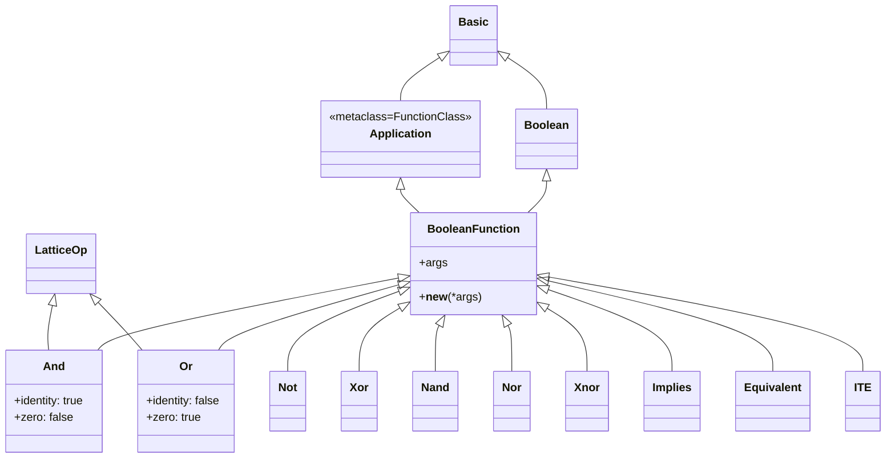
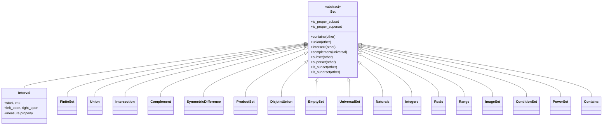
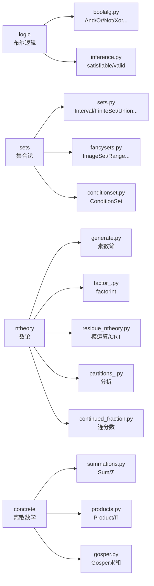

# 逻辑与集合系统源码信源

SymPy 的离散数学基础由四个模块组成：`sympy.logic`（布尔逻辑与 SAT 求解）、`sympy.sets`（集合论）、`sympy.ntheory`（数论）、`sympy.concrete`（求和/乘积符号）。这些模块为代数化简、假设推理、定理证明提供底层支撑。[^logic-init] [^sets-init] [^ntheory-init] [^concrete-init]

## 逻辑模块（sympy.logic）

### 模块导出

logic/__init__.py 导出：[^logic-init]

| 类别 | 符号 |
|---|---|
| 布尔常量 | `true`, `false` |
| 逻辑运算 | `And`, `Or`, `Not`, `Xor`, `Nand`, `Nor`, `Xnor`, `Implies`, `Equivalent`, `ITE` |
| 范式转换 | `to_cnf`, `to_dnf`, `to_nnf`, `simplify_logic` |
| 电路综合 | `POSform`, `SOPform`, `bool_map`, `gateinputcount` |
| SAT 求解 | `satisfiable`（从 `.inference` 导出） |

### 类继承层次



所有布尔函数类定义于 boolalg.py：[^boolalg-source]

| 类 | 行号 | 语义 |
|---|---|---|
| `BooleanFunction` | L490 | 布尔函数基类，继承 `Application` 和 `Boolean` |
| `And` | L580 | 逻辑与（∧），继承 `LatticeOp`，幂等/交换/结合 |
| `Or` | L753 | 逻辑或（∨），继承 `LatticeOp`，幂等/交换/结合 |
| `Not` | L872 | 逻辑非（¬） |
| `Xor` | L988 | 异或（⊕） |
| `Nand` | L1126 | 与非 |
| `Nor` | L1155 | 或非 |
| `Xnor` | L1189 | 同或（异或非） |
| `Implies` | L1220 | 蕴含（→），A→B 等价于 ¬A∨B |
| `Equivalent` | L1304 | 等价（↔） |
| `ITE` | L1383 | 条件（if-then-else），ITE(c, t, e) |

[^boolalg-source]

`And` 和 `Or` 继承 `LatticeOp`（core/operations.py），使用 `_argset: frozenset` 存储参数，自动实现幂等律和交换律。`And.identity = true`（与恒真）、`And.zero = false`（与恒假吸收）；`Or` 反之。

### 布尔运算示例

```python
>>> from sympy import (And, Or, Not, Xor, Implies, Equivalent, ITE,
...                    symbols, true, false)
>>> x, y, z = symbols('x y z')
>>> And(x, y)
x & y
>>> Or(x, y)
x | y
>>> Not(x)
~x
>>> Xor(x, y)
x ^ y
>>> Implies(x, y)
Implies(x, y)
>>> Equivalent(x, y)
Equivalent(x, y)
>>> ITE(x > 0, 1, -1)
>>> And(x, x, y)  # 幂等
x & y
>>> And(x, false)  # 吸收
False
```

### 范式转换

| 函数 | 说明 |
|---|---|
| `to_cnf(expr, simplify=False)` | 合取范式（CNF） |
| `to_dnf(expr, simplify=False)` | 析取范式（DNF） |
| `to_nnf(expr, ...)` | 否定范式（NNF），否定仅作用于原子 |
| `simplify_logic(expr, form=None, ...)` | 布尔表达式化简 |

```python
>>> from sympy import to_cnf, to_dnf, simplify_logic
>>> from sympy.abc import A, B
>>> to_cnf(A >> B)  # Implies 转 CNF
~A | B
>>> to_dnf(A & (B | C))
(A & B) | (A & C)
>>> simplify_logic(A & (A | B))
A
```

### SAT 求解器

`satisfiable(expr, algorithm='dpll2', all_models=False)` 函数定义于 logic/inference.py，实现 DPLL SAT 求解算法：[^logic-init]

- 若公式可满足，返回满足它的一个赋值字典（或所有模型的生成器）
- 若不可满足，返回 `False`
- `valid(expr)` 函数检查公式是否为永真式（重言式）

```python
>>> from sympy import satisfiable, And, Or, Not
>>> from sympy.abc import A, B
>>> satisfiable(And(A, Or(B, Not(B))))
{A: True}
>>> satisfiable(And(A, Not(A)))
False
>>> from sympy.logic.inference import valid
>>> valid(A | Not(A))
True
```

### 布尔映射与电路综合

`bool_map(expr1, expr2)` 查找两个布尔表达式之间的变量映射；`SOPform()`/`POSform()` 从真值表生成最小项表达式；`gateinputcount()` 统计门输入数。

## 集合模块（sympy.sets）

### 模块导出

sets/__init__.py 导出：[^sets-init]

| 类别 | 符号 |
|---|---|
| 集合类 | `Set`, `Interval`, `FiniteSet`, `Union`, `Intersection`, `Complement`, `SymmetricDifference`, `DisjointUnion`, `ProductSet` |
| 特殊集合 | `EmptySet`(=S.EmptySet), `UniversalSet`(=S.UniversalSet), `Naturals`(=S.Naturals), `Naturals0`(=S.Naturals0), `Integers`(=S.Integers), `Rationals`(=S.Rationals), `Reals`(=S.Reals), `Complexes`(=S.Complexes) |
| 高级集合 | `ImageSet`, `Range`, `ConditionSet`, `ComplexRegion`, `PowerSet`, `Contains` |
| 序数 | `Ordinal`, `OmegaPower`, `ord0` |
| 工具函数 | `imageset` |

### 集合类继承



[^sets-init]

### Interval 区间

`Interval(start, end, left_open=False, right_open=False)` 表示实数区间：

```python
>>> from sympy import Interval, oo, S
>>> Interval(0, 1)
Interval(0, 1)
>>> Interval(0, 1, left_open=True)
Interval.Lopen(0, 1)
>>> Interval(0, oo)
Interval(0, oo)
>>> Interval(0, 1).contains(0.5)
True
>>> S.Reals  # 全实数集
Reals
>>> S.EmptySet  # 空集
EmptySet
```

### FiniteSet 有限集

`FiniteSet(*elements)` 表示有限集合：

```python
>>> from sympy import FiniteSet
>>> A = FiniteSet(1, 2, 3)
>>> B = FiniteSet(2, 3, 4)
>>> A.union(B)
{1, 2, 3, 4}
>>> A.intersect(B)
{2, 3}
>>> A - B  # 集合差
{1}
>>> FiniteSet(1, 2).subset(FiniteSet(1, 2, 3))
False
>>> FiniteSet(1, 2).is_subset(FiniteSet(1, 2, 3))
True
```

### 集合运算

| 运算 | 运算符/方法 | 说明 |
|---|---|---|
| 并集 | `A | B` 或 `A.union(B)` 或 `Union(A, B)` | A∪B |
| 交集 | `A & B` 或 `A.intersect(B)` 或 `Intersection(A, B)` | A∩B |
| 补集 | `~A` 或 `Complement(U, A)` | 全集 U 中不在 A 的元素 |
| 差集 | `A - B` 或 `Complement(A, B)` | A\B |
| 对称差 | `A ^ B` 或 `SymmetricDifference(A, B)` | (A\B)∪(B\A) |
| 笛卡儿积 | `A * B` 或 `ProductSet(A, B)` | A×B |
| 包含 | `A.contains(x)` | x∈A |
| 子集 | `A.is_subset(B)` | A⊆B |
| 真子集 | `A.is_proper_subset(B)` | A⊂B |

```python
>>> from sympy import Interval, FiniteSet, Union, Intersection, Complement, ProductSet
>>> R = Interval(-oo, oo)
>>> U = Interval(0, 1)
>>> Complement(R, U)
Union(Interval.open(-oo, 0), Interval.open(1, oo))
>>> ProductSet(FiniteSet(1,2), FiniteSet('a','b'))
ProductSet({1, 2}, {a, b})
>>> list(ProductSet(FiniteSet(1,2), FiniteSet('a','b')))
[(1, a), (1, b), (2, a), (2, b)]
```

### ImageSet 与 ConditionSet

`ImageSet(lambda, base_set)` 表示集合在映射下的像；`ConditionSet(sym, condition, base_set)` 表示满足条件的元素集合：

```python
>>> from sympy import ImageSet, ConditionSet, S, Lambda, Symbol, pi
>>> from sympy.abc import x
>>> ImageSet(Lambda(x, 2*x), S.Integers)
ImageSet(Lambda(x, 2*x), Integers)
>>> ConditionSet(x, x > 0, S.Reals)
ConditionSet(x, x > 0, Reals)
>>> from sympy import Range
>>> Range(10)
Range(0, 10, 1)
>>> list(Range(5))
[0, 1, 2, 3, 4]
```

### 标准集合单例

| 集合 | 访问方式 | 说明 |
|---|---|---|
| 空集 | `S.EmptySet` | ∅ |
| 全集 | `S.UniversalSet` | 通用集合 |
| 自然数 | `S.Naturals` | {1, 2, 3, ...} |
| 非负整数 | `S.Naturals0` | {0, 1, 2, ...} |
| 整数 | `S.Integers` | ℤ |
| 有理数 | `S.Rationals` | ℚ |
| 实数 | `S.Reals` | ℝ |
| 复数 | `S.Complexes` | ℂ |

`S` 是 `SingletonRegistry` 实例，提供所有单例对象的统一访问。

## 数论模块（sympy.ntheory）

### 模块导出

ntheory/__init__.py 导出的公开 API 分为以下类别：[^ntheory-init]

| 类别 | 符号 |
|---|---|
| 素数生成 | `Sieve`, `sieve`, `primerange`, `nextprime`, `prevprime`, `primepi`, `prime`, `randprime`, `primorial`, `composite`, `compositepi` |
| 素性检测 | `isprime`, `is_gaussian_prime`, `is_mersenne_prime` |
| 因数分解 | `factorint`, `primefactors`, `divisors`, `proper_divisors`, `divisor_count`, `proper_divisor_count`, `divisor_sigma`, `perfect_power`, `multiplicity`, `factorrat`, `pollard_rho`, `pollard_pm1` |
| 欧拉函数 | `totient`, `reduced_totient`, `mobius` |
| 模运算 | `n_order`, `primitive_root`, `is_primitive_root`, `sqrt_mod`, `nthroot_mod`, `quadratic_residues`, `is_quad_residue`, `legendre_symbol`, `jacobi_symbol`, `discrete_log`, `quadratic_congruence`, `polynomial_congruence` |
| 分拆 | `npartitions` |
| 组合 | `binomial_coefficients`, `binomial_coefficients_list`, `multinomial_coefficients` |
| 连分数 | `continued_fraction`, `continued_fraction_periodic`, `continued_fraction_iterator`, `continued_fraction_reduce`, `continued_fraction_convergents` |
| 特殊函数 | `npartitions`（整数分拆） |
| 数位 | `digits`, `count_digits`, `is_palindromic` |
| ECM/QS | `ecm`, `qs`, `qs_factor` |
| 数论函数 | `primenu`, `primeomega`, `mersenne_prime_exponent`, `is_perfect`, `is_abundant`, `is_deficient`, `is_amicable`, `is_carmichael`, `abundance`, `dra`, `drm` |

[^ntheory-init]

注：`fibonacci`/`lucas`/`tribonacci` 定义于 `sympy.functions.combinatorial.numbers`（fibonacci L188, lucas L276, tribonacci L328），`crt`（中国剩余定理）定义于 `sympy.ntheory.modular`（L25），`mod_inverse` 定义于 `sympy.core.intfunc`（L386），均可从顶层 `sympy` 命名空间导入。

### 素数

```python
>>> from sympy import isprime, nextprime, prevprime, primerange, primepi, Sieve, sieve
>>> isprime(97)
True
>>> isprime(100)
False
>>> nextprime(100)
101
>>> prevprime(100)
97
>>> list(primerange(10, 30))
[11, 13, 17, 19, 23, 29]
>>> primepi(100)  # π(100): 100以内素数个数
25
>>> sieve[20]  # 第20个素数
71
>>> sieve.primerange(10, 30)  # 生成器
<generator object Sieve.primerange at ...>
```

`Sieve` 类实现埃拉托斯特尼筛法（Sieve of Eratosthenes），`sieve` 是全局单例实例，自动扩展并缓存素数表。

### 因数分解

```python
>>> from sympy import factorint, primefactors, divisors, divisor_count
>>> factorint(360)
{2: 3, 3: 2, 5: 1}
>>> primefactors(360)
[2, 3, 5]
>>> divisors(360)
[1, 2, 3, 4, 5, 6, 8, 9, 10, 12, 15, 18, 20, 24, 30, 36, 40, 45, 60, 72, 90, 120, 180, 360]
>>> divisor_count(360)
24
>>> from sympy import perfect_power
>>> perfect_power(16)
(2, 4)  # 2^4 = 16
```

`factorint(n)` 返回 `{prime: exponent}` 字典，是数论模块的核心函数。

### 数论函数

```python
>>> from sympy import totient, mobius, divisor_sigma
>>> totient(12)  # 欧拉函数 φ(12) = |{1,5,7,11}|
4
>>> mobius(12)  # 莫比乌斯函数 μ(12) = 0（有平方因子）
0
>>> mobius(30)  # μ(2·3·5) = (-1)^3 = -1
-1
>>> divisor_sigma(12)  # σ(12) = 1+2+3+4+6+12
28
```

### 模运算与中国剩余定理

```python
>>> from sympy.ntheory.modular import crt
>>> from sympy import mod_inverse, n_order
>>> crt([3, 5, 7], [2, 3, 2])  # x ≡ 2 (mod 3), x ≡ 3 (mod 5), x ≡ 2 (mod 7)
(23, 105)
>>> mod_inverse(3, 7)  # 3·? ≡ 1 (mod 7)
5
>>> n_order(3, 7)  # 3 mod 7 的乘法阶
6
```

`crt(moduli, remainders)` 返回 `(solution, lcm)` 元组。

### 连分数与组合数

```python
>>> from sympy.ntheory.continued_fraction import continued_fraction_periodic
>>> continued_fraction_periodic(1, 2, 7)  # 二次无理数的连分数展开
>>> from sympy import binomial_coefficients
>>> binomial_coefficients(3)  # (1+x)^3 系数
{(0, 3): 1, (1, 2): 3, (2, 1): 3, (3, 0): 1}
>>> from sympy import npartitions
>>> npartitions(5)  # 5的分拆数
7
```

### Fibonacci/Lucas 序列

`fibonacci`、`lucas`、`tribonacci` 定义于 `sympy.functions.combinatorial.numbers`，可直接从 sympy 顶层导入：

```python
>>> from sympy import fibonacci, lucas, tribonacci
>>> fibonacci(10)
55
>>> [fibonacci(i) for i in range(10)]
[0, 1, 1, 2, 3, 5, 8, 13, 21, 34]
>>> lucas(10)
123
>>> tribonacci(10)
105
```

## 离散数学（sympy.concrete）

### 模块导出

concrete/__init__.py 导出：[^concrete-init]

| 符号 | 来源 | 说明 |
|---|---|---|
| `Sum` / `summation` | `summations.py` | 求和符号 Σ |
| `Product` / `product` | `products.py` | 乘积符号 ∏ |

[^concrete-init]

### Sum 求和

`Sum` 类表示未求值的求和符号（∑ notation），`summation()` 函数求值求和：

```python
>>> from sympy import Sum, summation, symbols, oo
>>> n, k = symbols('n k', integer=True)
>>> s = Sum(k, (k, 1, n))
>>> s
Sum(k, (k, 1, n))
>>> s.doit()
n**2/2 + n/2
>>> summation(k**2, (k, 1, n))
n**3/3 + n**2/2 + n/6
>>> from sympy import factorial
>>> Sum(1/factorial(k), (k, 0, oo)).doit()
E
```

### Product 乘积

`Product` 类表示未求值的乘积符号（∏ notation），`product()` 函数求值乘积：

```python
>>> from sympy import Product, product
>>> from sympy.abc import a, b
>>> p = Product(k, (k, 1, n))
>>> p.doit()
n!
>>> product(k, (k, 1, 5))
120
```

### Gosper 求和

`gosper_sum(f, k)` 函数定义于 `concrete/gosper.py`（L160），实现 Gosper 算法求不定和：

```python
>>> from sympy.concrete.gosper import gosper_sum
>>> from sympy.abc import k
>>> gosper_sum(k, (k, 0, n))
n**2/2 + n/2
```

## 各模块关系概览



[^logic-init]: logic/__init__.py — 逻辑模块入口
[^boolalg-source]: logic/boolalg.py — 布尔代数类定义
[^sets-init]: sets/__init__.py — 集合模块入口
[^ntheory-init]: ntheory/__init__.py — 数论模块入口
[^concrete-init]: concrete/__init__.py — 离散数学模块入口
