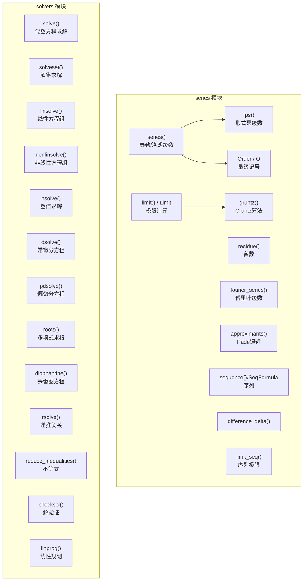

# 级数/极限与求解器源码信源

SymPy 的 `series` 模块提供极限、泰勒级数、洛朗级数、傅里叶级数、形式幂级数等微积分工具；`solvers` 模块提供代数方程求解（solve/solveset）、线性/非线性方程组（linsolve/nonlinsolve）、微分方程（dsolve/pdsolve）、丢番图方程（diophantine）、递推关系（rsolve）、不等式求解等能力。两个模块通过 `__init__.py` 统一导出。[^F-107] [^F-111]

## 模块架构



---

## 一、级数模块（series/）

`series/__init__.py` 导出的公开 API 包括：`Order`/`O`、`limit`/`Limit`、`gruntz`、`series`、`approximants`、`pade_approximant`、`residue`、`SeqPer`、`SeqFormula`、`sequence`、`SeqAdd`、`SeqMul`、`fourier_series`、`fps`、`difference_delta`、`limit_seq` 及 `EmptySequence`。[^F-107]

### 1.1 series() — 泰勒/洛朗级数展开

`series(expr, x=None, x0=0, n=6, dir="+")` 计算表达式在点 `x0` 处的级数展开，`n` 指定展开阶数（默认 6 阶，即到 O(x⁶)），`dir` 指定展开方向（`"+"` 右极限、`"-"` 左极限）。[^F-110]

`series()` 在内部通过 `_eval_nseries()` 方法分发到各函数类的具体实现，返回结果通常包含一个 `Order`/`O` 项表示截断误差。

```python
from sympy import series, sin, cos, exp, log, Symbol, O
x = Symbol('x')

# 基本泰勒展开（默认在 x=0, 展开到 6 阶）
series(sin(x), x, 0, 6)
# → x - x**3/6 + x**5/120 + O(x**6)

series(cos(x), x, 0, 6)
# → 1 - x**2/2 + x**4/24 + O(x**6)

series(exp(x), x, 0, 5)
# → 1 + x + x**2/2 + x**3/6 + x**4/24 + O(x**5)

# 在非零点展开
series(1/(1+x), x, 1, 4)
# → 1/2 - (x-1)/4 + (x-1)**2/8 - (x-1)**3/16 + O((x-1)**4, (x, 1))

# 洛朗级数（含负幂次）
series(1/sin(x), x, 0, 5)
# → 1/x + x/6 + 7*x**3/360 + O(x**4)

# 对数展开
series(log(1+x), x, 0, 5)
# → x - x**2/2 + x**3/3 - x**4/4 + O(x**5)

# 移除 O 项（获取截断多项式）
series(sin(x), x, 0, 6).removeO()
# → x**5/120 - x**3/6 + x
```

### 1.2 limit() — 极限计算

`limit(e, z, z0, dir="+")` 使用 Gruntz 算法（基于级数展开和渐近分析）计算表达式 `e(z)` 在 `z→z0` 时的极限。`dir` 参数支持 `"+"`（右极限，默认）、`"-"`（左极限）、`"+-"`（双向极限）。`Limit` 类表示未求值的极限。[^F-109]

```python
from sympy import limit, Limit, sin, cos, exp, log, oo, Symbol
x = Symbol('x')

# 基本极限
limit(sin(x)/x, x, 0)          # → 1
limit((1 + 1/x)**x, x, oo)     # → E
limit(exp(-1/x**2), x, 0)      # → 0

# 一侧极限
limit(1/x, x, 0, dir='+')      # → oo
limit(1/x, x, 0, dir='-')      # → -oo

# 洛必达法则类型
limit((cos(x)-1)/x**2, x, 0)   # → -1/2

# 未求值极限
L = Limit(sin(x)/x, x, 0)
L                              # → Limit(sin(x)/x, x, 0)
L.doit()                       # → 1

# Gruntz 算法（底层）
from sympy.series import gruntz
gruntz(sin(x)/x, x, 0)         # → 1
```

### 1.3 Order / O — 量级记号

`Order` 类（别名 `O`）表示大 O 记号，描述函数在某点附近的量级行为，用于级数截断和渐近分析。`Order` 继承自 `Expr`。[^F-108]

```python
from sympy import O, Order, sin, Symbol
x, y = symbols('x y')

# 基本用法
O(x**2)                       # → O(x**2)
O(x) + O(x**2)                # → O(x)  (低阶吸收高阶)
x + O(x**2)                   # → x + O(x**2)

# 在级数中自动出现
from sympy import series
series(sin(x), x, 0, 4)       # → x - x**3/6 + O(x**4)

# 检查量级
O(x**2).contains(O(x**3))     # O(x³) 在 O(x²) 内
```

### 1.4 residue() — 留数计算

`residue(expr, x, x0)` 计算表达式在点 `x0` 处的留数（洛朗展开中 (x-x0)^{-1} 项的系数）。

```python
from sympy import residue, Symbol, exp
x = Symbol('x')

residue(1/x, x, 0)             # → 1
residue(exp(x)/x**2, x, 0)     # → 1 (exp(x)/x² 的留数为 1/0! = 1)
residue(1/(x**2+1), x, -I)     # → I/2
```

### 1.5 序列与形式幂级数

SymPy 提供多种序列表示和形式幂级数工具：[^F-107]

| 类/函数 | 说明 |
|---------|------|
| `SeqFormula` | 由通项公式定义的序列 |
| `SeqPer` | 周期序列 |
| `SeqAdd` / `SeqMul` | 序列的加法/乘法 |
| `sequence` | 便捷构造函数 |
| `fps` | 形式幂级数（Formal Power Series） |
| `fourier_series` | 傅里叶三角级数 |
| `difference_delta` | 差分 |
| `limit_seq` | 序列极限 |

```python
from sympy import (SeqFormula, SeqPer, sequence, fps, fourier_series,
                   difference_delta, limit_seq, factorial, Symbol,
                   sin, cos, pi, oo, S)
n, x = symbols('n x', integer=True), Symbol('x')

# 序列构造
s1 = SeqFormula(n**2, (n, 0, oo))
s1[0:5]                        # → [0, 1, 4, 9, 16]

s2 = SeqPer((1, 2, 3), (n, 0, oo))
s2[0:7]                        # → [1, 2, 3, 1, 2, 3, 1]

# 便捷构造
s3 = sequence(n**2 + n, (n, 0, 5))
list(s3)                       # → [0, 2, 6, 12, 20, 30]

# 形式幂级数
f = fps(sin(x), x)
f[0:8:2]                       # 取偶数阶项系数
f.truncate(6)                  # → x - x**3/6 + x**5/120 + O(x**6)

# 傅里叶级数
f = fourier_series(x**2, (x, -pi, pi))
f.truncate(3)
# → pi**2/3 - 4*cos(x) + cos(2*x) - 4*cos(3*x)/9

# 差分
difference_delta(n**2, n)      # → 2*n - 1 (Δ(n²) = (n+1)² - n²)

# 序列极限
limit_seq((n**2 + 1)/(n**2 + n))  # → 1
```

### 1.6 approximants() — Padé 逼近

`approximants(l, X, Y)` 计算幂级数系数列表的 Padé 逼近，`pade_approximant` 为单阶便捷函数。

```python
from sympy import pade_approximant, exp, series, Symbol
x = Symbol('x')

# 用泰勒级数系数构造 Padé 逼近
s = series(exp(x), x, 0, 6).removeO()
# pade_approximant(s, x, 3)  # (3,3) 型 Padé 逼近
```

---

## 二、求解器模块（solvers/）

`solvers/__init__.py` 导出了广泛的方程求解工具，涵盖代数方程、微分方程、递推关系、不等式、线性规划等。[^F-111]

### 2.1 solve() — 代数方程求解

`solve(f, *symbols, **flags)` 是 SymPy 最常用的方程求解函数，求解 `f(x) = 0`（或 `f(x) = g(x)`），返回解的列表。支持 `dict=True`（返回字典列表）、`set=True`（返回解集）、`check=True`（验证解）等参数。[^F-SOLVE]

```python
from sympy import solve, symbols, Eq, sin, exp, sqrt, I
x, y, z = symbols('x y z')

# 单变量方程
solve(x**2 - 4, x)              # → [-2, 2]
solve(x**2 + 1, x)              # → [-I, I]
solve(sin(x) - 1, x)            # → [pi/2]  (主解)

# 方程形式（Eq）
solve(Eq(x**2, 4), x)           # → [-2, 2]

# 多变量方程组
solve([x + y - 3, x - y - 1], [x, y])
# → {x: 2, y: 1}

# dict=True 返回字典列表
solve(x**2 - 4, x, dict=True)  # → [{x: -2}, {x: 2}]

# check=False 跳过解验证（加速但可能有增根）
solve(sqrt(x+2) - x, x)         # → [2]  (自动验证排除增根)

# 符号参数求解
a, b, c = symbols('a b c')
solve(a*x**2 + b*x + c, x)
# → [(-b + sqrt(-4*a*c + b**2))/(2*a), -(b + sqrt(-4*a*c + b**2))/(2*a)]
```

### 2.2 solveset() — 集合化求解

`solveset(f, symbol=None, domain=S.Complexes)` 以**集合**形式返回方程或不等式的解，是 solve 的现代替代品。默认在复数域 `S.Complexes` 上求解，可指定实数域 `S.Reals` 等。返回 `FiniteSet`、`Interval`、`ConditionSet`、`Union` 等集合对象。[^F-112]

| 域 | 说明 |
|----|------|
| `S.Complexes`（默认） | 复数域 |
| `S.Reals` | 实数域 |
| `S.Integers` | 整数域 |
| `S.Naturals` / `S.Naturals0` | 正整数/非负整数 |
| `Interval(a,b)` | 区间 |

```python
from sympy import solveset, S, Interval, symbols, sin, oo, ConditionSet
x = symbols('x')

# 多项式方程
solveset(x**2 - 4, x)           # → {-2, 2} (FiniteSet)
solveset(x**2 + 1, x, S.Reals)  # → EmptySet (实数域无解)

# 三角方程（返回主解的周期推广）
solveset(sin(x), x, S.Reals)
# → Union(ImageSet(Lambda(_n, 2*_n*pi), Integers),
#         ImageSet(Lambda(_n, 2*_n*pi + pi), Integers))

# 不等式
solveset(x**2 - 4 < 0, x, S.Reals)  # → (-2, 2) (Interval.open(-2, 2))

# 无解/条件解
solveset(x - x, x)              # → Complexes (恒成立)
solveset(x - x - 1, x)          # → EmptySet (矛盾)
```

### 2.3 linsolve() — 线性方程组求解

`linsolve(system, *symbols)` 求解 N 个变量 M 个线性方程的方程组。支持三种输入形式：增广矩阵、方程列表、AX=b 形式。[^F-112]

```python
from sympy import linsolve, linear_eq_to_matrix, symbols, Matrix
x, y, z = symbols('x y z')

# 方程列表形式
linsolve([x + y + z - 1, x + y + 2*z - 3], (x, y, z))
# → {(-y - 1, y, 2)}  (z=2, x+y=-1, y自由)

# 增广矩阵形式
M = Matrix([[1, 2, 3, 1], [4, 5, 6, 2], [7, 8, 10, 3]])
linsolve(M, x, y, z)
# → {(0, -1, 1)}  (唯一解)

# AX=b 形式
A = Matrix([[1, 1], [1, -1]])
b = Matrix([3, 1])
linsolve((A, b), x, y)
# → {(2, 1)}

# linear_eq_to_matrix: 将方程列表转换为矩阵形式
eqs = [x + y - 3, x - y - 1]
A, b = linear_eq_to_matrix(eqs, [x, y])
# A → [[1,1],[1,-1]], b → [3,1]
```

### 2.4 nonlinsolve() — 非线性方程组求解

`nonlinsolve(system, *symbols)` 求解非线性方程组，使用代入消元和 Gröbner 基等方法。[^F-112]

```python
from sympy import nonlinsolve, symbols
x, y = symbols('x y')

# 非线性系统
nonlinsolve([x**2 + y**2 - 1, x - y], [x, y])
# → {(-√2/2, -√2/2), (√2/2, √2/2)}

# 含超越函数
nonlinsolve([x*y - 1, x - 2], [x, y])
# → {(2, 1/2)}
```

### 2.5 nsolve() — 数值求解

`nsolve(f, x0, **kwargs)` 使用数值方法（二分法、牛顿法等）求方程的数值根。`x0` 可以是初始猜测值或搜索区间。

```python
from sympy import nsolve, cos, Symbol, sin
x = Symbol('x')

# 单初始猜测
nsolve(cos(x) - x, x, 1)        # → 0.739085133215161 (Dottie数)

# 区间搜索
nsolve(sin(x), x, (3, 4))       # → 3.14159265358979 (π)

# 方程组数值解
from sympy import symbols
y = Symbol('y')
nsolve((x**2 + y**2 - 1, x - y), (x, y), (1, 1))
# → Matrix([[0.70710678118], [0.70710678118]])
```

### 2.6 dsolve() — 常微分方程求解

`dsolve(eq, func=None, hint="default", simplify=True, ics=None, ...)` 求解常微分方程（组）。它使用一个 hint 系统分类 ODE 类型，支持多种求解方法。`classify_ode(eq)` 返回所有可用的求解 hint。[^F-DSOLVE]

常用的 ODE hint 类型包括：

| hint | 方程类型 |
|------|---------|
| `separable` | 可分离变量 |
| `1st_exact` | 恰当方程 |
| `1st_linear` | 一阶线性 |
| `Bernoulli` | Bernoulli 方程 |
| `homogeneous` | 齐次方程 |
| `1st_homogeneous_coeff_best` | 齐次系数最佳方法 |
| `almost_linear` | 近线性 |
| `linear_coefficients` | 线性系数 |
| `separable_reduced` | 可分离约化 |
| `Riccati_special_minus2` | Riccati 特殊情形 |
| `nth_linear_constant_coeff_homogeneous` | n阶常系数齐次 |
| `nth_linear_constant_coeff_undetermined_coefficients` | 待定系数法 |
| `nth_linear_constant_coeff_variation_of_parameters` | 参数变易法 |
| `nth_order_reducible` | 可降阶高阶方程 |
| `Liouville` | Liouville 型 |
| `all` | 尝试所有方法 |

```python
from sympy import (dsolve, classify_ode, Function, Symbol,
                   Derivative, Eq, sin, cos, exp, checkodesol)
x = Symbol('x')
f = Function('f')
y = f(x)

# 一阶 ODE: f'(x) = f(x) (指数增长)
eq = Derivative(y, x) - y
dsolve(eq, y)
# → Eq(f(x), C1*exp(x))

# 二阶常系数齐次 ODE: f'' + f = 0 (简谐振动)
eq2 = Derivative(y, x, 2) + y
dsolve(eq2, y)
# → Eq(f(x), C1*sin(x) + C2*cos(x))

# 带初值条件
eq3 = Derivative(y, x) - y
sol = dsolve(eq3, y, ics={f(0): 1})
# → Eq(f(x), exp(x))

# 分类 ODE 类型
classify_ode(Derivative(y, x) - y, y)
# → ('separable', '1st_exact', '1st_linear', ...)

# 验证解
sol = dsolve(eq, y)
checkodesol(eq, sol)            # → (True, 0)  (验证通过)
```

### 2.7 pdsolve() — 偏微分方程求解

`pdsolve(eq, func=None, **kwargs)` 求解偏微分方程，`classify_pde(eq)` 分类 PDE 类型，`checkpdesol(eq, sol)` 验证解。

```python
from sympy import pdsolve, Function, Symbol, Derivative, Eq
x, t = symbols('x t')
f = Function('f')
u = f(x, t)

# 简单 PDE
eq = Derivative(u, x) + Derivative(u, t)
pdsolve(eq, u)
# → Eq(f(x, t), F(x - t))  (行波解)
```

### 2.8 roots() — 多项式求根

`roots(f, *gens, **flags)` 来自 `polys/polyroots.py`（非 solvers 模块直接导出，但通过顶层 sympy 命名空间可用），返回多项式根的字典 `{root: multiplicity}`。

```python
from sympy import roots, Symbol
x = Symbol('x')

roots(x**3 - 6*x**2 + 11*x - 6, x)
# → {1: 1, 2: 1, 3: 1}  (三个单根)

roots(x**3 - 3*x**2 + 3*x - 1, x)
# → {1: 3}  (三重根)

roots(x**2 + 1, x)
# → {-I: 1, I: 1}
```

### 2.9 diophantine() — 丢番图方程求解

`diophantine(eq, t=None, syms=None)` 求解整系数不定方程（丢番图方程），返回整数解的元组。

```python
from sympy import diophantine, Symbol
x, y, z = symbols('x y z', integer=True)

# 线性丢番图方程: 2x + 3y = 5
diophantine(2*x + 3*y - 5)
# → {(3*t_0 - 5, 5 - 2*t_0)}  (参数化解)

# Pell 方程: x² - 2y² = 1
diophantine(x**2 - 2*y**2 - 1)
```

### 2.10 rsolve() — 递推关系求解

`rsolve(f, y, init=None)` 求解递推关系，支持 `rsolve_poly`（多项式系数）、`rsolve_ratio`（有理系数）、`rsolve_hyper`（超几何系数）。

```python
from sympy import rsolve, Function, Symbol
n = Symbol('n', integer=True, nonnegative=True)
y = Function('y')

# Fibonacci 递推: y(n+2) = y(n+1) + y(n)
f = y(n+2) - y(n+1) - y(n)
rsolve(f, y(n), {y(0): 0, y(1): 1})
# → (sqrt(5)/5)*(1/2 + sqrt(5)/2)**n - sqrt(5)*(1/2 - sqrt(5)/2)**n/5
#   = (φⁿ - ψⁿ)/√5  (Binet公式)
```

### 2.11 不等式求解

`solvers/inequalities.py` 提供多种不等式求解函数：[^F-111]

| 函数 | 说明 |
|------|------|
| `reduce_inequalities` | 化简单变量/多变量不等式组 |
| `solve_univariate_inequality` | 求解单变量不等式 |
| `solve_poly_inequality` | 求解多项式不等式 |
| `solve_rational_inequalities` | 求解有理函数不等式 |
| `reduce_abs_inequality` | 化简含绝对值的不等式 |
| `reduce_abs_inequalities` | 化简含绝对值的不等式组 |

```python
from sympy import reduce_inequalities, solve_univariate_inequality
from sympy import symbols, S
x = symbols('x')

# 单不等式
reduce_inequalities(x**2 - 4 < 0, x)
# → (-2 < x) & (x < 2)

# 不等式组
reduce_inequalities([x > 0, x**2 < 4], x)
# → (0 < x) & (x < 2)

# 使用 solveset 解不等式（推荐方式）
from sympy import solveset
solveset(x**2 - 4 < 0, x, S.Reals)  # → Interval.open(-2, 2)
```

### 2.12 其他求解工具

| 函数 | 说明 |
|------|------|
| `solve_linear` | 求解单个线性方程 |
| `solve_linear_system` | 求解线性系统（矩阵形式） |
| `solve_linear_system_LU` | LU 分解求解线性系统 |
| `solve_undetermined_coeffs` | 待定系数法 |
| `checksol` | 验证解是否满足方程 |
| `det_quick` | 快速行列式计算 |
| `inv_quick` | 快速矩阵求逆 |
| `solve_poly_system` | 多项式方程组 |
| `solve_triangulated` | 三角化系统求解 |
| `factor_system` | 系统因式分解 |
| `pde_separate` / `pde_separate_add` / `pde_separate_mul` | PDE 分离变量法 |
| `decompogen` | 函数分解 |
| `substitution` | 代入法求解 |
| `homogeneous_order` | 齐次函数阶数 |
| `ode_order` | ODE 阶数 |
| `linprog` / `lpmin` / `lpmax` | 线性规划 |

```python
from sympy import solve_linear, checksol, symbols
x = symbols('x')

# solve_linear: 解线性方程
solve_linear(2*x + 3, x)        # → (x, -3/2)

# checksol: 验证解
checksol(x**2 - 4, x, 2)        # → True
checksol(x**2 - 4, x, 3)        # → False
```

---

## 三、求解器对比与选择指南

### solve() vs solveset()

| 特性 | `solve()` | `solveset()` |
|------|-----------|-------------|
| 返回类型 | list / dict | Set 对象（FiniteSet/Interval/Union 等）|
| 三角方程 | 返回主解（有限列表） | 返回全部解（含周期 ImageSet）|
| 无限解 | 不返回或只返回部分 | 用 ConditionSet/ImageSet 表示 |
| 定义域 | 默认复数域 | 通过 domain 参数指定 |
| 不等式 | 不直接支持 | 原生支持 |
| 发展状态 | 维护模式 | 推荐使用 |

```python
from sympy import solve, solveset, sin, symbols, pi, S
x = symbols('x')

# 三角方程对比
solve(sin(x), x)                # → [0, pi]  (仅主值范围)
solveset(sin(x), x, S.Reals)   # → {2nπ} ∪ {2nπ+π} (全部解)
```

### 级数展开与求解器调用关系

```mermaid
flowchart LR
    EXPR["表达式"] -->|.series()| SER["series()<br/>_eval_nseries()"]
    EXPR -->|.limit()| LIM["limit()<br/>gruntz()"]
    EXPR -->|.diff()| DER["Derivative"]
    EXPR -->|.integrate()| INT["Integral"]

    SER --> ORD["Order/O<br/>截断项"]
    LIM --> ASYM["渐近展开"]

    EQ["方程"] --> SOL["solve()"]
    EQ --> SSET["solveset()"]
    EQ -->|线性| LIN2["linsolve()"]
    EQ -->|非线性| NLIN2["nonlinsolve()"]
    EQ -->|ODE| DS["dsolve()<br/>classify_ode()"]
    EQ -->|PDE| PD["pdsolve()"]
    EQ -->|数值| NS["nsolve()"]
    EQ -->|丢番图| DIO2["diophantine()"]
    EQ -->|递推| RS["rsolve()"]
```

---

## 四、代码示例综合

### 级数分析示例

```python
from sympy import (series, limit, residue, fourier_series, fps,
                   sin, cos, exp, log, symbols, pi, oo, O)
x = symbols('x')

# 1. 泰勒展开分析函数局部行为
print("sin(x) 到 8 阶:", series(sin(x), x, 0, 8))
print("exp(x) 到 5 阶:", series(exp(x), x, 0, 5))
print("log(1+x)/(1-x) 到 4 阶:", series(log(1+x)/(1-x), x, 0, 4))

# 2. 极限分析
print("lim_{x→0} sin(x)/x =", limit(sin(x)/x, x, 0))
print("lim_{x→∞} (1+1/x)^x =", limit((1+1/x)**x, x, oo))
print("lim_{x→0+} x·log(x) =", limit(x*log(x), x, 0, dir='+'))

# 3. 留数计算
print("res(1/x, 0) =", residue(1/x, x, 0))
print("res(cot(x)/x, 0) =", residue(cos(x)/(sin(x)*x), x, 0))

# 4. 傅里叶级数
f = fourier_series(x**2, (x, -pi, pi))
print("Fourier of x²:", f.truncate(3))
```

### 方程求解示例

```python
from sympy import (solve, solveset, linsolve, dsolve, nsolve,
                   Function, Derivative, symbols, Eq, Matrix,
                   sin, cos, exp, pi, S, Interval, roots)
x, y, z = symbols('x y z')
f = Function('f')

# 1. 代数方程
print("x²-5x+6=0:", solve(x**2 - 5*x + 6, x))
print("x³-1=0 (复域):", solveset(x**3 - 1, x))
print("x²>4 (实域):", solveset(x**2 > 4, x, S.Reals))

# 2. 线性方程组
A = Matrix([[1, 2, 3], [4, 5, 6], [7, 8, 10]])
b = Matrix([1, 2, 3])
print("线性方程组解:", linsolve((A, b), x, y, z))

# 3. 微分方程
ode = Derivative(f(x), x, 2) + f(x)
print("y''+y=0 通解:", dsolve(ode, f(x)))
print("y'=y, y(0)=1:", dsolve(Derivative(f(x),x)-f(x), f(x),
                                 ics={f(0): 1}))

# 4. 数值求解
print("cos(x)=x 数值解:", nsolve(cos(x)-x, x, 1))

# 5. 多项式求根
print("(x-1)(x-2)²(x-3)=0 的根:", roots((x-1)*(x-2)**2*(x-3), x))
```

---

## 脚注

[^F-107]: series 模块导出清单，参见 series/__init__.py
[^F-108]: Order 类定义，参见 series/order.py
[^F-109]: limit 函数与 Limit 类，参见 series/limits.py
[^F-110]: series 函数定义，参见 series/series.py
[^F-111]: solvers 模块导出清单，参见 solvers/__init__.py
[^F-112]: solveset/linsolve/nonlinsolve 定义，参见 solvers/solveset.py
[^F-SOLVE]: solve 函数定义，参见 solvers/solvers.py
[^F-DSOLVE]: dsolve 函数定义，参见 solvers/ode/ode.py
