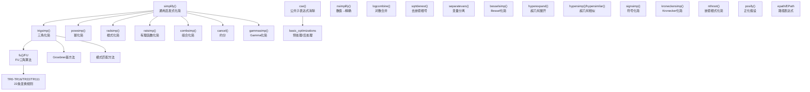
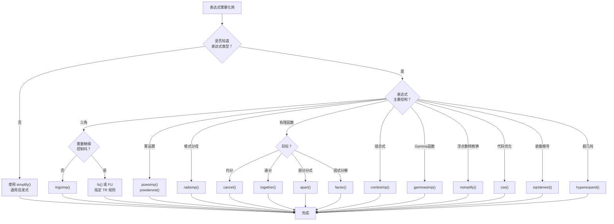

# 化简策略体系源码信源

SymPy 的 `simplify` 模块提供了多种数学表达式化简策略，从通用的 `simplify()` 到面向特定结构的专用化简函数（三角、幂、根式、有理函数、组合函数等），以及公共子表达式消除（CSE）等代码优化工具。化简函数通过 `simplify/__init__.py` 统一导出。[^F-101]

## 模块架构总览



## 一、化简函数总表

`simplify/__init__.py` 导出的全部公开 API 如下：[^F-101]

| 函数 | 来源文件 | 用途 | 适用场景 |
|------|---------|------|---------|
| `simplify` | simplify.py | 通用启发式化简 | 日常交互、不知道表达式结构 |
| `trigsimp` | trigsimp.py | 三角恒等式化简 | 含 sin/cos/tan 的表达式 |
| `exptrigsimp` | trigsimp.py | 指数-三角互化 | 复指数与三角函数混合 |
| `powsimp` | powsimp.py | 幂运算合并 | 同底/同指数的幂项 |
| `powdenest` | powsimp.py | 幂嵌套展开 | (aᵇ)ᶜ → a^{bc} 等 |
| `radsimp` | radsimp.py | 根式有理化 | 分母含根号 |
| `ratsimp` | ratsimp.py | 有理函数化简 | 多项式分式 |
| `ratsimpmodprime` | ratsimp.py | 模素数有理化简 | 有限域运算 |
| `combsimp` | combsimp.py | 组合式化简 | 含阶乘/二项式系数 |
| `gammasimp` | gammasimp.py | Gamma 函数化简 | 含 gamma/阶乘 |
| `fu` | fu.py | FU 算法三角化简 | 需要精细控制三角变换 |
| `FU` | fu.py | FU 变换规则集合 | 低级规则组合 |
| `cse` | cse_main.py | 公共子表达式消除 | 代码生成、大表达式优化 |
| `nsimplify` | simplify.py | 浮点数→精确表达式 | 0.707→√2/2 类问题 |
| `hyperexpand` | hyperexpand.py | 超几何函数展开 | hyper/meijerg 展开 |
| `hypersimp` | simplify.py | 超几何项化简 | 组合恒等式 |
| `hypersimilar` | simplify.py | 超几何相似判定 | 组合恒等式 |
| `logcombine` | simplify.py | 对数合并 | log(a)+log(b)→log(ab) |
| `sqrtdenest` | sqrtdenest.py | 去嵌套根号 | √(a+b√c) 化简 |
| `nthroot` | simplify.py | 根式和实 n 次根 | √(2+√3) 类表达式 |
| `separatevars` | simplify.py | 变量分离 | 多变量乘积分离 |
| `besselsimp` | simplify.py | Bessel 函数化简 | 含 Bessel 函数 |
| `kroneckersimp` | simplify.py | Kronecker δ 化简 | 含 KroneckerDelta |
| `signsimp` | simplify.py | 符号表达式化简 | 含 sign/Abs 等 |
| `collect` | radsimp.py | 同类项收集 | 按变量/因子收项 |
| `rcollect` | radsimp.py | 递归收集 | 嵌套表达式收集 |
| `collect_const` | radsimp.py | 常数收集 | 提取常数因子 |
| `fraction` | radsimp.py | 提取分子分母 | 取分式组分 |
| `numer` | radsimp.py | 取分子 | — |
| `denom` | radsimp.py | 取分母 | — |
| `posify` | simplify.py | 正化假设 | 将变量设为 positive |
| `epath` / `EPath` | epathtools.py | 表达式路径 | 按路径访问子表达式 |

---

## 二、核心化简函数详解

### 2.1 simplify() — 通用启发式化简

`simplify(expr, ratio=1.7, measure=count_ops, rational=False, inverse=False, doit=True, **kwargs)` 是最常用的化简入口，它内部依次尝试多种策略（cancel、expand、trigsimp、powsimp 等），以 `measure`（默认 `count_ops`，即操作数计数）衡量复杂度，若结果复杂度与输入复杂度之比超过 `ratio` 则保留原表达式。[^F-102]

```python
from sympy import simplify, cos, sin, exp, symbols, count_ops, oo, sqrt, I
x, y = symbols('x y')

# 经典示例
a = (x + x**2)/(x*sin(y)**2 + x*cos(y)**2)
simplify(a)                # → x + 1

# ratio 控制: ratio=1 要求结果不比输入长
root = 1/(sqrt(2)+3)
simplify(root, ratio=1) == root  # True (不化简，因为有理化后更长)
simplify(root, ratio=oo)         # 强制化简 → 3/7 - sqrt(2)/7

# rational 参数: 将 Floats 转为 Rational 后化简
simplify(0.1 + 0.2, rational=True)  # → 3/10

# inverse 参数: 允许 1/(x+1/x) → x/(x**2+1) 类化简
simplify(1/(1 + 1/x))               # → 1/(1 + 1/x)
simplify(1/(1 + 1/x), inverse=True) # → x/(x+1)
```

> ⚠️ `simplify()` 是启发式的，没有严格的"最简"定义。如果算法依赖特定化简（如 powsimp、trigsimp），应直接调用专用函数以获得可预测结果。

### 2.2 trigsimp() — 三角恒等式化简

`trigsimp(expr, inverse=False, **opts)` 使用三角恒等式化简表达式，支持多种方法：[^F-103]

| method 参数 | 算法 | 特点 |
|-------------|------|------|
| `'matching'`（默认） | 模式匹配 | 快速，适用于大多数情况 |
| `'groebner'` | Gröbner 基 | 更强但可能较慢 |
| `'combined'` | 先 matching 后 groebner | 兼顾速度和能力 |
| `'fu'` | FU 算法 | 运行完整 FU 变换链 |
| `'old'` | 旧版算法 | 兼容旧代码 |

```python
from sympy import trigsimp, sin, cos, tan, cot, symbols
x, y = symbols('x y')

# 基本恒等式
trigsimp(sin(x)**2 + cos(x)**2)   # → 1
trigsimp(tan(x)**2 + 1)           # → sec(x)**2
trigsimp(1/cot(x))                # → tan(x) (inverse=True 时)
trigsimp(1/cot(x), inverse=True)  # → tan(x)

# 复杂三角式
e = 2*sin(x)**2 + 2*cos(x)**2
trigsimp(e)                       # → 2

e = sin(x + y) - sin(x)*cos(y) - cos(x)*sin(y)
trigsimp(e)                       # → 0
```

### 2.3 powsimp() — 幂运算化简

`powsimp(expr, deep=False, combine='all', force=False, measure=count_ops)` 合并相似底数和指数的幂表达式。[^F-104]

| combine 参数 | 效果 |
|-------------|------|
| `'all'`（默认） | 同时合并同底和同指数 |
| `'base'` | 仅合并同底数（xᵃ·xᵇ→x^{a+b}） |
| `'exp'` | 仅合并同指数（xᵃ·yᵃ→(xy)ᵃ） |

`force=True` 强制进行不考虑假设的合并（如假设底数为正）。

```python
from sympy import powsimp, symbols, exp
x, y, n = symbols('x y n')
a, b = symbols('a b', positive=True)

# 同底数合并
powsimp(x**a * x**b)              # → x**(a+b)
powsimp(x**2 * x**3)              # → x**5

# 同指数合并
powsimp(a**n * b**n)              # → (a*b)**n

# force 参数: 不假设 x 为正，默认不合并
powsimp(x**n * y**n)              # → x**n*y**n
powsimp(x**n * y**n, force=True)  # → (x*y)**n

# deep 参数
powsimp(exp(x)*exp(y), deep=True) # → exp(x+y)
```

`powdenest()` 处理幂的嵌套：

```python
from sympy import powdenest, symbols
x = symbols('x', positive=True)
powdenest((x**a)**b)              # → x**(a*b)
```

### 2.4 radsimp() — 根式化简与有理化

`radsimp(expr, symbolic=True, max_terms=4)` 对分母含根式的表达式进行有理化，移除分母中的平方根。[^F-105]

```python
from sympy import radsimp, sqrt, symbols
x = symbols('x')

# 分母有理化
radsimp(1/(sqrt(2) + 1))          # → sqrt(2) - 1
radsimp(1/(1 + sqrt(2) + sqrt(3)))# → 有理化结果

# 含符号的根式
radsimp(1/(sqrt(x) + 1))          # → (sqrt(x) - 1)/(x - 1)
```

同模块还导出了几个辅助函数：

```python
from sympy import collect, rcollect, fraction, numer, denom
from sympy import symbols
x, y = symbols('x y')

# collect: 按变量收集同类项
expr = x*y + x - 3 + 2*x**2 - z*x**2 + x**3
collect(expr, x)
# → x**3 + x**2*(2 - z) + x*(y + 1) - 3

# fraction: 提取分子分母
from sympy import sin
fraction(1/x + 1/y)               # → (x + y, x*y)
numer(1/(x+1))                    # → 1
denom(1/(x+1))                    # → x + 1
```

### 2.5 ratsimp() — 有理函数化简

`ratsimp(expr)` 对有理函数（多项式分式）执行通分和约分化简。[^F-106]

```python
from sympy import ratsimp, symbols
x = symbols('x')

ratsimp(1/x + 1/(x + 1))         # → (2*x + 1)/(x*(x + 1))
ratsimp(x/(x**2 - 1) - 1/(x + 1))# → 1/((x - 1)*(x + 1))
```

### 2.6 fu() — FU 三角化简算法

`fu(rv, measure=lambda x: (L(x), x.count_ops()))` 实现了 Fu 等人提出的基于规则的三角化简算法。该算法通过一组命名为 TR0-TR22 的变换规则，利用贪心策略搜索最简形式。[^F-106]

`FU` 对象提供了对各条变换规则的直接访问。源码中定义了 22 条变换规则：[^F-TR]

| 规则 | 功能 | 核心变换 |
|------|------|---------|
| TR0 | 有理多项式化简 | `normal().factor().expand()` |
| TR1 | sec/csc → 1/cos, 1/sin | sec→1/cos, csc→1/sin |
| TR2 | tan/cot → sin/cos 比 | tan→sin/cos, cot→cos/sin |
| TR2i | sin/cos 比 → tan/cot | sin/cos→tan 等 |
| TR3 | 倍角展开 | sin(2x)→2sin·cos 等 |
| TR4 | 和差化积/积化和差 | sin+sin 等恒等式 |
| TR5 | 幂次化倍角 | sin²→(1-cos2x)/2 等 |
| TR6 | 倍角降幂 | cos2x→2cos²-1 等 |
| TR7 | 辅助角变换 | a·sin+b·cos 等 |
| TR8 | 双角正切（tan(x/2)）| tan(x/2) 代换 |
| TR9 | 余弦和角公式 | cos(A+B) 展开 |
| TR10 | 正弦和角公式 | sin(A+B) 展开 |
| TR10i | 和角公式逆向 | 和角→单角 |
| TR11 | 正切和角公式 | tan(A+B) 展开 |
| TR12 | 正切倍角 | tan(2x) 展开 |
| TR12i | 正切倍角逆向 | 2tan/(1-tan²)→tan2x |
| TR13 | 切比雪夫多项式 | cos(nx) 用 cos x 表示 |
| TR14 | 可解模式匹配 | 特定可化简模式 |
| TR15 | 幂次统一为 sin | cos²→1-sin² |
| TR16 | 幂次统一为 cos | sin²→1-cos² |
| TR22 | 幂次统一为 tan | 用 tan 表示所有 |
| TR111 | tan(x/2) 化简 | 正切半角特殊规则 |

```python
from sympy import fu, FU, TR1, TR2, TR3, TR5, sin, cos, tan, symbols
x = symbols('x')

# 直接使用 fu() 化简
fu(sin(x)**2 + cos(x)**2)         # → 1
fu(tan(x))                         # → sin(x)/cos(x)

# 单独调用某条变换规则
TR1(1/cos(x) + 2/sin(x))          # → sec→1/cos, csc→1/sin 已直接是 1/cos(x)+2/sin(x)
TR2(tan(x))                        # → sin(x)/cos(x)
TR3(sin(2*x))                      # → 2*sin(x)*cos(x)
TR5(sin(x)**2)                     # → 1/2 - cos(2*x)/2

# FU 对象是变换集合，可以像函数一样调用
FU(sin(x)*cos(x))                  # 应用默认策略链
```

### 2.7 combsimp() — 组合式化简

`combsimp(expr)` 化简含阶乘、二项式系数、Gamma 函数的组合表达式。[^F-106]

```python
from sympy import combsimp, factorial, binomial, symbols, gamma
n, k = symbols('n k', integer=True, positive=True)

combsimp(factorial(n)/factorial(n-2))    # → n*(n-1)
combsimp(binomial(n, k) + binomial(n, k-1)) # → binomial(n+1, k)
combsimp(gamma(n+1)/gamma(n))            # → n
```

### 2.8 gammasimp() — Gamma 函数化简

`gammasimp(expr)` 专门处理含 Gamma 函数的表达式，使用 Gamma 函数恒等式化简。

```python
from sympy import gammasimp, gamma, symbols, Rational
n = symbols('n', positive=True)
gammasimp(gamma(n + 1))              # → n*gamma(n)
gammasimp(gamma(Rational(1,2)))      # → sqrt(pi)
```

### 2.9 nsimplify() — 数值转精确表达式

`nsimplify(expr, constants=(), tolerance=None, full=False, rational=None, rational_conversion='base10')` 寻找浮点数的精确符号表示。[^F-NS]

```python
from sympy import nsimplify, pi, sqrt, GoldenRatio, E, I

nsimplify(0.70710678118)            # → sqrt(2)/2
nsimplify(3.1415926535)             # → pi
nsimplify(1.6180339887)             # → GoldenRatio
nsimplify(0.1 + 0.2)                # → 3/10
nsimplify(2.718281828)              # → E

# 指定允许的常量
nsimplify(0.8660254, [sqrt(3)])     # → sqrt(3)/2

# tolerance 控制精度
nsimplify(pi.evalf(3), tolerance=0.01)  # → 355/113 (密率)
```

### 2.10 cse() — 公共子表达式消除

`cse(exprs, symbols=None, optimizations=None, postprocess=None, order='canonical', ignore=(), list=True)` 提取表达式中重复出现的子表达式，用临时变量替换，返回 `(replacements, reduced_exprs)`。这是代码生成和大表达式求值的关键优化工具。[^F-CSE]

| 参数 | 类型 | 默认值 | 说明 |
|------|------|--------|------|
| `exprs` | Expr 或 list[Expr] | — | 待优化表达式 |
| `symbols` | 迭代器 | `numbered_symbols('x')` | 临时变量生成器 |
| `optimizations` | list[(pre, post)] 或 `'basic'` | None | 预/后处理优化对 |
| `order` | `'canonical'`/`'none'` | `'canonical'` | 参数排序方式 |
| `ignore` | iterable[Symbol] | () | 忽略的符号 |
| `list` | bool | True | 返回列表或与输入同类型 |

```python
from sympy import cse, symbols, sin, cos, sqrt
x, y, z = symbols('x y z')

# 基本用法
expr = sin(x)*cos(x) + sin(x)*cos(x)**2
repl, red = cse(expr)
# repl → [(x0, sin(x)*cos(x))] 或类似
# red  → [x0**2 + x0] 或类似

# 多表达式共享子表达式
exprs = [x**2 + x**3, x**2 - x**3]
repl, red = cse(exprs)
# repl → [(x0, x**2), (x1, x**3)] 或类似
# red  → [x0 + x1, x0 - x1]

# 使用 basic 优化
from sympy import SparseMatrix
cse(expr, optimizations='basic')

# 自定义临时变量命名
from sympy import numbered_symbols
repl, red = cse(expr, symbols=numbered_symbols('tmp'))
# 临时变量为 tmp0, tmp1, ...
```

`cse` 返回的 `replacements` 是 `(Symbol, expression)` 对的列表，按拓扑排序排列（先定义的变量可能被后定义的引用）。`reduced_exprs` 是替换后的表达式列表。

---

## 三、展开函数族

展开函数族虽然定义在 `core/function.py` 中，但与化简密切相关。它们可以通过顶层 `expand()` 统一调用，也可以单独使用：[^F-057]

| 函数 | hint 名 | 效果 |
|------|---------|------|
| `expand_mul` | `mul` | 展开乘法 (x+y)(x-y)→x²-y² |
| `expand_multinomial` | `multinomial` | 展开 (x+y)ⁿ |
| `expand_log` | `log` | 展开对数 log(ab)→log a+log b |
| `expand_power_exp` | `power_exp` | 展开 a^{b+c}→aᵇ·aᶜ |
| `expand_power_base` | `power_base` | 展开 (ab)ˣ→aˣ·bˣ |
| `expand_func` | `func` | 展开函数（如角加法） |
| `expand_trig` | `trig` | 展开三角 sin(2x)→2sin x cos x |
| `expand_complex` | `complex` | 分离实部虚部 |

```python
from sympy import (expand, expand_mul, expand_log, expand_trig,
                   expand_power_exp, expand_power_base, symbols,
                   sin, cos, exp, log)
x, y, z = symbols('x y z')
a, b = symbols('a b', positive=True)

# expand() 统一入口 (默认展开所有 hint)
expand((x + y)*(x - y))          # → x**2 - y**2
expand(sin(x + y))                # → sin(x)*cos(y) + sin(y)*cos(x)
expand(log(a*b))                  # → log(a) + log(b)
expand(exp(x + y))                # → exp(x)*exp(y)

# 单个 hint 控制
expand(log(a*b), log=False)       # → log(a*b) (不展开对数)
expand((x + y)**2, mul=True)      # → x**2 + 2*x*y + y**2

# 独立函数
expand_mul((x + 1)*(y + 2))      # → x*y + 2*x + y + 2
expand_trig(sin(2*x))            # → 2*sin(x)*cos(x)
expand_log(log(a**b), force=True) # → b*log(a)
```

### cancel()、factor()、together()、apart()

这几个函数虽然主要定义在 `polys/` 模块中，但在化简中频繁使用，且作为 Expr 方法和顶层函数可用：[^F-119] [^F-121]

| 函数 | 定义位置 | 用途 |
|------|---------|------|
| `cancel` | polys/polytools.py | 有理函数约分（约去公因子） |
| `factor` | polys/polytools.py | 多项式因式分解 |
| `together` | polys/rationaltools.py | 通分（合并为单一分式） |
| `apart` | polys/partfrac.py | 部分分式分解 |

```python
from sympy import cancel, factor, together, apart, symbols
x = symbols('x')

# cancel: 约分
cancel((x**2 - 1)/(x - 1))       # → x + 1
cancel((x**2 + 2*x + 1)/(x+1))   # → x + 1

# factor: 因式分解
factor(x**3 - 1)                 # → (x - 1)*(x**2 + x + 1)
factor(x**2 - 2*x - 3)           # → (x - 3)*(x + 1)

# together: 通分
together(1/x + 1/(x+1))          # → (2*x + 1)/(x*(x+1))

# apart: 部分分式
apart(1/(x**2 + 2*x - 3))       # → 1/(4*(x-1)) - 1/(4*(x+3))
```

---

## 四、专用化简工具

### 4.1 logcombine() — 对数合并

```python
from sympy import logcombine, symbols, log
x, y = symbols('x y', positive=True)
n = symbols('n', real=True)

logcombine(log(x) + log(y))      # → log(x*y)
logcombine(n*log(x))             # → log(x**n)
logcombine(log(x) - log(y))      # → log(x/y)
```

### 4.2 sqrtdenest() — 去嵌套根号

```python
from sympy import sqrtdenest, sqrt
sqrtdenest(sqrt(5 + 2*sqrt(6)))  # → sqrt(2) + sqrt(3)
```

### 4.3 separatevars() — 变量分离

```python
from sympy import separatevars, symbols, exp
x, y = symbols('x y')
separatevars(exp(x+y))            # → exp(x)*exp(y)
separatevars((x+y)*(x-y))         # → (x-y)*(x+y) (无法分离则保持)
```

### 4.4 nthroot() — 嵌套根式实根

```python
from sympy import nthroot, sqrt
nthroot(sqrt(2) + sqrt(3), 2)    # 计算 √(√2+√3)
```

### 4.5 besselsimp() — Bessel 函数化简

```python
from sympy import besselsimp, besselj, symbols
x, n = symbols('x n')
besselsimp(besselj(0, x).diff(x)) # → -besselj(1, x)
```

### 4.6 hyperexpand() — 超几何函数展开

```python
from sympy import hyperexpand, hyper, symbols
z = symbols('z')
hyperexpand(hyper([1,1],[2],z))  # 展开为初等函数
```

### 4.7 signsimp() — 符号化简

```python
from sympy import signsimp, symbols
x = symbols('x')
signsimp(-(-x))                   # → x
signsimp(-(x - 1))                # → 1 - x
```

---

## 五、化简策略选择指南



### 化简函数选择速查表

| 你想做什么 | 应该用 | 不要用 |
|-----------|--------|--------|
| 日常化简，不确定结构 | `simplify()` | — |
| sin²+cos²=1 类化简 | `trigsimp()` / `fu()` | `simplify()`（可能不够强） |
| xᵃ·xᵇ→x^{a+b} | `powsimp()` | `simplify()`（不保证幂合并） |
| 分母有理化 | `radsimp()` | `simplify()`（ratio 可能阻止） |
| (x²-1)/(x-1)→x+1 | `cancel()` | `simplify()`（可能更慢） |
| 多项式分解因式 | `factor()` | — |
| 通分 | `together()` | — |
| 部分分式分解 | `apart()` | — |
| 提取重复子表达式 | `cse()` | — |
| 0.333...→1/3 | `nsimplify(rational=True)` | `Rational(str(0.333))` |
| 展开 sin(x+y) | `expand_trig()` / `expand(func=True)` | `simplify()`（它做相反操作） |
| 展开 (a+b)ⁿ | `expand()` | — |
| 阶乘/二项式化简 | `combsimp()` | `simplify()`（可能不识别） |

---

## 脚注

[^F-101]: simplify 模块导出清单，参见 simplify/__init__.py
[^F-102]: simplify 主函数签名与实现，参见 simplify/simplify.py
[^F-103]: trigsimp 函数签名，参见 simplify/trigsimp.py
[^F-104]: powsimp 函数签名，参见 simplify/powsimp.py
[^F-105]: radsimp 函数签名，参见 simplify/radsimp.py
[^F-106]: fu/combsimp/ratsimp/gammasimp 函数定义，参见 simplify/fu.py、simplify/combsimp.py、simplify/ratsimp.py
[^F-057]: expand 系列函数定义，参见 core/function.py
[^F-119]: cancel/factor 等多项式函数，参见 polys/__init__.py
[^F-121]: together/apart 定义位置，参见 polys/rationaltools.py、polys/partfrac.py
[^F-NS]: nsimplify 函数签名，参见 simplify/simplify.py
[^F-CSE]: cse 函数签名，参见 simplify/cse_main.py
[^F-TR]: FU 变换规则定义，参见 simplify/fu.py 第 33-1452 行
