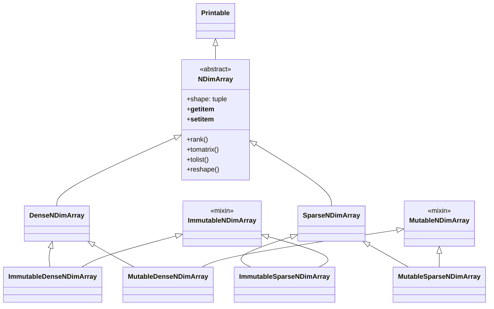
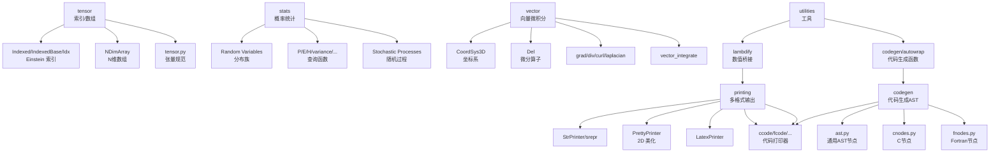

# 张量、统计、打印与代码生成、向量系统源码信源

本文档覆盖 SymPy 中五个关联模块：`sympy.tensor`（索引表示与 N 维数组）、`sympy.stats`（概率统计）、`sympy.printing`（多格式输出）、`sympy.codegen`（代码生成 AST）、`sympy.vector`（向量微积分），以及工具函数 `lambdify`。[^tensor-init] [^stats-init] [^printing-init] [^codegen-init] [^vector-init]

## 一、张量模块（sympy.tensor）

### 模块导出

tensor/__init__.py 导出：[^tensor-init]

| 类别 | 符号 |
|---|---|
| 索引符号 | `IndexedBase`, `Idx`, `Indexed` |
| 索引方法 | `get_contraction_structure`, `get_indices` |
| 形状函数 | `shape` |
| N 维数组 | `NDimArray`, `DenseNDimArray`, `SparseNDimArray`, `MutableDenseNDimArray`, `ImmutableDenseNDimArray`, `MutableSparseNDimArray`, `ImmutableSparseNDimArray`, `Array`(=ImmutableDenseNDimArray alias) |
| 数组运算 | `tensorproduct`, `tensorcontraction`, `tensordiagonal`, `derive_by_array`, `permutedims` |

### 索引表示体系

张量索引系统通过三个类实现 Einstein 求和约定风格的索引符号：

| 类 | 文件/行号 | 说明 |
|---|---|---|
| `IndexedBase` | indexed.py:363 | 索引对象的基类（张量名），继承 `Expr`，带形状参数 |
| `Idx` | indexed.py:581 | 索引符号，支持范围声明 |
| `Indexed` | indexed.py:125 | 索引后的张量分量，继承 `Expr` |

```python
>>> from sympy import IndexedBase, Idx, symbols
>>> A = IndexedBase('A', shape=(3, 3))
>>> i, j = symbols('i j', integer=True)
>>> A[i, j]
A[i, j]
>>> A[1, 2]
A[1, 2]
>>> A.shape
(3, 3)
>>> # 带范围的索引
>>> n = symbols('n', integer=True)
>>> k = Idx('k', range=(1, n))
```

`get_indices(expr)` 返回表达式中的索引；`get_contraction_structure(expr)` 分析求和结构。

### N 维数组体系



`Array` 是 `ImmutableDenseNDimArray` 的别名（array/__init__.py:258）。[^tensor-init]

```python
>>> from sympy import Array, tensorproduct, tensorcontraction, tensordiagonal, derive_by_array, permutedims
>>> from sympy.abc import x, y
>>> A = Array([[1, 2], [3, 4]])
>>> A.shape
(2, 2)
>>> A[0, 1]
2
>>> A.tolist()
[[1, 2], [3, 4]]
>>> # 张量积
>>> B = Array([x, y])
>>> C = tensorproduct(A, B)
>>> C.shape
(2, 2, 2)
>>> # 张量缩并
>>> D = tensorproduct(A, A)
>>> D.shape
(2, 2, 2, 2)
>>> E = tensorcontraction(D, (0, 2))  # 缩并第0和第2指标
>>> E.shape
(2, 2)
>>> # 对数组求导
>>> from sympy import sin, cos
>>> derive_by_array(sin(x)*cos(y), [x, y])
[cos(x)*cos(y), -sin(x)*sin(y)]
```

`tensor/tensor.py` 模块还提供更高级的 `Tensor` 类（tensor.py:2853，继承 `TensExpr`），用于张量索引规范（canonicalization），但该类未从 `tensor/__init__.py` 公开导出，需从 `sympy.tensor.tensor` 直接导入。

## 二、统计模块（sympy.stats）

### 模块导出

stats/__init__.py 导出概率统计的完整 API：[^stats-init]

| 类别 | 符号 |
|---|---|
| 查询函数 | `P`, `E`, `H`, `density`, `where`, `given`, `sample`, `cdf`, `median`, `variance`, `std`, `skewness`, `kurtosis`, `covariance`, `correlation`, `entropy`, `quantile`, `mode`, `factorial_moment`, `moment`, `cmoment`, `smoment`, `characteristic_function`, `moment_generating_function`, `sampling_density`, `coskewness` |
| 离散分布 | `FiniteRV`, `DiscreteUniform`, `Die`, `Bernoulli`, `Coin`, `Binomial`, `BetaBinomial`, `Hypergeometric`, `Geometric`, `Poisson`, `NegativeBinomial`, `Logarithmic`, `Skellam`, `YuleSimon`, `Zeta`, `Rademacher`, `IdealSoliton`, `RobustSoliton`, `FlorySchulz`, `Hermite`(discrete) |
| 连续分布 | `ContinuousRV`, `Normal`, `Exponential`, `Uniform`, `Beta`, `Gamma`, `Cauchy`, `ChiSquared`, `StudentT`, `Pareto`, `Weibull`, `LogNormal`, `Maxwell`, `Rayleigh`, `Arcsin`, `Benini`, `BetaNoncentral`, `BetaPrime`, `BoundedPareto`, `Chi`, `ChiNoncentral`, `Dagum`, `Davis`, `Erlang`, `ExGaussian`, `ExponentialPower`, `FDistribution`, `FisherZ`, `Frechet`, `GammaInverse`, `GaussianInverse`, `Gompertz`, `Gumbel`, `Kumaraswamy`, `Laplace`, `Levy`, `Logistic`, `LogCauchy`, `LogLogistic`, `LogitNormal`, `Lomax`, `Moyal`, `Nakagami`, `PowerFunction`, `QuadraticU`, `RaisedCosine`, `Reciprocal`, `ShiftedGompertz`, `Trapezoidal`, `Triangular`, `UniformSum`, `VonMises`, `Wald`, `WignerSemicircle` |
| 联合分布 | `JointRV`, `Dirichlet`, `Multinomial`, `MultivariateBeta`, `MultivariateEwens`, `MultivariateT`, `NegativeMultinomial`, `NormalGamma`, `MultivariateNormal`, `MultivariateLaplace`, `GeneralizedMultivariateLogGamma`, `GeneralizedMultivariateLogGammaOmega`, `marginal_distribution` |
| 随机过程 | `StochasticProcess`, `DiscreteTimeStochasticProcess`, `DiscreteMarkovChain`, `ContinuousMarkovChain`, `BernoulliProcess`, `PoissonProcess`, `WienerProcess`, `GammaProcess`, `TransitionMatrixOf`, `StochasticStateSpaceOf`, `GeneratorMatrixOf`, `sample_stochastic_process` |
| 随机矩阵 | `MatrixGamma`, `Wishart`, `MatrixNormal`, `MatrixStudentT`, `CircularEnsemble`, `CircularUnitaryEnsemble`, `CircularOrthogonalEnsemble`, `CircularSymplecticEnsemble`, `GaussianEnsemble`, `GaussianUnitaryEnsemble`, `GaussianOrthogonalEnsemble`, `GaussianSymplecticEnsemble` |
| 符号概率 | `Probability`, `Expectation`, `Variance`, `Covariance`, `Moment`, `CentralMoment`, `ExpectationMatrix`, `VarianceMatrix`, `CrossCovarianceMatrix` |

[^stats-init]

### 查询函数

| 函数 | 含义 |
|---|---|
| `P(condition)` | 概率（Probability） |
| `E(expr)` | 期望（Expectation） |
| `H(expr)` | 熵（Entropy） |
| `density(expr)` | 概率密度/质量函数 |
| `cdf(expr)` | 累积分布函数 |
| `sample(expr)` | 生成一个样本实现 |
| `where(condition)` | 条件成立的集合 |
| `given(expr, condition)` | 条件期望/概率 |
| `variance(expr)` | 方差 |
| `std(expr)` | 标准差 |
| `skewness(expr)` | 偏度 |
| `kurtosis(expr)` | 峰度 |
| `covariance(X, Y)` | 协方差 |
| `correlation(X, Y)` | 相关系数 |
| `median(expr)` | 中位数 |
| `quantile(expr, k)` | 分位数 |
| `pspace(expr)` | 概率空间 |

```python
>>> from sympy.stats import (P, E, variance, std, Die, Normal,
...                          Exponential, Binomial, Poisson,
...                          Bernoulli, Uniform, density, cdf, sample)
>>> from sympy import simplify, Symbol, oo, exp, sqrt, pi, erf
>>> X = Die('X', 6)  # 6面骰子
>>> Y = Die('Y', 6)
>>> P(X > 3)
1/2
>>> E(X + Y)
7
>>> variance(X + Y)
35/6
>>> Z = Normal('Z', 0, 1)  # 标准正态分布
>>> simplify(P(Z > 1))
1/2 - erf(sqrt(2)/2)/2
>>> density(Z)(Symbol('x'))
sqrt(2)*exp(-x**2/2)/(2*sqrt(pi))
>>> B = Binomial('B', 10, Symbol('p', positive=True))
>>> E(B)
10*p
>>> Pois = Poisson('Pois', 5)
>>> E(Pois)
5
>>> U = Uniform('U', 0, 1)
>>> E(U)
1/2
>>> variance(U)
1/12
```

### 自定义随机变量

```python
>>> from sympy.stats import ContinuousRV, DiscreteRV, FiniteRV, P, E
>>> from sympy import Rational, exp, Interval, oo, Symbol, S, Lambda, Eq
>>> x = Symbol('x')
>>> # 连续随机变量：指数分布 pdf = exp(-x) on [0, ∞)
>>> Z = ContinuousRV(x, exp(-x), set=Interval(0, oo))
>>> E(Z)
1
>>> P(Z > 5)
exp(-5)
>>> # 有限随机变量：自定义 pmf
>>> pmf = {1: Rational(1,3), 2: Rational(1,6), 3: Rational(1,4), 4: Rational(1,4)}
>>> X = FiniteRV('X', pmf)
>>> E(X)
29/12
```

### 随机过程

```python
>>> from sympy.stats import DiscreteMarkovChain, TransitionMatrixOf
>>> from sympy import Matrix
>>> T = Matrix([[Rational(1,2), Rational(1,2)], [Rational(1,3), Rational(2,3)]])
>>> X = DiscreteMarkovChain('X', trans_probs=T)
```

## 三、打印模块（sympy.printing）

### 模块导出

printing/__init__.py 导出多格式打印/输出函数：[^printing-init]

| 格式 | 函数/类 | 说明 |
|---|---|---|
| 字符串 | `StrPrinter`, `sstr`, `sstrrepr` | 普通字符串（`str()` 默认使用） |
| 表示 | `srepr` | S-expression 风格的精确表示（`repr()`） |
| ASCII/Unicode 美化 | `pretty()`, `pprint()`, `pretty_print()`, `pager_print` | 终端友好的 2D 输出 |
| LaTeX | `latex()`, `print_latex()`, `multiline_latex` | LaTeX 数学公式 |
| MathML | `mathml()`, `print_mathml()` | MathML 标记 |
| Python 代码 | `python()`, `print_python()`, `pycode` | Python 表达式代码 |
| C 代码 | `ccode()`, `print_ccode()`, `cxxcode()` | C/C++ 代码 |
| Fortran 代码 | `fcode()`, `print_fcode()` | Fortran 代码 |
| Julia 代码 | `julia_code()` | Julia 代码 |
| Mathematica 代码 | `mathematica_code()` | Mathematica/Wolfram 代码 |
| Octave/Matlab 代码 | `octave_code()` | Octave/MATLAB 代码 |
| Rust 代码 | `rust_code()` | Rust 代码 |
| JavaScript 代码 | `jscode()`, `print_jscode()` | JavaScript 代码 |
| GLSL 代码 | `glsl_code()`, `print_glsl()` | GLSL 着色器代码 |
| R 代码 | `rcode()`, `print_rcode()` | R 代码 |
| Maple 代码 | `maple_code()`, `print_maple_code()` | Maple 代码 |
| SMT-LIB | `smtlib_code()` | SMT-LIB 格式 |
| 树形结构 | `print_tree()` | 表达式树结构 |
| 表格 | `TableForm` | 表格格式化 |
| 图可视化 | `dotprint()` | Graphviz dot 格式 |
| 预览 | `preview()` | LaTeX 渲染预览 |
| GTK | `print_gtk()` | GTK 窗口显示 |
| Unicode 控制 | `pprint_use_unicode()`, `pprint_try_use_unicode()` | 控制 pprint 是否使用 Unicode |

[^printing-init]

### Printer 基类体系

所有打印器继承自 `Printer` 基类（printing/printer.py），通过 `_print_<ClassName>` 方法分发到具体类型的打印逻辑。典型工作流：

```python
>>> from sympy import (symbols, sin, Integral, Matrix, latex, pretty,
...                    srepr, ccode, julia_code, mathematica_code)
>>> from sympy import pprint
>>> x, y = symbols('x y')
>>> expr = Integral(sin(x), x)
>>> str(expr)
'Integral(sin(x), x)'
>>> srepr(expr)
"Integral(sin(Symbol('x')), Tuple(Symbol('x')))"
>>> latex(expr)
'\\int \\sin{\\left(x \\right)}\\, dx'
>>> pprint(expr, use_unicode=True)
⌠
⎮ sin(x) dx
⌡
>>> ccode(x**2 + sin(y))
'pow(x, 2) + sin(y)'
>>> julia_code(x**2 + 1)
'x.^2 + 1'
>>> mathematica_code(sin(x))
'Sin[x]'
```

### LaTeX 输出

```python
>>> from sympy import latex, Matrix, symbols
>>> x = symbols('x')
>>> M = Matrix([[1, 2], [3, 4]])
>>> latex(M)
'\\left[\\begin{matrix}1 & 2\\\\3 & 4\\end{matrix}\\right]'
>>> latex(1/x, mode='inline')
'\\\\frac{1}{x}'
```

## 四、代码生成（sympy.codegen）

### 模块导出

codegen/__init__.py 导出跨语言的 AST 节点基类：[^codegen-init]

| AST 节点 | 行号 | 说明 |
|---|---|---|
| `Assignment` | ast.py:463 | 赋值语句 `lhs = rhs` |
| `aug_assign` | - | 增广赋值（+=, -=, *=, /= 等） |
| `CodeBlock` | ast.py:593 | 代码块（多条语句序列） |
| `For` | ast.py:810 | for 循环 |
| `While` | ast.py:1637 | while 循环 |
| `Scope` | ast.py:1675 | 作用域块 |
| `Variable` | ast.py:1410 | 变量声明（带类型） |
| `Declaration` | ast.py:1610 | 变量声明语句 |
| `FunctionPrototype` | ast.py:1751 | 函数原型声明 |
| `FunctionDefinition` | ast.py:1800 | 函数定义 |
| `FunctionCall` | ast.py:1870 | 函数调用 |
| `Return` | ast.py:1847 | return 语句 |
| `Print` | ast.py:1724 | 打印语句 |
| `BreakToken` | ast.py:340 | break 语句 |
| `ContinueToken` | ast.py:359 | continue 语句 |
| `NoneToken` | ast.py:377 | None/NULL 字面量 |
| `Element` | ast.py:1583 | 指针/数组元素访问 |
| `Pointer` | ast.py:1558 | 指针类型 |
| `Attribute` | ast.py:1366 | 属性访问（`.` 运算符） |
| `Raise` | ast.py:1930 | 异常抛出 |

[^codegen-init]

条件分支（If/Else）通过语言特定节点实现：C 家族在 `cnodes.py` 提供 `goto`/`Label` 等控制流原语，条件表达式可使用 `sympy.ITE` 或通过 `CodeBlock` 组合。

### C 特有节点（cnodes.py）

| 节点 | 说明 |
|---|---|
| `CommaOperator` | 逗号运算符 |
| `Label` | goto 标签 |
| `goto` | goto 语句 |
| `PreIncrement/PostIncrement/PreDecrement/PostDecrement` | ++/-- 运算符 |
| `struct` | 结构体 |
| `union` | 联合体 |
| C99 数学函数 | `expm1`, `log1p`, `exp2`, `log2`, `fma`, `log10`, `Sqrt`, `Cbrt`, `hypot`, `isnan`, `isinf`（cfunctions.py） |

### Fortran 特有节点（fnodes.py）

| 节点 | 说明 |
|---|---|
| `Program` | 程序单元 |
| `Module` | 模块单元 |
| `Subroutine` | 子例程 |
| `Do` | do 循环 |
| `use`/`use_rename` | use 语句 |
| `ArrayConstructor` | 数组构造器 |
| `ImpliedDoLoop` | 隐 do 循环 |
| `FortranReturn` | return 语句 |
| `FFunction`/`F95Function` | Fortran 函数 |
| Fortran 内置函数 | `isign`, `dsign`, `cmplx`, `kind`, `merge`, `literal_sp`, `literal_dp`, `sum_`, `product_` |

### codegen 函数（utilities/codegen.py）

`codegen()` 函数（utilities/codegen.py:1991）从 SymPy 表达式生成完整的可编译源代码文件：

```python
codegen(name_expr, language=None, prefix=None, project="project",
        to_files=False, header=True, empty=True, argument_sequence=None,
        global_vars=None, standard=None, code_gen=None, printer=None)
```

支持的语言：
- `'C'`（C99）
- `'F95'`（Fortran 95）
- `'Octave'`（Octave/MATLAB 兼容）

```python
>>> from sympy.utilities.codegen import codegen
>>> from sympy.abc import x
>>> [(c_name, c_code), (h_name, h_code)] = codegen(
...     ("f", x**2 + 1), language="C", prefix="test", project="myproj",
...     header=True, empty=True)
>>> print(c_code)
/******************************************************************************
 *                    Code generated with sympy ...                           *
 *                                                                            *
 *                       See sympy.org for more info                         *
 ******************************************************************************/
#include "test.h"
#include <math.h>

double f(double x) {
   double f_result;
   f_result = pow(x, 2) + 1;
   return f_result;
}
```

### autowrap 自动包装（utilities/autowrap.py）

`autowrap()` 函数（utilities/autowrap.py:547）自动将 SymPy 表达式编译为 Python 可调用的二进制扩展，支持 backend：
- `'f2py'`（默认，Fortran via NumPy f2py）
- `'cython'`（Cython）

```python
>>> from sympy.utilities.autowrap import autowrap
>>> from sympy.abc import x
>>> f = autowrap(x**2 + 1, language='C', backend='cython')
>>> f(3)
10.0
```

## 五、向量模块（sympy.vector）

### 模块导出

vector/__init__.py 导出向量微积分系统：[^vector-init]

| 类别 | 符号 |
|---|---|
| 坐标系 | `CoordSys3D` |
| 向量 | `Vector`, `VectorAdd`, `VectorMul`, `BaseVector`, `VectorZero`, `Cross`, `Dot`, `cross`, `dot` |
| 并矢 | `Dyadic`, `DyadicAdd`, `DyadicMul`, `BaseDyadic`, `DyadicZero` |
| 标量 | `BaseScalar` |
| 微分算子 | `Del` |
| 微分运算 | `gradient`, `divergence`, `curl`, `laplacian`, `Gradient`, `Divergence`, `Curl`, `Laplacian` |
| 场分析 | `is_conservative`, `is_solenoidal`, `scalar_potential`, `scalar_potential_difference`, `vector_potential`, `directional_derivative` |
| 工具函数 | `express`, `matrix_to_vector`, `matrix_to_dyadic` |
| 点/定向 | `Point`, `AxisOrienter`, `BodyOrienter`, `SpaceOrienter`, `QuaternionOrienter` |
| 区域 | `ParametricRegion`, `parametric_region_list`, `ImplicitRegion` |
| 积分 | `ParametricIntegral`, `vector_integrate` |
| Kind | `VectorKind` |

[^vector-init]

### CoordSys3D 坐标系

`CoordSys3D` 是向量系统的核心，表示一个三维直角坐标系：

```python
>>> from sympy.vector import CoordSys3D, Del
>>> from sympy import symbols, sin, cos
>>> N = CoordSys3D('N')
>>> N.i, N.j, N.k  # 基向量
(N.i, N.j, N.k)
>>> v = 3*N.i + 4*N.j + 5*N.k
>>> v
3*N.i + 4*N.j + 5*N.k
>>> v.magnitude()
5*sqrt(2)
>>> from sympy.vector import dot, cross
>>> dot(N.i, N.j)
0
>>> cross(N.i, N.j)
N.k
```

### 微分算子（Del）

`Del`（∇）对象提供梯度、散度、旋度、拉普拉斯算子：

```python
>>> from sympy.vector import gradient, divergence, curl, laplacian
>>> from sympy.abc import x, y, z
>>> delop = Del()
>>> f = x**2*y + y*z
>>> gradient(f)  # ∇f
N.k*y + N.j*(x**2 + z) + N.i*(2*x*y)
>>> vfield = x*N.i + y*N.j + z*N.k
>>> divergence(vfield)  # ∇·v
3
>>> cfield = -y*N.i + x*N.j
>>> curl(cfield)  # ∇×v
2*N.k
>>> laplacian(x**2 + y**2 + z**2)  # ∇²f
6
```

| 运算 | 函数 | Del 语法 |
|---|---|---|
| 梯度 | `gradient(scalar)` | `delop.gradient(f)` |
| 散度 | `divergence(vector)` | `delop.dot(v)` |
| 旋度 | `curl(vector)` | `delop.cross(v)` |
| 拉普拉斯 | `laplacian(scalar/vector)` | - |

### 保守场与矢量势

```python
>>> from sympy.vector import (is_conservative, is_solenoidal,
...                           scalar_potential, vector_potential)
>>> from sympy.abc import x, y, z
>>> F = y*z*N.i + x*z*N.j + x*y*N.k
>>> is_conservative(F)
True
>>> scalar_potential(F, N)
x*y*z
>>> is_solenoidal(F)
True  # div = 0
```

### 向量积分

`vector_integrate()` 支持在参数化区域上计算线积分、面积分、体积分：

```python
>>> from sympy.vector import vector_integrate, ParametricRegion
>>> from sympy import symbols, sin, cos, pi
>>> t = symbols('t')
>>> curve = ParametricRegion((cos(t), sin(t), 0), (t, 0, 2*pi))
```

### ImplicitRegion

`ImplicitRegion` 表示由隐式方程定义的几何区域：

```python
>>> from sympy.vector import ImplicitRegion
>>> from sympy.abc import x, y
>>> circle = ImplicitRegion((x, y), x**2 + y**2 - 1)
```

## 六、lambdify 工具

`lambdify()` 函数定义于 utilities/lambdify.py:213，将 SymPy 表达式转换为可数值求值的 Python lambda 函数，支持 NumPy/SciPy/math 等后端：

```python
lambdify(args, expr, modules=None, printer=None, use_imps=True,
         dummify=False, cse=False)
```

参数说明：
- `args`：变量名或变量列表
- `expr`：SymPy 表达式
- `modules`：后端模块，可选 `'math'`、`'numpy'`、`'scipy'`、`'mpmath'`、`'sympy'` 或模块列表，默认自动选择
- `printer`：自定义打印器
- `use_imps`：是否使用隐函数（默认 True）
- `dummify`：是否替换变量名中的无效 Python 标识符
- `cse`：是否使用公共子表达式消除优化

```python
>>> from sympy import lambdify, symbols, sin
>>> import numpy as np
>>> x = symbols('x')
>>> f = lambdify(x, sin(x), modules='numpy')
>>> f(np.array([0, np.pi/2, np.pi]))
array([0.00000000e+00, 1.00000000e+00, 1.22464680e-16])
>>> g = lambdify(x, x**2 + 1, modules='math')
>>> g(3)
10
>>> # 多变量
>>> y = symbols('y')
>>> h = lambdify([x, y], x + y, modules='math')
>>> h(2, 3)
5
>>> # NumPy 向量化计算
>>> xs = np.linspace(0, 2*np.pi, 5)
>>> f(xs)
array([ 0.00000000e+00,  1.00000000e+00,  1.22464680e-16, -1.00000000e+00,
       -2.44929360e-16])
```

## 模块关系概览



[^tensor-init]: tensor/__init__.py — 张量模块入口与导出
[^stats-init]: stats/__init__.py — 统计模块入口与分布/查询函数
[^printing-init]: printing/__init__.py — 打印模块入口与多格式输出
[^codegen-init]: codegen/__init__.py — 代码生成 AST 节点基类
[^vector-init]: vector/__init__.py — 向量微积分模块入口
