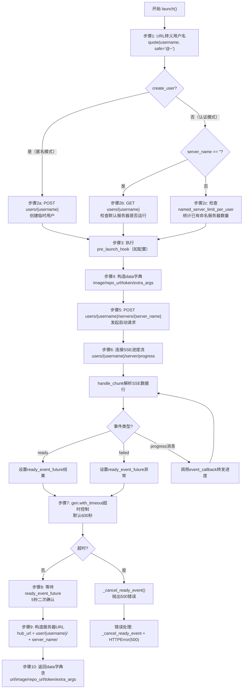

# 启动器与 JupyterHub 集成

## 概述

BinderHub 的启动系统定义在 launcher.py 和 binderspawner_mixin.py 中。`Launcher` 类负责通过 JupyterHub REST API 为每个构建好的镜像创建临时用户（或使用已认证用户）并启动 Notebook 服务器；`BinderSpawnerMixin` 是一个混入类，将标准 JupyterHub Spawner（如 KubeSpawner）转换为 BinderHub 专用 Spawner，处理镜像注入、Token 传递和 CORS 配置。

整个启动流程涉及 HTTP 认证头设置、用户创建冲突处理、指数退避重试、Server-Sent Events (SSE) 进度流消费、超时控制和服务器 URL 构造等多个环节。

## 模块常量

```python
# 匹配 SSH 格式仓库 URL 的正则（仅在确认 URL 不含 :// 后使用）
_ssh_repo_pat = re.compile(r".*@.*\:")

# 用户名随机后缀字符集（小写字母+数字，共36个字符）
SUFFIX_CHARS = string.ascii_lowercase + string.digits
# 随机后缀长度（36**8 ≈ 2**41 ≈ 2.8万亿种组合）
SUFFIX_LENGTH = 8
```

`SUFFIX_CHARS` 使用 `string.ascii_lowercase`（a-z）和 `string.digits`（0-9）共36个字符，8位后缀提供约2.8万亿种组合，足以在用户名层面避免碰撞。

## Launcher 类

`Launcher`（launcher.py:37-359）继承自 `LoggingConfigurable`，封装了与 JupyterHub API 交互的完整逻辑。

### 核心 Traitlets 属性

| 属性 | 类型 | 默认值 | 配置项 | 说明 |
|---|---|---|---|---|
| `hub_api_token` | `Unicode` | 环境变量 `JUPYTERHUB_API_TOKEN` | config=True | JupyterHub API 认证 Token |
| `hub_url` | `Unicode` | 无默认值（必须配置） | config=True | JupyterHub 对外公开 URL |
| `hub_url_local` | `Unicode` | 同 `hub_url` | config=True | JupyterHub 内部网络 URL（用于 Pod 间通信） |
| `create_user` | `Bool` | `True` | — | 是否在 Hub 上创建新用户（非认证模式为 True） |
| `allow_named_servers` | `Bool` | 环境变量 `JUPYTERHUB_ALLOW_NAMED_SERVERS` | config=True | 是否允许命名服务器（认证模式下使用） |
| `named_server_limit_per_user` | `Integer` | 环境变量 `JUPYTERHUB_NAMED_SERVER_LIMIT_PER_USER`，默认0 | config=True | 每个用户的最大并发命名服务器数（0=无限制） |
| `retries` | `Integer` | `4` | config=True | Hub API 请求的最大重试次数 |
| `retry_delay` | `Integer` | `4` | config=True | 首次重试延迟秒数，后续按指数退避（4→8→16→32秒） |
| `pre_launch_hook` | `Callable` | `None` | config=True, allow_none=True | 启动前钩子函数，接收(launcher, image, username, server_name, repo_url)五个参数 |
| `launch_timeout` | `Integer` | `600` | config=True | 等待服务器就绪的最大秒数（超时返回500错误） |

### hub_url_local 默认值

```python
@default("hub_url_local")
def _default_hub_url_local(self):
    return self.hub_url
```

`hub_url_local` 默认与 `hub_url` 相同，用于 Kubernetes 部署中 BinderHub Pod 通过 ClusterIP 内部访问 JupyterHub API（避免经过外部 LoadBalancer/Ingress 的网络开销）。在 Helm Chart 中，`JUPYTERHUB_API_URL` 环境变量会覆盖此值。

### api_request()：Hub API 请求与重试逻辑

`api_request()` 方法（launcher.py:98-133）是所有 Hub API 调用的底层方法，实现了认证头注入和指数退避重试。

```python
async def api_request(self, url, *args, **kwargs):
    """Make an API request to JupyterHub"""
    headers = kwargs.setdefault("headers", {})
    headers.update({"Authorization": f"token {self.hub_api_token}"})
    hub_api_url = (
        os.getenv("JUPYTERHUB_API_URL", "") or self.hub_url_local + "hub/api/"
    )
    if not hub_api_url.endswith("/"):
        hub_api_url += "/"
    request_url = hub_api_url + url
    req = HTTPRequest(request_url, *args, **kwargs)
    retry_delay = self.retry_delay
    for i in range(1, self.retries + 1):
        try:
            return await AsyncHTTPClient().fetch(req)
        except HTTPError as e:
            # 重试时将409冲突视为成功（幂等性处理）
            if i > 1 and e.code == 409 and e.response:
                self.log.warning("Treating 409 conflict on retry as success")
                return e.response
            # 仅对5xx错误重试（集群间歇性故障：502/504/599等）
            if e.code >= 500:
                self.log.error(
                    "Error accessing Hub API (using %s): %s", request_url, e
                )
                if i == self.retries:
                    raise
                await gen.sleep(retry_delay)
                retry_delay *= 2  # 指数退避
            else:
                raise
```

关键设计要点：

1. **认证头**：使用 `Authorization: token <hub_api_token>` 格式（JupyterHub API Token 认证规范）。
2. **API URL 优先级**：环境变量 `JUPYTERHUB_API_URL` > `hub_url_local + "hub/api/"`。在 Helm 部署中，`JUPYTERHUB_API_URL` 被设置为内部服务地址。
3. **重试策略**：
   - 仅对 HTTP 5xx 错误（含599连接超时）重试，这些通常是集群间歇性问题（Ingress 中断、Hub 重启、代理故障）；
   - 4xx 错误（如400、403、404）立即抛出，不重试；
   - 重试时遇到409 Conflict（如重复创建用户）被视为幂等成功，返回已有响应。
4. **指数退避**：初始延迟 `retry_delay`（默认4秒），每次重试后翻倍：4s → 8s → 16s → 32s。4次重试的总等待时间约60秒。

### get_user_data()：获取用户信息

```python
async def get_user_data(self, username):
    resp = await self.api_request(
        f"users/{username}",
        method="GET",
    )
    body = json.loads(resp.body.decode("utf-8"))
    return body
```

发送 `GET /hub/api/users/{username}` 获取用户模型，包含 `servers` 字典（当前运行的服务器列表）。在认证模式下用于检查用户是否已有运行中的服务器，避免冲突。

### unique_name_from_repo()：从仓库URL生成唯一用户名

`unique_name_from_repo()` 方法（launcher.py:143-169）将 Git 仓库 URL 转换为安全的 JupyterHub 用户名。

```python
def unique_name_from_repo(self, repo_url):
    """Generate a unique name for a git repo url"""
    # 步骤1：解析URL路径
    if "://" not in repo_url and _ssh_repo_pat.match(repo_url):
        # SSH格式：git@github.com:user/repo.git → user/repo.git
        path = repo_url.split(":", 1)[1]
    else:
        # HTTP/HTTPS格式：https://github.com/user/repo.git → /user/repo.git
        path = urlparse(repo_url).path

    # 步骤2：路径规范化
    prefix = path.strip("/").replace("/", "-").lower()

    # 步骤3：去除 .git 后缀
    if prefix.endswith(".git"):
        prefix = prefix[:-4]

    # 步骤4：超长截断（保留前15+后15字符，中间用连字符连接）
    if len(prefix) > 32:
        prefix = f"{prefix[:15]}-{prefix[-15:]}"

    # 步骤5：添加8位随机后缀
    return "{}-{}".format(
        prefix, "".join(random.choices(SUFFIX_CHARS, k=SUFFIX_LENGTH))
    )
```

转换示例：

| 输入 URL | 输出用户名 |
|---|---|
| `https://github.com/minrk/binder-example.git` | `minrk-binder-example-a3k9x2p7` |
| `git@github.com:user/repo.git` | `user-repo-b8m1q5w2` |
| `https://github.com/very-long-org-name/very-long-repo-name-for-binder.git` | `very-long-org--very-long-repo-n-k4f8z1x9` |

截断算法说明：当路径长度超过32字符时，保留前15字符和后15字符，中间用连字符 `-` 连接，确保总长度不超过31字符（加上8位后缀后总长度为40字符），满足 JupyterHub 用户名长度限制和 Kubernetes DNS 标签要求。

### launch()：完整启动流程

`launch()` 方法（launcher.py:171-359）是启动服务器的核心入口，实现了一个10步流程。

#### 方法签名

```python
async def launch(
    self,
    image,
    username,
    server_name="",
    repo_url="",
    extra_args=None,
    event_callback=None,
):
```

| 参数 | 类型 | 说明 |
|---|---|---|
| `image` | str | 完整镜像名（含registry前缀和tag） |
| `username` | str | JupyterHub 用户名 |
| `server_name` | str | 命名服务器名称（空字符串=默认服务器） |
| `repo_url` | str | 源仓库 URL |
| `extra_args` | dict | 额外参数（如binder_ref_url、binder_client_ip等） |
| `event_callback` | callable | SSE 进度事件回调（async函数） |

#### 启动流程图



#### 步骤详解

**步骤1：用户名URL转义**

```python
escaped_username = quote(username, safe="@~")
```

使用 `urllib.parse.quote()` 对用户名进行URL编码，`@` 和 `~` 字符不转义（与 JupyterHub 自身的转义逻辑一致）。这与 JupyterHub 源码中的 [user.py:427](https://github.com/jupyterhub/jupyterhub/blob/c00c3fa28703669b932eb84549654238ff8995dc/jupyterhub/user.py#L427) 的转义方式完全匹配。

**步骤2a：创建临时用户（匿名模式）**

```python
if self.create_user:
    app_log.info("Creating user %s for image %s", username, image)
    try:
        await self.api_request(
            f"users/{escaped_username}", body=b"", method="POST"
        )
    except HTTPError as e:
        if e.response:
            body = e.response.body
        else:
            body = ""
        app_log.error(
            "Error creating user %s: %s\n%s", username, e, body,
        )
        raise web.HTTPError(500, f"Failed to create temporary user for {image}")
```

发送 `POST /hub/api/users/{username}` 创建用户。请求体为空字节 `b""`（JupyterHub API 允许空体创建用户）。失败时记录响应体内容（便于调试）并抛出500错误。由于 `api_request()` 的重试逻辑已处理409幂等性，重复创建用户不会报错。

**步骤2b：认证模式下检查默认服务器冲突**

```python
elif server_name == "":
    user_data = await self.get_user_data(escaped_username)
    if server_name in user_data["servers"]:
        raise web.HTTPError(
            409, f"User {username} already has a running server."
        )
```

当 `create_user=False`（认证模式）且无命名服务器时，先查询用户现有服务器列表。如果默认服务器（`""`）已在运行中，返回409 Conflict。

**步骤2c：认证模式下检查命名服务器配额**

```python
elif self.named_server_limit_per_user > 0:
    user_data = await self.get_user_data(escaped_username)
    len_named_spawners = len([s for s in user_data["servers"] if s != ""])
    if self.named_server_limit_per_user <= len_named_spawners:
        raise web.HTTPError(
            409,
            "User {} already has the maximum of {} named servers."
            "  One must be deleted before a new server can be created".format(
                username, self.named_server_limit_per_user
            ),
        )
```

统计用户的非默认服务器数量（排除空字符串键的默认服务器），超过 `named_server_limit_per_user` 时返回409。

**步骤3：执行 pre_launch_hook**

```python
if self.pre_launch_hook:
    await maybe_future(
        self.pre_launch_hook(self, image, username, server_name, repo_url)
    )
```

使用 `jupyterhub.utils.maybe_future()` 包装钩子调用，支持同步和异步函数。钩子可用于自定义权限检查、配额验证或日志记录。

**步骤4：构造启动数据字典**

```python
data = {
    "image": image,
    "repo_url": repo_url,
    "token": base64.urlsafe_b64encode(uuid.uuid4().bytes)
    .decode("ascii")
    .rstrip("=\n"),
}
if extra_args:
    data.update(extra_args)
```

Token 生成方式：使用 `uuid.uuid4()` 生成128位随机UUID，通过 `base64.urlsafe_b64encode()` 编码为URL安全的字符串，并去除末尾的 `=` 填充字符和换行符，得到22字符的安全Token。此Token传递给 Jupyter Notebook 服务器作为认证凭证。

`extra_args` 通常包含以下字段（来自 BuildHandler.launch()）：

```python
extra_args = {
    "binder_ref_url": self.ref_url,
    "binder_launch_host": self.binder_launch_host,
    "binder_request": self.binder_request,
    "binder_persistent_request": self.binder_persistent_request,
    "binder_client_ip": client_ip,
}
```

**步骤5：发起服务器启动请求**

```python
ready_event_future = asyncio.Future()

def _cancel_ready_event(f=None):
    if not ready_event_future.done():
        if f and f.exception():
            ready_event_future.set_exception(f.exception())
        else:
            ready_event_future.cancel()

try:
    await self.api_request(
        f"users/{escaped_username}/servers/{server_name}",
        method="POST",
        body=json.dumps(data).encode("utf8"),
    )
```

发送 `POST /hub/api/users/{username}/servers/{server_name}` 请求，body 为 JSON 编码的 `data` 字典。JupyterHub 收到后会通过 Spawner 启动用户容器。`ready_event_future` 是一个 `asyncio.Future`，用于在SSE进度流中检测服务器就绪/失败事件。

`_cancel_ready_event` 是一个内部清理函数，在请求超时或出错时取消 Future，避免协程泄漏。

**步骤6：SSE 进度事件流处理**

```python
buffer_list = []

async def handle_chunk(chunk):
    lines = b"".join(buffer_list + [chunk]).split(b"\n\n")
    buffer_list[:] = [lines[-1]]  # 保留不完整的最后一块
    for line in lines[:-1]:
        if line:
            line = line.decode("utf8", "replace")
        if line and line.startswith("data:"):
            event = json.loads(line.split(":", 1)[1])
            if event_callback:
                await event_callback(event)
            if event.get("ready", False):
                if not ready_event_future.done():
                    ready_event_future.set_result(event)
            elif event.get("failed", False):
                if not ready_event_future.done():
                    ready_event_future.set_exception(
                        web.HTTPError(500, event.get("message", "unknown error"))
                    )
```

SSE（Server-Sent Events）流处理的关键逻辑：

1. **分块缓冲**：SSE 消息以 `\n\n` 分隔，TCP 分片可能导致消息边界在chunk中间，使用 `buffer_list` 拼接不完整数据。
2. **消息解析**：每个完整消息行以 `data:` 开头，解析JSON事件对象。
3. **事件转发**：通过 `event_callback` 将进度消息转发给上层（BuildHandler 用于向浏览器发送实时进度）。
4. **就绪/失败检测**：
   - `event["ready"] == True` → 服务器就绪，设置 Future 结果；
   - `event["failed"] == True` → 启动失败，设置 Future 异常（500错误，携带失败消息）。

进度 API URL 构造：

```python
url_parts = ["users", escaped_username]
if server_name:
    url_parts.extend(["servers", server_name, "progress"])
else:
    url_parts.extend(["server/progress"])
progress_api_url = url_path_join(*url_parts)
```

- 默认服务器：`GET /hub/api/users/{username}/server/progress`
- 命名服务器：`GET /hub/api/users/{username}/servers/{server_name}/progress`

**步骤7：超时控制**

```python
resp_future = self.api_request(
    progress_api_url,
    streaming_callback=lambda chunk: asyncio.ensure_future(
        handle_chunk(chunk)
    ),
    request_timeout=self.launch_timeout,
)
try:
    await gen.with_timeout(
        timedelta(seconds=self.launch_timeout), resp_future
    )
except (gen.TimeoutError, TimeoutError):
    _cancel_ready_event()
    raise web.HTTPError(
        500,
        f"Image {image} for user {username} took too long to launch",
    )
```

双重超时保护：
1. HTTP 请求层面：`request_timeout=self.launch_timeout`（600秒），Tornado AsyncHTTPClient 在超时后断开连接；
2. 协程层面：`gen.with_timeout()` 包装进度流 Future，超时后取消ready_event并返回500。

**步骤8：二次确认就绪状态**

```python
try:
    await gen.with_timeout(timedelta(seconds=5), ready_event_future)
except (gen.TimeoutError, TimeoutError):
    raise web.HTTPError(
        500, f"Image {image} for user {username} failed to launch"
    )
```

虽然进度流已返回（HTTP连接关闭），但 `ready_event_future` 可能尚未被 `handle_chunk` 设置结果（异步竞态条件）。等待最多5秒确保Future完成，否则视为启动失败。

**步骤9-10：构造服务器URL并返回**

```python
data["url"] = self.hub_url + f"user/{escaped_username}/"
if server_name:
    data["url"] += f"{server_name}/"
self.log.debug(f"redirect to server url: {data['url']}")
return data
```

返回字典包含以下字段：

```python
{
    "url": "https://hub.example.com/user/minrk-binder-example-a3k9x2p7/",
    "image": "gcr.io/my-project/binder-minrk-binder-example-abc123:refhash",
    "repo_url": "https://github.com/minrk/binder-example",
    "token": "base64-urlsafe-uuid4-token",
    "binder_ref_url": "https://github.com/minrk/binder-example/commit/abc123",
    "binder_launch_host": "https://mybinder.org/",
    "binder_request": "v2/gh/minrk/binder-example/master",
    "binder_persistent_request": "v2/gh/minrk/binder-example/abc123def...",
    "binder_client_ip": "192.168.1.1",
}
```

## BinderSpawnerMixin：Binder Spawner 混入类

`BinderSpawnerMixin`（binderspawner_mixin.py:24-117）是一个 `Configurable` 混入类，将任意容器 Spawner（如 KubeSpawner、DockerSpawner）转换为 BinderHub 专用 Spawner。

> **重要说明**：此类的源代码在 `binderhub/binderspawner_mixin.py` 中定义，但通过 CI 脚本 `ci/check_embedded_chart_code.py` 自动复制到 Helm Chart 的 `values.yaml` 的 `jupyterhub.hub.extraConfig.0-binderspawnermixin` 字段中，在 JupyterHub Pod 启动时动态注入执行。BinderHub 自身并不直接使用此代码，它作为分发机制随 BinderHub 一起提供给 JupyterHub。

### 核心属性

| 属性 | 类型 | 默认值 | 说明 |
|---|---|---|---|
| `auth_enabled` | `Bool` | `False` | 是否启用认证模式。启用后需要仓库内置 `jupyterhub-singleuser` |
| `cors_allow_origin` | `Unicode` | `""` | 允许访问 spawned notebook 的 Origin（设置 Access-Control-Allow-Origin 头）。设为 `"*"` 允许任意来源 |

### get_args()：Notebook 启动参数生成

```python
def get_args(self):
    if self.auth_enabled:
        args = super().get_args()
    else:
        args = [
            "--ip=0.0.0.0",
            f"--port={self.port}",
            f"--NotebookApp.base_url={self.server.base_url}",
            f"--NotebookApp.token={self.user_options['token']}",
            "--NotebookApp.trust_xheaders=True",
        ]
        if self.default_url:
            args.append(f"--NotebookApp.default_url={self.default_url}")

        if self.cors_allow_origin:
            args.append("--NotebookApp.allow_origin=" + self.cors_allow_origin)
        # allow_origin=* 不能正确允许跨域请求单文件
        # 见 https://github.com/jupyter/notebook/pull/5898
        if self.cors_allow_origin == "*":
            args.append("--NotebookApp.allow_origin_pat=.*")
        args += self.args
        # ServerApp 兼容：复制 NotebookApp 参数
        for arg in list(args):
            if arg.startswith("--NotebookApp."):
                args.append(arg.replace("--NotebookApp.", "--ServerApp."))
    return args
```

参数生成逻辑分两种模式：

**认证模式（auth_enabled=True）**：调用 `super().get_args()`，由 JupyterHub 标准流程处理认证（使用 JupyterHub 自己的 Token 机制）。

**匿名模式（auth_enabled=False）**：手动构造 Jupyter Notebook 启动参数：

| 参数 | 说明 |
|---|---|
| `--ip=0.0.0.0` | 监听所有网络接口 |
| `--port={self.port}` | Spawner 分配的端口 |
| `--NotebookApp.base_url=...` | Hub 代理的 base_url 路径 |
| `--NotebookApp.token=...` | 来自 `user_options` 的随机 Token（BinderHub 生成的 UUID Token） |
| `--NotebookApp.trust_xheaders=True` | 信任 X-Forwarded-Proto/Host 等头（Hub 代理在前面） |
| `--NotebookApp.default_url=...` | 可选，默认 URL（如 `/lab`） |
| `--NotebookApp.allow_origin=...` | CORS 允许来源 |
| `--NotebookApp.allow_origin_pat=.*` | `*` 时额外添加正则匹配，解决单文件跨域问题 |

**NotebookApp/ServerApp 双兼容**：Jupyter Notebook 7+（基于 Jupyter Server）使用 `--ServerApp.` 前缀替代 `--NotebookApp.` 前缀。BinderSpawnerMixin 自动复制所有 `--NotebookApp.` 参数为 `--ServerApp.` 版本，确保新旧版本 Jupyter 都能正确接收配置。

### start()：启动前注入镜像

```python
def start(self):
    if not self.auth_enabled:
        if "token" not in self.user_options:
            raise web.HTTPError(400, "token required")
        if "image" not in self.user_options:
            raise web.HTTPError(400, "image required")
    if "image" in self.user_options:
        self.image = self.user_options["image"]
    return super().start()
```

在匿名模式下，验证 `user_options` 中必须包含 `token` 和 `image` 字段（缺少则返回400错误）。然后从 `user_options` 中提取 `image` 字段设置到 `self.image`（这是 KubeSpawner/DockerSpawner 等容器 Spawner 的标准属性，用于指定启动容器的镜像）。最后调用 `super().start()` 执行实际的容器启动。

`user_options` 中的数据来自 Launcher.launch() 发送的 POST 请求体的 JSON 数据，即 `data` 字典中的 `image`、`token`、`repo_url` 等字段。

### get_env()：环境变量注入

```python
def get_env(self):
    env = super().get_env()
    if "repo_url" in self.user_options:
        env["BINDER_REPO_URL"] = self.user_options["repo_url"]
    for key in (
        "binder_ref_url",
        "binder_launch_host",
        "binder_persistent_request",
        "binder_request",
        "binder_client_ip",
    ):
        if key in self.user_options:
            env[key.upper()] = self.user_options[key]
    return env
```

将 Binder 相关上下文信息注入到 Notebook 容器的环境变量中：

| 环境变量 | 来源 | 说明 |
|---|---|---|
| `BINDER_REPO_URL` | `repo_url` | 源仓库 URL |
| `BINDER_REF_URL` | `binder_ref_url` | 解析后的具体 commit/ref URL |
| `BINDER_LAUNCH_HOST` | `binder_launch_host` | Binder 实例的主机 URL |
| `BINDER_PERSISTENT_REQUEST` | `binder_persistent_request` | 持久化的请求路径（含解析后的commit hash） |
| `BINDER_REQUEST` | `binder_request` | 原始请求路径（可能包含分支/tag名） |
| `BINDER_CLIENT_IP` | `binder_client_ip` | 客户端 IP 地址 |

这些环境变量可在 Notebook 中读取，用于在运行时获取 Binder 启动上下文。

## Launcher 在 BinderHub 应用中的初始化

在 app.py:950-956 中，Launcher 在应用初始化时被创建：

```python
self.launcher = Launcher(
    parent=self,
    hub_url=self.hub_url,
    hub_url_local=self.hub_url_local,
    hub_api_token=self.hub_api_token,
    create_user=not self.auth_enabled,
)
```

注意 `create_user` 的设置：当 `auth_enabled=True` 时 `create_user=False`（不创建临时用户，使用已认证用户）；当 `auth_enabled=False` 时 `create_user=True`（为每个启动请求创建临时用户）。

## BuildHandler 中的启动调用链

在 builder.py:734-852 中，`BuildHandler.launch()` 方法调用 Launcher 并实现了额外的重试逻辑：

```python
launcher = self.settings["launcher"]
retry_delay = launcher.retry_delay
for i in range(launcher.retries):
    launch_starttime = time.perf_counter()
    if self.settings["auth_enabled"]:
        user_model = self.hub_auth.get_user(self)
        username = user_model["name"]
        if launcher.allow_named_servers:
            server_name = launcher.unique_name_from_repo(self.repo_url)
        else:
            server_name = ""
    else:
        username = launcher.unique_name_from_repo(self.repo_url)
        server_name = ""
    try:
        server_info = await launcher.launch(
            image=self.image_name,
            username=username,
            server_name=server_name,
            repo_url=self.repo_url,
            extra_args=extra_args,
            event_callback=handle_progress_event,
        )
    except Exception as e:
        # 失败重试，指数退避
        ...
```

BuildHandler 层的重试与 Launcher.api_request() 的重试形成两层保护：
- **api_request 层**：重试单次 HTTP 请求的5xx错误；
- **BuildHandler.launch 层**：重试整个启动流程（包括用户创建、服务器启动、SSE进度等待）。

## 认证模式与匿名模式对比

| 特性 | 匿名模式（默认） | 认证模式（auth_enabled=True） |
|---|---|---|
| `create_user` | `True` | `False` |
| 用户身份 | 每次启动生成临时用户名 | 使用 JupyterHub 登录用户 |
| 用户名格式 | `repo-path-randomsuffix` | JupyterHub 用户名（如GitHub用户名） |
| 服务器模式 | 仅默认服务器（`server_name=""`） | 支持命名服务器（每个仓库一个唯一server_name） |
| Notebook Token | BinderHub 生成的随机UUID Token | JupyterHub OAuth 认证 |
| `jupyterhub-singleuser` 要求 | 不需要（标准Jupyter Notebook即可） | 需要（用于JupyterHub认证集成） |
| 并发限制 | 通过全局 `total_quota` 和 `per_repo_quota` | 额外增加 `named_server_limit_per_user` |

## 关键源码引用

- Launcher 类定义：launcher.py:37-359
- 模块常量与正则：launcher.py:28-34
- api_request() 重试逻辑：launcher.py:98-133
- unique_name_from_repo()：launcher.py:143-169
- launch() 完整流程：launcher.py:171-359
- BinderSpawnerMixin 类：binderspawner_mixin.py:24-117
- get_args() NotebookApp/ServerApp 双兼容：binderspawner_mixin.py:67-92
- Launcher 初始化：app.py:950-956
- BuildHandler.launch() 调用链：builder.py:734-852
