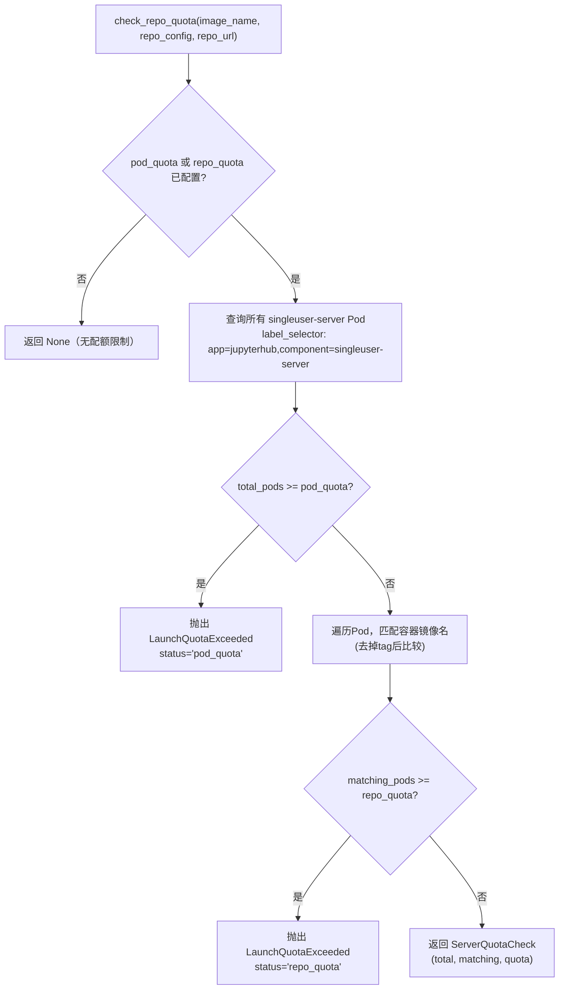

# 健康检查、配额管理与速率限制

## 概述

BinderHub 的运维保障系统由四个核心模块组成：health.py 提供健康检查端点，quota.py 管理并发启动配额，ratelimit.py 实现客户端速率限制，utils.py 提供 IP 网络匹配、内存单位解析和 LRU 缓存等基础工具。这些模块共同保障 BinderHub 在高并发场景下的稳定性和可观测性。

## 健康检查装饰器体系

health.py 定义了四个函数装饰器，以装饰器栈的方式组合应用到具体的检查方法上，提供重试、异常容错、结果缓存和慢查询日志功能。

### 装饰器栈结构

每个健康检查方法都被四层装饰器包裹（从上到下为执行顺序，从外到内为装饰器书写顺序）：

```python
@at_most_every(interval=15)     # 第1层：结果缓存，15秒内不重复执行
@false_if_raises                # 第2层：异常时返回False而非抛出
@retry                          # 第3层：失败时自动重试（默认3次，间隔1秒）
@_log_duration                  # 第4层：记录执行耗时
async def check_xxx(self):
    ...
```

装饰器的书写顺序很重要：`@at_most_every` 在最外层确保缓存先于重试生效；`@_log_duration` 在最内层准确测量单次执行时间。

### retry()：异常重试装饰器

```python
def retry(_f=None, *, delay=1, attempts=3):
    """Retry calling the decorated function if it raises an exception"""
    def repeater(f):
        @wraps(f)
        async def wrapper(*args, **kwargs):
            nonlocal attempts
            while attempts > 0:
                try:
                    return await f(*args, **kwargs)
                except Exception as e:
                    if attempts == 1:
                        raise
                    else:
                        attempts -= 1
                        app_log.exception(
                            f"Error checking {f.__name__}: {e}. "
                            f"Retrying ({attempts} attempts remaining)"
                        )
                        await asyncio.sleep(delay)
        return wrapper
    if _f is None:
        return repeater
    else:
        return repeater(_f)
```

设计特点：
- 支持无参数调用（`@retry`）和带参数调用（`@retry(delay=1, attempts=3)`）两种用法；
- 使用 `nonlocal attempts` 跟踪剩余重试次数；
- 每次失败后记录异常堆栈并等待 `delay` 秒；
- 最后一次尝试失败时直接抛出异常（不吞错）；
- 使用 `@wraps(f)` 保留原函数元数据。

### false_if_raises()：异常容错装饰器

```python
def false_if_raises(f):
    """Return False if `f` raises an exception"""
    @wraps(f)
    async def wrapper(*args, **kwargs):
        try:
            res = await f(*args, **kwargs)
        except Exception:
            app_log.exception(f"Error checking {f.__name__}")
            res = False
        return res
    return wrapper
```

将任何异常转换为 `False` 返回值。这确保单个健康检查项失败不会导致整个 `/health` 端点崩溃。异常以 ERROR 级别记录（含堆栈），便于排查问题。

### at_most_every()：节流缓存装饰器

```python
def at_most_every(_f=None, *, interval=60):
    """Call the wrapped function at most every `interval` seconds."""
    last_time = time.monotonic() - interval - 1
    last_result = unset = object()
    outstanding = None

    def caller(f):
        @wraps(f)
        async def wrapper(*args, **kwargs):
            nonlocal last_time, last_result, outstanding
            if outstanding is not None:
                # 不允许并发调用，返回已有Future
                return await outstanding
            now = time.monotonic()
            if last_result is unset or now > last_time + interval:
                outstanding = asyncio.ensure_future(f(*args, **kwargs))
                try:
                    last_result = await outstanding
                finally:
                    outstanding = None
                    last_time = time.monotonic()
            if last_result is unset:
                raise RuntimeError("No cached result to return")
            return last_result
        return wrapper
    if _f is None:
        return caller
    else:
        return caller(_f)
```

这是最复杂的装饰器，实现三个功能：

1. **时间窗口缓存**：`interval` 秒内直接返回缓存结果 `last_result`，避免频繁执行昂贵的检查（如 Kubernetes API 调用）；
2. **并发去重（Outstanding Future）**：如果缓存过期但已有一个并发调用正在执行（`outstanding` 不为 None），等待该调用完成而非发起新请求，防止缓存击穿；
3. **单调时钟**：使用 `time.monotonic()` 而非 `time.time()` 测量间隔，避免系统时钟调整影响缓存逻辑。

缓存状态转换：
```
首次调用 → last_result=unset → 执行函数 → 缓存结果+记录时间
                                    ↓
间隔内调用 → 直接返回缓存结果
间隔后调用 → 执行函数 → 更新缓存+时间
并发调用间隔到期 → 等待outstanding Future → 返回其结果
```

### _log_duration()：耗时记录装饰器

```python
def _log_duration(f):
    """Record the time for a given health check to run"""
    @wraps(f)
    async def wrapped(*args, **kwargs):
        tic = time.perf_counter()
        try:
            return await f(*args, **kwargs)
        finally:
            t = time.perf_counter() - tic
            if t > 0.5:
                log = app_log.info
            else:
                log = app_log.debug
            log(f"Health check {f.__name__} took {t:.3f}s")
    return wrapped
```

使用 `time.perf_counter()`（高精度计时器）测量执行耗时。耗时超过0.5秒的检查以 INFO 级别记录（提示可能的性能问题），否则以 DEBUG 级别记录。

## HealthHandler：基础健康检查处理器

`HealthHandler`（health.py:122-208）继承自 `BaseHandler`，提供 `/health` GET 和 HEAD 端点。

### 类属性

```python
class HealthHandler(BaseHandler):
    log_success_debug = True       # 200响应降级为DEBUG日志（避免日志洪水）
    skip_check_request_ip = True   # 跳过IP黑名单检查（允许联邦成员互相健康检查）
```

- `log_success_debug = True`：Tornado 将成功的（2xx）响应以 DEBUG 级别而非 INFO 级别记录，因为负载均衡器通常频繁调用 `/health`，会产生大量日志；
- `skip_check_request_ip = True`：健康检查通常来自负载均衡器、监控系统或联邦成员，这些IP可能不在正常访问列表中，需要跳过IP检查。

### 检查方法

#### check_jupyterhub_api()

```python
@at_most_every(interval=15)
@false_if_raises
@retry
@_log_duration
async def check_jupyterhub_api(self, hub_url):
    """Check JupyterHub API health"""
    await AsyncHTTPClient().fetch(hub_url + "hub/api/health", request_timeout=3)
    return True
```

向 JupyterHub 的 `/hub/api/health` 端点发送 GET 请求，超时3秒。这是最关键的健康检查——JupyterHub 不可用时 BinderHub 无法启动服务器。

#### check_docker_registry()

```python
@at_most_every(interval=15)
@false_if_raises
@retry
@_log_duration
async def check_docker_registry(self):
    """Check docker registry health"""
    app_log.info("Checking registry status")
    registry = self.settings["registry"]
    image_fullname = self.settings["image_prefix"] + "some-image-name:12345"
    name, tag = _get_image_basename_and_tag(image_fullname)
    await registry.get_image_manifest(name, tag)
    return True
```

通过请求一个虚构的镜像名（`{image_prefix}some-image-name:12345`）的 manifest 来检测注册表是否可访问。不关心镜像是否实际存在——只要注册表返回响应（即使是404），就说明注册表服务正常。如果注册表完全不可达（连接超时、DNS 失败等），`@false_if_raises` 将异常转换为 `False`。

### get_checks()：检查项注册

```python
def get_checks(self, checks):
    if self.settings["use_registry"]:
        checks["Docker registry"] = self.check_docker_registry()
    checks["JupyterHub API"] = self.check_jupyterhub_api(self.hub_url)
```

根据 `use_registry` 配置决定是否添加 Docker 注册表检查。JupyterHub API 检查始终存在。`checks` 字典的值是协程对象（async 函数调用返回的 coroutine），后续通过 `asyncio.gather` 并发执行。

### check_all()：并发执行所有检查

```python
async def check_all(self):
    checks = {}
    results = []
    self.get_checks(checks)

    for result, service in zip(
        await asyncio.gather(*checks.values()), checks.keys()
    ):
        if isinstance(result, bool):
            results.append({"service": service, "ok": result})
        else:
            results.append(dict({"service": service}, **result))

    # _ignore_failure=True 的检查项不计入健康状态
    overall = all(r["ok"] for r in results if not r.get("_ignore_failure", False))
    if not overall:
        unhealthy = [r for r in results if not r["ok"]]
        app_log.warning(f"Unhealthy services: {unhealthy}")
    return overall, results
```

关键点：
- `asyncio.gather()` 并发执行所有检查项，不逐一等待；
- 检查结果可以是 `bool` 或 `dict`（dict 类型包含额外信息字段）；
- **软检查**机制：结果字典中 `_ignore_failure=True` 的项即使失败也不影响整体健康状态（用于信息性指标如 Pod 配额）；
- 不健康的服务以 WARNING 级别记录。

### GET/HEAD 端点

```python
async def get(self):
    overall, checks = await self.check_all()
    if not overall:
        self.set_status(503)
    self.write({"ok": overall, "checks": checks})

async def head(self):
    overall, checks = await self.check_all()
    if not overall:
        self.set_status(503)
```

- **GET**：返回 JSON 格式的健康状态，包含整体状态和各检查项详情；
- **HEAD**：仅设置状态码不返回 body，供负载均衡器快速健康检查使用；
- 整体不健康时返回 HTTP 503 Service Unavailable。

响应示例：

```json
{
  "ok": true,
  "checks": [
    {"service": "JupyterHub API", "ok": true},
    {"service": "Docker registry", "ok": true},
    {"service": "Pod quota", "ok": true, "total_pods": 42, "build_pods": 3, "user_pods": 39, "quota": 100, "_ignore_failure": true}
  ]
}
```

## KubernetesHealthHandler：Kubernetes 增强健康检查

`KubernetesHealthHandler`（health.py:211-266）继承自 `HealthHandler`，增加了 Kubernetes Pod 配额检查。在 `app.py` 中，当 `build_class` 是 `KubernetesBuildExecutor` 子类时自动选用此类：

```python
@default("health_handler_class")
def _default_health_handler_class(self):
    if issubclass(self.build_class, KubernetesBuildExecutor):
        return KubernetesHealthHandler
    return HealthHandler
```

### _get_pods()：获取 Pod 统计信息

```python
@at_most_every
@_log_duration
async def _get_pods(self):
    """Get information about build and user pods"""
    namespace = self.settings["example_builder"].namespace
    k8s = self.settings["example_builder"].api
    pool = self.settings["executor"]

    label_selectors = [
        "app=jupyterhub,component=singleuser-server",
        "component=binderhub-build",
    ]
    requests = [
        asyncio.wrap_future(
            pool.submit(
                k8s.list_namespaced_pod,
                namespace,
                label_selector=label_selector,
                _preload_content=False,
                _request_timeout=KUBE_REQUEST_TIMEOUT,
            )
        )
        for label_selector in label_selectors
    ]
    responses = await asyncio.gather(*requests)
    return [json.loads(resp.read())["items"] for resp in responses]
```

通过 Kubernetes API 查询两类 Pod：
1. **用户服务器 Pod**：`app=jupyterhub,component=singleuser-server`（JupyterHub 启动的单用户服务器）；
2. **构建 Pod**：`component=binderhub-build`（BinderHub 启动的构建 Pod）。

关键实现细节：
- 使用 `asyncio.wrap_future(pool.submit(...))` 将阻塞的 Kubernetes 客户端调用包装为 asyncio Future，在线程池中执行，避免阻塞事件循环；
- `_preload_content=False` 延迟解析响应体，直接读取原始 JSON 提高效率；
- 使用 `KUBE_REQUEST_TIMEOUT = (3, 30)`（连接超时3秒，读取超时30秒）防止 Kubernetes API 挂起；
- 两个标签选择器的查询通过 `asyncio.gather` 并发执行。

### _check_pod_quotas()：Pod 配额检查

```python
async def _check_pod_quotas(self):
    user_pods, build_pods = await self._get_pods()
    n_user_pods = len(user_pods)
    n_build_pods = len(build_pods)

    quota = self.settings["launch_quota"].total_quota
    total_pods = n_user_pods + n_build_pods
    usage = {
        "total_pods": total_pods,
        "build_pods": n_build_pods,
        "user_pods": n_user_pods,
        "quota": quota,
        "ok": total_pods <= quota if quota is not None else True,
        "_ignore_failure": True,  # 软检查：超配额不标记服务不健康
    }
    return usage
```

将用户 Pod 和构建 Pod 总数与 `total_quota` 比较。`_ignore_failure: True` 表示 Pod 配额超限是信息性指标，不影响 `/health` 的整体状态码（服务仍然"健康"但已满负载）。当 `quota=None`（无配额限制）时始终返回 `ok=True`。

### get_checks() 扩展

```python
def get_checks(self, checks):
    super().get_checks(checks)
    checks["Pod quota"] = self._check_pod_quotas()
```

在父类检查项基础上追加 Pod 配额检查。

## LaunchQuota：启动配额系统

### LaunchQuotaExceeded 异常

```python
class LaunchQuotaExceeded(Exception):
    """Raised when a quota will be exceeded by a launch"""
    def __init__(self, message, *, quota, used, status):
        super().__init__()
        self.message = message   # 用户友好的错误消息
        self.quota = quota       # 配额上限
        self.used = used         # 已使用量
        self.status = status     # 配额类型标识（"pod_quota" 或 "repo_quota"）
```

`status` 字段用于 Prometheus 指标标签，区分是全局 Pod 配额还是仓库级别配额被触发。

### ServerQuotaCheck 命名元组

```python
ServerQuotaCheck = namedtuple("ServerQuotaCheck", ["total", "matching", "quota"])
```

`check_repo_quota()` 成功时返回此元组：
- `total`：当前运行的总服务器数；
- `matching`：运行相同镜像的服务器数；
- `quota`：仓库级别的配额限制。

### LaunchQuota 基类

```python
class LaunchQuota(LoggingConfigurable):
    executor = Any(allow_none=True, help="Optional Executor for blocking operations")
    total_quota = Integer(
        None,
        allow_none=True,
        config=True,
        help="""The number of concurrent singleuser servers.
        None: no quota; 0: maintenance mode (no launches); positive int: quota limit""",
    )

    async def check_repo_quota(self, image_name, repo_config, repo_url):
        return None  # 基类无配额检查，始终返回None
```

`total_quota` 的语义：
- `None`（默认）：无配额限制；
- `0`：维护模式，禁止启动任何新服务器；
- 正整数：最大并发服务器数。

### KubernetesLaunchQuota：Kubernetes 实现

`KubernetesLaunchQuota`（quota.py:78-158）通过查询 Kubernetes Pod 状态实现配额检查。

#### 属性

| 属性 | 类型 | 默认值 | 说明 |
|---|---|---|---|
| `api` | `Any` | 自动创建 `CoreV1Api()` | Kubernetes API 客户端 |
| `namespace` | `Unicode` | 环境变量 `BUILD_NAMESPACE` 或 `"default"` | 检查 Pod 的命名空间 |

#### API 客户端自动配置

```python
@default("api")
def _default_api(self):
    try:
        kubernetes.config.load_incluster_config()
    except kubernetes.config.ConfigException:
        kubernetes.config.load_kube_config()
    return client.CoreV1Api()
```

优先使用集群内配置（Pod 内的 ServiceAccount），回退到本地 kubeconfig（开发环境）。

#### check_repo_quota()：两级配额检查

```python
async def check_repo_quota(self, image_name, repo_config, repo_url):
    image_no_tag = image_name.rsplit(":", 1)[0]
    repo_quota = repo_config.get("quota")
    pod_quota = self.total_quota

    if pod_quota is not None or repo_quota:
        matching_pods = 0
        # 查询所有用户服务器Pod
        f = self.executor.submit(
            self.api.list_namespaced_pod,
            self.namespace,
            label_selector="app=jupyterhub,component=singleuser-server",
            _request_timeout=KUBE_REQUEST_TIMEOUT,
            _preload_content=False,
        )
        resp = await asyncio.wrap_future(f)
        pods = json.loads(resp.read())["items"]
        total_pods = len(pods)

        # 第一级：全局Pod配额检查
        if pod_quota is not None and total_pods >= pod_quota:
            self.log.error(f"BinderHub is full: {total_pods}/{pod_quota}")
            raise LaunchQuotaExceeded(
                "Too many users on this BinderHub! Try again soon.",
                quota=pod_quota, used=total_pods, status="pod_quota",
            )

        # 第二级：仓库级别配额检查
        for pod in pods:
            for container in pod["spec"]["containers"]:
                image = container["image"].rsplit(":", 1)[0]
                if image == image_no_tag:
                    matching_pods += 1
                    break

        if repo_quota and matching_pods >= repo_quota:
            self.log.error(
                f"{repo_url} has exceeded quota: {matching_pods}/{repo_quota} ({total_pods} total)"
            )
            raise LaunchQuotaExceeded(
                f"Too many users running {repo_url}! Try again soon.",
                quota=repo_quota, used=matching_pods, status="repo_quota",
            )

        return ServerQuotaCheck(total=total_pods, matching=matching_pods, quota=repo_quota)
    return None
```

检查流程：



仓库级别配额通过容器镜像名匹配实现——因为同一仓库的构建会产生相同前缀的镜像名（tag不同但镜像名部分相同），去掉tag后比较即可统计同一仓库的运行实例数。

## RateLimiter：固定窗口速率限制

`RateLimiter`（ratelimit.py:13-96）实现基于固定时间窗口的速率限制，按客户端 IP 地址限制构建请求频率。

### 核心配置

| 属性 | 类型 | 默认值 | 说明 |
|---|---|---|---|
| `period_seconds` | `Integer` | `3600` | 速率限制窗口时长（秒），默认1小时 |
| `limit` | `Integer` | `10` | 窗口内允许的最大请求数 |
| `clean_seconds` | `Integer` | `600` | 清理过期条目的间隔（秒），默认10分钟 |

### 算法实现

```python
def increment(self, key):
    now = int(self.time())
    # 定期清理过期条目
    if now - self._last_cleaned > self.clean_seconds:
        self._clean_limits()

    # 新key或窗口过期，初始化计数器
    if key not in self._limits or self._limits[key]["reset"] < now:
        self._limits[key] = {
            "remaining": self.limit,
            "reset": now + self.period_seconds,
        }
    limit = self._limits[key]
    limit["remaining"] -= 1
    if limit["remaining"] < 0:
        seconds_until_reset = int(limit["reset"] - now)
        raise RateLimitExceeded(
            f"Rate limit exceeded (by {-limit['remaining']}) for {key!r}, "
            f"reset in {seconds_until_reset}s."
        )
    return limit
```

固定窗口算法的特点：
1. **窗口重置**：当当前时间超过 `reset` 时间戳时，重置计数器为完整 `limit`，`reset` 设为当前时间 + `period_seconds`；
2. **递减计数**：每次调用 `increment(key)` 将 `remaining` 减1；
3. **超限检测**：`remaining < 0` 时抛出 `RateLimitExceeded` 异常（注意：即使超限也继续递减，以记录超额请求数用于滥用检测）；
4. **非滑动窗口**：速率限制在窗口结束时重置，而非滑动窗口。这意味着在窗口边界附近可能出现短时间内允许双倍请求的突发情况，但实现简单且内存开销低。

返回值结构：

```python
{"remaining": 9, "reset": 1692748800}  # Unix时间戳
```

### 过期条目清理

```python
def _clean_limits(self):
    now = self.time()
    self._last_cleaned = now
    self._limits = {
        key: limit for key, limit in self._limits.items() if limit["reset"] > now
    }
```

每 `clean_seconds` 秒执行一次，删除已过期的限制条目，防止内存无限增长（活跃用户条目保留，过期用户条目被 GC 回收）。

### 在 BaseHandler 中的集成

在 base.py:100-130 中，`check_rate_limit()` 方法在构建请求前被调用：

```python
def check_rate_limit(self):
    rate_limiter = self.settings["rate_limiter"]
    if rate_limiter.limit == 0:
        return  # 限制为0表示禁用速率限制
    if self.settings["auth_enabled"] and self.current_user:
        return  # 已认证用户不受速率限制
    if self._have_build_token:
        return  # 持有有效build_token的请求不受限制
    request_ip = self.request.remote_ip
    try:
        limit = rate_limiter.increment(request_ip)
    except RateLimitExceeded:
        raise web.HTTPError(
            429, f"Rate limit exceeded. Try again in {rate_limiter.period_seconds} seconds.",
        )
    else:
        self.set_header("x-ratelimit-remaining", str(limit["remaining"]))
        self.set_header("x-ratelimit-reset", str(limit["reset"]))
        self.set_header("x-ratelimit-limit", str(rate_limiter.limit))
```

速率限制的豁免条件：
1. `limit == 0`：配置为0时禁用速率限制；
2. 已认证用户：登录用户不受 IP 级别限制；
3. 持有有效 build_token：通过UI页面发起的请求（带有短期 JWT token）不受限制。

受限制的请求在响应头中返回速率限制信息（遵循 IETF 标准速率限制头）。

## 工具函数与类

### ip_in_networks()：IP 网络匹配

```python
def ip_in_networks(
    ip_addr: str, networks: Iterable[ipaddress.IPv4Network | ipaddress.IPv6Network]
):
    ip = ipaddress.ip_address(ip_addr)
    for network in networks:
        if ip in network:
            return network
    return False
```

使用 Python 标准库 `ipaddress` 模块检查 IP 地址是否属于给定网络列表中的任意一个。同时支持 IPv4 和 IPv6。匹配时返回匹配到的网络对象（用于错误消息），不匹配返回 `False`。

此函数在 `BaseHandler.check_request_ip()` 中用于 IP 黑名单检查：

```python
ban_networks = self.settings.get("ban_networks")
match = ip_in_networks(request_ip, ban_networks)
if match:
    raise web.HTTPError(403, f"Requests from {ban_networks[network_spec]} are not allowed")
```

`ban_networks` 配置通过 BinderHub traitlet 验证，自动将 CIDR 字符串转换为 `IPv4Network`/`IPv6Network` 对象：

```python
@validate("ban_networks")
def _cast_ban_networks(self, proposal):
    networks = {}
    for cidr, message in proposal.value.items():
        networks[ipaddress.ip_network(cidr)] = message
    return networks
```

配置示例：

```python
c.BinderHub.ban_networks = {
    "192.168.0.0/16": "内部网络",
    "10.0.0.0/8": "私有网络",
    "2001:db8::/32": "文档IPv6前缀",
}
```

### ByteSpecification：带单位的内存配置 Trait

```python
class ByteSpecification(Integer):
    UNIT_SUFFIXES = {
        "K": 1024,
        "M": 1024 * 1024,
        "G": 1024 * 1024 * 1024,
        "T": 1024 * 1024 * 1024 * 1024,
    }
    allow_none = True

    def validate(self, obj, value):
        if isinstance(value, (int, float)):
            return int(value)
        try:
            num = float(value[:-1])
        except ValueError:
            raise TraitError(...)
        suffix = value[-1]
        if suffix not in self.UNIT_SUFFIXES:
            raise TraitError(...)
        return int(float(num) * self.UNIT_SUFFIXES[suffix])
```

允许使用人类可读的格式指定字节数，支持 K/M/G/T 后缀（以1024为基数）。配置示例：

```python
c.KubernetesBuildExecutor.memory_limit = "2G"   # 2147483648 字节
c.KubernetesBuildExecutor.memory_request = "512M"  # 536870912 字节
c.BuildExecutor.memory_limit = 0  # 无限制（直接使用int）
```

### Cache：LRU 缓存实现

```python
class Cache(OrderedDict):
    """Basic LRU Cache with get/set"""
    def __init__(self, max_size=1024, max_age=0):
        self.max_size = max_size
        self.max_age = max_age
        self._ages = {}
```

基于 `collections.OrderedDict` 的 LRU（最近最少使用）缓存实现。

#### 核心方法

**get()**：

```python
def get(self, key, default=None):
    if key in self and not self._check_expired(key):
        self.move_to_end(key)  # 访问时移到末尾（标记为最近使用）
    return super().get(key, default)
```

**set()**：

```python
def set(self, key, value):
    self[key] = value
    self._ages[key] = self._now()
    self.move_to_end(key)
    if len(self) > self.max_size:
        first_key = next(iter(self))  # 删除最旧条目（OrderedDict头部）
        self.pop(first_key)
```

**_check_expired()**：

```python
def _check_expired(self, key):
    if not self.max_age:
        return False
    if self._ages[key] + self.max_age < self._now():
        self.pop(key)
        return True
    return False
```

特性：
- **max_size**（默认1024）：最大缓存条目数，超出时淘汰最久未访问的条目；
- **max_age**（默认0，即不使用TTL）：条目最大存活时间（秒），过期自动删除；
- 利用 `OrderedDict` 的有序性：访问/插入时 `move_to_end()`，淘汰时弹出第一个元素；
- 用于 repo2docker provider 的仓库信息缓存，避免重复查询 GitHub/GitLab API。

### 其他工具

**KUBE_REQUEST_TIMEOUT**：

```python
KUBE_REQUEST_TIMEOUT = (3, 30)
```

Kubernetes API 请求的默认超时设置，元组形式 `(connect_timeout, read_timeout)`。连接超时3秒快速失败，读取超时30秒允许较慢的列表操作。

**Kubernetes 客户端 ThreadPool monkeypatch**：

```python
_dummy_pool = Mock()
api_client.ThreadPool = lambda *args, **kwargs: _dummy_pool
```

这是一个重要的 monkeypatch：kubernetes Python 客户端在实例化时无条件创建与 CPU 数量相等的线程池线程，这在 BinderHub 使用 asyncio + 自有 ThreadPoolExecutor 时会造成线程泄漏。此 patch 将 kubernetes 客户端的 ThreadPool 替换为 Mock 对象，避免创建无用线程。

**rendezvous_rank()**：

```python
def rendezvous_rank(buckets, key):
    """Rendezvous hashing (HRW hashing) for consistent bucket assignment"""
    ranking = []
    for bucket in buckets:
        score = blake2b_hash_as_int(b"%s-%s" % (str(key).encode(), str(bucket).encode()))
        ranking.append((score, bucket))
    return [b for (s, b) in sorted(ranking, reverse=True)]
```

实现 Rendezvous Hashing（最高随机权重哈希），用于将 key 一致性地分配到多个 bucket（如多个构建节点）。使用 BLAKE2b 哈希函数，添加/删除 bucket 时仅影响 1/N 的 key 重新分配。

## 配置示例

### 基础健康检查配置

```python
# 健康检查自动配置，无需手动设置
# HealthHandler 或 KubernetesHealthHandler 根据 build_class 自动选择
c.BinderHub.health_handler_class = KubernetesHealthHandler
```

### 配额配置

```python
# 全局并发用户限制
c.LaunchQuota.total_quota = 100  # 最多100个并发用户服务器
# c.LaunchQuota.total_quota = 0  # 维护模式，禁止新启动

# Kubernetes 配额实现
c.BinderHub.launch_quota_class = KubernetesLaunchQuota
c.KubernetesLaunchQuota.namespace = "binderhub"
```

### 速率限制配置

```python
# 每IP每小时最多10次构建请求
c.RateLimiter.period_seconds = 3600  # 1小时窗口
c.RateLimiter.limit = 10             # 10次请求
c.RateLimiter.clean_seconds = 600    # 每10分钟清理过期条目

# 禁用速率限制
# c.RateLimiter.limit = 0
```

### IP 黑名单

```python
import ipaddress
c.BinderHub.ban_networks = {
    "192.0.2.0/24": "测试网络段",
    "198.51.100.0/24": "已知爬虫来源",
}
```

### 内存配置

```python
c.KubernetesBuildExecutor.memory_limit = "4G"
c.KubernetesBuildExecutor.memory_request = "1G"
```

## 关键源码引用

- 健康检查装饰器：health.py:14-119
- HealthHandler 基类：health.py:122-208
- KubernetesHealthHandler：health.py:211-266
- LaunchQuota 基类与异常：quota.py:18-75
- KubernetesLaunchQuota：quota.py:78-158
- RateLimiter：ratelimit.py:13-96
- ip_in_networks()：utils.py:171-186
- ByteSpecification：utils.py:48-98
- Cache LRU 实现：utils.py:101-145
- KUBE_REQUEST_TIMEOUT 与 monkeypatch：utils.py:18-19,195-196
- rendezvous_rank()：utils.py:29-45
- HealthHandler 类自动选择：app.py:374-378
- ban_networks 配置验证：app.py:789-796
