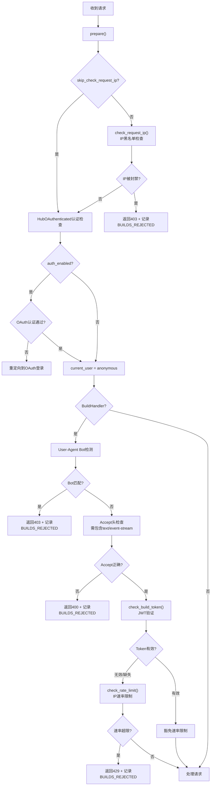

# 安全机制与认证体系

## 概述

BinderHub 的安全体系在 base.py 中定义基础框架，在 app.py 中配置安全相关 traitlets，在 main.py 中实现 JWT Build Token 的签发，在 builder.py 中实现请求级安全检查。安全机制包括：IP 黑名单、JWT Build Token 验证、User-Agent Bot 检测、速率限制、CORS 配置、HubOAuth 认证集成和 API-only 模式。

## BaseHandler：安全基础处理器

`BaseHandler`（base.py:16-210）继承自 `HubOAuthenticated` 和 `web.RequestHandler`，是所有 BinderHub 请求处理器的基类。`HubOAuthenticated` 是 JupyterHub 提供的混入类，为 HubOAuth 认证提供 `@authenticated` 装饰器和 `get_current_user()` 支持。

### 类继承关系

```
web.RequestHandler (Tornado)
    └── HubOAuthenticated (JupyterHub services.auth)
        └── BaseHandler (BinderHub)
            ├── BuildHandler
            ├── HealthHandler
            ├── MetricsHandler
            ├── VersionHandler
            ├── UIHandler
            ├── RepoLaunchUIHandler
            └── LegacyRedirectHandler
```

### initialize()：HubOAuth 初始化

```python
def initialize(self):
    super().initialize()
    if self.settings["auth_enabled"]:
        self.hub_auth = HubOAuth.instance(config=self.settings["traitlets_config"])
```

当 `auth_enabled=True` 时，通过 `HubOAuth.instance()` 获取 HubOAuth 单例实例。HubOAuth 使用 traitlets 配置（`c.HubOAuth.hub_host`、`c.HubOAuth.api_token`、`c.HubOAuth.base_url` 等），这些配置在 Helm Chart 的 `binderhub_config.py` 中根据 `hub_url` 自动设置。

### prepare()：请求预处理

```python
def prepare(self):
    super().prepare()
    self.check_request_ip()
```

Tornado 的 `prepare()` 方法在每个请求处理前被调用。BaseHandler 的实现首先调用父类 `prepare()`（HubOAuthenticated 会在此进行OAuth认证检查），然后执行 IP 黑名单检查。这意味着 IP 检查在所有请求上生效（除非 handler 设置 `skip_check_request_ip = True`）。

### skip_check_request_ip：IP检查豁免

```python
skip_check_request_ip = False
```

默认情况下所有处理器都执行 IP 检查。以下处理器设置 `skip_check_request_ip = True`：

| 处理器 | 原因 |
|---|---|
| `HealthHandler` | 允许联邦成员、负载均衡器健康检查（可能来自被封禁的IP段） |
| `VersionHandler` | 同上，版本检查不应被IP阻断 |
| `MetricsHandler` | Prometheus 抓取可能来自集群内IP |

参考：health.py:132、base.py:220。

### check_request_ip()：IP 黑名单检查

```python
def check_request_ip(self):
    ban_networks = self.settings.get("ban_networks")
    if self.skip_check_request_ip or not ban_networks:
        return
    request_ip = self.request.remote_ip
    match = ip_in_networks(request_ip, ban_networks)
    if match:
        network_spec = match
        message = ban_networks[network_spec]
        app_log.warning(
            f"Blocking request from {request_ip} matching banned network "
            f"{network_spec}: {message}"
        )
        raise web.HTTPError(403, f"Requests from {message} are not allowed")
```

检查流程：
1. 如果 handler 设置了 `skip_check_request_ip` 或未配置 `ban_networks`，直接返回；
2. 获取请求的客户端 IP（`request.remote_ip`，经过 xheaders 信任代理处理）；
3. 使用 `ip_in_networks()` 函数（utils.py:171-186）检查 IP 是否属于任何被封禁的 CIDR 网络段；
4. 匹配时记录 WARNING 日志（含IP、网络、原因消息）并返回 403 Forbidden。

`ban_networks` 在 app.py 中通过 `@validate` 装饰器自动将 CIDR 字符串转换为 `IPv4Network`/`IPv6Network` 对象：

```python
@validate("ban_networks")
def _cast_ban_networks(self, proposal):
    networks = {}
    for cidr, message in proposal.value.items():
        networks[ipaddress.ip_network(cidr)] = message
    return networks
```

配置示例：

```python
c.BinderHub.ban_networks = {
    "192.0.2.0/24": "测试网络段（TEST-NET-1）",
    "198.51.100.0/24": "已知滥用来源",
    "203.0.113.0/24": "数据中心IP段",
}
```

### token_origin()：Build Token 来源计算

```python
def token_origin(self):
    origin_or_host = self.request.headers.get("origin", None)
    if origin_or_host is not None:
        origin_or_host = urllib.parse.urlparse(origin_or_host).netloc
    else:
        origin_or_host = self.request.headers.get("host", "")
    return origin_or_host
```

Build Token 的 origin 字段用于验证请求来源：
1. 优先使用 `Origin` header（跨域请求时浏览器自动设置），通过 `urlparse` 提取 netloc 部分（去掉 scheme，只保留 `host:port`）；
2. 如果没有 Origin header（同源请求），回退到 `Host` header；
3. 这确保了 Token 只能在签发它的同一主机/来源上使用。

### check_build_token()：JWT Build Token 验证

```python
def check_build_token(self, build_token, provider_spec):
    if not build_token:
        app_log.debug(f"No build token for {provider_spec}")
        self._have_build_token = False
        return
    try:
        decoded = jwt.decode(
            build_token,
            key=self.settings["build_token_secret"],
            audience=provider_spec,
            algorithms=["HS256"],
        )
    except jwt.PyJWTError as e:
        app_log.error(f"Failure to validate build token for {provider_spec}: {e}")
        raise web.HTTPError(403, "Invalid build token")

    origin = self.token_origin()
    if decoded["origin"] != origin:
        app_log.error(
            f"Build token from mismatched origin != {origin}: {decoded};"
            f" Host={self.request.headers.get('host')}, "
            f"Origin={self.request.headers.get('origin')}"
        )
        if self.settings["build_token_check_origin"]:
            raise web.HTTPError(403, "Invalid build token")
    app_log.debug(f"Accepting build token for {provider_spec}")
    self._have_build_token = True
    return decoded
```

JWT 验证流程：

1. **空 Token**：未提供 build_token 时设置 `_have_build_token = False`，正常继续（受速率限制约束）；
2. **JWT 解码**：使用 `jwt.decode()` 验证 Token，参数为：
   - `key`：`build_token_secret`（HS256 对称密钥，32字节随机值）；
   - `audience`：`provider_spec`（格式为 `{provider_id}/{spec}`，如 `gh/minrk/binder-example/master`），验证 Token 的受众匹配；
   - `algorithms`：仅允许 `HS256`（HMAC-SHA256）算法；
3. **Origin 验证**：解码后检查 Token 中的 `origin` 字段是否与当前请求的 origin 匹配；
   - 如果不匹配，根据 `build_token_check_origin` 配置决定是否拒绝（默认 True = 拒绝）；
   - 不匹配时记录 ERROR 日志（含调试信息）；
4. **设置标记**：验证通过后设置 `self._have_build_token = True`，此标记用于：
   - 速率限制豁免（持有有效Token的请求不受IP速率限制）；
   - 事件日志中标记请求是否通过UI页面发起。

JWT Token 验证自动检查 `exp`（过期时间）声明，过期 Token 会抛出 `jwt.ExpiredSignatureError`。

### check_rate_limit()：速率限制与豁免

```python
def check_rate_limit(self):
    rate_limiter = self.settings["rate_limiter"]
    if rate_limiter.limit == 0:
        return
    if self.settings["auth_enabled"] and self.current_user:
        return  # 已认证用户豁免
    if self._have_build_token:
        return  # 有效build_token持有者豁免
    request_ip = self.request.remote_ip
    try:
        limit = rate_limiter.increment(request_ip)
    except RateLimitExceeded:
        raise web.HTTPError(
            429,
            f"Rate limit exceeded. Try again in {rate_limiter.period_seconds} seconds.",
        )
    else:
        app_log.debug(f"Rate limit for {request_ip}: {limit}")
    self.set_header("x-ratelimit-remaining", str(limit["remaining"]))
    self.set_header("x-ratelimit-reset", str(limit["reset"]))
    self.set_header("x-ratelimit-limit", str(rate_limiter.limit))
```

速率限制的三层豁免：
1. **`limit == 0`**：配置为0表示禁用速率限制；
2. **已认证用户**：`auth_enabled=True` 且 `current_user` 存在时（通过OAuth登录的用户），不受速率限制；
3. **持有有效Build Token**：`_have_build_token=True` 时（从Binder UI页面发起的请求），不受速率限制。

受限制的请求返回标准速率限制响应头：
- `X-RateLimit-Limit`：窗口内允许的最大请求数；
- `X-RateLimit-Remaining`：窗口内剩余请求数；
- `X-RateLimit-Reset`：窗口重置的Unix时间戳。

超限返回 HTTP 429 Too Many Requests。

在 BuildHandler 中，`check_rate_limit()` 和 `check_request_ip()` 被覆盖以在拒绝时记录 BUILDS_REJECTED 指标：

```python
def check_rate_limit(self):
    try:
        super().check_rate_limit()
    except HTTPError:
        self._record_rejected_build(reason="rate_limit")
        raise

def check_request_ip(self):
    try:
        super().check_request_ip()
    except HTTPError:
        self._record_rejected_build(reason="banned_ip")
        raise
```

### get_current_user()：用户身份

```python
def get_current_user(self):
    if not self.settings["auth_enabled"]:
        return "anonymous"
    return super().get_current_user()
```

- **匿名模式**（`auth_enabled=False`）：所有用户标识为 `"anonymous"`；
- **认证模式**：委托给 `HubOAuthenticated.get_current_user()`，通过 HubOAuth 验证请求中的 Cookie/Token 获取用户模型。

### set_default_headers()：安全响应头

```python
def set_default_headers(self):
    headers = self.settings.get("headers", {})
    for header, value in headers.items():
        self.set_header(header, value)
    self.set_header("access-control-allow-headers", "cache-control")
```

- 自定义headers：通过 `c.BinderHub.tornado_settings['headers']` 配置，可以添加 HSTS、X-Frame-Options 等安全头；
- CORS 头：始终设置 `Access-Control-Allow-Headers: cache-control`，允许浏览器发送带 `Cache-Control` 头的跨域请求。

在 app.py 中，如果配置了 `cors_allow_origin`，自动添加 CORS 头：

```python
if self.cors_allow_origin:
    self.tornado_settings.setdefault("headers", {})[
        "Access-Control-Allow-Origin"
    ] = self.cors_allow_origin
```

### template_namespace：模板安全上下文

```python
@property
def template_namespace(self):
    ns = dict(
        static_url=self.static_url,
        banner=self.settings["banner_message"],
        auth_enabled=self.settings["auth_enabled"],
    )
    if self.settings["auth_enabled"]:
        ns["xsrf"] = self.xsrf_token.decode("ascii")
        ns["api_token"] = self.hub_auth.get_token(self) or ""
    ns.update(self.settings.get("template_variables", {}))
    return ns
```

渲染模板时传递的安全相关变量：
- `auth_enabled`：前端可根据此显示/隐藏登录按钮；
- `xsrf`：XSRF Token（仅认证模式），用于防止跨站请求伪造；
- `api_token`：JupyterHub API Token（仅认证模式），用于前端调用Hub API。

### options()：CORS 预检支持

```python
def options(self, *args, **kwargs):
    pass
```

空的 OPTIONS 处理器，Tornado 默认会设置适当的 CORS 头（如 `Access-Control-Allow-Methods`、`Access-Control-Allow-Headers`），支持浏览器跨域预检请求。

## JWT Build Token 签发

Build Token 由 main.py:63-80 中的 `RepoLaunchUIHandler.get()` 方法签发：

```python
@authenticated
def get(self, provider_id, _escaped_spec):
    _, spec = self.get_spec_from_request()

    build_token = jwt.encode(
        {
            "exp": int(time.time()) + self.settings["build_token_expires_seconds"],
            "aud": f"{provider_id}/{spec}",
            "origin": self.token_origin(),
        },
        key=self.settings["build_token_secret"],
        algorithm="HS256",
    )
    self.page_config["buildToken"] = build_token
    ...
    return super().get()
```

### Token 结构

JWT Payload 包含三个声明：

| 声明 | 值 | 说明 |
|---|---|---|
| `exp` | 当前时间 + `build_token_expires_seconds` | 过期时间（Unix时间戳），默认300秒（5分钟） |
| `aud` | `"{provider_id}/{spec}"` | 受众，标识此Token仅对特定provider+spec有效 |
| `origin` | `token_origin()` | 签发来源（netloc），防止Token被其他站点盗用 |

使用 HS256 算法签名，密钥为 `build_token_secret`（32字节随机值）。

### build_token_secret 密钥管理

在 app.py:741-765 中：

```python
build_token_secret = Union(
    [Unicode(), Bytes()],
    config=True,
    help="Secret used to sign build tokens",
)

@validate("build_token_secret")
def _validate_build_token_secret(self, proposal):
    if isinstance(proposal.value, str):
        return a2b_hex(proposal.value)  # 十六进制字符串 → 字节
    return proposal.value

@default("build_token_secret")
def _default_build_token_secret(self):
    if os.environ.get("BINDERHUB_BUILD_TOKEN_SECRET"):
        return a2b_hex(os.environ["BINDERHUB_BUILD_TOKEN_SECRET"])
    app_log.warning(
        "Generating random build token secret. "
        "Set BinderHub.build_token_secret to avoid this warning."
    )
    return secrets.token_bytes(32)
```

密钥管理策略：
1. 支持十六进制字符串或原始字节两种格式配置；
2. 环境变量 `BINDERHUB_BUILD_TOKEN_SECRET` 可用于设置密钥（Helm部署中通过Secret注入）；
3. 默认生成随机32字节密钥，但每次重启会变化，导致重启前签发的Token失效——因此生产环境应显式配置固定密钥。

### build_token_expires_seconds 配置

```python
build_token_expires_seconds = Integer(
    300,
    config=True,
    help="Expiry (in seconds) of build tokens. These are generally only used to "
         "authenticate a single request from a page, so should be short-lived.",
)
```

默认5分钟有效期。Token仅用于从UI页面发起单次构建请求的验证，短有效期降低了Token被盗用的风险。

### build_token_check_origin 开关

```python
build_token_check_origin = Bool(
    True,
    config=True,
    help="Whether to validate build token origin. False disables the origin check.",
)
```

默认启用 Origin 检查。在某些特殊部署场景（如通过反向代理改变Host/Origin头）下可以禁用，但不推荐。

## Bot 检测：User-Agent 黑名单

在 builder.py:306-313（BuildHandler.prepare()）中实现：

```python
block_build_user_agents = self.settings.get("block_build_user_agents", [])
for pattern in block_build_user_agents:
    if pattern.match(user_agent):
        self._record_rejected_build(
            reason="user_agent", msg=f"user agent matching {pattern}"
        )
        raise HTTPError(403, "Bots not allowed")
```

默认阻止的 User-Agent 模式在 app.py:320-325 中定义：

```python
block_build_user_agents = List(
    Unicode(),
    default_value=[
        ".*bot.*",
        ".*gpt.*",
        ".*crawler.*",
        ".*spider.*",
    ],
    ...
)
```

在初始化时编译为正则表达式（大小写不敏感）：

```python
block_build_user_agent_patterns = [
    re.compile(pattern, re.IGNORECASE)
    for pattern in self.block_build_user_agents
]
```

默认阻止的模式：
- `.*bot.*`：通用爬虫/机器人（如Googlebot、bingbot）；
- `.*gpt.*`：GPT类AI爬虫；
- `.*crawler.*`：网络爬虫；
- `.*spider.*`：搜索引擎蜘蛛。

此外还检查 Accept 头，构建端点必须接受 `text/event-stream`：

```python
if "text/event-stream" not in accept:
    self._record_rejected_build(reason="accept_header", ...)
    raise HTTPError(400, "Missing Accept header: text/event-stream")
```

这防止非SSE客户端（如普通curl请求）意外触发构建。

## HubOAuth 认证集成

### 认证模式配置

认证模式通过 `c.BinderHub.auth_enabled = True` 启用。在 Helm Chart 的 `binderhub_config.py` 中：

```python
if c.BinderHub.auth_enabled:
    if "hub_url" not in c.BinderHub:
        c.BinderHub.hub_url = ""
    hub_url = urlparse(c.BinderHub.hub_url)
    c.HubOAuth.hub_host = f"{hub_url.scheme}://{hub_url.netloc}"
    if "base_url" in c.BinderHub:
        c.HubOAuth.base_url = c.BinderHub.base_url
```

自动配置 HubOAuth 所需的参数：
- `c.HubOAuth.hub_host`：JupyterHub 的完整 URL（scheme + host）；
- `c.HubOAuth.base_url`：BinderHub 的 base URL（用于 OAuth 回调路径构造）。

### OAuth 回调端点

在 app.py:1126-1133 中注册：

```python
if self.auth_enabled:
    oauth_redirect_uri = os.getenv("JUPYTERHUB_OAUTH_CALLBACK_URL") or \
        url_path_join(self.base_url, "oauth_callback")
    oauth_redirect_uri = urlparse(oauth_redirect_uri).path
    handlers.insert(
        -1, (re.escape(oauth_redirect_uri), HubOAuthCallbackHandler)
    )
```

使用 JupyterHub 提供的 `HubOAuthCallbackHandler` 处理 OAuth 回调。回调路径从环境变量 `JUPYTERHUB_OAUTH_CALLBACK_URL` 获取（Helm部署中自动设置），或默认为 `/oauth_callback`。

### 认证模式下的行为差异

| 特性 | 匿名模式（默认） | 认证模式 |
|---|---|---|
| `create_user` | `True`（创建临时用户） | `False`（使用登录用户） |
| `get_current_user()` | 返回 `"anonymous"` | 返回 JupyterHub 用户模型 |
| 速率限制 | 按IP限制 | 已认证用户豁免 |
| Build Token | 用于API来源验证 | 同样签发，但与OAuth共存 |
| 服务器命名 | 默认服务器（`server_name=""`） | 支持命名服务器（`allow_named_servers`） |
| 用户服务器限制 | 全局/仓库配额 | 额外 `named_server_limit_per_user` |
| `@authenticated` 装饰器 | 无强制认证（所有人都"已认证"为anonymous） | 要求OAuth登录 |

### Z2JH 中的 RBAC 配置

在认证模式下，JupyterHub 的 binder 服务角色需要额外的 scope：
- `servers`：启动/停止服务器；
- `read:users`：读取用户信息（替代匿名模式的 `admin:users`）；
- `admin:users`：创建用户（仅匿名模式需要）。

## CORS 配置

BinderHub 有两个层面的 CORS 配置：

1. **BinderHub API 层面**：`c.BinderHub.cors_allow_origin` 设置 BinderHub API 端点的 `Access-Control-Allow-Origin` 头；
2. **Spawned Notebook 层面**：`c.BinderSpawner.cors_allow_origin`（在 JupyterHub extraConfig 中设置）控制用户 Notebook 服务器的 CORS 头。

在 BinderSpawnerMixin.get_args() 中：

```python
if self.cors_allow_origin:
    args.append("--NotebookApp.allow_origin=" + self.cors_allow_origin)
if self.cors_allow_origin == "*":
    args.append("--NotebookApp.allow_origin_pat=.*")
```

`allow_origin=*` 时额外添加 `allow_origin_pat=.*` 是因为 Jupyter Notebook 的 `allow_origin=*` 不能正确处理单文件请求的跨域问题（参见 [jupyter/notebook#5898](https://github.com/jupyter/notebook/pull/5898)）。

同时所有 NotebookApp 参数自动复制为 ServerApp 版本，兼容 JupyterLab / Jupyter Server。

## API-only 模式

```python
enable_api_only_mode = Bool(
    False,
    config=True,
    help="""When enabled, BinderHub will operate in an API only mode,
    without a UI, and with the only registered endpoints being:
        - /metrics
        - /versions
        - /build/([^/]+)/(.+)
        - /health
        - /* -> shows a 404 page
    """,
)
```

API-only 模式下：
- 不注册 UI 相关路由（主页、v2/ 启动URL、badge静态文件等）；
- 仅保留 API 端点（/build、/metrics、/versions、/health、/api/repoproviders）；
- 适合以编程方式使用 BinderHub（如CI/CD集成、第三方平台集成）。

配合 `build_only` 查询参数使用：

```python
def _get_build_only(self):
    enable_api_only_mode = self.settings.get("enable_api_only_mode", False)
    build_only_query_parameter = str(
        self.get_query_argument(name="build_only", default="")
    )
    build_only = False
    if build_only_query_parameter.lower() == "true":
        if not enable_api_only_mode:
            raise HTTPError(400, "Building but not launching is not permitted when "
                                "the API only mode was not enabled")
        build_only = True
    return build_only
```

`build_only=true` 参数仅在 API-only 模式下可用，表示只构建镜像不启动服务器。构建完成后直接返回镜像名称，不进行启动流程。

## Docker 注册表认证安全

注册表认证涉及多种安全机制（详见 [07-registry-integration.md](07-registry-integration.md)）：

1. **docker config.json**：从 `~/.docker/config.json` 加载凭证，支持 Basic Auth 和 Bearer Token；
2. **Google Artifact Registry**：使用 GCE 元数据服务器自动获取 access_token（不需要手动配置凭证）；
3. **ExternalRegistryHelper**：通过 sidecar 微服务获取短期推送令牌，避免在 BinderHub 配置中存储长期凭证；
4. **Kubernetes Secret**：Helm Chart 中通过 `binder-build-docker-config` Secret 挂载 `/root/.docker/config.json`。

## 安全配置汇总

| 安全特性 | 配置项 | 默认值 | 说明 |
|---|---|---|---|
| Build Token 密钥 | `c.BinderHub.build_token_secret` | 随机生成 | HS256 JWT 签名密钥 |
| Token 有效期 | `c.BinderHub.build_token_expires_seconds` | 300（5分钟） | Build Token 过期时间 |
| Origin检查 | `c.BinderHub.build_token_check_origin` | `True` | 是否验证Token来源 |
| Bot UA阻止 | `c.BinderHub.block_build_user_agents` | `[".*bot.*", ".*gpt.*", ".*crawler.*", ".*spider.*"]` | User-Agent正则黑名单 |
| IP黑名单 | `c.BinderHub.ban_networks` | `{}` | CIDR→原因消息映射 |
| 速率限制窗口 | `c.RateLimiter.period_seconds` | 3600（1小时） | 速率限制时间窗口 |
| 速率限制请求数 | `c.RateLimiter.limit` | 10 | 窗口内最大请求数 |
| CORS来源 | `c.BinderHub.cors_allow_origin` | `""` | 允许的跨域来源 |
| 认证模式 | `c.BinderHub.auth_enabled` | `False` | 是否启用JupyterHub OAuth |
| API-only模式 | `c.BinderHub.enable_api_only_mode` | `False` | 是否仅API模式 |
| 自定义安全头 | `c.BinderHub.tornado_settings['headers']` | `{}` | 自定义HTTP响应头 |

## 安全请求处理流程



## _brotli C 扩展 GIL 注意事项

> **注意**：虽然不在 BinderHub 核心代码中，但在部署自由线程 Python（PEP 703，Python 3.13+ free-threading 模式）时需要注意。`brotli` 压缩 C 扩展（被 Tornado/pycurl 间接依赖）在自由线程模式下的 GIL 交互可能导致性能问题或死锁。对于 BinderHub 这种高并发异步服务，建议在自由线程 Python 部署前充分测试压缩相关依赖的线程安全性，或使用标准（带GIL）Python 构建。

## 配置示例

### 生产环境安全配置

```python
# 强制固定Build Token密钥（十六进制编码的32字节）
c.BinderHub.build_token_secret = "a1b2c3d4e5f6789012345678abcdef0123456789abcdef0123456789abcdef01"

# Token短期有效
c.BinderHub.build_token_expires_seconds = 300

# 启用Origin检查
c.BinderHub.build_token_check_origin = True

# IP黑名单（封禁数据中心和已知滥用IP段）
import ipaddress
c.BinderHub.ban_networks = {
    "192.0.2.0/24": "TEST-NET",
}

# 速率限制
c.RateLimiter.period_seconds = 3600
c.RateLimiter.limit = 20  # 每小时每IP最多20次构建

# CORS（限制为信任的来源）
c.BinderHub.cors_allow_origin = "https://mybinder.example.com"

# 安全响应头
c.BinderHub.tornado_settings = {
    "headers": {
        "X-Frame-Options": "DENY",
        "X-Content-Type-Options": "nosniff",
        "Strict-Transport-Security": "max-age=31536000; includeSubDomains",
    }
}
```

### 启用认证模式

```python
# BinderHub配置
c.BinderHub.auth_enabled = True
c.BinderHub.hub_url = "https://hub.example.com/"
c.BinderHub.hub_url_local = "http://proxy-public/hub/"  # 集群内部地址

# Helm values.yaml 对应配置
# config:
#   BinderHub:
#     auth_enabled: true
#     hub_url: https://hub.example.com/
# jupyterhub:
#   hub:
#     config:
#       JupyterHub:
#         authenticator_class: github  # 或其他认证器
#       BinderSpawner:
#         auth_enabled: true
#     loadRoles:
#       binder:
#         services: [binder]
#         scopes: [servers, read:users]  # 认证模式不需要admin:users
```

## 关键源码引用

- BaseHandler 类：base.py:16-210
- check_request_ip()：base.py:31-47
- token_origin()：base.py:49-63
- check_build_token() JWT验证：base.py:65-98
- check_rate_limit()：base.py:100-130
- get_current_user()：base.py:132-135
- Build Token签发：main.py:63-80
- build_token_secret配置：app.py:741-765
- block_build_user_agents配置：app.py:318-336
- ban_networks配置与验证：app.py:778-796
- enable_api_only_mode：app.py:838-850
- Bot检测与Accept检查：builder.py:299-319
- build_only参数处理：builder.py:246-263
- OAuth回调注册：app.py:1126-1133
- HubOAuth初始化：base.py:19-22
- CORS头设置：app.py:1018-1021
- BUILDS_REJECTED指标定义：builder.py:58-63
- ip_in_networks()工具函数：utils.py:171-186
