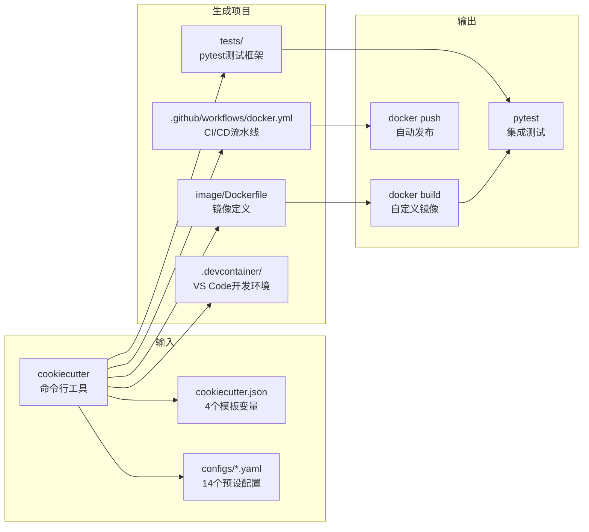

# Jupyter Docker Stacks Cookiecutter 教程

> **A cookiecutter project to help you get started defining, building, and sharing your Jupyter environments in Docker**

cookiecutter-docker-stacks 是 Jupyter 官方提供的项目模板生成器，一条命令即可生成包含 Dockerfile、测试框架、CI/CD 流水线、Dev Container 配置的完整自定义 Jupyter Docker 镜像项目。

## 快速开始

```bash
# 安装cookiecutter
pip install cookiecutter

# 使用scipy-notebook作为基础镜像生成项目
cookiecutter https://github.com/jupyter/cookiecutter-docker-stacks \
  --config-file configs/scipy.yaml --no-input

# 构建镜像
cd my-jupyter-stack
docker build --rm -t my-project/my-jupyter-stack image/

# 运行测试
pip install -r requirements-dev.txt
TEST_IMAGE=my-project/my-jupyter-stack pytest tests/ -v

# 运行容器
docker run -it --rm -p 8888:8888 my-project/my-jupyter-stack
```

## 文档导航

### 概念文档（Concepts）

按顺序阅读，系统掌握 cookiecutter-docker-stacks 的使用与原理：

| 章节 | 主题 | 核心内容 |
|------|------|----------|
| [00](concepts/00-introduction.md) | 项目介绍 | 定位、解决的问题、生成项目包含内容、核心特性 |
| [01](concepts/01-getting-started.md) | 快速上手 | 从安装到运行容器的8步完整流程 |
| [02](concepts/02-template-structure.md) | 模板结构解析 | 目录结构、各文件职责、文件间协同关系 |
| [03](concepts/03-cookiecutter-variables.md) | 模板变量详解 | 4个模板变量、14个基础镜像选项、Jinja2渲染 |
| [04](concepts/04-dockerfile-template.md) | Dockerfile编写指南 | 非root安全模型、包安装规范、5种常见错误 |
| [05](concepts/05-testing-framework.md) | 测试框架详解 | TrackedContainer类、fixtures、自定义测试 |
| [06](concepts/06-cicd-workflow.md) | CI/CD工作流 | GitHub Actions、触发条件、Docker Hub推送 |
| [07](concepts/07-devcontainer.md) | Dev Container | VS Code开发容器、Docker-in-Docker |
| [08](concepts/08-config-presets.md) | 预设配置与镜像选择 | 14个预设配置、镜像层级、选择决策树 |
| [09](concepts/09-best-practices.md) | 最佳实践 | 安全、性能、版本管理、生产部署清单 |

### 示例文档（Examples）

可独立运行的实用示例：

| 编号 | 示例 | 适用场景 |
|------|------|----------|
| [01](examples/01-basic-custom-image.md) | 自定义数据科学镜像 | 基于scipy-notebook添加Polars/DuckDB/XGBoost |
| [02](examples/02-gpu-image.md) | GPU/CUDA深度学习镜像 | PyTorch CUDA 12 GPU训练环境 |
| [03](examples/03-advanced-testing.md) | 高级测试编写 | 7种测试模式：包验证/环境检查/HTTP/日志/命令/挂载/配置 |

### 信源文件（References）

源码和配置文件的引用索引：

| 文件 | 内容 |
|------|------|
| [references/template-files.md](references/template-files.md) | 模板文件源码索引（Dockerfile、测试、CI/CD、Dev Container） |
| [references/workflow-source.md](references/workflow-source.md) | CI/CD工作流源码索引（docker.yml、tests.yml矩阵、pre-commit配置） |
| [references/tests-source.md](references/tests-source.md) | 测试框架源码索引（TrackedContainer、fixtures、pytest配置） |

## 核心能力一览



## 模板变量速查

| 变量 | 默认值 | 说明 |
|------|--------|------|
| stack_name | my-jupyter-stack | 项目目录名和镜像名 |
| stack_org | my-project | Docker组织/用户名 |
| stack_base_image | 14选1 | 基础镜像（foundation→all-spark） |
| stack_description | 自动生成 | 项目描述 |

## 14个基础镜像速查

| 层级 | 镜像 | 一句话说明 |
|------|------|-----------|
| L0 | docker-stacks-foundation | 最小基础层（OS+Micromamba，无Jupyter） |
| L1 | base-notebook | JupyterLab/Server/Hub 基础环境 |
| L2 | minimal-notebook | base + CLI工具 + TeX Live |
| L3 | scipy-notebook | minimal + numpy/pandas/scipy/sklearn |
| L3 | r-notebook | minimal + R + tidyverse |
| L3 | julia-notebook | minimal + Julia + IJulia |
| L3 | tensorflow-notebook | scipy + TensorFlow（+CUDA变体） |
| L3 | pytorch-notebook | scipy + PyTorch（+CUDA11/12变体） |
| L3 | datascience-notebook | scipy + R + Julia（三语言） |
| L3 | pyspark-notebook | scipy + OpenJDK + Spark |
| L4 | all-spark-notebook | pyspark + R Spark支持 |

## 关键文件路径

| 路径 | 说明 |
|------|------|
| `image/Dockerfile` | 镜像构建文件（核心修改文件） |
| `tests/conftest.py` | pytest fixtures定义 |
| `tests/utils/tracked_container.py` | Docker容器管理工具类 |
| `tests/test_notebook.py` | 默认测试（验证登录页面） |
| `.github/workflows/docker.yml` | CI/CD流水线（构建→测试→推送） |
| `requirements-dev.txt` | 测试依赖（docker/pytest/requests） |
| `.devcontainer/devcontainer.json` | VS Code开发容器配置 |

## CI/CD 触发条件

| 事件 | 条件 | 操作 |
|------|------|------|
| 定时 | 每周一 07:00 UTC | 构建+测试+推送（保持更新） |
| PR | 修改image/tests/CI文件 | 构建+测试（不推送） |
| Push (main) | 同上 | 构建+测试+推送 |
| 手动 | workflow_dispatch | 构建+测试+推送 |

## 相关链接

- **GitHub仓库**：<https://github.com/jupyter/cookiecutter-docker-stacks>
- **官方文档**：<https://jupyter-docker-stacks.readthedocs.io/en/latest/contributing/stacks.html>
- **Community Stacks指南**：<https://jupyter-docker-stacks.readthedocs.io/en/latest/contributing/stacks.html>
- **Jupyter Docker Stacks主项目**：<https://github.com/jupyter/docker-stacks>
- **Cookiecutter文档**：<https://cookiecutter.readthedocs.io/>

## 相关知识束

| 知识束 | 关系 |
|--------|------|
| [jupyter-docker-stacks](../jupyter-docker-stacks/index.md) | 上游：本模板基于的官方Docker镜像集 |
| [jupyter-notebook](../jupyter-notebook/index.md) | 同层：Jupyter Notebook应用层 |
| [jupyter-client](../jupyter-client/README.md) | 同层：Jupyter内核通信协议 |
| [nbformat](../nbformat/index.md) | 同层：Notebook文件格式 |

## 许可协议

cookiecutter-docker-stacks 使用 [BSD 3-Clause License](https://github.com/jupyter/cookiecutter-docker-stacks/blob/main/LICENSE.md)。

```{toctree}
:hidden:

concepts/index
examples/index
references/index
facts
insights
log
```
