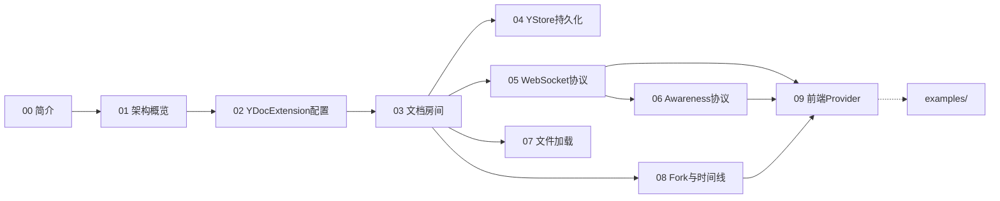

# Concepts 索引

核心概念文档，从入门到深入的学习路径。

## 学习路径

### 入门必读

1. [00-introduction.md](00-introduction.md) — Jupyter实时协作简介与功能概览
2. [01-architecture-overview.md](01-architecture-overview.md) — 整体架构与数据流
3. [02-ydoc-extension.md](02-ydoc-extension.md) — YDocExtension后端扩展配置

### 核心机制

4. [03-document-room.md](03-document-room.md) — 文档房间管理与生命周期
5. [04-ystore-persistence.md](04-ystore-persistence.md) — CRDT持久化存储
6. [05-websocket-protocol.md](05-websocket-protocol.md) — WebSocket通信协议
7. [06-awareness-protocol.md](06-awareness-protocol.md) — 用户感知Awareness协议
8. [07-file-loading.md](07-file-loading.md) — 文件加载与外带变更检测

### 高级特性

9. [08-fork-timeline.md](08-fork-timeline.md) — 文档分叉与时间线
10. [09-frontend-provider.md](09-frontend-provider.md) — 前端Provider架构

## 概念关系图



```{toctree}
:maxdepth: 7

00-introduction
01-architecture-overview
02-ydoc-extension
03-document-room
04-ystore-persistence
05-websocket-protocol
06-awareness-protocol
07-file-loading
08-fork-timeline
09-frontend-provider
```
