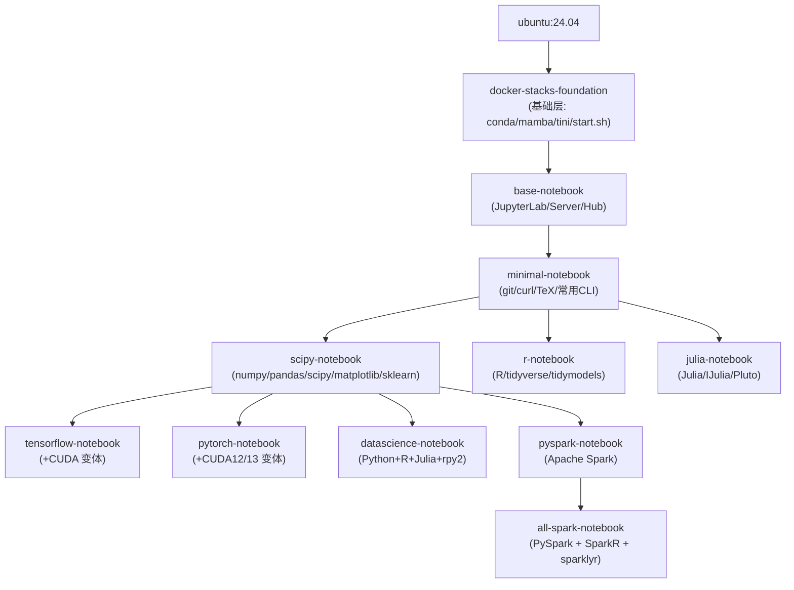

# Jupyter Docker Stacks 教程

> **Ready-to-run Docker images containing Jupyter applications and interactive computing tools**

Jupyter Docker Stacks 是 Jupyter 官方维护的一组 Docker 镜像，提供了开箱即用的 Jupyter 环境，涵盖从基础 Notebook 到包含 PyTorch/TensorFlow/Spark/R/Julia 的完整数据科学栈。

## 快速开始

```bash
# 启动 JupyterLab（最简方式）
docker run -it --rm -p 8888:8888 quay.io/jupyter/scipy-notebook:2026-07-28

# 挂载当前目录（推荐日常使用）
docker run -it --rm -p 8888:8888 \
    -v "${PWD}":/home/jovyan/work \
    quay.io/jupyter/scipy-notebook:2026-07-28
```

## 文档导航

### 概念文档（Concepts）

按顺序阅读，系统理解 Jupyter Docker Stacks 的设计与使用：

| 章节 | 主题 | 核心内容 |
|------|------|----------|
| [00](concepts/00-introduction.md) | 项目介绍 | 项目定位、核心特性、适用场景 |
| [01](concepts/01-getting-started.md) | 快速入门 | 镜像选择、首次启动、基本操作 |
| [02](concepts/02-image-hierarchy.md) | 镜像层级架构 | 12 个核心镜像的继承关系与选型决策 |
| [03](concepts/03-foundation-layer.md) | Foundation 基础层 | OS 配置、用户创建、Micromamba 安装 |
| [04](concepts/04-base-notebook.md) | Base Notebook | Jupyter Server/Lab/Hub 安装与配置 |
| [05](concepts/05-minimal-scipy.md) | Minimal/Scipy 层 | 命令行工具、TeX、科学计算包 |
| [06](concepts/06-specialized-stacks.md) | 专业镜像栈 | R/Julia/PyTorch/TensorFlow/Spark/Datascience |
| [07](concepts/07-startup-lifecycle.md) | 启动生命周期 | tini → start.sh → hooks → Jupyter 完整链路 |
| [08](concepts/08-hooks-and-customization.md) | Hooks 与定制 | 启动钩子、自定义脚本、扩展点 |
| [09](concepts/09-user-permissions.md) | 用户与权限 | jovyan 用户、UID/GID 重映射、sudo 管理 |
| [10](concepts/10-tagging-system.md) | Tagging 元数据系统 | 标签生成、Manifest 清单、软件版本追踪 |
| [11](concepts/11-testing-framework.md) | 测试框架 | pytest 测试、容器管理、并行测试 |
| [12](concepts/12-build-ci-cd.md) | 构建与 CI/CD | Makefile、GitHub Actions、多架构构建 |
| [13](concepts/13-best-practices.md) | 最佳实践 | 安全、性能、可复现性、生产部署 |

### 示例文档（Examples）

可独立运行的实用示例：

| 编号 | 示例 | 适用场景 |
|------|------|----------|
| [01](examples/01-basic-run.md) | 基础运行示例 | 快速启动 JupyterLab、端口映射、Token 配置 |
| [02](examples/02-custom-image.md) | 自定义镜像构建 | 编写 Dockerfile、安装依赖、扩展环境 |
| [03](examples/03-gpu-cuda.md) | GPU/CUDA 加速 | PyTorch/TensorFlow GPU 训练、多 GPU 配置 |
| [04](examples/04-ci-integration.md) | CI/CD 集成 | GitHub Actions 自动构建、自动化测试 |
| [05](examples/05-recipes.md) | 常用配方集锦 | SSL、Dask、Spark、数据库连接、多语言 Kernel |

完整示例列表见 [examples/index.md](examples/index.md)。

### 信源文件（References）

源码和配置文件的引用索引：

| 文件 | 内容 |
|------|------|
| [references/dockerfiles.md](references/dockerfiles.md) | 所有 Dockerfile 路径与关键内容登记 |
| [references/startup-scripts.md](references/startup-scripts.md) | 启动脚本（start.sh、run-hooks.sh 等）源码索引 |
| [references/tagging-source.md](references/tagging-source.md) | Tagging 系统源码索引（Tagger/Manifest/Hierarchy） |
| [references/tests-source.md](references/tests-source.md) | 测试框架源码索引（conftest、shared_checks） |
| [references/makefile-ci-source.md](references/makefile-ci-source.md) | Makefile 与 CI 工作流源码索引 |

## 镜像速查表



### 镜像选择决策树

1. **仅需 Jupyter 基础环境** → `base-notebook`
2. **需要命令行工具和 PDF 导出** → `minimal-notebook`
3. **Python 数据科学** → `scipy-notebook`
4. **R 语言分析** → `r-notebook`
5. **Julia 科学计算** → `julia-notebook`
6. **Python 深度学习** → `pytorch-notebook` 或 `tensorflow-notebook`（加 `cuda-` 前缀使用 GPU）
7. **多语言数据科学** → `datascience-notebook`
8. **大数据处理** → `pyspark-notebook` 或 `all-spark-notebook`
9. **需要自定义一切** → 从 `docker-stacks-foundation` 开始构建

## 核心特性

- **非 root 安全模型**：默认以 `jovyan`（UID 1000）运行，支持动态 UID/GID 重映射
- **Micromamba 包管理**：快速的 conda 兼容包管理器，默认使用 conda-forge 源
- **启动 Hooks 系统**：`start-notebook.d/` 和 `before-notebook.d/` 支持运行时定制
- **多架构支持**：linux/amd64 和 linux/arm64 双架构构建
- **丰富的标签体系**：日期标签、SHA 标签、版本标签保证可复现性
- **完善的测试**：每个镜像都有 pytest 测试套件，含容器自动管理
- **每周自动重建**：每周一和 PR 合并后自动重建，保持软件更新

## 常用环境变量

| 变量 | 默认值 | 说明 |
|------|--------|------|
| `NB_USER` | `jovyan` | 用户名（需配合 `--user root`） |
| `NB_UID` | `1000` | 用户 UID（需配合 `--user root`） |
| `NB_GID` | `100` | 用户 GID（需配合 `--user root`） |
| `GRANT_SUDO` | 未设置 | 设为 `yes` 授予无密码 sudo（需配合 `--user root`） |
| `CHOWN_HOME` | 未设置 | 设为 `yes` 修改 home 目录所有权 |
| `GEN_CERT` | 未设置 | 设为 `yes` 生成自签名 SSL 证书 |
| `DOCKER_STACKS_JUPYTER_CMD` | `lab` | Jupyter 启动命令（lab/notebook/nbclassic/server） |
| `RESTARTABLE` | 未设置 | 设为 `yes` 退出后自动重启 Jupyter |
| `JUPYTER_TOKEN` | 随机生成 | 设置固定 token |

## 关键路径

| 路径 | 说明 |
|------|------|
| `/home/jovyan/` | jovyan 用户主目录（工作区） |
| `/home/jovyan/work/` | 推荐挂载主机目录的位置 |
| `/opt/conda/` | Conda/Mamba 环境根目录 |
| `/usr/local/bin/start.sh` | 容器入口点脚本 |
| `/usr/local/bin/start-notebook.py` | Jupyter 启动脚本 |
| `/usr/local/bin/start-notebook.d/` | 启动前 Hooks 目录 |
| `/usr/local/bin/before-notebook.d/` | Jupyter 启动前 Hooks 目录 |
| `/etc/jupyter/` | Jupyter 配置目录 |

## 版本信息

| 组件 | 版本/说明 |
|------|-----------|
| 基础 OS | Ubuntu 24.04 LTS |
| Python | 3.12（构建时可定制） |
| 包管理器 | Micromamba（conda-forge） |
| 镜像仓库 | quay.io/jupyter/ |
| 构建频率 | 每周一 + PR 合并 |
| 支持架构 | linux/amd64, linux/arm64 |

## 相关链接

- **官方网站**：<https://jupyter-docker-stacks.readthedocs.io/>
- **GitHub 仓库**：<https://github.com/jupyter/docker-stacks>
- **镜像仓库**：<https://quay.io/organization/jupyter>
- **Jupyter 官方文档**：<https://docs.jupyter.org/>
- **Jupyter Server 文档**：<https://jupyter-server.readthedocs.io/>
- **JupyterLab 文档**：<https://jupyterlab.readthedocs.io/>

## 许可协议

Jupyter Docker Stacks 使用 [BSD 3-Clause License](https://github.com/jupyter/docker-stacks/blob/main/LICENSE.md)。

```{toctree}
:hidden:
:maxdepth: 7

examples/index
references/index
concepts/00-introduction
concepts/01-getting-started
concepts/02-image-hierarchy
concepts/03-foundation-layer
concepts/04-base-notebook
concepts/05-minimal-scipy
concepts/06-specialized-stacks
concepts/07-startup-lifecycle
concepts/08-hooks-and-customization
concepts/09-user-permissions
concepts/10-tagging-system
concepts/11-testing-framework
concepts/12-build-ci-cd
concepts/13-best-practices
facts
insights
log
```
