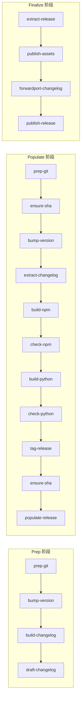

# CLI 命令详解

## 命令行基本用法

```bash
jupyter-releaser [全局选项] <command> [命令选项]
```

全局选项由每个命令的装饰器注入（通过 `add_options()` 工厂函数），不是 click 的 group 级选项。每个命令有自己的选项集，但大部分命令共享一组公共选项。

## ReleaseHelperGroup：命令的隐形框架

`ReleaseHelperGroup` 是自定义的 `click.Group` 子类，在每个命令执行前后自动处理框架逻辑。这是理解 CLI 行为的关键——很多"魔法"行为（自动切换目录、自动读取配置、参数被覆盖）都发生在这里。

### 执行流程

```mermaid
flowchart TD
    START[调用 jupyter-releaser <cmd>] --> A{命令是 list-envvars?}
    A -->|是| B[遍历所有命令参数收集 envvar → 输出 → 退出]
    A -->|否| C{命令标记了 use_checkout_dir?}
    C -->|是| D[切换到 .jupyter_releaser_checkout 目录]
    C -->|否| E[保持当前目录]
    D --> F[read_config: 读取 hooks/options/skip]
    E --> F
    F --> G{有 --force 参数?}
    G -->|是| H[清空 skip 列表]
    G -->|否| I[从 RH_STEPS_TO_SKIP 追加跳过项]
    H --> J[三层参数优先级解析]
    I --> J
    J --> K[执行 before-{cmd_name} hooks]
    K --> L[super.invoke: 执行实际命令函数]
    L --> M{命令是 prep-git 或 extract-release?}
    M -->|是| N[重新读取配置（配置可能刚从远端获取）]
    M -->|否| O
    N --> O[执行 after-{cmd_name} hooks]
    O --> P[切回原工作目录]
```

### 三层参数优先级

当同一参数有多个来源时，优先级从高到低：

1. **环境变量**（如 `RH_VERSION_SPEC`）—— 最高优先级
2. **CLI 命令行参数**（如 `--version-spec`）
3. **配置文件 options**（`.jupyter-releaser.toml` 中的 `[tool.jupyter-releaser.options]`）
4. **参数默认值**（如 `dist_dir` 默认 `"dist"`）—— 最低优先级

这意味着：配置文件可以设置默认行为，但 CLI 参数和环境变量始终可以覆盖。

## 公共选项详解

### 仓库与认证

| 选项 | 环境变量 | 默认值 | 说明 |
|------|---------|--------|------|
| `--repo` | `RH_REPOSITORY` | 自动检测 | 目标仓库，格式 `owner/name` |
| `--branch` | `RH_BRANCH` | 默认分支 | 发布分支 |
| `--ref` | `RH_REF` | 分支 HEAD | 目标 commit SHA |
| `--auth` | `GITHUB_ACCESS_TOKEN` | 无 | GitHub PAT |
| `--username` | `GITHUB_ACTOR` | 无 | GitHub 用户名 |

### 版本控制

| 选项 | 环境变量 | 默认值 | 说明 |
|------|---------|--------|------|
| `--version-spec` | `RH_VERSION_SPEC` | 交互式提示 | 新版本号或便捷指定符 |
| `--post-version-spec` | `RH_POST_VERSION_SPEC` | 无 | 发布后的版本号（dev 版本） |
| `--post-version-message` | `RH_POST_VERSION_MESSAGE` | `"Bump to {version}"` | post 版本 commit 信息 |
| `--version-cmd` | `RH_VERSION_COMMAND` | 自动检测 | 自定义版本获取命令 |
| `--tag-format` | `RH_TAG_FORMAT` | `"v{version}"` | Git tag 格式模板 |

### Changelog

| 选项 | 环境变量 | 默认值 | 说明 |
|------|---------|--------|------|
| `--changelog-path` | `RH_CHANGELOG` | `"CHANGELOG.md"` | Changelog 文件路径 |
| `--since` | `RH_SINCE` | 最近 tag | 起始 tag/commit |
| `--since-last-stable` | `RH_SINCE_LAST_STABLE` | `false` | 从最近稳定版开始 |
| `--silent` | `RH_SILENT` | `false` | 静默模式（不填充 changelog，使用占位符） |

### 构建与发布

| 选项 | 环境变量 | 默认值 | 说明 |
|------|---------|--------|------|
| `--dist-dir` | `RH_DIST_DIR` | `"dist"` | 构建资产输出目录 |
| `--python-packages` | `RH_PYTHON_PACKAGES` | `["."]` | Python 包列表，格式 `path:name` |
| `--release-url` | `RH_RELEASE_URL` | 自动查找 | Draft release URL |
| `--dry-run` | `RH_DRY_RUN` | `false` | Dry-run 模式 |
| `--force` | 无 | `false` | 强制执行，忽略 skip 列表 |

## 命令分类详解

### Git 环境准备类

#### `prep-git`

**功能**：初始化/复用 checkout 目录，clone 目标仓库，配置 git 用户。

**执行逻辑**：
1. 创建 `.jupyter_releaser_checkout/` 目录
2. 若目录已有 git 仓库，fetch + checkout；否则 clone
3. 设置 `user.email="github_actions@github.com"`、`user.name="github-actions"`
4. 配置 remote URL（插入 auth token）
5. Dry-run 时 remote 指向本地 bare 仓库

**何时调用**：prep-release 和 populate-release 的第一步

#### `ensure-sha`

**功能**：验证远程分支的 SHA 与预期一致，防止并发修改。

**执行逻辑**：
1. 获取远程分支当前 SHA
2. 与 `--ref` 或环境变量 `RH_REF` 比较
3. 不一致则报错退出

**何时调用**：populate-release 中调用两次（build 前和 tag 后），防止在构建期间有人向分支推送了新 commit

### 版本控制类

#### `bump-version`

**功能**：提升版本号，自动检测版本管理工具。

**便捷指定符**：
- `next`：根据 since_last_stable 判断 → 最近版本是 prerelease 则 release，否则下一个 patch
- `patch` / `minor` / `major`：语义版本递增
- `patch@release` / `next@major` 等组合
- `dev`：设置为下一个 dev 版本

**支持的版本工具**（自动检测）：
1. `tbump`（需 `tbump.toml`）
2. `hatch version`（pyproject.toml 中有 `[tool.hatch.version]`）
3. `bump2version`（需 `setup.cfg` 或 `.bumpversion.cfg`）
4. `npm version`（有 package.json 且无 Python 项目）

### Changelog 类

#### `extract-changelog`

**功能**：从 GitHub draft release body 提取 changelog，更新本地 CHANGELOG.md。

#### `build-changelog`

**功能**：调用 changelog.build_entry() 生成 changelog entry，插入到 CHANGELOG.md 的标记位置。

#### `draft-changelog`

**功能**：创建 GitHub draft release，附带 metadata.json；清理超过1天的旧 draft。

#### `forwardport-changelog`

**功能**：将 release tag 上的 changelog entry 前向移植（cherry-pick）到默认分支，创建 PR。

#### `publish-changelog`

**功能**：移除 changelog 中的 silent 占位符条目。

### 构建与检查类

#### `build-python` / `check-python`

- `build-python`：调用 `python.build_dist()`，自动检测构建后端，构建 sdist + wheel 到 dist 目录
- `check-python`：调用 `python.check_dist()`，包括 pip install 验证、twine check、可选 piplite 检查

#### `build-npm` / `check-npm`

- `build-npm`：调用 `npm.build_dist()`，`npm pack --ignore-scripts` 生成 .tgz
- `check-npm`：调用 `npm.check_dist()`，`npm publish <tgz> --dry-run` + `npm install -g <tgz>` 验证

**重要约束**：npm 构建必须在 Python 构建之前执行，因为 npm 构建可能产出 Python 包需要的文件（如 labextension）。

### 发布类

#### `tag-release`

**功能**：
1. 生成 asset_shas.json（所有 dist 文件的 SHA256）
2. 创建 release commit（包含 SHA256 信息）
3. 创建 annotated tag
4. 可选标记 npm workspace packages（`npm dist-tag`）

#### `populate-release`

**功能**：
1. 如果指定了 post-version-spec，bump 到 dev 版本并 push
2. Push release commit 和 tag 到 remote
3. 更新 release body 为 changelog 内容
4. 上传 dist 文件到 GitHub release

#### `publish-assets`

**功能**：发布资产到 PyPI 和 npm：
- `.whl` / `.tar.gz` → PyPI（twine 或 Trusted Publishing）
- `.tgz` → npm（npm publish，prerelease 自动用 `next` tag）
- E409/EPUBLISHCONFLICT 错误静默处理（版本已发布）

#### `publish-release`

**功能**：将 GitHub release 从 draft 状态转为 published。silent 模式下不发布（保持 draft）。

#### `delete-release`

**功能**：删除 draft release 及其所有 assets，用于清理错误的 draft。

#### `extract-release`

**功能**：从 draft release 下载资产到 dist 目录，验证 SHA256 校验和。

### 工具类

#### `list-envvars`

**特殊命令**：遍历所有命令参数，收集有 `envvar` 设置的选项，输出环境变量名、默认值、帮助文本到 `GITHUB_ENV`。用于在工作流开始时打印所有环境变量。

## 命令执行流程图



## 相关文档

- [配置与Hooks系统](04-config-and-hooks.md)
- [发布流水线详解](05-release-pipeline.md)
- [Python与npm双生态发布](06-python-npm-dual.md)
- [源码信源：cli.py](../references/cli-source.md)
