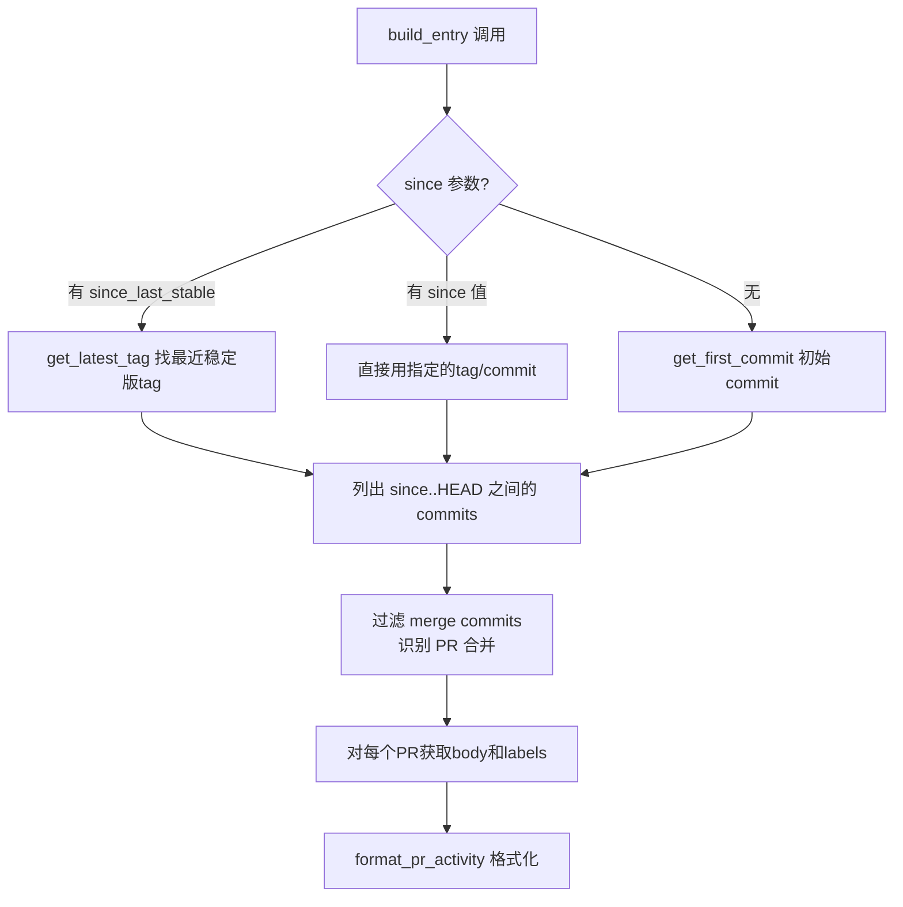

# Changelog 系统

jupyter_releaser 的 changelog 系统基于 HTML 注释标记定位插入点，从 GitHub PR 自动聚合变更内容，支持 backport PR 解析和占位符延迟填充。

## 标记系统（Markers）

Changelog 文件中通过 HTML 注释标记定义新版本条目的插入位置：

### 核心标记

| 标记 | 格式 | 用途 |
|------|------|------|
| START_MARKER | `<!-- <START NEW CHANGELOG ENTRY> -->` | 新版本条目插入的起始位置 |
| END_MARKER | `<!-- <END NEW CHANGELOG ENTRY> -->` | 新版本条目插入的结束位置 |

新版本的 changelog entry 会被插入到 START_MARKER 之后。

### 静默标记（Silent Markers）

| 标记 | 格式 | 用途 |
|------|------|------|
| START_SILENT_MARKER | `<!-- <START SILENT CHANGELOG ENTRY> -->` | 静默模式下的占位符起始 |
| END_SILENT_MARKER | `<!-- <END SILENT CHANGELOG ENTRY> -->` | 静默模式下的占位符结束 |
| SILENT_MARKER | `<!-- SILENT -->` | 单条条目标记 |

静默标记用于"先占位、后填充"场景：prep 阶段先插入一个空的占位条目，finalize 阶段再填充实际 changelog 内容。

### 标记使用模式

**标准模式（非 silent）**：
```markdown
# Changelog

<!-- <START NEW CHANGELOG ENTRY> -->

## 1.0.0

- Feature A (#123, @user1)
- Fix B (#124, @user2)

<!-- <END NEW CHANGELOG ENTRY> -->

## 0.9.0
...
```

**Silent 模式（占位符）**：
```markdown
# Changelog

<!-- <START NEW CHANGELOG ENTRY> -->

<!-- <START SILENT CHANGELOG ENTRY> -->

## 1.0.0

No merged PRs on this branch.

<!-- <END SILENT CHANGELOG ENTRY> -->

<!-- <END NEW CHANGELOG ENTRY> -->
```

silent 模式下，publish-changelog 命令会移除 `SILENT` 标记之间的占位内容，填充实际 changelog。

## Changelog Entry 生成流程

### build_entry 函数逻辑

`changelog.build_entry()` 生成单个版本的 changelog entry：

1. 确定版本号和起始点（since tag/commit）
2. 调用 `_get_prs()` 获取 since 到 HEAD 之间合并的 PR 列表
3. 对每个 PR 调用 `_format_pr_activity()` 生成条目文本
4. 按 PR 编号排序
5. 聚合为 Markdown 格式

### PR 获取逻辑



### PR 条目格式

每个 PR 生成的条目格式：
```
- {PR title} (#{PR number}, @{author})
```

如果 PR 有特定标签（如 `maintenance`、`documentation`），可能被分类或跳过。

## Backport PR 处理

Backport PR 是指将 main 分支的修复 cherry-pick 到旧版本分支的 PR。这类 PR 需要特殊处理以避免重复记录。

### Backport 识别

通过 PR 标题或消息中的 `backport PR #<num>` 模式识别：
```python
BACKPORT_TITLE = re.compile(r"[Bb]ackport.* PR #(?P<num>\d+)")
```

### Backport 解析流程

1. 检测到 backport PR 时，找到原始 PR（被 backport 的 PR）
2. 使用原始 PR 的标题和作者（而非 backport PR 本身的）
3. 在 changelog 中正确归属到原始贡献者

## Changelog 相关 CLI 命令

| 命令 | 核心函数 | 功能 |
|------|---------|------|
| `build-changelog` | `changelog.build_entry()` → `changelog.update_changelog()` | 生成 entry 并插入到 changelog 文件标记位置 |
| `extract-changelog` | 从 release body 提取 changelog | 从 GitHub draft release body 获取 changelog，更新本地文件 |
| `draft-changelog` | `lib.draft_changelog()` | 创建 draft release，将 changelog 放入 release body |
| `forwardport-changelog` | `lib.forwardport_changelog()` | 将 release tag 上的 changelog commit cherry-pick 到默认分支 |
| `publish-changelog` | `lib.publish_changelog()` | 移除 silent 占位符，填充实际 changelog |

### forwardport 机制

release tag 创建在发布分支上（如 v1.0.0 tag），这个 tag 包含 changelog 更新 commit。默认分支（main）需要同步这个更新：

1. Cherry-pick changelog commit 到默认分支
2. 解决可能的冲突（changelog 可能在两个分支上都有更新）
3. 创建一个 PR（带 "maintenance" 标签）
4. 维护者合并这个 PR

## Silent 模式：占位符延迟填充

### 使用场景

当 changelog 需要在 finalize 阶段才能确定（例如需要等待所有资产上传完成），使用 silent 模式：

1. **Prep 阶段**（silent=true）：插入空占位符，创建 draft release
2. **Populate 阶段**：构建资产、上传，但不更新 changelog 内容
3. **Finalize 阶段**：publish-changelog 命令移除占位符，插入实际 changelog

### 触发方式

`--silent` 选项或 `RH_SILENT=true` 环境变量。

## Changelog PR 创建

prep 阶段会自动创建一个 Changelog PR：

1. 创建 UUID 后缀分支：`changelog-{short_uuid}`
2. 提交 changelog 文件更新
3. 推送到 remote
4. 创建 PR，打上 "documentation" 标签
5. PR body 包含版本信息和审核指引

维护者审核并合并这个 PR 后，populate 阶段才会运行（populate 需要在 main 分支上能看到 changelog commit）。

## mdformat 格式化

所有 changelog 文本在写入文件前会通过 `mdformat.text()` 格式化，确保：
- 列表标记一致
- 标题层级正确
- 链接格式规范
- 换行符统一

## 相关文档

- [发布流水线详解](05-release-pipeline.md)
- [CLI命令详解](03-cli-commands.md)
- [示例：基本发布流程](../examples/01-basic-release-workflow.md)
