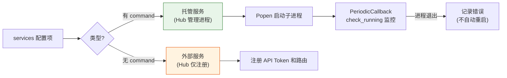
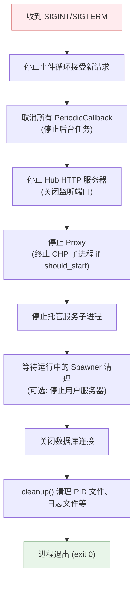

# JupyterHub 应用生命周期

JupyterHub 应用生命周期遵循 **初始化（initialize）→ 启动（start）→ 事件循环（event loop）→ 停止（stop）** 的四阶段模型。`JupyterHub` 类继承自 `traitlets.config.Application`，在 `initialize()` 阶段按严格顺序调用一系列 `init_*` 方法完成各子系统初始化，然后通过 `start()` 启动 Tornado HTTP 服务器和后台周期性任务，进入事件循环持续服务。

一句话概括：**JupyterHub 按"类加载→数据库→Hub→Proxy→OAuth→路由→Tornado 设置"的固定顺序完成初始化，启动 HTTP 服务器和后台服务轮询后进入 Tornado 事件循环，通过 SIGINT/SIGTERM 信号触发 cleanup() 实现优雅关闭**。

## 生命周期总览

```mermaid
flowchart TD
    Start(["CLI: jupyterhub"]) --> Init["initialize(argv)"]
    
    Init --> IC["init_configurable_classes()<br/>加载 Authenticator/Spawner/Proxy 类"]
    IC --> IDB["init_db()<br/>数据库连接 + ORM 表 + 迁移"]
    IDB --> IH["init_hub()<br/>创建 Hub 单例、连接 DB、加载服务"]
    IH --> IP["init_proxy()<br/>初始化 Proxy、启动 CHP 子进程"]
    IP --> IS["init_spawners()<br/>为活跃用户创建 Spawner 实例"]
    IS --> ISvc["init_services()<br/>启动托管服务、注册外部服务"]
    ISvc --> IR["init_roles()<br/>加载默认角色和自定义角色"]
    IR --> IO["init_oauth()<br/>初始化 OAuth 提供方"]
    IO --> IHd["init_handlers()<br/>注册所有 URL 路由"]
    IHd --> IT["init_tornado_settings()<br/>Tornado 应用设置"]
    
    IT --> Start2["start()"]
    Start2 --> Srv["启动 HTTP 服务器<br/>(Hub 监听 hub_ip:hub_port)"]
    Srv --> ProxyStart["启动 Proxy<br/>(CHP 子进程 + 路由注册)"]
    ProxyStart --> Poll["启动后台周期性任务<br/>(服务轮询、活动追踪、路由检查)"]
    Poll --> Loop["进入 Tornado 事件循环<br/>(IOLoop.current().start())"]
    
    Loop -->|SIGINT/SIGTERM| Stop["stop()"]
    Stop --> Cleanup["cleanup()<br/>停止服务器、清理 Proxy、关闭 DB"]
    Cleanup --> End(["进程退出"])
    
    style Start fill:#e3f2fd,stroke:#1565c0
    style Init fill:#fff3e0,stroke:#e65100
    style IC fill:#f3e5f5,stroke:#6a1b9a
    style IDB fill:#e0f7fa,stroke:#00695c
    style IH fill:#e8f5e9,stroke:#2e7d32
    style IP fill:#fff3e0,stroke:#e65100
    style IS fill:#fce4ec,stroke:#c62828
    style ISvc fill:#f3e5f5,stroke:#6a1b9a
    style IR fill:#fff9c4,stroke:#f57f17
    style IO fill:#e8f5e9,stroke:#2e7d32
    style IHd fill:#e3f2fd,stroke:#1565c0
    style IT fill:#e0f7fa,stroke:#00695c
    style Start2 fill:#e8f5e9,stroke:#2e7d32
    style Loop fill:#fffde7,stroke:#f57f17
    style Stop fill:#ffebee,stroke:#c62828
    style End fill:#e8f5e9,stroke:#2e7d32
```



[^app-src]

## 初始化阶段（initialize）

`initialize(argv)` 是 JupyterHub 的初始化入口，由 `traitlets.config.Application` 框架在 `main()` 中调用。该方法首先解析命令行参数、加载配置文件、初始化日志，然后按固定顺序调用各 `init_*` 方法完成子系统初始化。

### 关键初始化方法表

| 阶段 | 方法 | 作用 | 关键操作 |
|:----:|------|------|---------|
| 1 | `init_configurable_classes()` | 加载可配置组件类 | 根据配置解析 `authenticator_class`、`spawner_class`、`proxy_class` 为实际类对象（支持 entry points 短名称和 Python 路径解析） |
| 2 | `init_db()` | 初始化数据库 | 创建 SQLAlchemy 引擎和 Session 工厂；调用 `create_tables()` 创建 ORM 表；通过 `check_db_revision()` 检查 Alembic 迁移版本；`upgrade_db=True` 时自动执行迁移 |
| 3 | `init_hub()` | 创建 Hub 实例 | 创建 Hub 单例对象，配置 Hub 连接参数（`hub_ip`/`hub_port`/`hub_prefix`/`cookie_secret`），将 Hub 与数据库 Session 关联 |
| 4 | `init_proxy()` | 初始化代理 | 创建 Proxy 实例；若 `should_start=True` 则启动 CHP 子进程；等待 CHP API 就绪（健康检查） |
| 5 | `init_spawners()` | 初始化 Spawner | 查询数据库中所有活跃用户的 Spawner 记录，为每个活跃 Spawner 创建实例并恢复状态（`load_state()`） |
| 6 | `init_services()` | 初始化服务 | 遍历 `services` 配置列表，启动托管服务（Hub 管理的子进程），注册外部服务（仅注册路由和 Token） |
| 7 | `init_roles()` | 初始化角色 | 加载系统默认角色（user/admin/token 等），合并 `load_roles` 配置中的自定义角色定义，建立 RBAC 权限体系 |
| 8 | `init_oauth()` | 初始化 OAuth | 创建 OAuth 服务器实例，注册 OAuth 客户端（单用户服务器作为 OAuth 客户端），配置 OAuth Token 颁发和验证逻辑 |
| 9 | `init_handlers()` | 注册路由 | 创建 Tornado Application 所需的路由列表，注册所有 URL 模式到对应的 RequestHandler 类 |
| 10 | `init_tornado_settings()` | Tornado 设置 | 配置 Tornado Application 的各项设置（cookie_secret、static_path、template_path、autoreload 等） |

[^app-src]

### 各阶段详细说明

#### 1. init_configurable_classes() — 组件类加载

此阶段将配置中的字符串类引用解析为实际的 Python 类对象：

- 对于 `authenticator_class`：先在 `jupyterhub.authenticators` entry points 组中查找短名称，未命中则作为 Python 导入路径解析
- 对于 `spawner_class`：先在 `jupyterhub.spawners` entry points 组中查找，未命中则作为 Python 导入路径解析
- 对于 `proxy_class`：先在 `jupyterhub.proxies` entry points 组中查找，未命中则作为 Python 导入路径解析

解析失败将抛出 `ConfigError` 异常，终止启动流程。

#### 2. init_db() — 数据库初始化

```python
def init_db(self):
    # 创建 SQLAlchemy 引擎
    self.db = orm.new_session_factory(self.db_url)
    # 创建所有 ORM 表（如果不存在）
    orm.create_tables(self.db)
    # 检查数据库版本
    if not self.upgrade_db:
        orm.check_db_revision(self.db)
```

- 使用 SQLAlchemy 创建数据库引擎和 Session 工厂
- `create_tables()` 基于 ORM 模型定义创建所有表结构
- `check_db_revision()` 通过 Alembic 版本表检查数据库 schema 版本是否与代码匹配，版本不匹配且 `upgrade_db=False` 时报错退出
- 默认数据库为 SQLite（`sqlite:///jupyterhub.sqlite`），生产环境推荐使用 PostgreSQL/MySQL

#### 3. init_hub() — Hub 单例创建

- 创建 `Hub` 类实例（继承自 LoggingConfigurable）
- 配置 Hub 的网络参数：`ip`、`port`、`base_url`（prefix）、`cookie_secret`
- `cookie_secret` 用于加密浏览器 Cookie，若未配置则自动生成随机值（生产环境应固定以避免重启后会话失效）
- 将数据库 Session 工厂绑定到 Hub 实例

#### 4. init_proxy() — 代理初始化

- 创建 Proxy 实例（默认为 `ConfigurableHTTPProxy`），传入 Hub 和数据库引用
- 若 `should_start=True`（默认），通过 `subprocess.Popen` 启动 `configurable-http-proxy` 子进程
- 等待 CHP 管理 API 就绪（轮询 `api_url` 直到返回 200）
- CHP 启动后认证 Token 自动同步（Hub 生成的 Token 通过环境变量 `CONFIGPROXY_AUTH_TOKEN` 传递给 CHP 进程）

#### 5. init_spawners() — Spawner 恢复

- 查询数据库中所有非 `stopped` 状态的 Spawner 记录
- 为每个记录创建对应的 Spawner 实例（使用配置的 `spawner_class`）
- 调用 `spawner.load_state(state)` 从数据库恢复 Spawner 的持久化状态
- 检查已恢复 Spawner 对应的服务器进程是否仍然存活（`poll()`），不存活则标记为 stopped

#### 6. init_services() — 服务启动

- 遍历 `services` 配置列表，每个服务定义是一个字典
- **托管服务**（`command` 指定）：Hub 启动子进程管理其生命周期，类似无 Spawner 的 User
- **外部服务**（无 `command`，仅指定 `url` 和 `api_token`）：Hub 仅注册路由和 Token，不管理进程
- 每个服务获得独立的 API Token，可通过 Hub API 进行管理

#### 7. init_roles() — RBAC 角色加载

- 加载 JupyterHub 内置默认角色（如 `user`、`admin`、`token`、`server`）
- 每个角色包含一组 `scopes`（权限范围），定义了该角色可以执行的操作
- 合并 `load_roles` 配置中的自定义角色定义
- RBAC 系统在 v6.0 中替代了旧的 `admin_users` 简单判断，提供更细粒度的权限控制

#### 8. init_oauth() — OAuth 提供方初始化

- 创建 OAuth 2.0 服务器实例
- 单用户服务器作为 OAuth 客户端注册到 Hub
- 用户访问单用户服务器时，服务器通过 OAuth 与 Hub 验证用户身份
- OAuth 流程支持 Token 刷新和过期管理

#### 9. init_handlers() — 路由注册

- 构建 Tornado `Application` 的路由列表
- 路由按 URL 前缀分组：
  - `/hub/login`、`/hub/logout`：认证相关
  - `/hub/spawn`、`/hub/api/users/.../server`：Spawner 管理
  - `/hub/api/...`：REST API
  - `/hub/admin`：管理面板
  - `/hub/`：Hub 主页和静态资源
  - `/oauth_callback`：OAuth 回调
- 认证器、Spawner 等子组件可以贡献额外的路由（通过 `get_handlers()` 方法）

#### 10. init_tornado_settings() — Tornado 应用配置

- 配置 `cookie_secret`（从 Hub 继承）
- 设置 `static_path` 和 `template_path`（JupyterHub 内置静态资源和模板）
- 配置 `login_url`（`/hub/login`）
- 设置 `autoreload`（开发模式下自动重载）
- 绑定 `db`、`hub`、`authenticator`、`spawner_class` 等引用到 settings 字典，供 RequestHandler 通过 `self.settings` 访问

[^app-src]

## 启动阶段（start）

所有 `init_*` 方法执行成功后，`start()` 方法启动实际的服务：

### HTTP 服务器启动

1. **Hub HTTP 服务器**：在 `hub_ip:hub_port` 上启动 Tornado HTTPServer，监听 Proxy 转发来的内部请求
2. **Proxy 启动确认**：确保 CHP 子进程正在运行，注册 Hub 默认路由（`/` → Hub）
3. **路由恢复**：调用 `proxy.restore_routes()` 恢复所有用户路由和服务路由（Hub 路由 → 用户路由 → 服务路由）

### 后台周期性任务启动

`start()` 方法启动多个 `tornado.ioloop.PeriodicCallback` 后台任务：

| 任务 | 默认间隔 | 作用 |
|------|---------|------|
| Proxy 存活检查 | 5 秒 | `_check_running_callback` 检查 CHP 子进程是否存活，进程退出时记录错误 |
| 路由一致性检查 | 定期 | `check_routes()` 对比数据库状态与代理路由表，自动补建/更新/删除路由 |
| 服务轮询 | 定期 | 检查托管服务子进程状态，异常退出时记录日志 |
| 用户活动更新 | 定期 | 更新用户 `last_activity` 时间戳 |

[^app-src]

## Tornado 事件循环

JupyterHub 基于 Tornado 异步 Web 框架，所有 HTTP 请求处理、进程管理、数据库访问均在单线程事件循环中通过 `async/await` 异步执行。

### 事件循环机制

```python
# start() 方法末尾
tornado.ioloop.IOLoop.current().start()
```

- **单事件循环架构**：整个 Hub 进程运行在单个 Tornado IOLoop 中，无需多线程即可处理高并发请求
- **异步 I/O**：数据库访问（通过 SQLAlchemy async 或线程池）、HTTP 客户端（aiohttp）、进程管理（asyncio subprocess）全部异步化
- **协程调度**：`async def` 定义的请求处理器通过 `await` 挂起/恢复，事件循环在等待 I/O 时切换到其他协程
- **PeriodicCallback**：周期性任务通过 `tornado.ioloop.PeriodicCallback` 在事件循环中调度执行

### 请求处理流程

当 HTTP 请求到达 Hub 时：

1. Tornado HTTPServer 接收连接
2. IOLoop 将请求分发到匹配的 RequestHandler
3. RequestHandler 的 `get()`/`post()` 等 async 方法执行
4. 遇到 `await` 时协程挂起，IOLoop 处理其他就绪协程
5. I/O 完成后协程恢复执行，发送 HTTP 响应

[^app-src]

## 服务管理

### Service 生命周期

JupyterHub 的 Service（服务）分为两种类型：



- **托管服务**：Hub 通过 `subprocess.Popen` 启动子进程，将 `JUPYTERHUB_API_TOKEN` 等环境变量传递给服务进程；通过 `PeriodicCallback` 定期调用 `poll()` 检查进程是否存活
- **外部服务**：Hub 不管理进程生命周期，仅生成 API Token 并注册路由，外部服务需自行管理生命周期并使用 Token 访问 Hub API

每个 Service 在数据库中有对应的 ORM 记录（`Service` 模型），拥有独立的 API Token 和路由。

[^app-src]

## 用户活动追踪

JupyterHub 通过 `last_activity` 字段追踪用户的最后活跃时间，用于闲置服务器自动关闭（culling）和活动监控。

### 更新机制

1. **API 请求触发**：用户通过 Hub API 执行操作时，自动更新 `user.last_activity`
2. **单用户服务器活动**：单用户服务器通过 API 代理定期向 Hub 报告活动（`/hub/api/users/.../activity`）
3. **轮询更新**：PeriodicCallback 定期检查所有运行中服务器的活动状态
4. **Spawner 事件**：服务器启动/停止/访问时触发活动更新

`last_activity` 是数据库中 `User` 和 `Spawner` 模型的 `DateTime` 字段，配合 `cull_idle_servers` 服务可实现闲置服务器自动回收。

[^app-src]

## 优雅关闭

### 信号处理

JupyterHub 监听 SIGINT（Ctrl+C）和 SIGTERM（kill/容器停止）信号，触发优雅关闭流程：

```python
# Tornado IOLoop 信号处理
signal.signal(signal.SIGINT, self._handle_signal)
signal.signal(signal.SIGTERM, self._handle_signal)
```

### stop() 与 cleanup() 流程



**关闭顺序**：
1. 停止接受新请求（HTTP 服务器停止 accept）
2. 取消所有后台周期性任务（`PeriodicCallback.stop()`）
3. 停止 Hub HTTP 服务器（关闭 `hub_ip:hub_port` 监听）
4. 停止 Proxy：若 `should_start=True`，终止 CHP 子进程
5. 停止托管服务子进程
6. 可选：停止正在运行的用户服务器（默认不强制停止，仅记录状态）
7. 关闭数据库连接池
8. 清理 PID 文件、临时文件等资源
9. 进程以退出码 0 正常退出

### 强制关闭

如果优雅关闭超时（默认较短超时），第二次信号将触发强制退出（`os._exit(1)`），立即终止进程。

[^app-src]

## CLI 入口点

| 命令 | 入口 | 说明 |
|------|------|------|
| `jupyterhub` | `jupyterhub.app:main` | Hub 主进程入口，执行完整生命周期 |
| `jupyterhub-singleuser` | `jupyterhub.singleuser:main` | 单用户服务器入口，被 Spawner 启动后作为独立 Jupyter 实例运行 |

`main()` 函数的标准模式：

```python
def main(argv=None):
    app = JupyterHub.instance()
    app.initialize(argv)
    app.start()  # 进入事件循环，直到 stop() 被调用
```

[^app-src]

## 生命周期方法参考

以下为 `JupyterHub` 类的核心生命周期方法完整列表：

| 方法 | 阶段 | 签名 | 说明 |
|------|------|------|------|
| `initialize` | 初始化 | `initialize(self, argv=None)` | 主初始化方法：解析 CLI、加载配置、初始化日志、顺序调用所有 `init_*` 方法 |
| `init_configurable_classes` | 初始化 | `init_configurable_classes(self)` | 解析 `spawner_class`/`authenticator_class`/`proxy_class` 为类对象 |
| `init_db` | 初始化 | `init_db(self)` | 创建数据库引擎、初始化 ORM 表、检查/执行迁移 |
| `init_hub` | 初始化 | `init_hub(self)` | 创建 Hub 实例、配置连接参数、绑定数据库 |
| `init_proxy` | 初始化 | `init_proxy(self)` | 创建 Proxy 实例、启动 CHP 子进程、等待就绪 |
| `init_spawners` | 初始化 | `init_spawners(self)` | 恢复数据库中活跃 Spawner 的状态 |
| `init_services` | 初始化 | `init_services(self)` | 启动托管服务、注册外部服务 |
| `init_roles` | 初始化 | `init_roles(self)` | 加载默认角色和自定义 RBAC 角色 |
| `init_oauth` | 初始化 | `init_oauth(self)` | 创建 OAuth 服务器、注册客户端 |
| `init_handlers` | 初始化 | `init_handlers(self)` | 构建 Tornado 路由列表 |
| `init_tornado_settings` | 初始化 | `init_tornado_settings(self)` | 配置 Tornado Application 参数 |
| `start` | 启动 | `async start(self)` | 启动 HTTP 服务器、Proxy 路由恢复、后台任务、进入事件循环 |
| `stop` | 停止 | `async stop(self)` | 优雅关闭：停止服务器、清理 Proxy、关闭数据库 |
| `cleanup` | 清理 | `cleanup(self)` | 清理 PID 文件、日志文件等残留资源 |

[^app-src]

## 源码溯源

本文档的事实依据来源于以下源码参考文档：

- [JupyterHub Application 源码参考](../references/app-source.md)：`JupyterHub` 主应用类的生命周期方法签名、核心配置 Traitlets、Entry Points 注册与 CLI 入口点定义

## 相关概念

- [JupyterHub 配置系统](configuration.md) — 配置在 initialize() 阶段的加载顺序与注入机制
- [JupyterHub 架构概览](architecture-overview.md) — 各核心组件在生命周期中的初始化依赖关系
- [Proxy 代理系统](proxy.md) — Proxy 在 init_proxy() 阶段的启动与路由注册流程
- [Spawner 机制](spawner.md) — init_spawners() 阶段的 Spawner 状态恢复与服务器管理
- [ORM 数据模型](orm.md) — init_db() 阶段创建的数据库表结构与数据模型

[^app-src]: JupyterHub Application 源码参考
