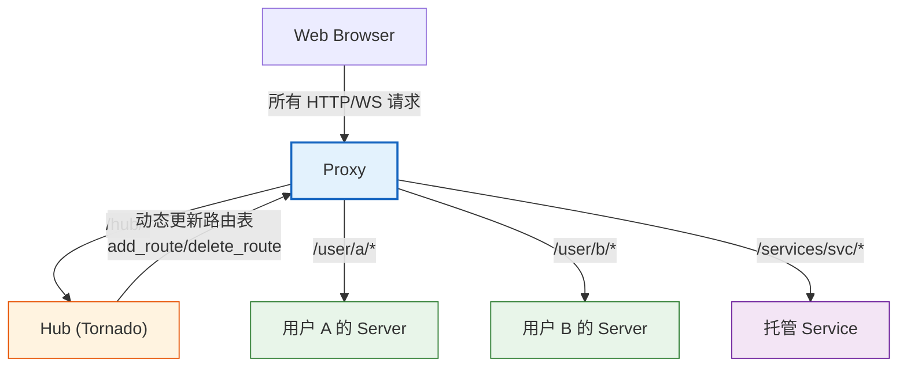
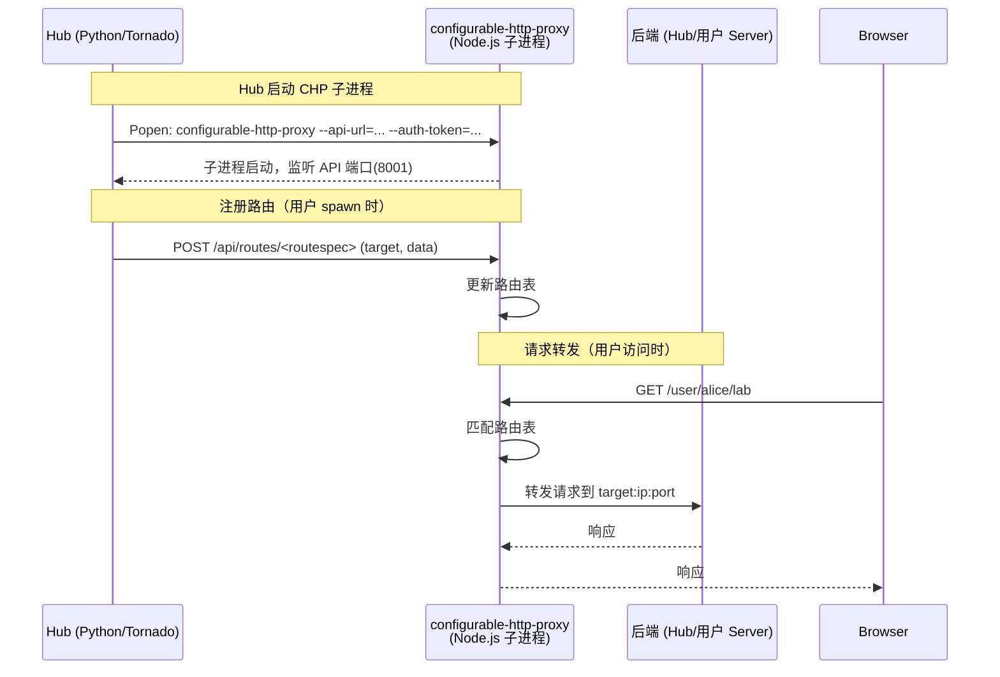
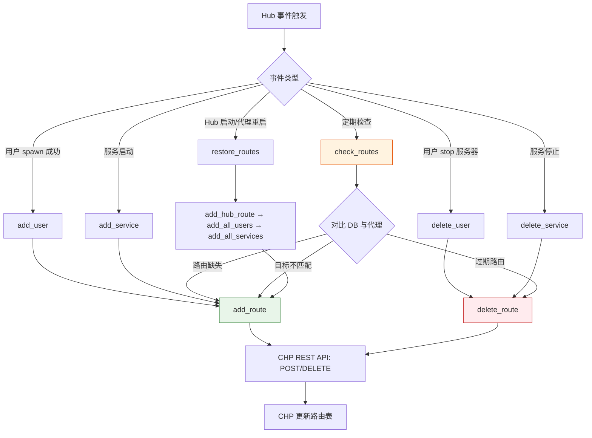
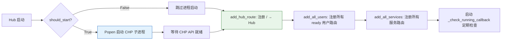

# Proxy 代理系统

Proxy 是 JupyterHub 架构中**所有 HTTP 请求的统一入口**，承担反向代理、路由分发和 SSL 终端的职责。所有外部流量（包括 Hub 自身和用户服务器）都首先经过 Proxy，由 Proxy 根据路由表将请求转发到正确的后端目标。

## Proxy 在架构中的角色



Proxy 的三大核心职责：

1. **统一入口**：监听公共端口（默认 8000），所有外部流量唯一入口点
2. **路由分发**：根据 URL 路径前缀将请求转发到 Hub 或对应用户的 Server/Service
3. **SSL 终端**：处理 HTTPS 加密/解密，后端通信使用 HTTP

当用户 spawn 服务器时，Hub 调用 Proxy 的 `add_route()` 将 `/user/<username>/` 路由注册到 Spawner 返回的 `(ip, port)`；当用户停止服务器时，Hub 调用 `delete_route()` 移除该路由。

[^proxy-source]

## Proxy 基类抽象

所有 JupyterHub 代理实现继承自 `Proxy` 基类（`jupyterhub/proxy.py`），该基类继承自 `traitlets.config.LoggingConfigurable`，定义了代理必须实现的接口和通用的路由管理逻辑。

### 核心配置 Traitlets

| Traitlet | 类型 | 默认值 | 可配置 | 说明 |
|----------|------|--------|:------:|------|
| `should_start` | `Bool` | `True` | ✅ | Hub 是否负责启动/停止代理进程；代理由外部（systemd/docker）管理时设为 `False` |
| `extra_routes` | `Dict(Unicode, Unicode)` | `{}` | ✅ | 额外静态路由映射 `{routespec: target_url}`，API-only 模式下有用 |
| `public_url` | `Unicode` | `''` | ❌ | 代理的公共 URL |
| `ssl_key` | `Unicode` | `''` | ❌ | SSL 密钥文件路径 |
| `ssl_cert` | `Unicode` | `''` | ❌ | SSL 证书文件路径 |
| `host_routing` | `Bool` | — | ❌ | 是否启用基于主机名的子域路由（由 `subdomain_host` 配置决定） |
| `db_factory` | `Any` | — | ❌ | 数据库 session 工厂回调 |
| `app` | `Any` | — | ❌ | JupyterHub 应用实例引用 |
| `hub` | `Any` | — | ❌ | Hub 服务器对象引用 |

### 抽象方法（子类必须实现）

| 方法 | 签名 | 说明 |
|------|------|------|
| `start` | `start(self)` | 启动代理进程（`should_start=True` 时必须实现） |
| `stop` | `stop(self)` | 停止代理进程 |
| `add_route` | `async add_route(self, routespec, target, data)` | 添加路由：将 `routespec` 映射到 `target` URL，关联 `data` 字典 |
| `delete_route` | `async delete_route(self, routespec)` | 删除指定 routespec 的路由 |
| `get_all_routes` | `async get_all_routes(self)` | 返回所有路由的字典 `{routespec: {routespec, target, data}}` |

### 基类提供的具体方法

| 方法 | 签名 | 说明 |
|------|------|------|
| `validate_routespec` | `validate_routespec(self, routespec)` | 验证并规范化 routespec：检查主机路由一致性，自动补全尾部 `/` |
| `get_route` | `async get_route(self, routespec)` | 获取单条路由信息（默认从 `get_all_routes()` 结果提取） |
| `add_user` | `async add_user(self, user, server_name='')` | 添加用户服务器路由，`data={'user': user.name, 'server_name': server_name}`；Spawner pending 非 `spawn` 时抛异常 |
| `delete_user` | `async delete_user(self, user, server_name='')` | 删除用户服务器路由；命名服务器通过 `url_path_join` 拼接 routespec |
| `add_service` | `async add_service(self, service)` | 添加服务路由，`data={'service': service.name}` |
| `delete_service` | `async delete_service(self, service)` | 删除服务路由 |
| `add_all_users` | `async add_all_users(self, user_dict)` | 批量添加所有 ready 状态的用户 Spawner 路由 |
| `add_all_services` | `async add_all_services(self, service_dict)` | 批量添加所有有 Server 的服务路由（`asyncio.gather` 并发） |
| `add_hub_route` | `add_hub_route(self, hub)` | 添加 Hub 默认路由，`data={'hub': True}` |
| `check_routes` | `async check_routes(self, user_dict, service_dict, routes=None)` | 检查代理路由与数据库状态一致性，补建/更新/删除路由 |
| `restore_routes` | `async restore_routes(self)` | 代理重启后恢复全部路由：Hub 路由 → 用户路由 → 服务路由 |

[^proxy-source]

## ConfigurableHTTPProxy（CHP）实现

`ConfigurableHTTPProxy`（CHP）是 JupyterHub 的默认代理实现，管理一个 Node.js 的 `configurable-http-proxy` 子进程，通过 CHP 的 REST API 动态管理路由表。

### 工作原理



### CHP 关键配置

| Traitlet | 类型 | 默认值 | 说明 |
|----------|------|--------|------|
| `auth_token` | `Unicode` | 环境变量 `CONFIGPROXY_AUTH_TOKEN` 或自动生成 | CHP REST API 的认证 Token；Hub 管理代理时自动生成安全随机值 |
| `api_url` | `Unicode` | `'http://127.0.0.1:8001'`（启用 `internal_ssl` 时为 `https://`） | CHP 管理 API 的监听地址，Hub 通过此 URL 调用 CHP REST API |
| `command` | `Command` | `'configurable-http-proxy'` | 启动 CHP 的命令 |
| `concurrency` | `Integer` | `10` | 并发代理 API 请求数上限（`BoundedSemaphore`），防止批量路由更新时超时 |
| `log_level` | `CaselessStrEnum` | `'info'` | CHP 日志级别：`debug`/`info`/`warn`/`error` |
| `debug` | `Bool` | `False` | 启用 debug 级别日志（设置 `log_level='debug'`） |
| `check_running_interval` | `Integer` | `5` | 检查 CHP 子进程是否存活的轮询间隔（秒） |
| `command_umask` | `Integer` | `0o007` | 运行 CHP 前设置的 umask（用于 Unix Domain Socket 权限控制） |
| `pid_file` | `Unicode` | `'jupyterhub-proxy.pid'` | CHP 进程 PID 文件路径 |

#### 外部代理部署模式

如果 CHP 运行在独立容器或由外部进程管理器（systemd/supervisor）管理，配置：

```python
c.ConfigurableHTTPProxy.should_start = False
c.ConfigurableHTTPProxy.auth_token = "your-secret-token"  # 需与外部 CHP 一致
c.ConfigurableHTTPProxy.api_url = "http://chp-container:8001"
```

此时 Hub 不启动/停止 CHP 子进程，仅通过 API 管理路由。

[^proxy-source]

### CHP 内部属性

| 属性 | 说明 |
|------|------|
| `proxy_process` | CHP 子进程的 `Popen` 实例 |
| `semaphore` | `asyncio.BoundedSemaphore(concurrency)`，并发控制信号量，随 `concurrency` 变化自动重建 |
| `_check_running_callback` | `tornado.ioloop.PeriodicCallback`，定期检查 CHP 是否存活 |

CHP 通过 `aiohttp` 库向 CHP REST API 发起 HTTP 请求，`jupyterhub.httpclient.fetch` 封装了带认证和重试的 HTTP 客户端。

[^proxy-source]

## 路由管理

### Route Specification（路由规范）

路由键（routespec）采用 URL 前缀格式 `[host]/path/`，遵循以下规则：

- **路径路由（默认）**：`/path/`，无主机组件，必须以 `/` 开头和结尾
- **主机路由（子域模式）**：`host.tld/path/`，当启用 `subdomain_host` 时使用
- 基类 `validate_routespec()` 自动补全尾部斜杠，并验证主机路由一致性

`'/'` 是特殊的默认路由（Hub 路由），跳过部分验证。

### 四种路由类型

路由通过 `add_route(routespec, target, data)` 注册，`data` 字典按路由类型区分：

| 路由类型 | routespec 示例 | data 结构 | 说明 |
|----------|---------------|-----------|------|
| **Hub 路由** | `/` | `{'hub': True}` | 默认路由，将 `/hub/*` 和未匹配路径转发到 Hub |
| **用户路由** | `/user/alice/` | `{'user': 'alice', 'server_name': ''}` | 将用户请求转发到其单用户 Server |
| **命名服务器路由** | `/user/alice/work/` | `{'user': 'alice', 'server_name': 'work'}` | 转发到用户的命名服务器 |
| **服务路由** | `/services/dask/` | `{'service': 'dask'}` | 转发到 JupyterHub 托管服务 |
| **额外路由** | `/custom/` | `{'extra': True}` | 通过 `extra_routes` 配置的静态路由 |

### 路由数据格式

每条路由在 CHP 内部存储为：

```python
{
    "routespec": "/user/alice/",   # 路由前缀
    "target": "http://127.0.0.1:12345",  # 后端目标 URL
    "data": {"user": "alice", "server_name": ""}  # 元数据
}
```

`get_all_routes()` 返回 `{routespec: route_info}` 字典，`get_route(routespec)` 返回单条路由信息。

### 路由操作流程



[^proxy-source]

## `_one_at_a_time` 并发控制装饰器

`_one_at_a_time` 是模块级装饰器，限制 async 方法同一时间只能执行一次：

```python
@_one_at_a_time
async def check_routes(self, user_dict, service_dict, routes=None):
    ...
```

### 实现机制

- 使用 `WeakKeyDictionary` 按**事件循环**存储 `asyncio.Lock`，避免测试中事件循环创建/销毁导致的锁泄漏
- 并发调用不会并行执行，而是排队等待前一次调用完成
- 主要用于 `check_routes()` 方法，防止多个协程同时检查和修改路由表导致竞态条件

### 为什么需要串行化

`check_routes()` 执行"对比数据库状态与代理路由表"的操作，如果多个协程并发执行，可能导致：
- 重复添加相同路由
- 删除另一个协程刚添加的路由
- 读到不一致的中间状态

`_one_at_a_time` 确保路由检查的原子性。

[^proxy-source]

## Proxy 启动/停止/重启流程

### 启动流程



### 停止流程

1. `stop()` 方法终止 CHP 子进程
2. 清理 PID 文件
3. 停止 `_check_running_callback`

### 重启恢复

当 CHP 意外重启（路由表丢失）时，Hub 通过 `restore_routes()` 恢复所有路由：

1. 添加 Hub 路由（`/`）
2. 添加所有用户路由
3. 添加所有服务路由

`check_routes()` 定期执行一致性检查，自动修复任何偏差。

[^proxy-source]

## 自定义 Proxy 扩展点

通过继承 `Proxy` 基类并实现抽象方法，可以替换 CHP 为其他代理实现：

| Proxy 实现 | 技术栈 | 适用场景 |
|-----------|--------|---------|
| **ConfigurableHTTPProxy** | Node.js + node-http-proxy | 默认，中小型部署 |
| **TraefikProxy** | Traefik + etcd/Consul | Docker/K8s 部署，服务发现 |
| **KubeIngressProxy** | Kubernetes Ingress | Kubernetes 原生部署 |

自定义 Proxy 的最小实现：

```python
from jupyterhub.proxy import Proxy

class MyCustomProxy(Proxy):
    async def start(self):
        # 启动代理（如需要）
        ...
    
    async def stop(self):
        # 停止代理
        ...
    
    async def add_route(self, routespec, target, data):
        # 在你的代理中注册路由
        ...
    
    async def delete_route(self, routespec):
        # 从你的代理中删除路由
        ...
    
    async def get_all_routes(self):
        # 返回所有路由
        return {routespec: {"routespec": ..., "target": ..., "data": ...}}
```

在配置中指定：

```python
c.JupyterHub.proxy_class = "mypackage.MyCustomProxy"
```

如果代理由外部管理（不需要 Hub 启动/停止），设置 `should_start = False`，只需实现路由 CRUD 方法即可。

## 源码溯源

本文档的事实依据来源于以下源码参考文档：

- [JupyterHub Proxy 源码参考](../references/proxy-source.md)：Proxy 基类与 ConfigurableHTTPProxy 的完整 API 参考，包含所有配置 traitlets、抽象方法签名、路由数据格式、`_one_at_a_time` 装饰器实现及类继承关系

## 相关概念

- [Spawner 机制](spawner.md) — Spawner 启动服务器后，Hub 调用 Proxy.add_route 注册路由
- [Authenticator 认证系统](authenticator.md) — 认证器与 Proxy 的协作关系
- [ORM 数据模型](orm.md) — 路由状态与数据库的一致性检查
- JupyterHub 多用户部署 — Proxy 在 JupyterHub 四大子系统中的定位

[^proxy-source]: JupyterHub Proxy 源码参考
