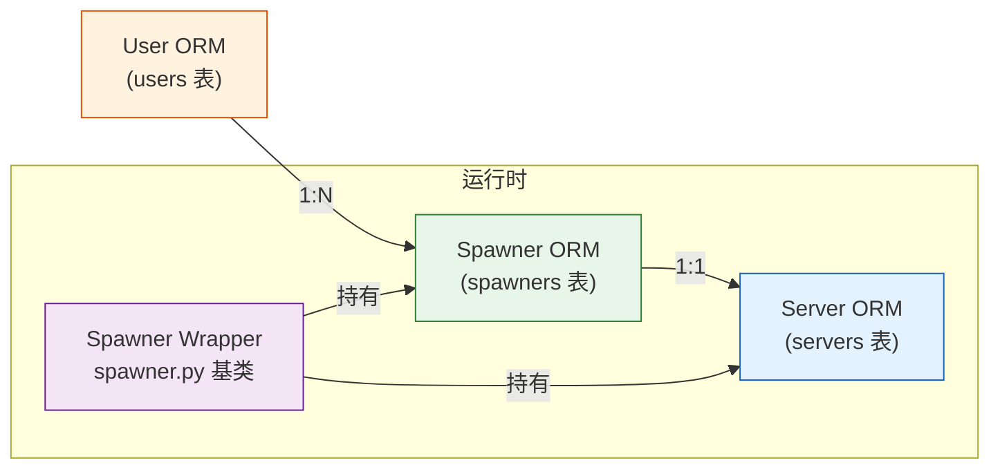

# Spawner 机制

Spawner 是 JupyterHub 中负责**管理单用户 Notebook 服务器生命周期**的核心组件。每个登录用户对应一个 Spawner 实例，Spawner 负责创建、启动、监控和停止该用户的 Jupyter Server 进程（`jupyterhub-singleuser`）。

## Spawner 基类职责

Spawner 基类继承自 `traitlets.config.LoggingConfigurable`，定义了所有 Spawner 实现必须遵循的契约。其核心职责包括：

1. **生命周期管理**：启动、停止、监控单用户服务器进程
2. **状态持久化**：将运行时状态序列化到数据库，支持 Hub 重启后的恢复
3. **环境构建**：组装启动命令、环境变量和命令行参数
4. **资源配置**：设置内存/CPU 限制等资源约束
5. **进度反馈**：通过 SSE（Server-Sent Events）向用户推送启动进度
6. **钩子执行**：在 spawn 前后执行用户自定义钩子（pre_spawn_hook / post_stop_hook）

[^spawner-source]

## 核心生命周期方法

Spawner 的四个核心异步方法定义了服务器的完整生命周期：

| 方法 | 签名 | 返回值 | 说明 |
|------|------|--------|------|
| `start` | `async () → (ip, port)` | `(str, int)` 元组 | 启动单用户服务器，返回服务器监听的 IP 和端口；Hub 根据返回值更新 Proxy 路由 |
| `stop` | `async (now=False)` | `None` | 停止单用户服务器；`now=True` 时立即强制终止 |
| `poll` | `async () → int/None` | 退出码或 `None` | 检查进程状态：返回 `None` 表示仍在运行，返回整数退出码表示已停止 |
| `wait` | `async () → int` | 退出码 | 等待进程退出并返回退出码 |

此外还有三个状态管理方法配合数据库持久化：

| 方法 | 说明 |
|------|------|
| `get_state()` | 获取可序列化的状态字典，用于 DB 持久化 |
| `load_state(state)` | 从持久化状态字典恢复 Spawner 状态 |
| `clear_state()` | 清除持久化状态 |

[^spawner-source]

### 生命周期状态转换

Spawner 的运行时状态在以下状态之间转换：

```
  (stopped/inactive)
       │
       │ start()
       ▼
  (starting/pending) ──start_timeout──→ (failed)
       │
       │ 服务器就绪
       ▼
  (running/ready) ──poll() 返回退出码──→ (stopped)
       │
       │ stop()
       ▼
  (stopping/pending) ──stop_timeout──→ (force kill)
       │
       ▼
  (stopped/inactive)
```

ORM 层的 Spawner 模型通过四个布尔/枚举属性反映状态：

| 属性 | 类型 | 含义 |
|------|------|------|
| `pending` | `str/None` | 待处理操作：`'spawn'`（启动中）、`'stop'`（停止中）、`None`（无待处理） |
| `running` | `bool` | 服务器进程是否在运行 |
| `ready` | `bool` | 服务器是否已就绪可接受请求 |
| `active` | `bool` | Spawner 是否活跃（running 或 pending 非空） |

状态不变量：`ready` 蕴含 `running`，`running` 蕴含 `active`；`pending` 非空时 `active` 为 `True`。

[^spawner-source][^orm-source]

### SpawnException（v6.0 新增）

v6.0 引入 `SpawnException` 异常类，允许 Spawner 实现**策略性阻止 spawn**（如容量已满）：

```python
raise SpawnException(
    "Server is full",
    reason="capacity",           # 短标签，用于 metrics 分类
    log_message="详细日志",       # 仅记录日志，不展示给终端用户
    message_html="<b>...</b>",   # HTML 格式的用户可见消息
    status_code=503              # HTTP 响应状态码
)
```

[^spawner-source]

## 服务器信息管理

Spawner 通过一组 traitlets 管理单用户服务器的连接信息：

| Traitlet | 类型 | 默认值 | 说明 |
|----------|------|--------|------|
| `ip` | `Unicode` | `''` | 服务器监听的 IP 地址，`start()` 返回值会设置此字段 |
| `port` | `Integer` | 随机端口 | 服务器监听端口，`start()` 返回值会设置此字段 |
| `pid` | `Integer` | `0` | 单用户服务器进程 ID，LocalProcessSpawner 用此追踪进程 |
| `server` | 关联 | — | ORM `Server` 对象引用，包含 proto/ip/port/base_url/cookie_name |

`Server` ORM 模型存储在数据库中，包含 `proto`（http/https）、`ip`、`port`、`base_url`、`cookie_name` 等字段，Spawner 与 Server 是一对一关系。

[^spawner-source][^orm-source]

## 资源配置

Spawner 基类定义了资源限制相关的 traitlets，供具体子类（DockerSpawner、KubeSpawner 等）实现约束：

| 配置项 | 说明 |
|--------|------|
| `mem_limit` | 内存限制（字节或人类可读格式如 `"1G"`、`"512M"`） |
| `cpu_limit` | CPU 核心数限制（浮点数，如 `1.0` 表示 1 核，`2.0` 表示 2 核） |
| `mem_guarantee` | 内存保证/预留量（调度器保证的最小内存） |
| `cpu_guarantee` | CPU 保证/预留量（调度器保证的最小 CPU） |

> **注意**：基类 `Spawner` 仅声明这些配置项，具体的资源隔离实现由子类负责——LocalProcessSpawner 不强制实施资源限制，DockerSpawner 将其映射为 `--memory`/`--cpus`，KubeSpawner 将其映射为 Pod resources limits/requests。

## 环境变量与命令

Spawner 控制单用户服务器的启动命令和环境变量：

### 命令构建

| Traitlet/方法 | 类型/签名 | 默认值 | 说明 |
|---------------|-----------|--------|------|
| `cmd` | `Command` | `['jupyterhub-singleuser']` | 启动单用户服务器的基础命令 |
| `args` | `List(Unicode)` | `[]` | 传递给命令的额外参数 |
| `get_args()` | `() → list` | — | 返回完整命令行参数列表，子类可重写以注入动态参数 |

最终启动命令为 `cmd + get_args()`。

### 环境变量

| Traitlet/方法 | 类型/签名 | 默认值 | 说明 |
|---------------|-----------|--------|------|
| `env` | `Dict` | `{}` | 用户自定义的额外环境变量 |
| `env_keep` | `List(Unicode)` | `['PATH','PYTHONPATH','CONDA_ROOT','VIRTUAL_ENV','LANG','LC_ALL']` | 从 Hub 父进程继承的环境变量白名单 |
| `get_env()` | `() → dict` | — | 返回完整环境变量字典，包含 JupyterHub 自动注入的变量（如 `JUPYTERHUB_API_TOKEN`、`JUPYTERHUB_API_URL` 等） |

`get_env()` 合并三个来源：(1) `env_keep` 指定的父进程变量；(2) Spawner 自动注入的 Hub 通信变量；(3) 用户配置的 `env` 字典。

[^spawner-source]

## 关键配置项

| 配置项 | 类型 | 默认值 | 说明 |
|--------|------|--------|------|
| `start_timeout` | `Integer` | `60` | 启动超时（秒），超时后判定 spawn 失败 |
| `stop_timeout` | `Integer` | `10` | 停止超时（秒），超时后发送 SIGKILL 强制终止 |
| `http_timeout` | `Integer` | `30` | Hub 向单用户服务器发起 HTTP 请求的超时（秒） |
| `poll_interval` | `Integer` | `30` | Hub 轮询 Spawner 状态的间隔（秒） |
| `notebook_dir` | `Unicode` | `''` | Notebook 工作目录路径 |
| `default_url` | `Unicode` | `''` | 服务器启动后的默认跳转 URL（如 `/lab`、`/tree`） |
| `debug` | `Bool` | `False` | 是否启用 debug 模式，传递 `--debug` 参数给单用户服务器 |
| `api_token` | `Unicode` | 自动生成 | Hub API 访问 token，注入到单用户服务器环境中 |
| `oauth_client_id` | `Unicode` | 自动生成 | OAuth 客户端 ID |
| `options_form` | `Unicode` | `''` | Spawn 选项表单 HTML，允许用户在启动前选择配置（如资源规格） |

在配置文件中使用 `c.Spawner.xxx` 设置这些选项：

```python
# jupyterhub_config.py
c.Spawner.start_timeout = 120
c.Spawner.notebook_dir = "/home/{username}/notebooks"
c.Spawner.default_url = "/lab"
c.Spawner.mem_limit = "2G"
c.Spawner.cpu_limit = 1.0
```

[^spawner-source]

## 内置 Spawner 实现

### LocalProcessSpawner

默认 Spawner 实现，继承自 `Spawner`：

- 在本地系统上以**子进程**方式启动单用户服务器
- 使用 `subprocess.Popen` 创建进程
- 通过 PID 管理进程生命周期（`poll()` 检查进程是否存在）
- `make_preexec_fn()` 创建用户切换函数（`setuid`/`setgid`），以目标用户身份运行进程
- 适用于**单机部署**场景（如 TLJH）

### SimpleLocalProcessSpawner

继承自 `LocalProcessSpawner`，简化版本地进程 Spawner：

- **不做用户切换**，直接以 Hub 进程的用户身份运行单用户服务器
- 省略了 `setuid`/`setgid` 逻辑，部署更简单
- 适用于**测试环境**和简单的个人部署
- 不适合多用户生产环境（无用户隔离）

[^spawner-source]

## Spawner 与 ORM 模型的关系

Spawner 运行时对象与数据库 ORM 模型紧密关联：



关键关系：

1. **User → Spawner（1:N）**：一个用户可以拥有多个命名服务器，每个命名服务器对应一个 Spawner ORM 记录；默认服务器 `name=''`，命名服务器 `name='<server_name>'`
2. **Spawner → Server（1:1）**：每个 Spawner 关联一个 Server 记录，存储 IP/端口/协议/URL 等连接信息；`cascade="all, delete-orphan"` 确保 Spawner 删除时级联清理 Server
3. **Spawner.state（JSONDict）**：Spawner 的运行时状态通过 `get_state()`/`load_state()` 序列化为 JSON 存储在此列
4. **Spawner.user_options（JSONDict）**：用户通过 `options_form` 提交的选项存储在此列
5. **外键策略**：`spawners.user_id` 为 `ON DELETE CASCADE`（删除用户级联删除 Spawner），`spawners.server_id` 为 `ON DELETE SET NULL`

Hub 启动时，从数据库加载所有 Spawner ORM 记录，通过 `load_state()` 恢复运行时状态，然后调用 `poll()` 检查服务器是否仍在运行。

[^orm-source]

## 自定义 Spawner 扩展点

Spawner 是 JupyterHub 中最灵活的扩展点之一。第三方通过继承 `Spawner` 基类并实现核心方法，可以适配任意计算后端：

| Spawner 实现 | 启动方式 | 适用场景 |
|-------------|---------|---------|
| **LocalProcessSpawner** | 本地子进程 | 单机部署、TLJH |
| **SimpleLocalProcessSpawner** | 本地子进程（无用户切换） | 测试、个人部署 |
| **DockerSpawner** | Docker 容器 | Docker 环境、容器隔离 |
| **KubeSpawner** | Kubernetes Pod | 云原生、大规模集群（Z2JH） |
| **BatchSpawner** | HPC 批处理系统（SLURM/PBS/LSF） | 超算/HPC 环境 |
| **SSH Spawner** | SSH 远程启动进程 | 远程服务器部署 |
| **SystemdSpawner** | systemd 服务 | 使用 systemd 管理进程的服务器 |
| **CustomSpawner** | 自定义逻辑 | 按需实现 |

自定义 Spawner 的最小实现只需重写 `start()`、`stop()`、`poll()` 三个方法：

```python
from jupyterhub.spawner import Spawner

class MyCustomSpawner(Spawner):
    async def start(self):
        # 在目标环境中启动 jupyterhub-singleuser
        # 返回 (ip, port)
        ...
        return (ip, port)

    async def stop(self, now=False):
        # 停止/清理服务器
        ...

    async def poll(self):
        # 检查状态：None 表示运行中，int 表示已退出
        ...
```

在配置文件中指定自定义 Spawner：

```python
c.JupyterHub.spawner_class = "mypackage.MyCustomSpawner"
```

## 进度事件与钩子

### SSE 进度事件

`progress()` 异步生成器方法在 spawn 过程中产生 SSE 事件，前端通过 `/hub/api/users/<name>/server/progress` 端点实时展示启动进度：

```python
async def progress(self):
    yield {"progress": 10, "message": "正在创建资源..."}
    yield {"progress": 50, "message": "正在启动服务器..."}
    yield {"progress": 100, "message": "服务器就绪"}
```

### Spawn 钩子

| 钩子 | 触发时机 | 典型用途 |
|------|---------|---------|
| `pre_spawn_hook` | `start()` 之前 | 准备工作目录、设置权限、挂载存储 |
| `post_stop_hook` | `stop()` 完成之后 | 清理临时资源、归档日志 |

## 源码溯源

本文档的事实依据来源于以下源码参考文档：

- [JupyterHub Spawner 源码参考](../references/spawner-source.md)：Spawner 基类及 LocalProcessSpawner/SimpleLocalProcessSpawner 的完整 API 参考，包含所有配置 traitlets、生命周期方法签名和状态转换图
- [JupyterHub ORM 源码参考](../references/orm-source.md)：Spawner/User/Server ORM 模型的表结构、列定义、关系映射和外键策略

## 相关概念

- [Proxy 系统](proxy.md) — Proxy 如何根据 Spawner 返回的 (ip, port) 更新路由
- [Authenticator 认证系统](authenticator.md) — 认证器与 Spawner 的协作关系
- [ORM 数据模型](orm.md) — Spawner/User/Server 在数据库中的持久化模型
- [JupyterHub 多用户部署](/concepts/11-jupyterhub.md) — JupyterHub 架构总览中 Spawner 的定位

[^orm-source]: JupyterHub ORM 源码参考
[^spawner-source]: JupyterHub Spawner 源码参考
