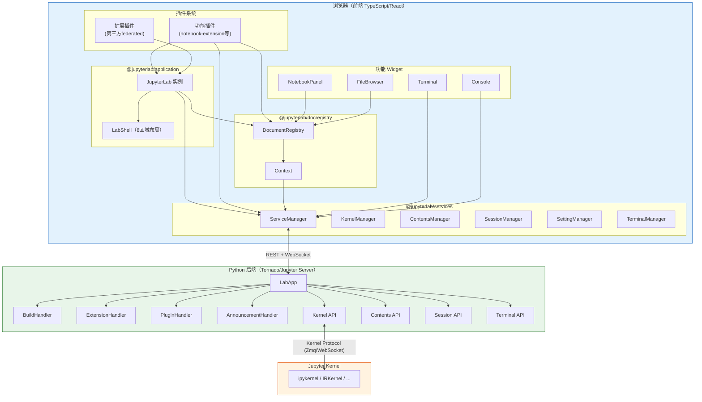

## JupyterLab 是什么

JupyterLab 是 [Project Jupyter](https://jupyter.org/) 的下一代基于 Web 的交互式开发环境（IDE），是经典 Jupyter Notebook 的进化版本。它采用 TypeScript + React + Lumino 构建前端，Python（Tornado/Jupyter Server）构建后端，以浏览器为运行载体，提供 Notebook、代码控制台、文本编辑器、终端、文件浏览器、调试器、数据查看器等多种组件，并支持通过扩展（extension）系统深度定制。

JupyterLab 在 BSD-3-Clause 协议下开源，是目前数据科学、机器学习、科学计算领域使用最广泛的交互式计算平台之一。

## 核心特性

1. **Notebook 为中心**：完整支持 Jupyter Notebook（.ipynb）格式，包括代码单元（Code Cell）、Markdown 单元（Markdown Cell）、原始单元（Raw Cell），输出支持富文本、图片、HTML、交互式 Widget
2. **多面板布局**：基于 Lumino 的 DockPanel 布局系统，支持标签页拖拽、分屏、左右侧栏、底部面板
3. **多语言内核**：通过 Jupyter Kernel 协议支持 Python、R、Julia、Scala 等数十种编程语言内核
4. **扩展生态**：通过 npm 包形式分发 prebuilt 扩展，PyPI 安装；支持 federated extension 独立构建
5. **实时协作**：基于 Yjs CRDT 实现多人实时编辑（需 jupyter-collaboration 扩展）
6. **调试支持**：内置可视化调试器（Debugger），支持断点、变量查看、调用栈
7. **LSP 集成**：内置 Language Server Protocol 支持，提供代码补全、跳转、诊断
8. **Mermaid 渲染**：原生支持 Mermaid 图表在 Markdown 中渲染

## 在 Jupyter 生态中的定位

Jupyter 生态可分为五层，JupyterLab 位于**交互界面层**：

| 层次 | 代表项目 | 作用 |
|------|---------|------|
| **协议规范层** | Jupyter Notebook Format (nbformat), Jupyter Kernel Protocol | 定义数据格式和通信协议 |
| **内核运行时层** | ipykernel, IRKernel, IJulia 等 | 各语言代码执行引擎 |
| **服务层** | jupyter-server, jupyter-client | Tornado Web 服务器、内核管理、REST API |
| **交互界面层** | **JupyterLab**, Jupyter Notebook, Jupyter Console, RetroLab | 用户可见的 Web/终端界面 |
| **扩展生态层** | jupyterlab-git, jupyterlab-lsp, jupyter-collaboration 等 | 功能扩展与集成 |

## 核心架构哲学：插件即一切

JupyterLab 最重要的架构决策是：**所有功能都是插件**。

- 文件浏览器是插件，Notebook 是插件，菜单是插件，命令面板是插件，甚至主题也是插件
- 核心框架（`@jupyterlab/application`）只提供应用壳、Shell 布局、插件注册/激活机制和 Token 依赖注入
- 每个插件通过 `JupyterFrontEndPlugin` 接口声明自己需要什么服务（`requires`/`optional`）和提供什么服务（`provides`）
- Lumino Application 框架根据 Token 依赖关系自动按拓扑排序激活插件

这种设计使 JupyterLab 具有极强的可扩展性——理论上任何 UI 组件都可以被替换或扩展，不需要修改核心代码。

## 学习目标

完成本教程后，你将能够：

1. 向团队清晰解释 JupyterLab 的前后端分离架构和插件系统工作原理
2. 独立从源码构建 JupyterLab，理解三种运行模式（core/dev/app）的区别
3. 复述 Token 依赖注入机制，理解插件的 requires/optional/provides 声明
4. 理解 DocumentRegistry 的文档工厂模式，解释"打开一个文件"的完整流程
5. 掌握 ServiceManager 各子管理器的作用，理解前端与后端的通信机制
6. 能够编写一个最小 JupyterLab 扩展，注册自定义命令和 Widget

## 章节导航表

| 章号 | 标题 | 核心内容 | 预计阅读时间 |
|------|------|----------|-------------|
| 00 | 概述与知识地图 | 项目定位、特性、架构哲学、导航表、学习路径 | 5 分钟 |
| 01 | 整体架构概览 | Monorepo 结构、技术栈、前后端分层、数据流 | 8 分钟 |
| 02 | 应用框架与 Shell 布局 | JupyterFrontEnd/JupyterLab 类、LabShell 8 区域、启动流程 | 10 分钟 |
| 03 | 插件系统与依赖注入 | Token、JupyterFrontEndPlugin、激活/停用、DI 机制 | 10 分钟 |
| 04 | 服务层与后端通信 | ServiceManager、12 个子管理器、REST/WebSocket 通信 | 8 分钟 |
| 05 | 文档注册与 Widget 工厂 | DocumentRegistry、ModelFactory/WidgetFactory、Context、文件类型链 | 10 分钟 |
| 06 | Notebook 与 Cell 架构 | NotebookPanel/Notebook/Cell 层级、Cell 类型、NotebookModel | 8 分钟 |
| 07 | 扩展生态系统 | Federated 扩展、Python 扩展管理器、prebuilt/source 扩展 | 8 分钟 |
| 08 | 构建系统与运行模式 | Rspack 构建、jlpm、core/dev/app 三模式、staging 目录 | 6 分钟 |
| 09 | 关键子系统 | PageConfig、命令系统、StateDB、设置、Router | 8 分钟 |

## 三条学习路径

### 路径一：快速上手路径（使用者）
**目标**：了解 JupyterLab 是什么、核心界面和功能
```
00 → 01 → 02
```
**预计**：约 20 分钟

### 路径二：扩展开发路径（前端开发者）
**目标**：理解插件系统，能开发 JupyterLab 扩展
```
00 → 01 → 02 → 03 → 05 → 07 → examples/01-minimal-extension
```
**预计**：约 50 分钟

### 路径三：完整源码学习路径（架构师/核心贡献者）
**目标**：完整理解从后端到前端的全链路架构
```
00 → 01 → 02 → 03 → 04 → 05 → 06 → 07 → 08 → 09 → examples
```
**预计**：约 80 分钟

## 整体架构流程图



数据流自顶向下：用户操作 Widget → 通过 ServiceManager 调用后端 REST/WebSocket API → Python 后端（LabApp）路由到对应 Handler 或内核 → 结果返回前端更新 Widget 状态。插件系统在应用启动时自动装配所有功能。

## 为什么 JupyterLab 值得学习

- **插件架构的典范**：Token 依赖注入 + 拓扑激活 + 功能全部插件化，是大型前端应用可扩展性设计的优秀参考
- **前后端分离的工程实践**：Python 后端提供 REST API + WebSocket，TypeScript 前端通过 ServiceManager 统一管理所有后端通信
- **Monorepo 管理经验**：使用 Lerna + Yarn workspaces 管理 80+ 个包，独立版本控制
- **Lumino 框架**：提供 Signal（响应式）、Disposable（资源管理）、DockPanel（高级布局）、Command（命令系统）等企业级 UI 基础设施
- **文档工厂模式**：DocumentRegistry 的 ModelFactory/WidgetFactory/WidgetExtension 三级扩展点是编辑器类应用的通用模式

## 相关概念

- [01 整体架构概览](01-architecture-overview.md)
- [源码文件地图](../references/source-code-map.md)
- [最小扩展示例](../examples/01-minimal-extension.md)
