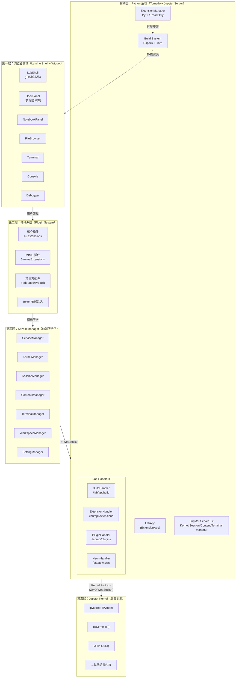

## 概述

JupyterLab 采用经典的前后端分离架构：Python/Tornado 后端提供静态资源服务、REST API 和 WebSocket 通信，TypeScript/React/Lumino 前端构建完整的 IDE 式用户界面。理解 JupyterLab 的整体架构，需要从三个维度入手：**Monorepo 代码组织**、**技术栈选型**和**五层运行时架构**。

## Monorepo 结构

JupyterLab 使用 **Lerna + Yarn Workspaces** 管理单一仓库中的多个包（F-016, F-017）。根 `package.json` 声明包管理器为 Yarn 3.5.0（F-016），`lerna.json` 配置为 independent 版本模式，即每个包独立维护版本号（F-017）。

仓库呈现**双结构**特征：

- **Python 包**（`jupyterlab/` 目录）：后端服务，包名 `jupyterlab`，要求 Python >= 3.10（F-003），使用 hatchling 构建（F-009），当前版本 4.7.0-alpha.1（F-011）。
- **前端包**（`packages/` 目录）：共 **103 个** TypeScript/JavaScript 包（F-043-F-075），每个包有独立的 `package.json`、`src/`、`style/`，通过 `@jupyterlab/*` 作用域发布。

前端 103 个包按职责分为五类：核心包（18 个，如 application/services/coreutils）、功能包（32 个，如 notebook/cells/outputarea）、MIME 扩展包（6 个，如 json-extension/pdf-extension）、功能扩展包（44 个，如 notebook-extension/filebrowser-extension）、构建测试包（3 个）。其中 `@jupyterlab/metapackage` 聚合全部 88 个核心包（F-071, F-152），`jupyterlab/staging/package.json` 定义构建入口，包含 46 个核心 extensions、5 个 mimeExtensions 和约 70 个 singletonPackages（F-138）。

Python 侧的 CLI 入口点有三个（F-013）：`jupyter-lab`（启动应用，指向 `labapp:main`）、`jupyter-labextension`（扩展管理，指向 `labextensions:main`）、`jupyter-labhub`（JupyterHub 集成，指向 `labhubapp:main`）。

## 技术栈

### 前端技术栈

| 技术 | 版本/说明 | 事实编号 |
|------|----------|---------|
| TypeScript | 全量 TypeScript 编写 | — |
| React | 18（`react ^18.2.0`） | F-147 |
| Lumino | 15 个 `@lumino/*` 包（widgets/signaling/commands/application/messaging 等） | F-148 |
| CodeMirror | 6（`@codemirror/language/state/view ^6.0.0`） | F-150 |
| Yjs | `^13.5.40`（CRDT 实时协作） | F-147 |
| Rspack | `@rspack/cli + @rspack/core ^2.0.2`（Rust 高性能打包器，替代 Webpack） | F-150, F-137 |
| Fast Element | `@microsoft/fast-element/fast-foundation`（Web Components） | F-149 |
| Lezer | `@lezer/common/highlight`（CodeMirror 6 解析器生态） | F-149 |

需要特别注意：**Lumino 是 JupyterLab 前端的"操作系统内核"**，而非 React。React 仅用于局部 UI 渲染（对话框、工具栏按钮、设置编辑器等），主布局（DockPanel、TabBar、SplitPanel）完全由 Lumino 控制。15 个 Lumino 包被列入 singletonPackages，确保整个应用只有一套 Lumino 实例（F-139, F-148）。

### 后端技术栈

| 技术 | 版本/说明 | 事实编号 |
|------|----------|---------|
| Python | >= 3.10（支持 3.10-3.14） | F-003, F-008 |
| Tornado | >= 6.2.0（Web 框架） | F-162, F-163 |
| Jupyter Server | >= 2.19.0, < 3（Tornado-based 服务端） | F-159 |
| jupyterlab_server | >= 2.28.0, < 3（LabServerApp 基类、page_config、工作区） | F-158 |
| notebook_shim | >= 0.2（经典 Notebook 配置兼容层） | F-160 |
| traitlets | 配置系统（Bool/Unicode/Instance/Type） | F-162 |
| httpx | >= 0.25.0（异步 HTTP 客户端，PyPI 扩展管理器使用） | F-162, F-122 |
| jinja2 | >= 3.0.3（HTML 模板渲染） | F-162 |

## 五层架构

JupyterLab 的运行时架构可分为五层，自上而下贯穿浏览器到计算内核：



### 第一层：浏览器前端（Lumino Shell）

最上层是用户直接交互的 UI 层，基于 Lumino Widget 体系构建。`LabShell` 继承 Lumino Widget（shell.ts:368），实现 8 个区域的布局（main/header/top/menu/left/right/bottom/down），核心是 `OptimizedDockPanelSvg`（DockPanel 的 SVG 优化版），支持标签页拖拽、分屏、多文档/单文档模式。Notebook、文件浏览器、终端、调试器等都是 Lumino Widget，通过 `shell.add(widget, area)` 添加到对应区域。

### 第二层：插件系统

JupyterLab 的所有功能都是插件。核心框架 `@jupyterlab/application` 只提供应用壳、Shell 布局、插件注册/激活机制和 Token 依赖注入（F-043）。插件通过 `JupyterFrontEndPlugin` 接口声明 `requires`/`optional`/`provides`，Lumino Application 框架根据 Token 依赖关系按拓扑排序激活。前端构建配置中定义了 46 个核心 extensions 和 5 个 mimeExtensions（F-138）。

### 第三层：ServiceManager

`@jupyterlab/services` 包提供前端与后端通信的统一客户端（F-046）。`ServiceManager` 类（manager.ts:48）聚合 12 个子管理器：contents、events、kernels、sessions、settings、terminals、builder、workspaces、nbconvert、kernelspecs、user、serverSettings。它在浏览器端通过 shim 使用原生 WebSocket（Node 端使用 `ws ^8.11.0`，F-164）。

### 第四层：Python 后端

`LabApp` 继承自 `NotebookConfigShimMixin` 和 `LabServerApp`（labapp.py:417，F-076），是 Jupyter Server 的 ExtensionApp。它注册 Lab 专属 Handler（BuildHandler、ExtensionHandler、PluginHandler、NewsHandler），将内核/会话/文件/终端管理委托给 Jupyter Server 2.x（F-159），将页面配置、工作区、许可证委托给 jupyterlab_server（F-158）。构建系统使用 Rspack（F-137），扩展管理器通过 entry point 支持可插拔实现（F-113）。

### 第五层：Jupyter Kernel

最底层是各语言的计算内核。Python 后端通过 Jupyter Kernel Protocol（ZMQ/WebSocket）与内核通信，前端通过 WebSocket 经后端代理与内核交互。Python 环境默认依赖 `ipykernel >= 6.5.0`（F-162）。

## 前后端通信

JupyterLab 前后端之间有三种通信机制：

### 1. REST API

前端 `ServiceManager` 通过 `ServerConnection` 发起 HTTP 请求到 Jupyter Server 的 REST 端点，包括：
- `/api/kernels`、`/api/sessions`、`/api/contents`、`/api/terminals`（Jupyter Server 提供）
- `/lab/api/build`、`/lab/api/extensions`、`/lab/api/plugins`、`/lab/api/news`（LabApp 专属，F-098-F-112）

ExtensionHandler 的 GET 接口支持分页（page/per_page 参数）和 RFC 5988 Link 头（first/prev/next/last），POST 接口支持 install/uninstall/enable/disable 四种命令（F-109, F-110）。

### 2. WebSocket

实时双向通信使用 WebSocket：
- Kernel 通信：前端通过 WebSocket 发送/接收 Jupyter Kernel Protocol 消息（代码执行、输出、状态更新）
- Terminal：终端的 PTY 输入输出
- Yjs CRDT：实时协作（需 jupyter-collaboration 扩展，F-087）

浏览器端 `@jupyterlab/services` 通过 shim 使用原生 WebSocket，Node 端使用 `ws` 包（F-164）。

### 3. page_config 机制

`page_config` 是 JupyterLab 特有的配置传递机制：后端在渲染 HTML 模板时，将配置数据内联到页面的 `<script id="jupyter-config-data" type="application/json">` 标签中，前端通过 `PageConfig.getOption()` 同步读取（F-167）。

`page_config_data` 在 `LabApp.initialize_handlers()` 中设置（labapp.py:742-757），传递的配置包括：devMode、token、exposeAppInBrowser、quitButton、allow_hidden_files、delete_to_trash、notebookVersion、buildAvailable、buildCheck、extensionManager、news、hub* 等（F-167）。这种设计减少了首次加载的 API 请求数，但修改配置需要刷新页面。

## 核心包依赖链

JupyterLab 前端包的依赖关系呈清晰的分层结构：

```
@jupyterlab/application (应用壳)
  ├── @lumino/widgets, @lumino/application, @lumino/commands (Lumino 框架)
  ├── @jupyterlab/apputils (对话框/工具栏/命令栏)
  ├── @jupyterlab/coreutils (URL/路径/信号/PageConfig)
  ├── @jupyterlab/docregistry (文档注册表)
  ├── @jupyterlab/rendermime (MIME 渲染注册表)
  ├── @jupyterlab/services (REST/WebSocket 客户端)
  ├── @jupyterlab/statedb (LocalStorage 状态)
  ├── @jupyterlab/translation (国际化)
  └── @jupyterlab/ui-components (React UI 组件库)

@jupyterlab/notebook (Notebook 功能)
  ├── @jupyterlab/cells (CodeCell/MarkdownCell/RawCell)
  │     ├── @jupyterlab/codeeditor (编辑器抽象)
  │     └── @jupyterlab/outputarea (输出区域)
  ├── @jupyterlab/codemirror (CodeMirror 6 实现)
  ├── @jupyterlab/docregistry
  ├── @jupyterlab/services
  └── @jupyter/ydoc (Yjs CRDT)
```

`@jupyterlab/application` 是依赖链的顶点（F-145），它直接依赖全套 `@lumino/*` 包以及 apputils/coreutils/docregistry/rendermime/services/statedb/translation/ui-components。`@jupyterlab/notebook` 是最重要的功能包，依赖 cells/codemirror/docregistry/outputarea/rendermime/services 和 `@jupyter/ydoc`（F-047）。

构建时通过 `singletonPackages` 列表确保 React、Lumino、CodeMirror、Yjs 等框架包只有一个实例（F-139），防止多实例冲突导致扩展崩溃。这是 JupyterLab 扩展生态稳定性的关键保障。

## 三种运行模式

LabApp 支持三种运行模式（F-080），通过不同的 static_paths、labextensions_path 和 page_config 实现：

| 模式 | 标志 | 静态资源 | 第三方扩展 | 构建 UI |
|------|------|---------|-----------|---------|
| Core | `--core-mode` | pip 包内预构建 | 禁用 | 不显示 |
| Dev | `--dev-mode` | dev_mode/ 本地构建 | 可用 | 不显示（顶部红色条带） |
| App | `--app-dir` | app_dir 下构建 | 可用 | 显示 |

core 模式下 `labextensions_path` 为空（F-088），`buildAvailable` 和 `buildCheck` 为 False（F-090），是最小化部署模式；dev 模式用于 JupyterLab 本身源码开发；app 模式是正常使用模式。

## 相关概念

- [00 概述与知识地图](00-introduction.md)
- [02 应用框架与 Shell 布局](02-application-shell.md)
- [03 插件系统与依赖注入](03-plugin-system.md)
- [04 服务层与后端通信](04-service-layer.md)
- [08 构建系统与运行模式](08-build-and-modes.md)
- [源码文件地图](../references/source-code-map.md)
