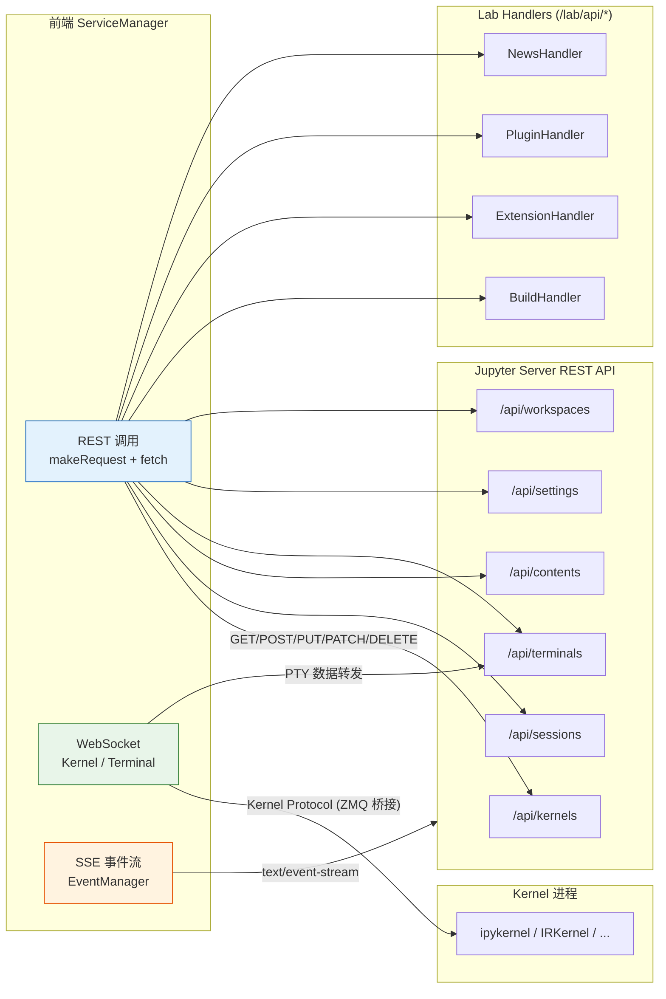

## ServiceManager：后端服务的统一入口

`ServiceManager` 是 JupyterLab 前端与 Python 后端通信的核心聚合类，定义在 `packages/services/src/manager.ts:48`。它实现 `ServiceManager.IManager` 接口，将所有后端服务子管理器聚合为一个统一对象，通过 `JupyterFrontEnd.serviceManager` 属性暴露给插件（`frontend.ts:117`）。`@jupyterlab/services` 包是 Jupyter REST API 的 TypeScript 客户端，负责 Kernel/Session/Content/Terminal 等全部后端通信（F-046）。

`ServiceManager` 构造函数（`manager.ts:52-90`）接收 `Partial<ServiceManager.IOptions>`，关键参数包括 `serverSettings`（通过 `ServerConnection.makeSettings()` 生成默认值）和 `standby`（默认为 `'when-hidden'`）。构造时，所有子管理器以 `normalized` 配置对象统一创建。`ready` Promise 在 `sessions`、`kernelspecs` 以及 `terminals`（如果可用）全部完成首次数据获取后 resolve。

## 子管理器清单

`ServiceManager` 聚合了 11 个子管理器，每个对应一组 Jupyter Server REST API 端点：

| 属性 | 类型 | 职责 | 对应后端 API |
|------|------|------|-------------|
| `contents` | `Contents.IManager` | 文件/目录 CRUD、检查点 | `/api/contents/` |
| `sessions` | `Session.IManager` | 内核会话生命周期管理 | `/api/sessions/` |
| `kernels` | `Kernel.IManager` | Kernel 实例管理 | `/api/kernels/` |
| `kernelspecs` | `KernelSpec.IManager` | 可用内核规格信息 | `/api/kernelspecs` |
| `terminals` | `Terminal.IManager` | 终端会话管理 | `/api/terminals/` |
| `settings` | `Setting.IManager` | 插件设置持久化 | `/api/settings/` |
| `workspaces` | `Workspace.IManager` | 工作区布局状态 | `/api/workspaces/` |
| `nbconvert` | `NbConvert.IManager` | Notebook 导出格式 | `/api/nbconvert/` |
| `builder` | `Builder.IManager` | 前端资源构建（已弃用） | `/lab/api/build` |
| `events` | `Event.IManager` | 后端事件流（SSE） | `/api/events` |
| `user` | `User.IManager` | 当前用户信息 | `/api/me` |

此外还有 `serverSettings: ServerConnection.ISettings` 属性保存共享的服务器连接配置。

各子管理器在构造时通过 `connectionFailure` 信号将连接错误代理到 ServiceManager 级别（`manager.ts:78-80`），`kernelspecs`、`sessions`、`terminals` 的连接失败都会触发 ServiceManager 的 `connectionFailure` 信号。

### ContentsManager（文件内容管理）

`ContentsManager` 负责文件和目录的 CRUD 操作，对应 `/api/contents/` REST API。提供 `get(path)`（GET 获取内容）、`save(path, options)`（PUT 保存）、`delete(path)`（DELETE 删除）、`rename(path, newPath)`（PATCH 重命名）、`newUntitled(options)`（POST 新建）、`copy(path, toDir)`（POST 复制）以及检查点管理（`createCheckpoint`/`listCheckpoints`/`restoreCheckpoint`）。文件变化时发射 `fileChanged` 信号。

### SessionManager 与 KernelManager（会话与内核）

`SessionManager` 管理内核会话，将一个文档（Notebook 或 Console）绑定到一个 Kernel 实例。提供 `startNew(options)`、`refreshRunning()`、`stopIfNeeded(path)` 等方法，以及 `runningChanged`、`connectionStatusChanged` 信号。`KernelManager` 直接管理 Kernel 生命周期，提供 `startNew()`、`interruptKernel(id)`、`restartKernel(id)`、`shutdown(id)`、`connectTo(options)` 等方法。Kernel 连接通过 WebSocket 进行 Jupyter Kernel Protocol 通信。

### TerminalManager（终端管理）

`TerminalManager` 管理终端会话，对应 `/api/terminals/` API。`startNew()` 创建新终端，`connectTo(name)` 通过 WebSocket 连接到已有终端的 PTY，转发终端输入输出数据。`runningChanged` 信号通知终端列表变化。

### 其他管理器

- **`SettingManager`**：基于 JSON Schema 的插件设置管理，`fetch(id)` 获取设置、`save(id, raw)` 保存设置，对应 `/api/settings/`。
- **`WorkspaceManager`**：工作区布局状态的保存/加载/列出/删除，对应 `/api/workspaces/`（F-050）。
- **`NbConvertManager`**：`getExportFormats()` 获取可用导出格式列表，`getExportUrl(path, format)` 构造导出 URL。
- **`KernelSpecManager`**：获取可用内核的规格（名称、显示名、语言、资源路径），`ready` Promise 在首次获取后 resolve。
- **`EventManager`**：通过 Server-Sent Events（SSE）监听后端事件流，对应 `/api/events` 端点。
- **`UserManager`**：获取当前用户身份信息，在 JupyterHub 等多用户环境下使用，对应 `/api/me`。
- **`BuildManager`**：管理前端资源构建，通过 `/lab/api/build` 端点与后端 `BuildHandler` 通信（F-104），在 JupyterLab v5 中将被移除。

## ServerConnection：通信基础设施

所有子管理器的底层 HTTP 和 WebSocket 通信都通过 `ServerConnection` 模块（`packages/services/src/serverconnection.ts`）完成。它提供三个核心 API：

### ServerConnection.makeSettings()

`makeSettings(options?)`（`serverconnection.ts:120`）创建并返回 `ServerConnection.ISettings` 对象，包含：

- `baseUrl`：后端基础 URL（如 `http://localhost:8888/`）
- `wsUrl`：WebSocket URL（如 `ws://localhost:8888/`）
- `token`：认证 token，从 PageConfig 获取
- `fetch`：HTTP 请求函数，默认使用浏览器原生 `fetch`
- `WebSocket`：WebSocket 构造函数，浏览器端使用原生 WebSocket
- `init`：默认 `RequestInit`（headers 等）

ServiceManager 构造时调用 `ServerConnection.makeSettings()` 获取默认配置（`manager.ts:55`）。

### ServerConnection.makeRequest()

`makeRequest(url, init, settings)`（`serverconnection.ts:144`）是所有 REST API 调用的统一入口，负责：

1. 自动添加 `Authorization: token <token>` 认证头
2. 处理 `X-XSRFToken` 防跨站请求伪造
3. 统一错误处理：HTTP 错误响应封装为 `ServerConnection.ResponseError`（`serverconnection.ts:155`），网络错误封装为 `ServerConnection.NetworkError`（`serverconnection.ts:213`，继承自 `TypeError`）
4. 支持自定义 `fetch` 实现（便于测试和代理）

### WebSocket 连接管理

Kernel 和 Terminal 的实时通信使用 WebSocket。`ServerConnection` 通过 `makeSettings()` 生成正确的 WebSocket URL，自动将 `http://` 替换为 `ws://`、`https://` 替换为 `wss://`，并在 URL 参数中附加 `token` 用于认证。Node.js 环境使用 `ws` 包（F-164），浏览器端使用原生 WebSocket。

## REST API 通信模式

每个子管理器对应 Jupyter Server 的一组 REST 端点。JupyterLab 自身还通过 `/lab/api/*` 前缀注册了 Lab 专属 Handler（F-089）：

| Handler | 路由 | 方法 | 功能 |
|---------|------|------|------|
| `BuildHandler` | `/lab/api/build` | GET/POST/DELETE | 查询/触发/取消前端构建（F-104、F-106） |
| `ExtensionHandler` | `/lab/api/extensions` | GET/POST | 扩展列表查询与安装/卸载/启用/禁用（F-108、F-110） |
| `PluginHandler` | `/lab/api/plugins` | GET/POST | 插件锁定状态查询与启用/禁用（F-111、F-112） |
| `NewsHandler` | `/lab/api/news` | GET | 获取公告通知 Atom feed（F-098、F-101） |
| `CheckForUpdateHandler` | `/lab/api/update` | GET | 检查 JupyterLab 版本更新（F-098、F-099） |

所有 Handler 方法均使用 `@web.authenticated` 装饰器要求认证（F-103）。



## WebSocket 通信

Kernel 通信是服务层最复杂的部分。前端通过 WebSocket 连接到 Jupyter Server，服务器端将 WebSocket 消息桥接到 Kernel 的 ZMQ 端口。一条 Kernel 消息是 JSON 对象，包含 `channel`（`shell`/`iopub`/`stdin`/`control`/`hb`）、`header`（`msg_id`/`msg_type`/`session`/`version`）、`parent_header`、`metadata`、`content`、`buffers` 字段。Shell channel 发送执行请求，IOPub channel 接收输出（stream/display_data/execute_result/error/status），Control channel 处理中断/重启等控制命令，HB channel 做心跳检测。

Terminal 通信则简单得多——WebSocket 直接转发 PTY 的原始字节流，前端 xterm.js 渲染终端界面。

## 连接状态管理

Kernel 和 Terminal 连接维护了 `ConnectionStatus` 状态枚举，定义在 `packages/services/src/kernel/kernel.ts:1052`：

```typescript
export type ConnectionStatus = 'connected' | 'connecting' | 'disconnected';
```

`KernelConnection` 和 `DefaultTerminalConnection` 都暴露 `connectionStatus` 属性和 `connectionStatusChanged` 信号。状态转换流程为：初始 `connecting` → WebSocket 连接成功变为 `connected` → 连接断开或错误变为 `disconnected` → 自动重连时回到 `connecting`。

ServiceManager 层面通过 `connectionFailure: ISignal<IManager, Error>` 信号（`manager.ts:95`）统一代理子管理器的连接失败事件。插件可以监听此信号或使用 `IConnectionLost` Token（`tokens.ts:16`）自定义连接丢失时的行为（默认弹出对话框提示用户）。

## standby 轮询策略

`standby` 选项控制各管理器何时暂停对后端 API 的轮询，定义在 `ServiceManager.IOptions`（`manager.ts:243`）中，类型为 `Poll.Standby | (() => boolean | Poll.Standby)`，默认值为 `'when-hidden'`（`manager.ts:56`）。

| 策略值 | 行为 |
|--------|------|
| `'when-hidden'`（默认） | 页面不可见（`document.visibilityState === 'hidden'`）时暂停轮询，节省带宽和服务器资源 |
| `'never'` | 始终轮询，不暂停，适合需要后台持续监控的场景 |
| `'always'` | 始终维持连接（旧模式，行为与 `'never'` 类似） |

该策略被 `KernelManager`、`SessionManager`、`TerminalManager`、`KernelSpecManager`、`EventManager` 等所有需要轮询的子管理器共享（各 manager.ts 构造函数中均以 `options.standby ?? 'when-hidden'` 传递）。内部使用 Lumino 的 `Poll` 类实现基于 Page Visibility API 的定时轮询控制。

## 服务层在架构中的角色

服务层是前端插件系统与 Python 后端之间的唯一通信通道。插件通过 `JupyterFrontEnd.serviceManager` 获取 ServiceManager 实例，进而访问各个子管理器。这种聚合设计使得插件不需要关心底层的认证、URL 构造、错误处理、WebSocket 重连等细节——这些都由 ServerConnection 和各子管理器统一封装。例如，Context 对象在保存文档时直接调用 `serviceManager.contents.save(path, model)`，无需手动构造 HTTP 请求或处理 token 认证（F-053）。

后端方面，JupyterLab 自身的 Handler 注册在 `/lab/api/*` 前缀下（F-089），而 Kernel、Session、Contents、Terminal 等核心 API 由 jupyter_server 包提供，注册在 `/api/*` 前缀下。jupyterlab 包本身是一个"薄"后端层——大量核心功能委托给 jupyter_server 和 jupyterlab_server，自身主要负责前端构建编排、扩展管理和少量 Lab 专属 API。

## 相关概念

- [00 概述与知识地图](00-introduction.md)
- [01 整体架构概览](01-architecture-overview.md)
- [02 应用框架与 Shell 布局](02-application-shell.md)
- [03 插件系统与依赖注入](03-plugin-system.md)
- [05 文档注册与 Widget 工厂](05-document-widget-system.md)
- [06 Notebook 与 Cell 架构](06-notebook-cells.md)
- [07 扩展生态系统](07-extension-ecosystem.md)
- [08 构建系统与运行模式](08-build-and-modes.md)
- [09 关键子系统](09-key-subsystems.md)
