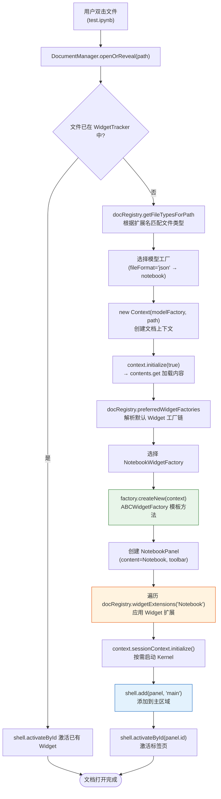

## DocumentRegistry：文档系统的注册中心

`DocumentRegistry` 是 JupyterLab 文档系统的核心注册中心，定义在 `packages/docregistry/src/registry.ts:47`。它维护文件类型、模型工厂、Widget 工厂、Widget 扩展之间的映射关系，决定不同类型的文件如何被创建、打开、编辑和渲染。`@jupyterlab/docregistry` 包提供 Context、DocumentModel 和 WidgetFactory 等核心抽象，`@jupyterlab/docmanager` 包则负责运行时的文档打开/保存/关闭管理，`docmanager-extension` 注册文档管理相关命令（F-053）。

`DocumentRegistry` 内部维护多个私有映射表，包括 `_modelFactories`（模型工厂注册表）、`_widgetFactories`（Widget 工厂注册表）、`_widgetFactoriesForFileType`（文件类型到 Widget 工厂列表的多值映射）、`_defaultWidgetFactory`/`_defaultWidgetFactories`/`_defaultWidgetFactoryOverrides`（默认工厂解析链）、`_fileTypes`（文件类型定义列表）、`_extenders`（Widget 扩展注册表）。注册表变化时发射 `changed` 信号，参数类型为 `IChangedArgs`，包含 `type`（`'widgetFactory'`/`'modelFactory'`/`'widgetExtension'`/`'fileType'`）和 `change`（`'added'`/`'removed'`）。

## 文件类型系统

文件类型通过 `DocumentRegistry.IFileType` 接口描述（`registry.ts:1280`），它继承自 `IRenderMime.IFileType`（`packages/rendermime-interfaces/src/index.ts:177`），并增加了两个字段：

```typescript
interface IFileType extends IRenderMime.IFileType {
  readonly icon?: LabIcon;
  readonly contentType: Contents.ContentType;   // 'file' | 'directory' | 'notebook'
  readonly fileFormat: Contents.FileFormat;     // 'text' | 'base64' | 'json'
}
```

继承自 `IRenderMime.IFileType` 的字段包括 `name`（文件类型唯一名称，如 `'notebook'`）、`mimeTypes`（MIME 类型数组，如 `['application/x-ipynb+json']`）、`extensions`（扩展名数组，如 `['.ipynb']`）、`displayName`（显示名）、`icon`/`iconClass`/`iconLabel`（图标）、`fileFormat` 等。

文件类型通过 `addFileType(fileType, factories?)` 方法注册（`registry.ts:287`）。构造 DocumentRegistry 时会自动注册一批默认文件类型，包括 notebook（`contentType: 'notebook'`, `fileFormat: 'json'`, extensions `['.ipynb']`）、directory、markdown、python、json 等文本和二进制类型（F-054）。

## 工厂模式：三级抽象

DocumentRegistry 采用经典的工厂模式，提供三个层次的扩展点。

### IModelFactory（模型工厂）

`IModelFactory<T>` 接口定义在 `registry.ts:1210`，负责为文档创建数据模型：

```typescript
interface IModelFactory<T extends IModel = IModel> {
  readonly name: string;                          // 工厂唯一名称
  readonly contentType: Contents.ContentType;     // 'notebook' | 'file' | 'string'
  readonly fileFormat: Contents.FileFormat;       // 'json' | 'text' | 'base64'
  createNew(options?: IModelOptions): T;          // 创建新模型实例
  preferredPath(path: string): string;            // 计算偏好路径
  preferredLanguage?(path: string): string;       // 推断语言
}
```

内置模型工厂包括：
- **`TextModelFactory`**：纯文本文件模型，`name: 'text'`，DocumentRegistry 构造时默认注册
- **`Base64ModelFactory`**（`default.ts:283`）：继承 TextModelFactory，`name: 'base64'`，`contentType: 'file'`，`fileFormat: 'base64'`，用于二进制文件（图片、PDF 等）
- **`NotebookModelFactory`**（由 `@jupyterlab/notebook` 包提供）：创建 NotebookModel

模型工厂通过 `addModelFactory(factory)` 注册（`registry.ts:208`）。

### IWidgetFactory（Widget 工厂）

`IWidgetFactory<T, U>` 接口定义在 `registry.ts:1163`，负责创建和管理文档 Widget 实例：

```typescript
interface IWidgetFactory<T extends IDocumentWidget, U extends IModel>
  extends IWidgetFactoryOptions<T>, IDisposable {
  createNew(context: IContext<U>, source?: T): T;
  widgetCreated: ISignal<IWidgetFactory<T, U>, T>;
}
```

`IWidgetFactoryOptions<T>`（`registry.ts:1071`）定义了工厂的行为特征：`name`（工厂名，如 `'Notebook'`）、`label`（显示名）、`fileTypes`（支持的文件类型列表）、`defaultFor`（作为哪些类型的默认打开方式）、`defaultRendered`（作为默认渲染方式）、`modelName`（使用的模型名，默认 `'text'`）、`preferKernel`/`canStartKernel`（内核偏好）、`readOnly`、`toolbarFactory`、`shutdownOnClose` 等。

### ABCWidgetFactory（抽象基类）

`ABCWidgetFactory<T, U>` 是 Widget 工厂的抽象基类，定义在 `packages/docregistry/src/default.ts:317`。ABC 即 Abstract Base Class。它实现了 `IWidgetFactory` 接口的通用逻辑，子类只需实现 `createNewWidget(context: IContext<U>): T` 和 `defaultToolbarFactory(widget: T): IToolbarItem[]` 两个抽象方法。`NotebookWidgetFactory` 和文件编辑器的 `EditorWidgetFactory` 都继承自 ABCWidgetFactory。

Widget 工厂通过 `addWidgetFactory(factory)` 注册（`registry.ts:124`）。注册时，工厂根据 `defaultFor` 和 `defaultRendered` 字段被加入默认工厂映射表。名为 `'*'` 的 defaultFor 表示全局默认工厂。

### IWidgetExtension（Widget 扩展点）

`IWidgetExtension<T, U>` 接口定义在 `registry.ts:1195`，允许插件为已有工厂创建的 Widget 注入额外功能：

```typescript
interface IWidgetExtension<T extends Widget, U extends IModel> {
  createNew(widget: T): IDisposable;
}
```

Widget 扩展通过 `addWidgetExtension(widgetName, extension)` 注册（`registry.ts:243`），绑定到指定名称的 Widget 工厂。每当该工厂创建新 Widget 时，所有绑定的扩展都会被调用，为 Widget 添加按钮、菜单项、事件监听等。这遵循开闭原则——无需修改原始工厂代码即可增强已有文档类型。典型应用包括为 Notebook 工具栏添加按钮、为编辑器添加拼写检查等。

## Context：文档上下文

`Context<T extends IModel>` 类定义在 `packages/docregistry/src/context.ts:39`，是一个文档的运行时上下文，通常由 DocumentManager 实例化。它封装了文档的完整运行时状态：

- **`model: T`**（`context.ts:153`）：文档数据模型，由 IModelFactory 创建
- **`path: string`**（`context.ts:165`）：文档在服务器上的完整路径
- **`localPath: string`**（`context.ts:174`）：去除 drive 前缀的本地路径
- **`sessionContext: ISessionContext`**（`context.ts:82`）：关联的 Kernel 会话上下文，管理内核启动/关闭
- **`urlResolver: IRenderMime.IResolver`**（`context.ts:247`）：URL 解析器，解析文档中的相对路径资源
- **`contentsModel`**：文档元数据（不含 content），从 Contents API 获取
- **`lastModifiedCheckMargin: number`**（`context.ts:142`）：检测文档修改冲突的时间容差（毫秒），默认 500ms

Context 提供的核心方法：
- **`initialize(isNew: boolean)`**（`context.ts:258`）：初始化上下文，加载文件内容或创建新文件
- **`save()`**（`context.ts:283`）：保存文档到磁盘
- **`rename(newName)`**（`context.ts:272`）：重命名文档
- **`revert()`**（`context.ts:358`）：将文档内容回滚到磁盘版本
- **`saveAs()`**：另存为新路径
- **`createCheckpoint()`/`restoreCheckpoint()`**：检查点管理

Context 暴露三个关键信号：`pathChanged`（路径变化）、`fileChanged`（文件元数据变化）、`saveState`（保存状态变化，值为 `'started'`/`'completed'`/`'failed'`）。

## 文件打开流程

当用户在文件浏览器中双击文件时，DocumentManager 与 DocumentRegistry 协作完成打开流程：



工厂选择遵循优先级链（`preferredWidgetFactories`，`registry.ts:369`）：用户覆盖（`_defaultWidgetFactoryOverrides`）→ 文件类型默认（`_defaultWidgetFactories`）→ 渲染默认（`_defaultRenderedWidgetFactories`）→ 全局默认（`_defaultWidgetFactory`）→ 该文件类型的其他工厂 → 全局通配工厂。一个文件类型可注册多个 Widget 工厂，这就是"Open With"子菜单的实现基础。

## 实例：Notebook 文件类型

以 `.ipynb` 文件为例，展示完整的注册链路：

1. **文件类型注册**：DocumentRegistry 默认注册 `notebook` 文件类型，`extensions: ['.ipynb']`，`contentType: 'notebook'`，`fileFormat: 'json'`
2. **模型工厂注册**：`@jupyterlab/notebook-extension` 的 tracker 插件中创建 `NotebookModelFactory` 并调用 `registry.addModelFactory(modelFactory)`（`notebook-extension/src/index.ts:2363-2368`）
3. **Widget 工厂注册**：`widget-factory` 插件（`index.ts:1006-1025`）在 `activateWidgetFactory` 函数中创建 `NotebookWidgetFactory`，配置为 `name: 'Notebook'`、`fileTypes: ['notebook']`、`modelName: 'notebook'`、`defaultFor: ['notebook']`、`preferKernel: true`、`canStartKernel: true`，然后调用 `app.docRegistry.addWidgetFactory(factory)`（`index.ts:1729`）
4. **Widget 扩展**：其他插件通过 `addWidgetExtension('Notebook', extension)` 为 NotebookPanel 添加工具栏按钮、菜单项等功能
5. **打开文件**：用户双击 `.ipynb` 文件时，工厂链解析到 NotebookWidgetFactory，创建 NotebookPanel 并添加到 Shell 主区域

## DocumentRegistry vs DocumentManager

两者职责明确分离：
- **DocumentRegistry**（`@jupyterlab/docregistry`）：静态注册中心，管理文件类型/模型工厂/Widget 工厂/扩展的映射关系，不涉及 Widget 生命周期
- **DocumentManager**（`@jupyterlab/docmanager`）：运行时管理器，负责创建 Context 和 Widget、维护 WidgetTracker、与 Shell 交互添加/激活 Widget、处理最近打开文件列表

## DocumentWidget：文档 Widget 基类

`DocumentWidget<T extends Widget, U extends IModel>` 是所有文档 Widget 的基类，继承自 Lumino 的 `Widget`。它组合了三个核心部分：`content: T`（文档内容 Widget，如 Notebook 或 CodeEditor）、`context: IContext<U>`（文档上下文）、`toolbar: Toolbar<Widget>`（工具栏）。`NotebookPanel` 继承自 `DocumentWidget<Notebook, INotebookModel>`，其 `content` 是 `Notebook` Widget，负责单元格列表的渲染和交互；`FileEditor` 对应的 Widget 则以代码编辑器作为 content。ABCWidgetFactory 的 `createNew` 方法返回的就是 DocumentWidget 子类实例。

文档系统的三个扩展层次遵循开闭原则：L1 模型工厂定义新的数据模型，L2 Widget 工厂定义新的渲染和交互方式，L3 Widget 扩展为已有 Widget 注入功能。大多数扩展开发只需要使用 L3——通过 `addWidgetExtension` 为 Notebook 或编辑器添加按钮、菜单项等，无需创建新的工厂。这种设计使 JupyterLab 的文档系统具有极强的可扩展性（F-053、F-054）。

## 相关概念

- [00 概述与知识地图](00-introduction.md)
- [01 整体架构概览](01-architecture-overview.md)
- [02 应用框架与 Shell 布局](02-application-shell.md)
- [03 插件系统与依赖注入](03-plugin-system.md)
- [04 服务层与后端通信](04-service-layer.md)
- [06 Notebook 与 Cell 架构](06-notebook-cells.md)
- [07 扩展生态系统](07-extension-ecosystem.md)
- [08 构建系统与运行模式](08-build-and-modes.md)
- [09 关键子系统](09-key-subsystems.md)
