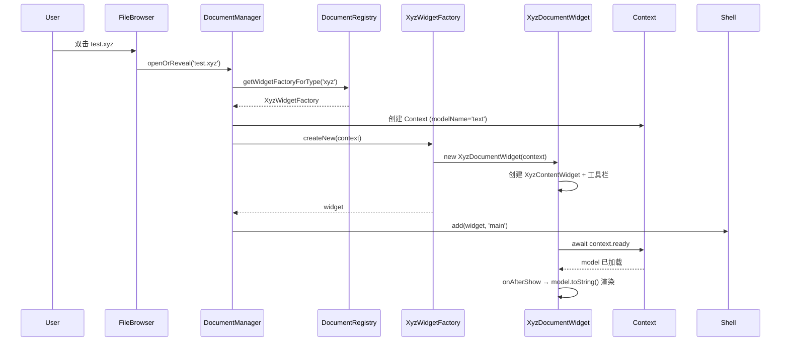

# 02 自定义文件类型查看器

在 [示例 01](01-minimal-extension.md) 中我们注册了一条命令。本例更进一步：让 JupyterLab 能够"打开"一种全新的文件格式 `.xyz`，双击文件时显示一个自定义查看器。这是 JupyterLab 文档系统的标准扩展模式——注册文件类型、实现内容 Widget、实现 WidgetFactory、把工厂注册到 DocumentRegistry（F-053）。

> **前置条件**：已完成 [示例 01](01-minimal-extension.md) 的项目脚手架（package.json、tsconfig.json），了解 `JupyterFrontEndPlugin`、`activate` 函数和 Token 注入。建议先阅读 [05 文档注册与 Widget 工厂](../concepts/05-document-widget-system.md)。

## 目标

创建一个扩展，实现：

1. 注册 `.xyz` 文件类型（`contentType: 'file'`、`fileFormat: 'text'`）。
2. 双击 `.xyz` 文件时打开一个自定义 Widget，读取文件文本内容并渲染。
3. 在 Widget 工具栏添加一个"刷新"按钮，重新读取文件内容。

## 核心 API 回顾

涉及以下来自 `@jupyterlab/docregistry` 的真实 API：

- **`DocumentRegistry`**：文档注册表，`app.docRegistry` 是其实例。提供 `addFileType()`、`addWidgetFactory()`、`addModelFactory()` 等方法。
- **`ABCWidgetFactory<T, U>`**：Widget 工厂抽象基类，子类实现 `createNewWidget(context, source?)` 返回 Widget；基类负责工具栏装配、`widgetCreated` 信号发射。
- **`DocumentWidget<T, U>`**：文档 Widget 标准外壳，继承 `MainAreaWidget<T>`，持有 `context`，自动处理标题与文件路径同步、dirty 状态。
- **`DocumentRegistry.IContext<U>`**：文档上下文，提供 `ready: Promise<void>`、`model: IModel`、`path`、`save()`、`pathChanged` 信号等。
- **`DocumentRegistry.IModel`**：文档模型接口，`toString(): string` 返回模型的文本表示。文本文件使用内置的 `text` 模型（`TextModelFactory`，name 为 `'text'`）。

## 项目结构

在示例 01 的基础上增加两个源文件：

```
my-xyz-viewer/
├── package.json
├── tsconfig.json
└── src/
    ├── index.ts      # 插件入口：注册文件类型和工厂
    └── widget.ts     # 内容 Widget 和 WidgetFactory
```

## 步骤 1：package.json 依赖

```json
{
  "name": "@my-org/my-xyz-viewer",
  "version": "0.1.0",
  "description": "A custom .xyz file viewer for JupyterLab",
  "keywords": ["jupyter", "jupyterlab", "jupyterlab-extension"],
  "license": "BSD-3-Clause",
  "main": "lib/index.js",
  "types": "lib/index.d.ts",
  "type": "module",
  "exports": {
    ".": "./lib/index.js"
  },
  "files": ["lib/**/*.{js,d.ts,map}"],
  "scripts": {
    "build": "tsc",
    "watch": "tsc -w",
    "clean": "rimraf lib"
  },
  "dependencies": {
    "@jupyterlab/application": "^4.7.0-alpha.1",
    "@jupyterlab/docregistry": "^4.7.0-alpha.1",
    "@jupyterlab/ui-components": "^4.7.0-alpha.1",
    "@lumino/messaging": "^2.0.0",
    "@lumino/widgets": "^2.0.0",
    "@lumino/coreutils": "^2.0.0",
    "@lumino/disposable": "^2.0.0"
  },
  "devDependencies": {
    "typescript": "~5.5.0",
    "rimraf": "^5.0.0"
  },
  "jupyterlab": {
    "extension": true
  }
}
```

`@jupyterlab/docregistry` 提供 DocumentRegistry/ABCWidgetFactory/DocumentWidget；`@jupyterlab/ui-components` 提供 `ToolbarButton` 和 `refreshIcon`；`@lumino/widgets` 提供 `Widget` 基类，`@lumino/messaging` 提供 `Message` 类型。这些都是 singletonPackages，由宿主提供（F-139）。

## 步骤 2：内容 Widget（src/widget.ts）

内容 Widget 负责实际渲染。它继承 Lumino `Widget`，在 `onAfterShow` 生命周期中等待 `context.ready`，然后通过 `context.model.toString()` 读取文本并写入 DOM。

```typescript
import { Message } from '@lumino/messaging';
import { Widget } from '@lumino/widgets';
import { DocumentRegistry, DocumentWidget } from '@jupyterlab/docregistry';
import { ToolbarButton, refreshIcon } from '@jupyterlab/ui-components';

export class XyzContentWidget extends Widget {
  constructor(context: DocumentRegistry.IContext<DocumentRegistry.IModel>) {
    super();
    this._context = context;
    this.addClass('jp-XyzViewer');
    this.node.style.padding = '8px';
    this.node.style.overflow = 'auto';
    this.node.style.whiteSpace = 'pre-wrap';
    this.node.style.fontFamily = 'monospace';
  }

  get context(): DocumentRegistry.IContext<DocumentRegistry.IModel> {
    return this._context;
  }

  protected onAfterShow(msg: Message): void {
    super.onAfterShow(msg);
    void this._context.ready.then(() => {
      this._render();
    });
  }

  refresh(): void {
    this._render();
  }

  private _render(): void {
    const text = this._context.model.toString();
    const banner = '=== .xyz File Contents ===\n\n';
    this.node.textContent = banner + text;
  }

  private _context: DocumentRegistry.IContext<DocumentRegistry.IModel>;
}

export class XyzDocumentWidget extends DocumentWidget<XyzContentWidget> {
  constructor(context: DocumentRegistry.IContext<DocumentRegistry.IModel>) {
    const content = new XyzContentWidget(context);
    super({ context, content });
    this.id = `xyz-${context.path}`;
    this.title.label = context.path.split('/').pop() ?? 'untitled.xyz';
    this.title.closable = true;

    const refreshButton = new ToolbarButton({
      icon: refreshIcon,
      onClick: () => content.refresh(),
      tooltip: 'Refresh .xyz Content'
    });
    this.toolbar.addItem('refresh', refreshButton);
  }
}
```

### 关键点

- **`XyzContentWidget`** 是纯 Lumino Widget，不直接知道 JupyterLab 的文档外壳。它持有 `context`，通过 `context.ready` Promise 确保模型已从后端加载完成（F-053）。`context.model.toString()` 返回文档模型的文本内容——对于 `fileFormat: 'text'` 的文件，内置 text 模型已自动完成文件内容的加载与同步。
- **`onAfterShow`** 是 Lumino Widget 生命周期消息，在 Widget 首次显示时触发。这里延迟渲染以避免在 Widget 还未挂载到 DOM 时操作节点。
- **`XyzDocumentWidget`** 继承 `DocumentWidget<XyzContentWidget>`，泛型参数指定内容 Widget 类型。构造时创建 content 并通过 `super({ context, content })` 传入。`DocumentWidget` 基类自动：
  - 把 `context.ready` 合并到 `reveal` Promise（MainAreaWidget 的渐显机制）；
  - 监听 `context.pathChanged` 更新标题标签；
  - 监听 model 的 `dirty` 状态更新标题的未保存标记。
- **工具栏按钮**通过 `this.toolbar.addItem('refresh', refreshButton)` 添加。`ToolbarButton` 来自 `@jupyterlab/apputils`，`refreshIcon` 来自 `@jupyterlab/ui-components`。这是"可选工具栏按钮"的最简实现，无需使用 IWidgetExtension。

## 步骤 3：WidgetFactory（src/widget.ts，续）

```typescript
import { ABCWidgetFactory } from '@jupyterlab/docregistry';

export class XyzWidgetFactory extends ABCWidgetFactory<XyzDocumentWidget> {
  protected createNewWidget(
    context: DocumentRegistry.IContext<DocumentRegistry.IModel>
  ): XyzDocumentWidget {
    return new XyzDocumentWidget(context);
  }
}
```

`ABCWidgetFactory` 已经实现了 `IWidgetFactory` 接口的全部公共逻辑（`name`、`fileTypes`、`readOnly`、`preferKernel`、`createNew`、`widgetCreated` 信号、dispose 等）。子类只需实现抽象方法 `createNewWidget(context, source?)`，返回一个 Widget 实例。基类的 `createNew` 会调用 `createNewWidget`，然后自动装配工具栏并发射 `widgetCreated` 信号（`packages/docregistry/src/default.ts:465`）。

工厂的配置（name、支持哪些 fileTypes、modelName 等）通过构造函数的 `IWidgetFactoryOptions` 传入，在插件入口中提供。

## 步骤 4：插件入口（src/index.ts）

```typescript
import {
  JupyterFrontEnd,
  JupyterFrontEndPlugin
} from '@jupyterlab/application';
import { DocumentRegistry } from '@jupyterlab/docregistry';
import { XyzWidgetFactory } from './widget';

const plugin: JupyterFrontEndPlugin<void> = {
  id: '@my-org/my-xyz-viewer:plugin',
  autoStart: true,
  requires: [],
  activate: (app: JupyterFrontEnd) => {
    const docRegistry = app.docRegistry;

    docRegistry.addFileType(
      {
        name: 'xyz',
        displayName: 'XYZ File',
        extensions: ['.xyz'],
        contentType: 'file',
        fileFormat: 'text',
        mimeTypes: ['text/plain']
      },
      ['XYZ Viewer']
    );

    const factory = new XyzWidgetFactory({
      name: 'XYZ Viewer',
      fileTypes: ['xyz'],
      defaultFor: ['xyz'],
      modelName: 'text',
      readOnly: true
    });

    docRegistry.addWidgetFactory(factory);

    console.log('XYZ viewer extension activated!');
  }
};

export default plugin;
```

### 代码解读

- **`docRegistry.addFileType(fileType, factories?)`**（`packages/docregistry/src/registry.ts:287`）：注册文件类型。
  - `name: 'xyz'`：文件类型内部标识，工厂的 `fileTypes` 数组用它关联。
  - `extensions: ['.xyz']`：文件扩展名，文件浏览器据此匹配图标和默认打开方式。
  - `contentType: 'file'`：内容类型为普通文件（区别于 `'notebook'` 和 `'directory'`）。
  - `fileFormat: 'text'`：文本格式，Contents API 以文本方式读取。
  - `mimeTypes: ['text/plain']`：关联 MIME 类型。
  - 第二个参数 `['XYZ Viewer']` 把该文件类型关联到名为 "XYZ Viewer" 的工厂，并自动把该工厂设为该类型的默认打开工厂。这等价于后续 `addWidgetFactory` 时工厂声明 `defaultFor: ['xyz']`，这里两种方式都用了以确保默认关联（实际二选一即可，同时使用不会冲突）。
- **`new XyzWidgetFactory(options)`**：工厂选项：
  - `name: 'XYZ Viewer'`：工厂唯一名称，显示在"打开方式"菜单中。
  - `fileTypes: ['xyz']`：此工厂能打开的文件类型名列表（对应 addFileType 的 name）。
  - `defaultFor: ['xyz']`：双击 `.xyz` 文件时默认使用此工厂打开。
  - `modelName: 'text'`：使用内置的文本模型工厂（`TextModelFactory`，name 为 `'text'`）。JupyterLab 已默认注册 text 模型，无需自己注册 ModelFactory。
  - `readOnly: true`：标记为只读查看器，不会触发保存逻辑。
- **`docRegistry.addWidgetFactory(factory)`**（`registry.ts:124`）：把工厂注册到文档注册表，返回 `IDisposable`。注册后，DocumentManager 在打开 `.xyz` 文件时会查找名为 "XYZ Viewer" 的工厂，调用其 `createNew(context)` 创建 Widget。
- **不需要手动注册 ModelFactory**：因为我们复用内置的 `'text'` 模型。如果需要自定义数据模型（如二进制解析、结构化文档），才需要实现 `IModelFactory` 并调用 `docRegistry.addModelFactory()`。

## 步骤 5：构建与安装

```bash
npm install
npm run build
jupyter labextension develop --overwrite .
jupyter lab
```

## 步骤 6：测试

1. 在 JupyterLab 文件浏览器中，右键 → New → Text File，命名为 `test.xyz`。
2. 双击 `test.xyz`，应打开一个标签页，标题为 `test.xyz`，内容区域显示 `=== .xyz File Contents ===` 后跟文件文本。
3. 编辑文件内容（可改用文本编辑器打开修改），回到 XYZ Viewer 标签页，点击工具栏的刷新按钮，内容应更新。
4. 在文件上右键 → "Open With"，应能看到 "XYZ Viewer" 选项。

## 工作流程图



## 进阶：使用 IWidgetExtension 注入工具栏

上文直接在 `XyzDocumentWidget` 构造函数中添加工具栏按钮，简单直接。如果想把工具栏按钮做成可复用的横切扩展（例如为所有文档类型添加一个"导出"按钮），可以实现 `DocumentRegistry.IWidgetExtension`：

```typescript
import { IDisposable } from '@lumino/disposable';
import { ToolbarButton } from '@jupyterlab/ui-components';

class MyToolbarExtension
  implements DocumentRegistry.IWidgetExtension<XyzDocumentWidget, DocumentRegistry.IModel>
{
  createNew(
    widget: XyzDocumentWidget,
    context: DocumentRegistry.IContext<DocumentRegistry.IModel>
  ): IDisposable {
    const button = new ToolbarButton({
      label: 'Export',
      onClick: () => console.log('Export', context.path),
      tooltip: 'Export this file'
    });
    widget.toolbar.addItem('export', button);
    return { dispose: () => button.dispose() };
  }
}

docRegistry.addWidgetExtension('XYZ Viewer', new MyToolbarExtension());
```

`DocumentRegistry.IWidgetExtension<T, U>` 只有一个 `createNew(widget, context)` 方法，在工厂每次创建 Widget 后被调用，返回的 IDisposable 在 Widget 销毁时释放。这是 JupyterLab 核心扩展为 Notebook/编辑器注入工具栏按钮的标准方式。

## 注意事项

1. **模型选择**：本例用 `modelName: 'text'` 复用内置文本模型，适用于纯文本查看器。若文件是 JSON 或二进制，应使用 `'json'` 模型或自定义 ModelFactory。
2. **`context.ready`**：必须等待它 resolve 后再读取 model，否则 `toString()` 可能返回空字符串。`ready` 在模型从后端 Contents API 加载完成后 resolve。
3. **只读 vs 可编辑**：`readOnly: true` 的工厂不提供保存能力。若要支持编辑，应设置 `readOnly: false`，让内容 Widget 修改 `model`（通过 `model.fromString(text)` 或共享模型 API），Context 会自动处理 dirty 状态和保存。
4. **id 唯一性**：Widget 的 `id` 应基于文件路径生成，避免多个同名文件的 Widget id 冲突。
5. **资源释放**：如果 Widget 中连接了 Signal 或注册了事件监听，应重写 `onCloseRequest` 或实现 `dispose` 清理。`DocumentWidget` 基类已处理大部分与 context 相关的信号解绑。
6. **工厂 name 与 fileType name 大小写**：DocumentRegistry 内部按小写匹配，工厂的 `fileTypes` 和 `defaultFor` 应使用与 `addFileType` 的 `name` 一致的值（大小写不敏感，但建议保持一致）。

## 相关概念

- [05 文档注册与 Widget 工厂](../concepts/05-document-widget-system.md)
- [03 插件系统与依赖注入](../concepts/03-plugin-system.md)
- [09 关键子系统](../concepts/09-key-subsystems.md)

## 相关示例

- [01 最小扩展：Hello World 插件](01-minimal-extension.md)
